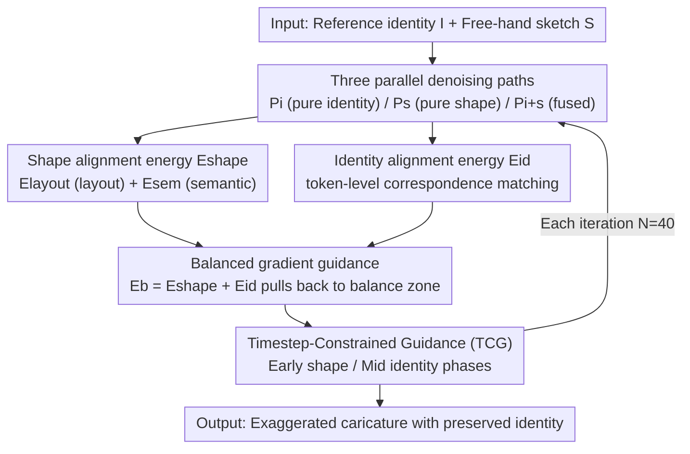

# CaricHarmony: Contrastive Diffusion Paths for Identity-Preserving Caricature Synthesis

**Conference**: CVPR 2026  
**Paper**: [CVF Open Access](https://openaccess.thecvf.com/content/CVPR2026/html/Wang_CaricHarmony_Contrastive_Diffusion_Paths_for_Identity-Preserving_Caricature_Synthesis_CVPR_2026_paper.html)  
**Code**: https://dongyuuw.github.io/CaricHarmony/ (Project Page)  
**Area**: Diffusion Models / Image Generation  
**Keywords**: Caricature Synthesis, Identity Preservation, Sketch Guidance, Energy Function Guidance, Training-Free Diffusion

## TL;DR
CaricHarmony reformulates the long-standing trilemma of "exaggerated deformation vs. identity preservation" as a **condition signal contamination** issue in the diffusion denoising trajectory. It proposes a **training-free** framework: during inference, three denoising paths (pure identity, pure sketch, and fused output) are run in parallel. An energy function operating on cross-attention features is used to pull the fused path back to the balance zone between identity and shape. Without fine-tuning any parameters and generating an image in 16 seconds, it improves the shape CLIP to 0.8615 (compared to DemoCaricature's 0.8450) and achieves a user preference score of 7.81 (vs. 6.06).

## Background & Motivation

**Background**: Caricature synthesis presents a paradox: the face needs to be highly exaggerated and distorted (e.g., elongated nose, shrunk eyes), yet must remain immediately recognizable. Early GAN methods (CariGANs, WarpGAN, AutoToon, StyleCariGAN) focused on "automatic exaggeration," giving users zero control over the deformation results. Among recent controllable methods, DemoCaricature guides the shape with free-hand sketches but requires per-sample fine-tuning of ~70 seconds per identity, while CaricatureBooth restricts sketches to a fixed number of Bezier curves and requires large-scale pre-training on synthetic data.

**Limitations of Prior Work**: When the identity condition $C_{id}$ and shape condition $C_s$ are fed into a diffusion model simultaneously, the outputs almost inevitably collapse to one of two extremes: either ignoring the sketch's creative exaggerations to preserve identity (resulting in plain, realistic portraits) or faithfully following the sketch but distorting the face beyond recognition. No existing method can stably "achieve both."

**Key Challenge**: The authors identify the root cause as **condition signal contamination**. From the continuous perspective of score-based diffusion, both the pure identity-preservation region and the pure shape-following region have higher probability densities along the denoising trajectory than the intermediate "balance zone." Consequently, the trajectory is pulled toward the high-density sides, leaving the ideal balance point as an unstable, low-density region. The two conditions cannot be reconciled by simple weighted fusion, as they cause **destructive interference** along the denoising trajectory. Prior methods (DemoCaricature, CaricatureBooth) never addressed this underlying contamination problem and merely shifted where the identity-shape conflict manifested.

**Goal**: To stably stop the generation trajectory within the balance zone of identity and shape without training, fine-tuning, or restricting sketch formats.

**Key Insight**: Since "mixing contaminated signals" is the root cause, the solution is **not to mix them**. Instead, maintain two "uncontaminated" reference paths as anchors and use them to correct the third fused path.

**Core Idea**: During inference, maintain three parallel diffusion paths: $P_i$ (pure identity), $P_s$ (pure shape), and $P_{i+s}$ (fused output). Pass gradients through a specially designed cross-attention energy function at each denoising step to guide $P_{i+s}$, pulling it back to the balance zone from either extreme.

## Method

### Overall Architecture
CaricHarmony is built on SDXL (specifically using Juggernaut-XL-v9 weights). The identity condition is injected via PuLID's ID Encoder, and the shape condition is injected via T2I-Sketch-Adapter. The entire method is **zero-training and zero-fine-tuning**, operating entirely during the inference phase. Its core is running three parallel denoising trajectories simultaneously:

- $P_i$: Fed only with the identity condition $I$, naturally guiding the trajectory toward faithful identity preservation.
- $P_s$: Fed only with the binary sketch $S$ as the shape condition, naturally guiding the trajectory toward precise caricature geometry.
- $P_{i+s}$: Fed with both conditions to produce the final output, though it is inherently prone to collapsing into one of the extremes.

$P_i$ and $P_s$ act as "uncontaminated" reference anchors. At each denoising step, the intermediate cross-attention features of $P_{i+s}$ are aligned with those of $P_s$ and $P_i$: on the shape side, $E_{shape}$ (consisting of $E_{layout}$ and $E_{sem}$) ensures sketch fidelity; on the identity side, $E_{id}$ ensures identity fidelity through token-level correspondence matching. These two energies are naturally adversarial—once the trajectory leans toward one side, the guidance strength of the other side increases, pulling the latent back. The composite energy $E_b = E_{shape} + E_{id}$ acts as an additional "balancing condition" $C_b$, providing continuous gradient guidance during denoising to prevent trajectory collapse. Finally, a Timestep-Constrained Guidance (TCG) strategy is used so that each guidance type functions only during its appropriate denoising stage (shape constraint in the early stage, identity constraint in the middle stage).

### Key Designs

**1. Three parallel uncontaminated denoising paths: Replacing "mixed contaminated signals" with "correction using clean anchors"**

This is the foundation of the design, directly addressing the diagnosis of "condition signal contamination." Previous methods attempted to directly fuse $C_{id}$ and $C_s$, causing destructive interference along the denoising trajectory, where the trajectory gets pulled to the two high-density extremes. CaricHarmony's approach is **not to mix**: it runs two additional paths with only a single condition, $P_i$ (identity only) and $P_s$ (shape only). These paths remain "uncontaminated" and accurately encode identity preservation and shape exaggeration, respectively. The fused path $P_{i+s}$ no longer searches for a balance point blindly; instead, it uses these two uncontaminated paths as reference targets and is "pulled" toward the middle at each step. To ensure clear notation, the paper denotes intermediate features from $P_i$ and $P_s$ with superscripts $i$ and $s$, while features from $P_{i+s}$ have no superscript. This converts the difficult problem of "how to mix two conflicting conditions" into a controllable alignment problem of "how to pull one path toward two clean reference paths."

**2. Shape alignment energy $E_{shape}$: Preserving exaggerated geometry with query feature alignment**

Relying on the default fused path easily loses the exaggerated geometry of the sketch, so the cross-attention features of $P_{i+s}$ must be aligned with those of $P_s$. Inspired by PuLID, the authors extract the query features $Q^s$ of each cross-attention block as the target shape layout (queries reflect how text/sketch conditions are spatially allocated). The layout energy $E_{layout}$ aligns $Q$ and $Q^s$ token-by-token:

$$E_{layout} = \sqrt{\sum_{j=1}^{n} \|q_j - q_j^s\|_2^2 \cdot c_j^s}$$

where $c_j^s \in [0,1]$ is a confidence weight representing how strongly each token correlates with the sketch strokes. This weight is obtained by rasterizing the sketch $S$ into a binary stroke map (stroke pixels as 1, background as 0) and resizing it to the spatial resolution of the query features. This applies shape guidance only to stroke-related tokens and suppresses guidance on unrelated regions. Additionally, a semantic consistency term $E_{sem}$ is introduced: if two caricatures have similar face shapes, their attention localization for text keys should also align. Therefore, the attention map of queries over text keys $K_{txt}$ is used as an additional signal:

$$E_{sem} = \|\text{Attn}(K_{txt}, Q, Q) - \text{Attn}(K_{txt}, Q^s, Q^s)\|_2$$

Combining these yields $E_{shape} = E_{layout} + E_{sem}$.

**3. Identity alignment energy $E_{id}$: Overcoming the caricature domain gap with token-level correspondence matching**

Aligning solely with shape severely degrades identity. Conventional methods compute ID loss using face recognition encoders, but these models are trained only on photorealistic images. The extreme exaggeration of caricatures creates a substantial domain gap, rendering standard ID loss ineffective; moreover, ID guidance must be applied at intermediate timesteps when predicted images are still noisy. Instead, the authors use the ID-conditioned cross-attention output $O^i$ from $P_i$ to guide the output $O$ of $P_{i+s}$. The challenge is that when $P_{i+s}$ is influenced by the exaggerated shape condition $C_s$, the spatial layout of $O$ and $O^i$ may completely differ; direct alignment would cause layout mismatch and confuse the model. The solution is **correspondence matching based on query correlation**. By treating the query-output pairs of $P_i$ as a "dictionary" (where query tokens act as "keys" and output tokens as "values"), for each $o_j$ in the fused path, the most similar query token in $P_i$ is first matched via cosine similarity:

$$k = \arg\max_l \Phi(q_j, q_l^i)$$

The corresponding output token $o_k^i$ in the dictionary is then retrieved as the guidance target, and the energy is defined as:

$$E_{id} = \sqrt{\sum_{j=1}^{n} \|o_j - o_k^i\|_2^2 \cdot c_j^i}$$

The confidence weight $c_j^i = \frac{\Phi(q_j, q_k^i) - \phi}{1 - \phi}$ (where $\phi = \min_l \Phi(q_j, q_l^i)$) weakens the guidance strength if the match is not sufficiently "distinctive" (i.e., not well-separated from other query tokens), preventing degradation from false matches. This mechanism leverages the fact that intermediate diffusion features inherently retain layout information to localize facial components, which is something standard ID losses cannot do.

**4. Balanced gradient guidance + Timestep constraints: Finding the sweet spot and dividing work between adversarial physical forces**

$E_{shape}$ and $E_{id}$ are inherently adversarial: as the latent leans toward one side, the opposing guidance intensifies and pulls it back. Combining them yields the composite energy $E_b = E_{shape} + E_{id}$ as the balancing condition $C_b$. In the score function, classifier-free guidance is used for the first term, and the gradient of $E_b$ is used for the second:

$$\hat{\epsilon}_t \leftarrow (1+\gamma)\epsilon_\theta(\hat{z}_t, t, C_e) - \gamma\epsilon_\theta(\hat{z}_t, t, \varnothing)$$
$$\tilde{\epsilon}_t \leftarrow \hat{\epsilon}_t + \eta \nabla_{\hat{z}_t} E_b(\hat{z}_t, t, C_b, C_e)$$

where $\gamma$ controls the CFG scale, and $\eta$ controls the balancing guidance strength. Additionally, **Timestep-Constrained Guidance (TCG)** is applied: $E_{shape}$ manages coarse-scale layout, while $E_{id}$ handles fine-grained identity details. To align with the coarse-to-fine nature of the denoising process, $E_{shape}$ is activated early ($t \in [1000, 700]$), while $E_{id}$ is activated later ($t \in [900, 400]$). Ending the guidance early ensures the final fine details are not degraded.

### Loss & Training
This method **requires no training or fine-tuning**; all "losses" are computed as gradients of the energy functions during inference. Key hyperparameters: based on SDXL with Juggernaut-XL-v9 weights, DPM++ 2M sampler, $N=40$ denoising steps, CFG scale $\gamma=7$, balancing guidance factor $\eta=0.4$, and an output resolution of $768\times768$. Inference takes approximately 16 seconds on a single RTX 4090. The text prompt is fixed as "A highly exaggerated and detailed caricature of a man/woman."

## Key Experimental Results

The evaluation dataset is WebCaricature (using the photograph with the smallest index as the reference ID per person and edge maps from corresponding caricatures as sketches, totaling 1,216 samples). S-CLIP measures the edge map similarity between generated results and ground truth caricatures to evaluate shape consistency; I-CLIP measures similarity between generated caricatures and reference identity images to evaluate identity preservation; ImageReward and PickScore evaluate overall image quality.

### Main Results

| Method | I-CLIP ↑ | S-CLIP ↑ | ImageReward ↑ | PickScore ↑ |
|------|---------|---------|---------------|-------------|
| StyleCariGAN | 0.5228 | - | 0.4340 | 0.0637 |
| WarpGAN | 0.6634 | - | -0.2588 | 0.1033 |
| AutoToon | 0.7628 | - | -0.4978 | 0.1094 |
| DemoCaricature | 0.7591 | 0.8450 | 0.2871 | 0.0949 |
| **Ours (full)** | 0.7512 | **0.8615** | **0.8509** | **0.2049** |

Ours significantly outperforms DemoCaricature in S-CLIP (0.8615 vs. 0.8450), ImageReward (0.8509 vs. 0.2871), and PickScore (0.2049 vs. 0.0949). Note that the I-CLIP score is slightly lower than DemoCaricature's (0.7512 vs. 0.7591). The authors attribute this to the domain gap of CLIP-based evaluation models in caricature domains, where I-CLIP is highly sensitive to shape modifications. Despite this minor quantitative discrepancy, both qualitative and user-study results confirm excellent identity preservation. In terms of generation speed, ours takes only 16 seconds, which is about 4× faster than DemoCaricature (~70 seconds of per-identity fine-tuning), while accepting arbitrary sketch formats without pre-processing.

### User Study

| Method | ID ↑ | Shape ↑ | Overall ↑ |
|------|------|---------|-----------|
| StyleCariGAN | 4.59 | - | 4.91 |
| WarpGAN | 4.81 | - | 4.62 |
| AutoToon | 6.73 | - | 5.50 |
| DemoCaricature | 6.03 | 5.51 | 6.06 |
| **Ours** | **6.83** | **8.08** | **7.81** |

Evaluated on 200 samples (20 identities × 20 exaggerated hand-drawn sketches) scored by 16 volunteers on a scale of 1–10. Ours achieves the highest score across all metrics (identity, shape, and overall), notably showing a substantial lead in Shape (8.08 vs. 5.51). This confirms that humans can identify faces even under extreme geometric deformations, and ours achieves the ideal balance of "exaggerated enough yet recognizable."

### Ablation Study

| Configuration | I-CLIP | S-CLIP | Description |
|------|--------|--------|------|
| Full model | 0.7512 | 0.8615 | Complete model, balancing identity and shape |
| w/o $E_{shape}$ | 0.7747 | 0.8296 | Biased toward identity: good face structures but insufficient exaggeration (resembles normal portraits) |
| w/o $E_{id}$ | 0.7381 | 0.8698 | Biased toward shape: faithful to sketch but suffers from identity loss and coarse details |

### Key Findings
- **Adversarial nature of the two energies is the core design**: Removing $E_{shape}$ yields the highest I-CLIP (0.7747) but drops S-CLIP to 0.8296. Removing $E_{id}$ yields the highest S-CLIP (0.8698) but drops I-CLIP to 0.7381. This proves that removing either component pushes the model to one of the extremes, and only the full model successfully hits the balanced zone.
- **TCG is crucial**: Ablations show that omitting the timestep constraint leads to degraded details and artifacts that harm overall quality.
- **Adjustable balance knob**: Linearly scaling the coefficients of $E_{id}$ (from 2 to 0) and $E_{shape}$ (from 0 to 2) allows a smooth transition between "identity-dominant" and "shape-dominant" generation, enabling users to fine-tune results based on preference.
- **Robustness to extreme exaggeration**: Ours keeps identity recognizable even under severe facial distortions, whereas DemoCaricature fails to parse spatial layouts under highly exaggerated sketches due to conditional signal interference.

## Highlights & Insights
- **Redefining the problem is more valuable than stacking methods**: Diagnosing the "ID-shape conflict" as "conditional signal contamination / denoising trajectories being pulled by two high-density poles" is the most insightful contribution. Under this score-based framing, "maintaining uncontaminated reference paths" naturally arises as the solution, rather than relying on another weighted balancing trick.
- **The three-path contrastive concept is highly transferable**: For any controllable generation task where two inputs conflict and direct fusion collapses (e.g., style vs. content, layout vs. texture), the paradigm of "maintaining clean, single-condition anchor paths + using energy gradients to correct the fused path" can be readily adopted.
- **Token-level matching bypasses the domain gap**: Instead of forcing raw spatial alignment which causes layout mismatch due to caricature exaggeration, using query similarity to construct a "dictionary" to retrieve target output tokens cleverly sidesteps the domain gap. This prevents failures of standard ID losses that were trained solely on photorealistic faces.
- **Truly training-free**: Operating with zero pre-training, zero per-sample fine-tuning, and zero sketch format limitations, this method significantly lowers the barrier for professional-grade caricature creation, making it highly practice-friendly.

## Limitations & Future Work
- **I-CLIP remains slightly lower than DemoCaricature**: Although the authors attribute this to the domain gap making the metric overly sensitive to shape distortion, it highlights the lack of an identity metric specifically tailored for caricatures; current quantitative identity measurements remain somewhat unreliable here.
- **Dependency on base model generation capacity**: The overall high ImageReward and PickScore across variations are explicitly credited to SDXL's generation capabilities. The upper bound of this method is constrained by the base diffusion model, and its performance with weaker base models remains unverified. ⚠️ Subject to the original paper's claims.
- **Computational overhead of multiple paths**: Running three denoising trajectories in parallel while computing energy gradients introduces extra computational cost compared to single-path inference. The paper does not provide GPU VRAM or throughput comparisons against single-path generation (though it remains faster than per-sample fine-tuning).
- **Heuristically set timestep windows**: The active intervals for $E_{shape}$ and $E_{id}$ ($t \in [1000, 700]$ and $[900, 400]$) are empirically set. Whether these are globally optimal across all identities/sketches or can be made adaptive warrants further exploration.

## Related Work & Insights
- **vs. DemoCaricature**: Both utilize free-hand sketches for shape control. However, DemoCaricature integrates identity data into text embedding and cross-attention key-value paths, requiring ~70 seconds of per-sample fine-tuning, and fails under extreme sketches since it does not resolve the identity-shape conflict. In contrast, ours is training-free, generates images in 16 seconds, and explicitly resolves the conflict.
- **vs. CaricatureBooth**: CaricatureBooth limits input sketches to a fixed number of Bezier curves and requires pre-training on synthetic data generated via TPS deformation, severely restricting sketch freedom. Ours accepts arbitrary sketch formats with zero pre-processing.
- **vs. Early warping GANs (StyleCariGAN / WarpGAN / AutoToon)**: These methods perform automatic exaggeration with zero controllability. Ours provides explicit, adjustable sketch guidance.
- **vs. PuLID**: Ours adopts its query feature alignment and contrastive alignment ideas to avoid contaminating the base model's behavior. However, PuLID is built for general tuning-free personalization and does not address the shape-identity conflict; ours integrates T2I-Sketch-Adapter with the PuLID ID Encoder and introduces custom energy functions to resolve the ID-shape conflict.

## Rating
- Novelty: ⭐⭐⭐⭐⭐ Formulating the ID-shape conflict as trajectory-level conditional signal contamination and presenting a three-path clean anchor solution is a highly fresh perspective.
- Experimental Thoroughness: ⭐⭐⭐⭐ Solid main experiments, user studies, ablations, scaling, and extreme exaggeration evaluations are provided, though evaluations lack caricature-specific identity metrics and multi-path computational overhead analysis.
- Writing Quality: ⭐⭐⭐⭐⭐ Crisp problem formulation, tight connection between equations and design choices, and a compelling narrative.
- Value: ⭐⭐⭐⭐ Training-free, fast, and compatible with arbitrary sketch layouts, significantly democratization caricature synthesis; the paradigm is highly extensible to other conflicting conditional tasks.

<!-- RELATED:START -->

## Related Papers

- [\[CVPR 2026\] Semantic Alignment for Pose-Invariant Identity Preserving Diffusion](semantic_alignment_for_pose-invariant_identity_preserving_diffusion.md)
- [\[CVPR 2026\] Identity-Preserving Image-to-Video Generation via Reward-Guided Optimization](identity-preserving_image-to-video_generation_via_reward-guided_optimization.md)
- [\[CVPR 2026\] Not All Birds Look The Same: Identity-Preserving Generation For Birds](not_all_birds_look_the_same_identity-preserving_generation_for_birds.md)
- [\[CVPR 2025\] StableAnimator: High-Quality Identity-Preserving Human Image Animation](../../CVPR2025/image_generation/stableanimator_high-quality_identity-preserving_human_image_animation.md)
- [\[CVPR 2026\] Attribute-Preserving Pseudo-Labeling for Diffusion-Based Face Swapping](attribute-preserving_pseudo-labeling_for_diffusion-based_face_swapping.md)

<!-- RELATED:END -->
