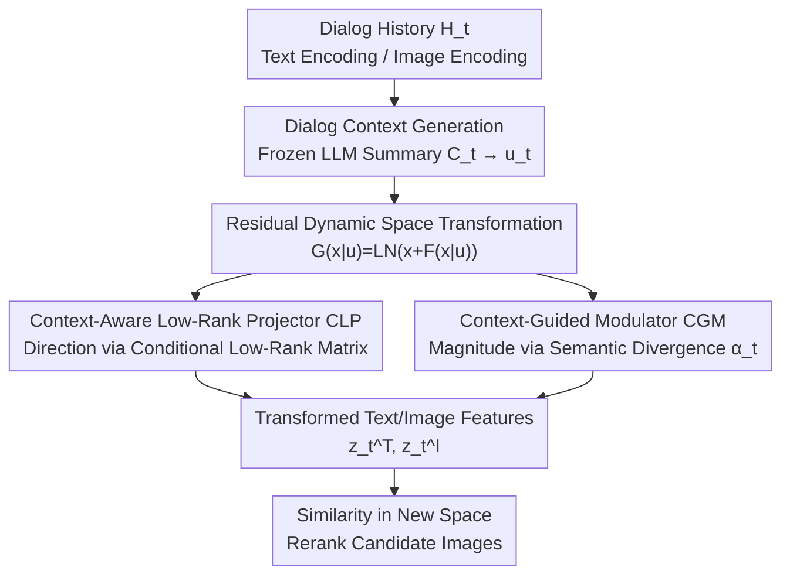

# CAST: Context-Aware Dynamic Latent Space Transformation for Interactive Text-to-Image Retrieval

**Conference**: CVPR 2026  
**Paper**: [CVF Open Access](https://openaccess.thecvf.com/content/CVPR2026/html/Lin_CAST_Context-Aware_Dynamic_Latent_Space_Transformation_for_Interactive_Text-to-Image_Retrieval_CVPR_2026_paper.html)  
**Code**: https://github.com/HuiGuanLab/CAST  
**Area**: Interactive Text-to-Image Retrieval / Multimodal VLM  
**Keywords**: Interactive Retrieval, Dynamic Latent Space, Low-rank Projection, Contextual Modulation, Plug-and-play

## TL;DR
To address the limitation in Interactive Text-to-Image Retrieval (I-TIR) where "all dialog turns share a static feature space," CAST introduces a lightweight module, CASR. This module dynamically "deforms" the latent space containing text and image features based on the context of each dialog turn. The Contextual Low-rank Projector (CLP) determines the semantic direction of the deformation, while the Context-Guided Modulator (CGM) determines the magnitude. On VisDial, CAST improves the 10-turn average R@1 from 48.44% (ChatIR) to 51.85%, with increasing advantages in later turns and negligible parameter overhead.

## Background & Motivation
**Background**: Interactive Text-to-Image Retrieval (I-TIR) allows users to gradually clarify and supplement retrieval intentions through multi-turn natural language dialogs, which is more aligned with real-world usage than traditional single-turn "one-sentence precise description" retrieval. Current mainstream works (ChatIR, PlugIR, ImageScope, etc.) focus on two categories: 1) using LLMs to reconstruct/refine dialog history to turn verbose and vague expressions into focused queries; 2) using LLMs to generate discriminative questions to guide users toward informative answers.

**Limitations of Prior Work**: Regardless of text-side optimizations, cross-modal matching in these methods occurs within the **same fixed multimodal feature space**—all dialog text and images are mapped onto the same static embedding manifold. They implicitly assume that the "geometric relationship between text and images remains constant throughout the entire dialog."

**Key Challenge**: Interactive retrieval is inherently dynamic. Each round of user feedback introduces new semantic constraints (e.g., emphasizing "the color of the dog"), which should ideally make the feature space more sensitive and discriminative toward dimensions like "color." If the space remains static, new semantics are merely projected back onto the same geometric manifold. The query vector "drifts" without truly reflecting the updated intention, causing fine-grained clues (newly mentioned attributes, corrected object relationships) to be easily lost in static representations.

**Goal**: Allow the feature space itself to evolve with the dialog context. This is decomposed into two sub-problems: (1) Which **semantic direction** should the model follow to refine the retrieval? (2) What should be the **magnitude** of this semantic modulation?

**Key Insight**: View "each dialog turn" as a **contextual modulation step** that dynamically deforms the current multimodal representation space into a new space better suited to the current intention, allowing text and image embeddings to evolve together with the context.

**Core Idea**: Use a lightweight **low-rank residual transformation**, conditioned on the context of each dialog turn, to dynamically reshape the geometry of the shared text-image latent space, rather than repeatedly rewriting queries in a fixed space.

## Method

### Overall Architecture
The input to CAST is the dialog history up to turn $t$, $H_t = C_0, (Q_1, A_1), \dots, (Q_t, A_t)$, and an image gallery; the output is the reranked retrieval results for the current turn. The pipeline operates as follows: first, a frozen LLM compresses the dialog history into a concise context summary $C_t$, which a text encoder encodes into a semantic condition vector $u_t$. This $u_t$ enters the core module, **CASR (Context-Aware Space Regulator)**, which generates instructions on "how to deform the space." Specifically, **CLP** provides the deformation direction and **CGM** provides the magnitude. Finally, these instructions are applied to both the text feature $x_t^T$ and each image feature $x_t^I$ via a residual transformation, resulting in $z_t^T$ and $z_t^I$ in the dynamic space specific to the current turn. Cosine similarity is then used for ranking. When the next turn arrives, $u_t$ is updated and the space is deformed again—resulting in "one dynamic space per turn."

The CASR transformation is formulated as a residual: for any feature $x_t$ in the original space,

$$G(x_t \mid u_t) = \mathrm{LN}\big(x_t + F(x_t \mid u_t)\big),$$

where $F$ is a contextualized transformation function. Additive residuals are used instead of direct replacement to preserve original representations and allow contextual modulation to act as a "smooth fine-tuning" injection of semantic shift, thereby stabilizing training. Both text and image features **share the same** $G(\cdot \mid u_t)$ for coupled transformation (distinguishing it from GeneCIS, which only conditions on the query side).

### Key Designs

**1. Residual Dynamic Latent Space Transformation: Evolving the "Space Itself" per Turn**
This serves as the overarching framework, directly addressing the pain point where static spaces submerge fine-grained details. While traditional methods repeatedly rewrite text queries on a fixed manifold, CAST applies transformations to the **space geometry**. For each turn, a transformation $F(x_t \mid u_t)$ is generated based on semantic conditions $u_t$. The additive residual with LayerNorm is used because multi-turn interaction is highly sensitive to stability; direct replacement would cause representation jumps and training divergence. The residual form keeps the original representation as an anchor, layering contextual semantic shifts as fine-tuning.

**2. CLP (Context-Aware Low-Rank Projector): Determining "Deformation Direction"**
To deform a $d \times d$ feature space directly would require learning a full linear transformation, which is expensive and potentially destructive to the original geometry. CLP utilizes **low-rank projection conditioned on $u_t$**. Two MLPs generate two low-rank matrices $A_t = \mathrm{MLP}_A(u_t) \in \mathbb{R}^{d\times r}$ and $B_t = \mathrm{MLP}_B(u_t) \in \mathbb{R}^{d\times r}$ ($r \ll d$) in real-time. These are column-normalized ($\hat A_t = A_t/\lVert A_t\rVert_2$, $\hat B_t = B_t/\lVert B_t\rVert_2$) for stability, followed by the conditional projection:

$$P(x_t \mid u_t) = (x_t \hat B_t)\,\hat A_t^\top, \quad P(x_t \mid u_t)\in\mathbb{R}^{1\times d}.$$

This compresses $x_t$ into a compact low-rank subspace spanned by $u_t$ via $\hat B_t$ and projects it back via $\hat A_t^\top$, forming a directional transformation along axes relevant to the current intention. The low-rank constraint minimizes computation (e.g., 0.002s for 50,000 images at r=8) and avoids geometric destruction from irrelevant directions.

**3. CGM (Context-Guided Modulator): Determining "Deformation Magnitude"**
Direction alone is insufficient; excessive magnitude causes instability, while too little fails to adjust the space. CGM adaptively provides a scaling coefficient $\alpha_t \in [0,1]$ based on the **semantic divergence between the initial condition $u_0$ and the current context $u_t$**:

$$\alpha_t = \sigma\big(\mathrm{MLP}([u_0; u_t])\big),$$

The final transformation term is $F(x_t \mid u_t) = \alpha_t \cdot P(x_t \mid u_t)$. The intuition is that the further the current intention deviates from the initial description, the more the space should be reshaped. This ensures smooth evolution while maintaining sensitivity to major semantic shifts.

### Loss & Training
During training, dialog samples within each batch are randomly truncated to various lengths to ensure text and image features are modulated under distinct contexts. The objective is a **context-guided contrastive loss**, aligning the modulated text embedding $z_t^{T_i}$ with its corresponding context-conditioned image embedding $z_t^{I_i}$:

$$\mathcal{L}_{cgc} = -\frac{1}{B}\sum_{i=1}^{B}\log\frac{\exp\!\big(\mathrm{sim}(z_{t_i}^{T_i}, z_{t_i}^{I_i})/\tau\big)}{\sum_{j=1}^{B}\exp\!\big(\mathrm{sim}(z_{t_i}^{T_i}, z_{t_i}^{I_j})/\tau\big)},$$

where $\tau$ is the temperature. Unlike standard contrastive losses assuming a single static space, alignment here occurs within a set of "subspaces modulated by their respective dialog conditions." A lightweight regularization is applied to $\alpha_t$ to ensure stable modulation across turns. BLIP serves as the backbone.

## Key Experimental Results

### Main Results
The dataset used is VisDial (COCO-based standard I-TIR benchmark), with Recall@K (10-turn average, K=1/5/10) as the metric and BLIP as the common backbone. CAST consistently leads across all metrics and turns.

| Metric (10-turn Avg) | BLIP | ChatIR | PlugIR | ImageScope | CAST (Ours) |
|----------------------|------|--------|--------|------------|-------------|
| R@1 Avg              | 33.97| 48.44  | 44.92  | 32.19      | **51.85**   |
| R@5 Avg              | 55.23| 70.88  | 67.01  | 56.81      | **74.23**   |
| R@10 Avg             | 64.13| 79.90  | 75.26  | 67.86      | **82.05**   |

Per-turn analysis validates the "dynamic space" value: at Turn 1, R@1 is 43.60% (ChatIR 42.78%), a small lead; by Turn 10, R@1 reaches **57.56%**, significantly outperforming ChatIR (53.15%) and PlugIR (46.61%). As context accumulates and the space is refined, alignment becomes more accurate.

### Ablation Study
**(a) Contribution of CLP and CGM (10-turn Avg)**:

| CLP | CGM | R@1 | R@5 | R@10 |
|-----|-----|-----|-----|------|
| ×   | ×   | 48.44| 71.71| 79.89|
| ✓   | ×   | 51.04| 73.45| 80.90|
| ✓   | ✓   | **51.85**| **74.23**| **82.05**|

CLP is the primary driver (Gain: +2.60 R@1), while CGM provides further refinement (Gain: +1.15 R@10).

**(b) CLP Projection Structure Comparison (Avg. R@10)**:

| Projection Design | Avg. R@10 | Δ vs. Ours |
|-------------------|-----------|------------|
| Ours (Context-aware Low-rank) | 82.05 | — |
| Single context-aware matrix W | 80.57 | -1.48 |
| Single context-independent W | 79.18 | -2.87 |
| Independent $W_t$ per turn | 75.52 | -6.53 |

### Key Findings
- **CLP properties are essential**: Removing low-rank decomposition drops performance by 1.48, and removing context-conditioning (shared $W$) drops it by 2.87. Learning independent $W_t$ per turn causes a massive drop (-6.53) due to overfitting, proving that generating low-rank transforms via shared MLPs is key.
- **Increasing advantage in later turns**: The lead over ChatIR grows from <1% in Turn 1 to 4+% in Turn 10, validating that static spaces submerge fine-grained clues in long dialogs.
- **Plug-and-play**: Integrated into BLIP, PlugIR, or ChatIR, CASR improves all of them; notably, it brings basic BLIP close to PlugIR levels.
- **Efficiency**: Low-rank formulas enable fast computation; at r=8, processing 50k images takes ~0.002s.

## Highlights & Insights
- **From "Query Rewriting" to "Geometric Transformation"**: Most I-TIR research focuses on the text side. CAST is among the first to manipulate the geometry of the multimodal space itself with coupled transformations for text and images.
- **LoRA-style Low-rank for Dynamic Evolution**: Using real-time generated low-rank matrices to construct projections inherits stability and efficiency while shifting the "condition" from weight adaptation to dialog semantics.
- **Direction-Magnitude Decoupling**: The separation of CLP (where) and CGM (how much) is a clean, interpretable design that provides more control than simple scalar gating.

## Limitations & Future Work
- The experiments are limited to the VisDial benchmark; cross-domain generalization (e.g., e-commerce, open-vocabulary libraries) has not been verified.
- Semantic conditions $u_t$ depend on a frozen LLM for summarization. The LLM summary quality is a bottleneck; errors in summarization directly pollute the deformation direction.
- The specific form and weight of the $\alpha_t$ regularization are not highly detailed in the text, requiring reference to the code for reproduction.
- CGM gains are relatively small (+0.54 compared to a learnable scalar), suggesting its necessity is weaker than CLP and warrants stronger magnitude control designs.

## Related Work & Insights
- **vs ChatIR / PlugIR**: These refine text queries but use a static matching space. CAST can be used as a plug-and-play addition to these frameworks to update the space geometry.
- **vs QuARI**: QuARI also transforms features per query but operates under a **single-turn** assumption. CAST handles multi-turn evolution.
- **vs GeneCIS**: While both agree similarity is context-dependent, GeneCIS focuses on conditioning the query side, whereas CAST updates **both query and image** via coupled transformations.

## Rating
- Novelty: ⭐⭐⭐⭐⭐ Transforming space geometry instead of rewriting queries is a strong perspective shift.
- Experimental Thoroughness: ⭐⭐⭐⭐ Comprehensive results and ablations, though limited to one benchmark.
- Writing Quality: ⭐⭐⭐⭐⭐ Clear logic from motivation to method.
- Value: ⭐⭐⭐⭐ Lightweight and plug-and-play with clear benefits for multi-turn systems.

<!-- RELATED:START -->

## Related Papers

- [\[CVPR 2026\] Latent Diffusion Inversion Requires Understanding the Latent Space](latent_diffusion_inversion_requires_understanding_the_latent_space.md)
- [\[CVPR 2026\] OPRO: Orthogonal Panel-Relative Operators for Panel-Aware In-Context Image Generation](opro_orthogonal_panel-relative_operators_for_panel-aware_in-context_image_genera.md)
- [\[CVPR 2026\] 3D Space as a Scratchpad for Editable Text-to-Image Generation](3d_space_as_a_scratchpad_for_editable_text-to-image_generation.md)
- [\[CVPR 2026\] Unified Latent Space for Understanding and Generation via Semantic Auto-encoder](unified_latent_space_for_understanding_and_generation_via_semantic_auto-encoder.md)
- [\[CVPR 2026\] Neighbor-Aware Localized Concept Erasure in Text-to-Image Diffusion Models](neighbor-aware_localized_concept_erasure_in_text-to-image_diffusion_models.md)

<!-- RELATED:END -->
