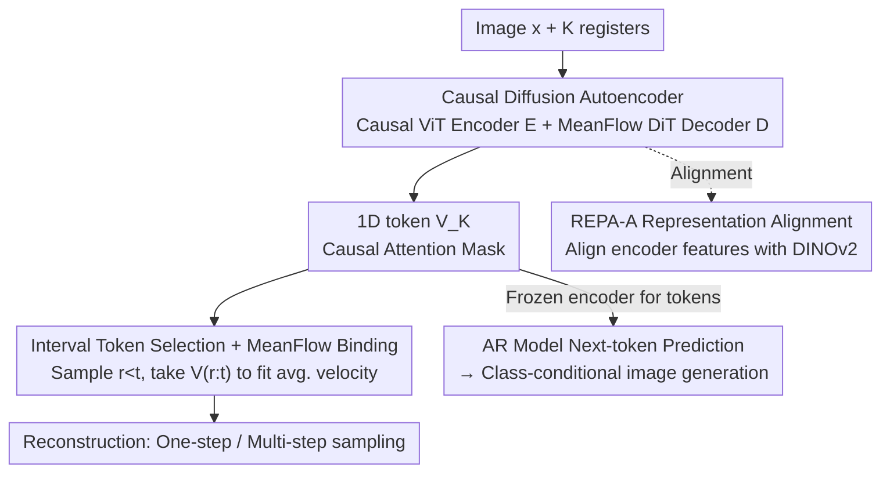

# CaTok: Taming Mean Flows for One-Dimensional Causal Image Tokenization

**Conference**: CVPR 2026  
**Paper**: [CVF Open Access](https://openaccess.thecvf.com/content/CVPR2026/html/Chen_CaTok_Taming_Mean_Flows_for_One-Dimensional_Causal_Image_Tokenization_CVPR_2026_paper.html)  
**Code**: https://sharelab-sii.github.io/catok-web (Project Page)  
**Area**: Image Generation / Diffusion Models  
**Keywords**: Causal image tokenizer, 1D token, MeanFlow, Diffusion autoencoder, Autoregressive generation  

## TL;DR
CaTok trains a diffusion autoencoder by binding "selecting 1D tokens within the time interval $[r,t]$" with the "MeanFlow average velocity field objective." This ensures that the compressed 1D visual tokens possess both causality and balance, supporting both fast one-step generation and high-fidelity multi-step reconstruction. It achieves 0.75 rFID / 22.53 PSNR / 0.674 SSIM on ImageNet reconstruction with fewer training epochs.

## Background & Motivation
**Background**: Autoregressive (AR) large language models have achieved significant success by "segmenting sentences into 1D causal tokens + next-token prediction." The vision community aims to bring this paradigm to image generation, but a key bottleneck is how to segment images into 1D tokens with a "causal order."

**Limitations of Prior Work**: Existing visual tokenizers are not "clean" regarding causality. 2D tokenizers like VQGAN segment images into grids and flatten them into 1D sequences via raster/random order, lacking causal dependencies between tokens. VAR uses "next-scale prediction" for coarse-to-fine ordering, which provides causality but disrupts the LLM's "next-token prediction" mode. Recent diffusion autoencoders extract 1D tokens from encoder registers as decoder conditions, but they also face issues: Naive flow decoders (e.g., FlowMo) condition on **all** tokens, lacking causality; consistency decoders use nested dropout to condition only on the **first k** tokens (sampled randomly or tied to timesteps). Because earlier tokens are selected more frequently, severe **imbalance** is introduced—suppressing the contribution of later tokens and harming AR generation.

**Key Challenge**: In the diffusion autoencoder framework, **causality** (tokens having sequential dependencies) and **balance** (every token being fully utilized) are difficult to achieve simultaneously. Naive decoders offer balance without causality, while consistency decoders offer causality without balance.

**Core Idea**: The authors observed that the MeanFlow structure—where the "average velocity field follows a sub-path $[r,t]$"—naturally provides both causality and balance. By binding the "token selection" to the "average velocity of a specific time interval," tokens $V_{r:t}$ corresponding to the interval $[r \cdot K, t \cdot K]$ are used to predict the average velocity of that interval. Thus, tokens naturally acquire causality along the noise→image path. Since intervals are sampled uniformly and randomly without favoring earlier tokens, imbalance is avoided at the root.

## Method

### Overall Architecture
CaTok is essentially a **diffusion autoencoder**. A causal ViT encoder $E_\delta$ compresses an image into $K$ 1D tokens $V_K$, and a MeanFlow DiT decoder $D_\theta$ reconstructs the image from noise using tokens as conditions. The key difference lies in the **binding of token selection and the training objective**: during training, two timesteps $r < t$ are sampled; only the tokens $V_{r:t}$ in the interval $[r \cdot K, t \cdot K]$ are fed into the decoder to predict the average velocity $u_\theta$ for the interval $[r,t]$. After training, the encoder is frozen to extract tokens for a standard LlamaGen to perform "next-token prediction" AR generation. During inference, the MeanFlow decoder supports one-step image generation: $\hat{x}=\epsilon - D_\theta(\epsilon,0,1,\hat{V}_K)$.

The entire flow is a serial pipeline: "Encoding → Interval Token Selection → MeanFlow Decoding → (Post-freezing) AR Generation," with REPA-A used for representation alignment at the encoder side.

### Key Designs

**1. Causal Diffusion Autoencoder: Incorporating causal constraints into token attention**

To ensure 1D tokens possess an AR-style causal structure, CaTok establishes rules within the encoder. Images $x$ and $K$ registers $R$ are fed into a causal ViT encoder, outputting image features $H_e$ and compressed 1D tokens $V_K$: $[H_e, V_K]=E_\delta([x,R])$. Critically, a **directed causal attention mask** is applied—image patches attend to each other but **cannot see** 1D tokens, while each 1D token attends to all image features but **only sees preceding tokens** within the sequence. This forms a strict left-to-right dependency within $V_K$, aligning with the LLM next-token paradigm. The decoder uses a MeanFlow DiT $D_\theta$ operating in the frozen KL-16 MAR-VAE latent space to save computation.

**2. Interval Token Selection + MeanFlow Binding: Achieving causality and balance (Core Design)**

This is the core of CaTok. Standard rectified flow learns instantaneous velocity $v(z_t,t)=\epsilon-x$. MeanFlow directly fits the **average velocity** over an interval $[r,t]$:

$$u(z_t,r,t) \triangleq \frac{1}{t-r}\int_r^t v(z_\tau,\tau)\,d\tau,$$

which is converted into a trainable objective via the identity $u(z_t,r,t)=v(z_t,t)-(t-r)\big(v(z_t,t)\partial_z u+\partial_t u\big)$. CaTok **binds** token selection to this interval: during training, $r,t\in[0,1]$ ($r<t$) are sampled, and **only tokens $V_{r:t}$ from the interval $[r\cdot K, t\cdot K]$** are fed to the decoder to predict $u_\theta=D_\theta(z_t,r,t,V_{r:t})$. 

This solves both problems: the average velocity field characterizes evolution along a sub-path, ensuring tokens naturally acquire **causality** as they relate to the generation process (the later the endpoint $t$, the more tokens and higher detail). Since $[r,t]$ is sampled uniformly, every token has an equal chance of being used, ensuring **balance** without extra re-weighting. The MeanFlow objective is implemented as:

$$\mathcal{L}_{MF} := \mathbb{E}\big\|u_\theta-(\epsilon-x)-\mathrm{sg}[(t-r)((\epsilon-x)\partial_z u_\theta+\partial_t u_\theta)]\big\|_2^2,$$

where $\mathrm{sg}[\cdot]$ denotes stop-gradient. To stabilize training, a fixed ratio $q=75\%$ of samples use $r=t$, regressing to rectified flow with all tokens: $\mathcal{L}_{RF}:=\mathbb{E}\|v_\theta-(\epsilon-x)\|_2^2$.

**3. REPA-A: Tailored representation alignment for conditional diffusion autoencoders**

Diffusion autoencoders are slow to converge from scratch. While REPA uses Vision Foundation Models (VFM) for alignment, existing variants are suboptimal for CaTok. The authors propose **REPA-A**, which aligns the **encoder's output features $H_e$** with VFM representations $H_{vfm}$ (DINOv2-B/16):

$$\mathcal{L}_{REPA\text{-}A} := -\mathbb{E}\Big[\frac{1}{N}\sum_{n=1}^N \mathrm{sim}(H_{vfm}^{[n]}, H_e^{[n]})\Big],$$

where $\mathrm{sim}$ is cosine similarity. This enables registers to capture more semantic and discriminative content, making 1D tokens more informative.

### Loss & Training
Total objective = MeanFlow $\mathcal{L}_{MF}$ + Rectified Flow $\mathcal{L}_{RF}$ + REPA $\mathcal{L}_{REPA}$ + REPA-A $\mathcal{L}_{REPA\text{-}A}$. The encoder is ViT-B/8 with registers and causal masking. Post-training, the encoder is **frozen** to extract tokens, and a standard $\epsilon$LlamaGen-L is trained for AR generation using teacher forcing and CFG during inference.

## Key Experimental Results

### Main Results
ImageNet-1K 256×256 Reconstruction:

| Method | Token | #Param | Epochs | rFID↓ | PSNR↑ | SSIM↑ |
|------|-------|--------|--------|-------|-------|-------|
| FlowMo-Lo-256 | 256 | 945M | 130 | 0.95 | 22.07 | 0.649 |
| Semanticist-L-256 | 256 | 552M | 400 | 0.78 | 21.61 | 0.626 |
| **CaTok-L-256** | 256 | 552M | **160** | **0.75** | **22.53** | **0.674** |
| CaTok-B-256 | 256 | 224M | 80 | 1.17 | 22.10 | 0.666 |
| CaTok-L-256† (One-step) | 256 | 552M | 160 | 4.63 | 20.99 | 0.630 |

CaTok-L-256 outperforms all diffusion autoencoders in PSNR/SSIM, achieving an rFID of 0.75 in less than half the epochs of Semanticist. The one-step variant (†) achieves the best PSNR/SSIM among one-step 1D tokenizers.

Class-conditional Generation:

| Method | #Param | Token | gFID↓ | IS↑ |
|------|--------|-------|-------|-----|
| Semanticist-L-256 | 343M | 256/32 | 2.57 | 260.9 |
| SpectralAR-64 | 310M | 64 | 3.02 | 282.2 |
| **CaTok-L-128** | 343M | 128 | **2.95** | 269.2 |
| CaTok-L-64 | 343M | 64 | 3.01 | 280.5 |
| CaTok-L-32 | 343M | 32 | 3.40 | 288.6 |

CaTok achieves competitive gFID/IS with SOTA tokenizers despite significantly fewer training epochs for tokenization (160 vs 300+).

### Ablation Study
Ablation of training components (CATOK-B-256, 80 epochs):

| Configuration | rFID@1 | rFID@25 | gFID |
|------|--------|---------|------|
| $\mathcal{L}_{RF}$ only | 183.69 | 1.81 | 19.67 |
| + $\mathcal{L}_{MF}$ | 4.71 | 1.90 | 24.39 |
| + $\mathcal{L}_{REPA}$ | 4.31 | 1.71 | 17.92 |
| + $\mathcal{L}_{REPA\text{-}A}$ | 3.92 | 1.15 | 13.54 |
| + Interval $[r,t]$ Selection | 4.89 | 1.17 | **4.91** |

### Key Findings
- **"Interval Token Selection" is critical for AR quality**: While interval selection causes a slight drop in reconstruction (rFID 3.92→4.89), it leads to a massive improvement in gFID (13.54→4.91). Practical causality is more important for AR tasks than raw reconstruction fidelity.
- **"All tokens" yield the best rFID but worst gFID**: Reconstructing with all tokens lacks causality, making it difficult for AR models to learn.
- **MeanFlow objective enables one-step sampling**: Without $\mathcal{L}_{MF}$, rFID@1 is 183.69 (unusable); adding it drops rFID@1 to 4.71.
- **REPA-A improves performance and stabilizes training**: It improves gFID significantly and smooths loss spikes during the introduction of MeanFlow loss.

## Highlights & Insights
- **Binding token selection to the MeanFlow time interval** is an elegant structural insight: the sub-path average velocity naturally unifies causality (interval endpoints) and balance (uniform sampling).
- **One-step sampling is a "by-product"**: CaTok achieves respectable one-step generation by simply choosing the right objective function, rather than through complex GAN-based recipes.
- **The Reconstruction vs. Generation trade-off**: High reconstruction fidelity does not equate to suitability for AR generation; causal structure is the key factor.

## Limitations & Future Work
- Experiments focused on ImageNet-1K; scaling behavior on larger datasets or different token counts was not fully explored.
- One-step rFID (4.63) still lags behind 2D tokenizers using heavy GAN losses.
- The coupling between 1D token dimensions and AR generator error accumulation remains a topic for future research.

## Related Work & Insights
- **vs. FlowMo / DiTo**: These condition on all tokens, lacking causality (gFID 13.54). CaTok's interval selection achieves 4.91.
- **vs. FlexTok / Semanticist / Selftok**: These use nested dropout (prefix tokens), leading to imbalance. CaTok's uniform interval sampling ensures all tokens contribute equally.
- **vs. VQGAN / VAR**: VQGAN lacks proper 1D causality; VAR's multi-scale approach is causal but departs from the next-token paradigm. CaTok remains strictly 1D and AR-friendly.

## Rating
- Novelty: ⭐⭐⭐⭐⭐ 
- Experimental Thoroughness: ⭐⭐⭐⭐ 
- Writing Quality: ⭐⭐⭐⭐⭐ 
- Value: ⭐⭐⭐⭐ 

<!-- RELATED:START -->

## Related Papers

- [\[CVPR 2026\] Improved Mean Flows: On the Challenges of Fastforward Generative Models](improved_mean_flows_on_the_challenges_of_fastforward_generative_models.md)
- [\[CVPR 2026\] Evaluating Generative Models via One-Dimensional Code Distributions](evaluating_generative_models_via_one-dimensional_code_distributions.md)
- [\[CVPR 2026\] Stable Mean Flow: Lyapunov-Inspired One-Step Flow Matching](stable_mean_flow_lyapunov-inspired_one-step_flow_matching.md)
- [\[CVPR 2026\] MacTok: Robust Continuous Tokenization for Image Generation](mactok_robust_continuous_tokenization_for_image_generation.md)
- [\[CVPR 2026\] Functional Mean Flow in Hilbert Space](functional_mean_flow_in_hilbert_space.md)

<!-- RELATED:END -->
