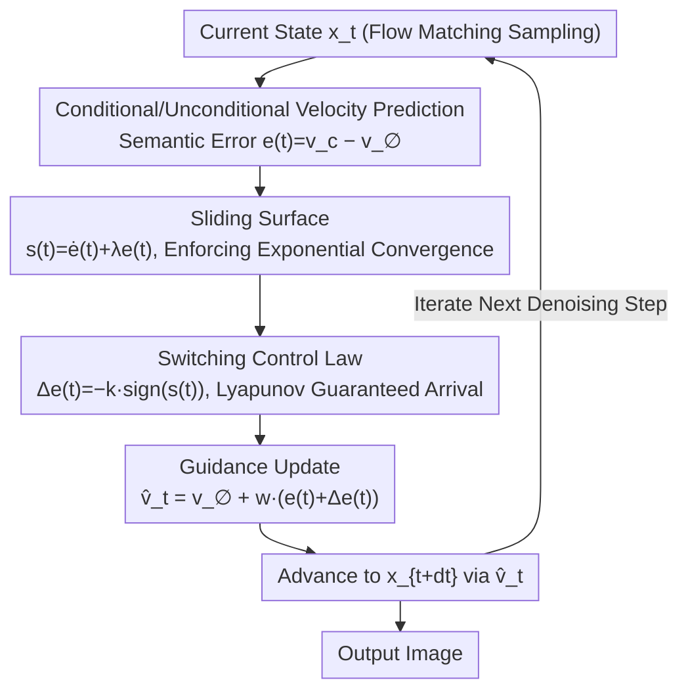

# CFG-Ctrl: Control-Based Classifier-Free Diffusion Guidance

**Conference**: CVPR2026  
**arXiv**: [2603.03281](https://arxiv.org/abs/2603.03281)  
**Code**: [Project Page](https://hanyang-21.github.io/CFG-Ctrl)  
**Area**: Image Generation  
**Keywords**: Classifier-Free Guidance, Control Theory, Sliding Mode Control, Flow Matching, Text-to-Image Generation

## TL;DR

Reinterprets Classifier-Free Guidance (CFG) as a feedback control process within flow-matching diffusion models, proposes a unified framework CFG-Ctrl, and designs a nonlinear feedback guidance mechanism SMC-CFG based on Sliding Mode Control (SMC). This approach significantly enhances semantic consistency and generation robustness at large guidance scales.

## Background & Motivation

**Core Status of CFG**: CFG is a critical technology for enhancing semantic alignment in diffusion models, widely utilized in tasks such as text-to-image and text-to-video generation. However, its essence has been simply treated as a linear extrapolation between conditional and unconditional predictions.

**Inherent Limitations of Linear Extrapolation**: Standard CFG is prone to over-saturation, structural distortion, and loss of detail at large guidance scales. It is extremely sensitive to the guidance scale, which severely limits the practically usable guidance range.

**Limitations of Prior Work**: Existing works (Weight Scheduler, APG, CFG-Zero⋆, Rectified-CFG++, etc.), while improving CFG from various perspectives, essentially still rely on linear control laws. They cannot guarantee stable convergence within highly nonlinear generative dynamics.

**Natural Decay of Error Signals**: The authors observe that the difference between conditional and unconditional velocity predictions gradually decreases during the denoising process. This difference naturally constitutes an "error signal" in control theory, providing a theoretical foundation for reinterpreting CFG.

**Key Insight from Control Theory**: Sliding Mode Control (SMC) has been widely validated for its robustness and convergence in nonlinear dynamical systems, making it naturally suitable for addressing the instability of CFG at high guidance scales.

**Lack of a Unified Theoretical Perspective**: Previous CFG variants have lacked a unified analytical framework, making it difficult to systematically compare and design new guidance strategies.

## Method

### Overall Architecture

CFG-Ctrl aims to answer two questions: why standard CFG collapses at large guidance scales (over-saturation, structural distortion, loss of detail), and whether a unified perspective can encompass various CFG variants. The authors view the flow-matching sampling process as a continuous-time controlled dynamical system:

$$\frac{d\mathbf{x}_t}{dt} = \mathbf{v}_\theta(\mathbf{x}_t, t) + \mathbf{u}_t$$

The control signal $\mathbf{u}_t = K_t \, \Pi_t(\mathbf{e}(t))$ is decomposed into three parts: guidance scheduler $K_t$ (scalar/matrix gain), direction operator $\Pi_t$ (identity/projection, etc.), and semantic error $\mathbf{e}(t) = \mathbf{v}_\theta(\mathbf{x}_t, t, \mathbf{c}) - \mathbf{v}_\theta(\mathbf{x}_t, t, \varnothing)$. From this perspective, standard CFG is a Proportional Controller (P-control), Weight Scheduler is time-varying gain scheduling, APG and CFG-Zero⋆ are projection feedback controls, and Rectified-CFG++ is model predictive control—all of which are linear control laws. This is the common root of their instability in highly nonlinear generative dynamics. SMC-CFG transforms each sampling step into a nonlinear feedback loop: calculate semantic error → construct sliding surface → use switching control law to pull the trajectory back → integrate the correction into the velocity → update state and proceed to the next step.

### Key Designs

**1. Sliding Surface: Ensuring Stable Exponential Convergence of Semantic Error**

Linear control laws cannot guarantee stable convergence in nonlinear systems. SMC-CFG utilizes Sliding Mode Control instead. The authors construct a sliding surface $\mathbf{s}(t) = \dot{\mathbf{e}}(t) + \lambda \mathbf{e}(t)$ in the phase space $(\mathbf{e}, \dot{\mathbf{e}})$ of the semantic error. Once the trajectory hits $\mathbf{s}(t) = \mathbf{0}$, the error is forced to converge monotonically to zero along the exponential curve $\mathbf{e}(t) = \mathbf{e}(T)\exp(-\lambda t)$. The convergence rate is determined by $\lambda$ and is independent of the specific network nonlinearity.

**2. Switching Control Law: "Pulling" Trajectories Back to the Sliding Surface via Nonlinear Feedback**

Defining the sliding surface is insufficient; a force is required to pull deviating trajectories back. The authors introduce a nonlinear switching term $\Delta\mathbf{e}(t) = -k \cdot \mathrm{sign}(\mathbf{s}(t))$. The sign function ensures the control force always points towards the sliding surface, with gain $k$ controlling the traction strength. Stability analysis based on the Lyapunov function $V(\mathbf{s}) = \frac{1}{2}\|\mathbf{s}\|^2$ proves that as long as $k \cdot b_{\min} > \delta$, the system reaches the sliding surface in finite time: $\|\mathbf{s}(t)\| = 0,\ t \leq \frac{\\|\mathbf{s}(0)\|}{\eta},\ \eta = k \cdot b_{\min} - \delta > 0$. This finite-time convergence is rare in diffusion guidance literature and is the fundamental reason it does not collapse at large scales.

**3. Guidance Update: Incorporating Correction into Unconditional Velocity**

Finally, the linear error term and the nonlinear switching term are combined and written back into the sampling velocity: $\hat{\mathbf{v}}_t = \mathbf{v}_\theta(\mathbf{x}_t, t, \varnothing) + w \cdot (\mathbf{e}(t) + \Delta\mathbf{e}(t))$. Compared to standard CFG, which only has the linear extrapolation term $w \cdot \mathbf{e}(t)$, the additional $\Delta\mathbf{e}(t)$ represents the sliding mode feedback. It only modifies guidance computation during the sampling phase without touching model training, thus making it plug-and-play.

### Hyperparameters & Usage

- **$\lambda$**: Sliding surface shape parameter, controlling the convergence rate (optimal $\lambda=5$ in experiments).
- **$k$**: Switching control gain, controlling the traction strength toward the sliding surface (trade-off between semantic alignment and image realism).
- Values are fixed across 8B–20B models without requiring per-model tuning; applied only during sampling, no retraining needed.

## Key Experimental Results

### Main Results: Text-to-Image Generation (MS-COCO 5K)

Evaluated on three mainstream models: SD3.5 (8B), Flux-dev (12B), and Qwen-Image (20B):

| Model | Method | FID↓ | CLIP↑ | Aesthetic↑ | ImageReward↑ | HPSv2.1↑ | MPS↑ |
|------|------|------|-------|-----------|-------------|----------|------|
| SD3.5 | CFG | 21.42 | 0.3681 | 5.588 | 0.889 | 0.284 | 7.248 |
| SD3.5 | **Ours** | **20.04** | **0.3694** | 5.579 | **0.949** | **0.288** | **7.572** |
| Flux-dev | CFG | 27.32 | 0.3692 | 5.540 | 0.875 | 0.283 | 7.839 |
| Flux-dev | **Ours** | **26.40** | **0.3743** | **5.734** | **1.056** | **0.302** | **8.231** |
| Qwen-Image | CFG | 35.43 | 0.3815 | 5.600 | 1.106 | 0.304 | 8.185 |
| Qwen-Image | **Ours** | **33.37** | **0.3856** | **5.629** | **1.204** | **0.311** | **8.432** |

Ours (SMC-CFG) comprehensively outperforms standard CFG and other variants (CFG-Zero⋆, Rect-CFG++) across all models, with significant gains in human preference metrics like ImageReward and MPS.

### Ablation Study

**Ablation of $\lambda$** (Fixed $k=0.1$, Flux-dev): $\lambda=5$ yields the lowest FID (25.95) and highest CLIP (0.3709). Both excessively large or small values lead to performance degradation.

**Ablation of $k$** (Fixed $\lambda=5$): Small $k$ favors lower FID (image realism), while large $k$ favors higher CLIP (semantic alignment), creating a clear quality-fidelity trade-off.

### Key Findings

- **Robustness at Large Guidance Scales**: While image quality for standard CFG deteriorates sharply as the CFG scale increases, SMC-CFG remains stable, greatly expanding the usable guidance range.
- **Model Agnosticism**: The method is effective across different model scales (8B-20B) without requiring per-model hyperparameter tuning ($\lambda$, $k$ are fixed across models).
- **Qualitative Comparison**: In complex scenarios involving positional relationships, text rendering, clothing details, and human actions, SMC-CFG exhibits superior text consistency and detail fidelity compared to all baselines.

## Highlights & Insights

- **Unified Theoretical Framework**: CFG-Ctrl for the first time systematically unifies CFG and its variants (P-control, gain scheduling, projection feedback, MPC) from a control theory perspective, providing a clear theoretical benchmark for guidance strategy design.
- **Nonlinear Control Breakthrough**: SMC-CFG is the first work to introduce Sliding Mode Control to diffusion guidance, replacing linear extrapolation with nonlinear feedback to fundamentally solve the instability at high guidance scales.
- **Rigorous Theoretical Guarantees**: Provides complete Lyapunov stability analysis and proof of finite-time convergence, which is rare in diffusion model guidance literature.
- **Plug-and-Play, No Retraining**: Only modifies guidance calculation during the sampling stage without changing the model training process.

## Limitations & Future Work

- The $\mathrm{sign}$ function in sliding mode control may introduce chattering; the paper does not discuss the effects of smooth approximations (e.g., $\tanh$).
- Validated only on text-to-image tasks; not yet extended to other modalities like text-to-video or 3D generation.
- Lyapunov analysis relies on $\sigma_{\min}(\Gamma_s) \geq b_{\min} > 0$ and boundedness assumptions, which have not been fully verified for practical neural networks.
- Ablation experiments were conducted only on Flux-dev; detailed analysis on whether optimal hyperparameters are consistent across different models is lacking.

## Related Work & Insights

- **CFG Variants**: CFG++ (Chung et al., 2024), APG (Orthogonal Decomposition), Weight Scheduler (Time-varying weights), CFG-Zero⋆ (Fan et al., 2025, optimized guidance scale), Rectified-CFG++ (Yang et al., predictor-corrector)
- **Flow Matching Foundations**: Flow Matching (Lipman et al.), Rectified Flow (Liu et al.)
- **Control Theory Applications**: PID Control, MPC, Adaptive Control, Sliding Mode Control (Edwards & Spurgeon, 1998)

## Rating

- Novelty: ⭐⭐⭐⭐⭐ — Reinterpreting CFG from a control theory perspective is very novel; introducing SMC to diffusion guidance is a first.
- Experimental Thoroughness: ⭐⭐⭐⭐ — Comprehensive evaluation across three mainstream models and 8 metrics, though lacks validation for non-T2I tasks.
- Writing Quality: ⭐⭐⭐⭐⭐ — Theoretical derivations are rigorous and complete; the unified comparison in Table 1 is particularly excellent.
- Value: ⭐⭐⭐⭐ — Provides a systematic control theory toolbox for CFG improvement, likely to inspire more advanced control strategies.

<!-- RELATED:START -->

## Related Papers

- [\[CVPR 2026\] C$^2$FG: Control Classifier-Free Guidance via Score Discrepancy Analysis](c2fg_control_classifier-free_guidance_via_score_discrepancy_analysis.md)
- [\[AAAI 2026\] Studying Classifier(-Free) Guidance From A Classifier-Centric Perspective](../../AAAI2026/image_generation/studying_classifier-free_guidance_from_a_classifier-centric_perspective.md)
- [\[ICLR 2026\] Stage-wise Dynamics of Classifier-Free Guidance in Diffusion Models](../../ICLR2026/image_generation/stage-wise_dynamics_of_classifier-free_guidance_in_diffusion_models.md)
- [\[AAAI 2026\] DICE: Distilling Classifier-Free Guidance into Text Embeddings](../../AAAI2026/image_generation/dice_distilling_classifier-free_guidance_into_text_embedding.md)
- [\[ICLR 2026\] Overshoot and Shrinkage in Classifier-Free Guidance: From Theory to Practice](../../ICLR2026/image_generation/overshoot_and_shrinkage_in_classifier-free_guidance_from_theory_to_practice.md)

<!-- RELATED:END -->
