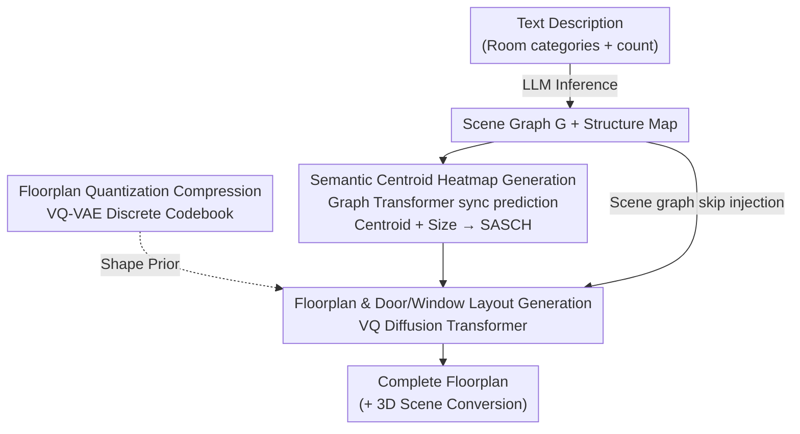

# CG-Floor: Centroid-Guided Diffusion for Large-Scale Floorplan Generation

**Conference**: CVPR 2026  
**Paper**: [CVF Open Access](https://openaccess.thecvf.com/content/CVPR2026/html/Lian_CG-Floor_Centroid-Guided_Diffusion_for_Large_Scale_Floorplan_Generation_CVPR_20_paper.html)  
**Code**: https://cic.tju.edu.cn/faculty/likun/projects/CG-Floor (Project page, code open)  
**Area**: Diffusion Models / Image Generation  
**Keywords**: Floorplan generation, centroid-guided diffusion, VQ-VAE codebook, topology-geometry decoupling, large-scale layout  

## TL;DR
CG-Floor employs a "locate-then-draw" hierarchical framework for large-scale floorplan generation: first, a Graph Transformer predicts centroids and sizes of all rooms simultaneously, encoded as a "Size-Aware Semantic Centroid Heatmap" (SASCH) to anchor the global topology; then, a VQ-VAE codebook and a Vector Quantized Diffusion Transformer draw non-Manhattan (non-rectangular) room shapes guided by the SASCH. It reduces the FID from 79.7 to 16.0 on the large-scale MSD dataset.

## Background & Motivation
**Background**: Floorplan generation previously fell into two main categories: rule-based optimization (manual constraints + solving) and learning-based methods (HouseGAN++, HouseDiffusion, Graph2Plan, etc.). Learning-based methods driven by graph or wall constraints perform well on small floorplans with fewer than 10 rooms and regular shapes.

**Limitations of Prior Work**: Existing methods fail in large-scale scenarios (multi-unit residential or commercial buildings) with dozens of rooms, dense connectivity, and irregular shapes, exposing two specific issues. First, vector-based methods (e.g., MHD, which represents each room as a polygon and directly regresses vertex coordinates) suffer from combinatorial explosion as the number of rooms and vertices grows; to achieve convergence, they often force rooms to be rectangular, leading to shape distortion and severe inconsistency with structural constraints. Second, pixel-based methods (e.g., Graph-informed U-Net) can naturally accommodate non-Manhattan geometry but lack global room position information, resulting in blurry boundaries, numerous artifacts, and difficulty in room segmentation.

**Key Challenge**: In large-scale floorplans, **topological complexity (room connectivity, relative positions) and geometric complexity (irregular shapes) are entangled in a single generation process** by existing methods. Models attempt to manage global relations and local shapes simultaneously, failing at both—leading to semantic misalignment and room displacement.

**Goal**: To generate floorplans that are both semantically consistent (matching input room categories/counts/connectivity) and geometrically realistic/diverse under large-scale, densely connected, and non-rectangular conditions, while supporting text input, editing, and 3D conversion.

**Key Insight**: Since entanglement is the root cause, the solution is **explicit decoupling**—decomposing the problem into two stages: first solving topology, then geometry. The authors' key observation is that instead of predicting room centroids sequentially (which accumulates errors and ignores room sizes), a model should **synchronously predict the centroids and sizes of all rooms in a single forward pass**. This serves as a powerful "topological anchor" to align global structure with input constraints, leaving shape details to subsequent generation.

**Core Idea**: Use a "Size-Aware Semantic Centroid Heatmap (SASCH)" as an intermediary to decouple topology prediction and shape generation—first determining where each room is and how large it should be, then allowing a diffusion model to fill in irregular contours under the guidance of this map.

## Method

### Overall Architecture
CG-Floor is a coarse-to-fine hierarchical framework. The input is a scene graph $G=(V,E)$ (room nodes + spatial semantic relations, which can be automatically generated by an LLM from text like "three bedrooms and one kitchen") plus a structural map $I_{struct}$ (building boundary/load-bearing structure). The output is a large-scale floorplan that can be further converted into a 3D scene. The pipeline consists of three modules:

1.  **Semantic Centroid Heatmap Generation** (§3.3): A Graph Transformer fuses scene graph connectivity with structural map features to simultaneously predict the centroid coordinates and sizes of all rooms, which are then encoded into a multi-channel SASCH to serve as structural conditions.
2.  **Floorplan Quantization Compression** (§3.4): A pre-trained VQ-VAE compresses floorplans containing complex room types into discrete codebook tokens to specifically handle non-Manhattan irregular geometry.
3.  **Floorplan and Door/Window Layout Generation** (§3.5): A Vector Quantized Diffusion Transformer denoises and generates room-wall maps in the SASCH and codebook latent space, followed by a U-Net to complete the door and window layout.

These three modules correspond to "Locate → Learn shape priors → Draw shapes and details within priors," completely separating topological and geometric complexity. The data flow is as follows:

### Key Designs

**1. Explicit Topology-Geometry Decoupling and Synchronous Centroid+Size Prediction**

This is the foundation of the work. The pain point is that sequential centroid prediction accumulates errors and ignores room sizes early on, while direct layout generation fails to capture global connectivity. CG-Floor does the opposite: it synchronously predicts the centroid positions $\hat p_i$ and sizes $\hat s_i$ of **all** rooms in a **single forward pass**, treating them as "topological anchors" to align global structure with input constraints. This step focuses only on "where each room is, how large it is, and who it connects to," **temporarily stripping away shape information**. This extracts topological complexity from subsequent geometric complexity, significantly reducing overall difficulty. Unlike methods like MHD that bake topology and geometry into one process, decoupling allows the model to solve one sub-problem per stage—placing the "skeleton" correctly before "growing the flesh," which is why semantic misalignment is resolved in large-scale scenes.

**2. Size-Aware Semantic Centroid Heatmap (SASCH): Encoding the Skeleton as Diffusion Conditions**

Predicting centroids and sizes is insufficient; they must be transformed into a conditional representation usable by the generator. The authors use an $L$-layer Graph Transformer to jointly process scene graph connectivity and structural features. The structure map is first encoded into $f_{struct}$ via a 3-layer CNN. Node and edge features are updated layer-by-layer (multi-head attention, with edge features participating in scoring):

$$\hat w_{ij}^{k,\ell} = \frac{Q^{k,\ell}h_i^{\ell}\cdot K^{k,\ell}h_j^{\ell}}{\sqrt{d_k}}\cdot E^{k,\ell}e_{ij}^{\ell}, \qquad w_{ij}^{k,\ell}=\mathrm{softmax}_j(\hat w_{ij}^{k,\ell})$$

Each layer use cross-attention to dynamically fuse visual features $f_{struct}$ with node features. Final node features are decoded by an MLP into centroids $\hat p_i$ and sizes $\hat s_i$. Then, the SASCH is constructed: for $C$ room types, each type has a channel $H_k$. Each room of that type is drawn as a Gaussian kernel centered at $(x_i, y_i)$ with a standard deviation $\sigma_i$ proportional to the room size $s_i$:

$$H_k(x,y)=\sum_{i\in\mathcal R_k}\exp\!\left(-\frac{(x-x_i)^2+(y-y_i)^2}{2\sigma_i^2}\right)$$

Stacking $C$ channels yields $H\in\mathbb R^{C\times S_l\times S_l}$. SASCH is effective because it encodes "category + global position + size" into a spatial heatmap—maintaining semantics (via channels) and implicitly expressing room size (via Gaussian radius), providing the diffuser with a dense, differentiable, and semantically aligned structural guide. Removing it in ablations (w/o SASCH) leads to errors in room counts and types.

**3. VQ-VAE Codebook + VQ Diffusion Transformer: Handling Non-Manhattan Irregular Rooms**

In large-scale floorplans, room contours are no longer axis-aligned (non-Manhattan) and are highly diverse and irregular. Directly performing diffusion in pixel space is both expensive and prone to blurriness. The authors first use a VQ-VAE to encode the floorplan $F\in\{0,1\}^{C\times S\times S}$ into a learnable codebook $\mathcal C=\{c_i\}$ containing $N$ vectors. The encoder outputs continuous latents $Z=E(F)$, where each spatial vector is quantized to the nearest codebook entry $c_t=\arg\min_{c_i\in\mathcal C}\|z_k-c_i\|_2$. After obtaining discrete $Z_q$, the decoder reconstructs $\hat F=D(Z_q)$. This discrete codebook compresses "rich room contour patterns" into a compact set of tokens, essentially learning a **shape prior library**.

Subsequently, an $M$-layer denoising Transformer is trained to perform **discrete absorbing diffusion** in the codebook latent space. Condition injection occurs via two paths: SASCH and $f_{struct}$ are concatenated and aligned via $1\times1$ convolution before being added to initial noise to form $Z_T$; simultaneously—to compensate for "centroid representation blind spots" (e.g., the centroid of a C-shaped room might fall outside the room)—scene graph node features $\{h_i^L\}$ from the Graph Transformer are injected via **skip connections** using cross-attention every $M_s$ blocks. This ensures generation fits connectivity and category constraints. The discrete absorbing diffusion accelerates generation through parallel token prediction. Generated floorplans contain rooms and walls; doors and windows are then added by a U-Net predicting the layout $I_{dw}$, which also uses cross-attention to inject $h_i^L$ at its lowest resolution. Removing the VAE (letting diffusion draw complex shapes directly) causes the FID to jump from 16 to 270, and removing skip connections increases the FID to 66.9.

### Loss & Training
Training occurs in two stages. Phase 1: Train VQ-VAE with reconstruction loss $L_{rec}$ (cross-entropy) + quantization loss $L_{VQ}=\|\mathrm{sg}[Z]-Z_q\|_2+\beta\|Z-\mathrm{sg}[Z_q]\|_2$ ($\mathrm{sg}$ is stop-gradient), combined as $L_{VAE}=L_{rec}+L_{VQ}$. Phase 2: Freeze VAE and train the generative model: $L_{floorplan}=\lambda_1 L_{geo}+\lambda_2 L_{diffusion}+\lambda_3 L_{dw}$, where $L_{geo}$ is the L2 loss for centroid position and size, $L_{dw}$ is door/window cross-entropy, and $L_{diffusion}$ uses reweighted ELBO. Hyperparameters: $\beta,\lambda_1,\lambda_2,\lambda_3=0.25,1,1,1$, $T=1000$, codebook $N=1024$, resolution $S=1024$. Training used 4 RTX 4090s for 1000 epochs per stage.

## Key Experimental Results

### Main Results
On the large-scale MSD dataset (approx. 5.3K annotated floorplans of medium-to-large building complexes, the only large-scale dataset available), all baselines were retrained using the same "scene graph + structure map" inputs. CG-Floor leads across all four metrics:

| Method | FID↓ | KID↓ | Shape-Sim↑ | Consistency↑ |
|------|------|------|-----------|--------------|
| Graph2Plan | 279.86 | 277.49 | 0.56 | - |
| HouseGAN++ | 160.59 | 125.70 | 0.68 | - |
| UN | 179.22 | 180.67 | 0.41 | - |
| MHD | 79.72 | 63.85 | 0.65 | 87.1 |
| **Ours** | **16.03** | **6.80** | **0.71** | **91.3** |

Compared to the runner-up MHD, FID decreased by 79.8% and KID by 89.3%. Shape-Sim (0.71 vs 0.65) indicates better handling of diverse geometries (breaking the rectangular assumption). Consistency (91.3 vs 87.1) shows better maintenance of topological connectivity.

### Ablation Study

| Configuration | FID↓ | KID↓ | Shape-Sim↑ | Consistency↑ | Description |
|------|------|------|-----------|--------------|------|
| Full model | **16.03** | **6.80** | **0.71** | **91.3** | Full model |
| w/o SASCH | 21.62 | 8.61 | 0.67 | - | Remove centroid heatmap; errors in room count/type |
| w/o VAE | 270.49 | 349.00 | 0.64 | - | Diffusion draws complex shapes directly; near collapse |
| w/o SKIP | 66.92 | 38.31 | 0.65 | 89.7 | No scene graph feature injection; connectivity worsens |
| w/o AUG | 25.95 | 15.65 | 0.68 | 90.1 | No data augmentation |

In the user study (Table 3), the selection rates for the proposed method in GT-Similarity / Consistency / Realism were 95.0% / 93.2% / 92.5%, significantly outperforming all baselines.

### Key Findings
- **VQ-VAE is the bottleneck for geometric quality**: Removing it causes FID to surge from 16 to 270, proving that for complex non-Manhattan rooms, "learning discrete shape priors first and then sampling within them" is far more reliable than raw pixel-based diffusion.
- **SASCH handles semantic alignment**: Removing it results in the smallest FID degradation (21.6), but room counts and types begin to fail. Its value lies in topological/semantic correctness rather than pixel fidelity, validating the "decoupling" design.
- **Skip connections fix centroid blind spots**: Removing them increases FID to 66.9, confirming that centroids falling outside rooms (e.g., C-shapes) is a genuine issue requiring scene graph feature bypasses to correct connectivity.

## Highlights & Insights
- **Using SASCH as an intermediary for topology and geometry is a clean decoupling point**: It translates abstract connectivity constraints into a dense, differentiable spatial map that both supervises (L2 regression) and guides diffusion. It is more informative than a raw connectivity graph and easier than direct layout drawing.
- **Size-awareness is a subtle but critical addition**: Setting Gaussian kernel standard deviation proportional to room size ensures that "large living rooms" and "small bathrooms" have different coverage areas in the heatmap. This implicitly encodes area priors into conditions for free.
- **The combination of discrete codebooks and discrete absorbing diffusion is transferable**: Quantizing "complex shapes" into a token library before diffusion is a strategy applicable to any layout generation with clear global structure but irregular local geometry (e.g., PCB layouts, maps, UI layouts).
- **The LLM bypass for Text → Scene Graph lowers the barrier to entry**: Users only provide "number of bedrooms/kitchens," and the LLM completes connectivity via statistical constraints, avoiding the impracticality of manual graph drawing in large-scale scenes.

## Limitations & Future Work
- Reliance on the single MSD dataset (5.3K) means generalization to other architectural styles or national regulations is not fully verified.
- Under in-the-wild text input, the authors acknowledge "minor local artifacts" that require post-processing; doors and windows are added by an independent U-Net rather than through end-to-end joint optimization, which may lead to imperfect coordination.
- The two-stage training (1000 epochs each) involves significant computational cost. While discrete absorbing diffusion is parallelized, the inference overhead for $T=1000$ and $S=1024$ is not quantitatively reported in the main text.
- **Future Directions**: Integrating door/window layouts into the main diffusion model; introducing architectural code constraints (evacuation, lighting); exploring lighter codebooks or few-step diffusion to reduce inference cost.

## Related Work & Insights
- **vs MHD (Modified HouseDiffusion, Vector Polygons)**: MHD regresses vertex coordinates directly; in large scales, vertex combinations explode, forcing a retreat to rectangular assumptions. The proposed pixel + codebook approach naturally accommodates non-Manhattan shapes (FID 16 vs 79.7).
- **vs UN (Graph-informed U-Net, Pixel)**: UN fuses structure and connectivity maps into pixel generation but lacks global room positions, causing blurry boundaries (Shape-Sim only 0.41). CG-Floor uses SASCH to provide explicit anchors, solving the "lack of global localization → blurry boundaries" defect.
- **vs HouseGAN++ / Graph2Plan (SOTA for small floorplans)**: Both perform adequately for <10 rooms but suffer from incorrect room counts and broken connectivity at scale. CG-Floor's hierarchical decoupling is specifically designed for large scales, representing a paradigm shift from "small-scale floorplans" to "large-scale floorplans."

## Rating
- Novelty: ⭐⭐⭐⭐⭐ Decoupling via SASCH and using VQ-VAE for non-Manhattan shapes directly addresses central pain points of large-scale layouts.
- Experimental Thoroughness: ⭐⭐⭐⭐ Main experiments, ablations, and user studies are comprehensive with massive improvements, though limited to the MSD dataset.
- Writing Quality: ⭐⭐⭐⭐ The logic of Motivation—Decoupling—Modules is very clear. Metrics for consistency are deferred to the supplement.
- Value: ⭐⭐⭐⭐⭐ High practical value by pushing floorplan generation from <10 rooms to large scales with text/edit/3D support.

<!-- RELATED:START -->

## Related Papers

- [\[CVPR 2026\] Unified Vector Floorplan Generation via Markup Representation](unified_vector_floorplan_generation_via_markup_representation.md)
- [\[CVPR 2026\] Pico-Banana-400K: A Large-Scale Dataset for Text-Guided Image Editing](pico-banana-400k_a_large-scale_dataset_for_text-guided_image_editing.md)
- [\[CVPR 2026\] 4KLSDB: A Large-Scale Dataset for 4K Image Restoration and Generation](4klsdb_a_large-scale_dataset_for_4k_image_restoration_and_generation.md)
- [\[CVPR 2026\] StyleText: A Large-Scale Dataset and Benchmark for Stylized Scene Text Inpainting](styletext_a_large-scale_dataset_and_benchmark_for_stylized_scene_text_inpainting.md)
- [\[CVPR 2026\] Scale Space Diffusion：把尺度空间塞进扩散过程](scale_space_diffusion.md)

<!-- RELATED:END -->
