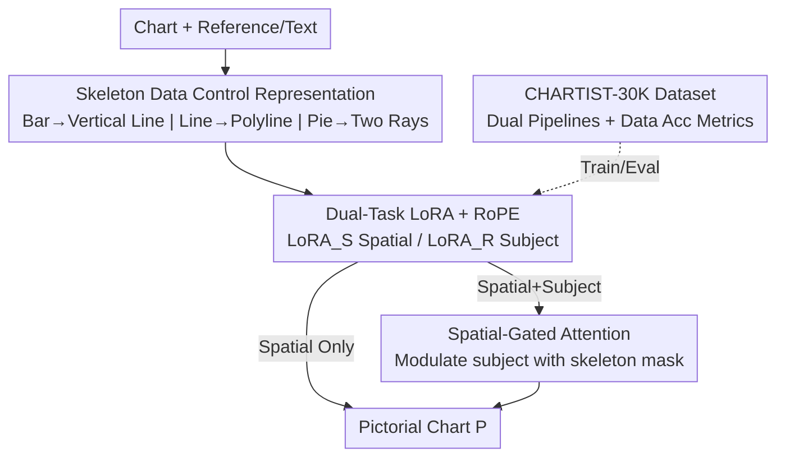

# ChArtist: Generating Pictorial Charts with Unified Spatial and Subject Control

**Conference**: CVPR 2026  
**Paper**: [CVF Open Access](https://openaccess.thecvf.com/content/CVPR2026/html/Xiao_ChArtist_Generating_Pictorial_Charts_with_Unified_Spatial_and_Subject_Control_CVPR_2026_paper.html)  
**Code**: Project Page https://chartist-ai.github.io/ (Code not explicitly open-sourced, ⚠️ refer to project page)  
**Area**: Diffusion Models / Image Generation  
**Keywords**: Pictorial Chart Generation, Controllable Diffusion, Skeleton Representation, Subject-Driven Generation, Gated Attention  

## TL;DR
ChArtist abstracts the data structures of "bar/line/pie" charts into minimalist **skeletons** as spatial conditions and overlays the **subject** conditions from reference images. It trains two independent LoRAs to learn these controls separately and uses **spatial-gated attention** during inference to ensure the subject adheres to the spatial structure, automatically generating pictorial charts that are both faithful to data and visually expressive.

## Background & Motivation
**Background**: Pictorial charts embed semantic images directly into chart structures to tell data stories—for example, using a series of dogs of varying heights instead of bars, or following a line graph with the silhouette of a flower. They are more eye-catching and memorable than standard bar charts but currently rely on manual assembly by designers or semi-automated tools, which is labor-intensive and lacks quantitative evaluation of "data accuracy."

**Limitations of Prior Work**: Generating these automatically with existing controllable diffusion models is difficult. Mainstream spatial controls (ControlNet's Canny edges, depth maps, etc.) are **dense pixel-level conditions** designed for natural images. They assume a pixel-to-pixel correspondence between the condition and the generated image, forcing the content into silhouettes—this is disastrous for pictorial charts that require "creative deformation," as content gets squeezed into hard boundaries or loses semantic detail. Conversely, sparse conditions (bounding boxes) are too weak to maintain internal chart structures.

**Key Challenge**: Pictorial charts must simultaneously satisfy two conflicting requirements: **data fidelity** (accurate bar heights, line trends, and pie angles) and **visual expression** (natural and aesthetically pleasing images that integrate reference subjects). Dense conditions favor the former at the expense of the latter, and sparse conditions do the opposite. Furthermore, adding both "spatial constraints" and "reference subjects" causes **cross-condition interference**, where the subject branch distorts the spatial structure or leaks reference content into the background, destroying data fidelity.

**Goal**: To build an end-to-end pictorial chart generation pipeline that supports two workflows from real design processes: "data-first" (defining the chart before finding suitable images), corresponding to **spatial control**, and "visual-first" (selecting a beautiful image before deforming it into a chart), corresponding to **subject control**. Both can be used independently or jointly.

**Key Insight**: Rather than using general-purpose conditions for natural images, it is better to design a **task-specific** control representation for charts. The authors observed that chart information primarily resides in the "data encoding dimensions" (bar height, line path, pie angle), while everything else is style space for creative expression.

**Core Idea**: Replace dense silhouettes with a **skeleton representation** that encodes only data dimensions. Train two independent LoRAs for spatial and subject control, and use a training-free **spatial-gated attention** during inference to force the "subject to obey the space," achieving a balance between data fidelity and visual expression.

## Method

### Overall Architecture
ChArtist is built on the pretrained Diffusion Transformer (FLUX.1-DEV). The input is a chart skeleton $S$ (optionally overlaid with a reference image $R$ or text), and the output is a pictorial chart $P$ that integrates the visual subject with the data structure. The pipeline consists of four parts: compressing the chart into a **skeleton representation** as a spatial condition; training two task-specific LoRAs—$\text{LoRA}_S$ for spatial alignment and $\text{LoRA}_R$ for subject injection, merged into the same multimodal sequence via RoPE position strategies; using **spatial-gated attention** during dual-control inference to modulate subject signals with spatial masks; and supporting all this with the self-constructed **CHARTIST-30K** triplet dataset and a set of **data accuracy metrics**.

### Key Designs

**1. Skeleton Data Control Representation: Encoding only data dimensions to leave style space**

To address the conflict between "dense conditions being too rigid and sparse conditions being too weak," the authors found a "sweet spot" on the complexity spectrum of control representations: the **skeleton**. Its design principle is to retain only the primary data encoding dimensions of the chart while keeping the structure as minimalist as possible. For the three chart types, the skeletons are defined minimally: for bar charts, **each bar is represented by a vertical line** (encoding height); for line charts, a **polyline** tracks the trend; and for pie charts, **two colored radial lines** mark the clockwise start and end angles of each sector. Compared to Canny/depth maps, skeletons contain no specific object contours, so the model is not "held hostage" by original shapes and can freely deform any reference subject into these structures—exactly what "creative deformation" requires.

**2. Dual-Task LoRA + RoPE Unified Sequence: Decoupling spatial and subject controls**

To support both "spatial-first" and "visual-first" workflows in one framework, the authors trained two **task-specific LoRAs** instead of learning both controls together. Condition image tokens $C$ (skeleton $S$ for spatial, reference $R$ for subject), text tokens $T$, and noisy image tokens $X$ are concatenated into a unified sequence $[T, X, C]$ and fed into the DiT. $T$ and $X$ pass through the frozen pretrained backbone, while only $C$ passes through the trainable LoRA adapters, allowing the three types of tokens to interact via multimodal attention. The two LoRAs are trained on different data—$\text{LoRA}_S$ learns skeleton-chart pairs $(S, P)$, while $\text{LoRA}_R$ learns reference-chart pairs $(R, P)$. Moreover, their positional requirements differ: spatial control must be **spatially aligned** with latent variables $X$, whereas subject control does not. To unify them, the authors used a RoPE position-aware strategy—skeleton $S$ and latent tokens $X$ **share position indices** (ensuring point-to-point alignment), while reference $R$ is shifted as a whole by an offset $\Delta$ in the latent space next to $X$. This allows the two LoRAs to be used individually or jointly, corresponding to different semantic sources (text concepts vs. reference appearance).

**3. Spatial-Gated Attention: Converting "parallel competition" to "serial dependency"**

Directly merging two LoRAs in parallel causes severe cross-condition interference, which is fatal for charts. This manifests as either the generation not sticking to the skeleton (**structural misalignment**) or the chart area being correct while reference content leaks into the background (**style leakage**). The authors' insight is that pictorial charts inherently require the subject to be **explicitly subordinate** to spatial constraints. Thus, they switched the inference paradigm from parallel competition to serial conditioning and proposed training-free spatial-gated attention. The process involves two steps: first, deriving a **spatial mask** $M$ from the spatial condition. Since skeletons are sparse, the attention map between skeleton queries and latent keys is calculated:

$$W_{S\to X} = \mathrm{softmax}\!\left(\frac{Q_S K_X^\top}{\sqrt{d_k}}\right),$$

where $(W_{S\to X})_{i,j}$ represents the probability of latent token $j$ aligning with skeleton token $i$. The attention of these "data-encoding tokens" is aggregated to form the mask $M = \sum_{i \in I_S}(W_{S\to X})_i$, where $I_S$ is the set of 1D token indices for foreground pixels. Then, $M$ is used to gate the subject attention—replacing the original subject attention $W_{X\to R}$ with:

$$W'_{X\to R} = M \odot W_{X\to R} + \beta\cdot(1-M)\odot W_{X\to R},$$

where $\odot$ is element-wise multiplication and $\beta$ controls the intensity of the subject's presence in background regions, followed by normalization. Intuitively, in chart regions where $M$ is high, subject attention is preserved; in non-chart regions where $M$ is low, subject attention is suppressed to $\beta$ times its original value. A smaller $\beta$ better "confines" the reference content to the chart area. This mechanism requires no retraining and is applied only during inference.

**4. CHARTIST-30K Dataset & Data Accuracy Metrics: Creating triplets via dual pipelines**

Fine-tuning the LoRAs requires $(S, R, P)$ triplets, which do not exist in the real world. The authors synthesized 30,000 samples (10k each for bar/line/pie). Since deformation needs vary wildly between charts, they used two pipelines. **Bar charts use $(R, S)\to P$ (Reference-First)**: A T2I model generates a single-object reference $R$, BiRefNet extracts the background for precise height, and $R$ is sliced vertically into $K=5$ equal grids. Grids are ranked in a "priority queue" based on SSIM (high SSIM = repetitive texture, safe for duplication/cropping) to match the height specified by $S$. Finally, I2I refinement ensures a seamless pictorial bar. **Line/Pie charts use the reverse $S\to P\to R$ (Chart-First)**: Since bending rigid objects into curves is ill-posed, the authors first generate a background with repetitive textures using T2I, use skeleton $S$ as a binary mask to crop the chart shape for an initial $P$, and use I2I for detail. Then, using a diptych prompt, an inpainting model generates an object $R$ to the right of $P$ that is "consistent in appearance but natural and independent in shape." A **Structure-Aware F1** metric was also designed: since skeletons are sparse, IoU cannot capture alignment. They construct a **distance field** along data-encoding dimensions and sample weighted Precision/Recall based on "data encoding type"—weighting regions near the trajectory for lines, bar endpoints for bars, and radial dividers for pies.

### Loss & Training
Following the default settings of OmniControl, FLUX.1-DEV was fine-tuned with LoRA on CHARTIST-30K. For each chart type, two LoRAs with rank=16 (spatial/subject) were trained at $512\times512$ resolution for 25,000 iterations each using 2×NVIDIA A100 (80GB). The default subject suppression factor is $\beta=0.6$.

## Key Experimental Results

### Main Results
Evaluation was split into Task 1 (Spatial Alignment Only) and Task 2 (Subject-Guided + Joint). 500 evaluation images were generated per chart type per task, with prompts covering 30 categories (plants, animals, architecture, sports, etc.).

**Task 1 (Spatial Alignment Only)** comparing different spatial control representations. Higher Data Accuracy (Data Acc) indicates better fidelity, higher CLIP-T indicates better text alignment:

| Method | Bar Data Acc | Bar CLIP-T | Line Data Acc | Line CLIP-T | Pie Data Acc | Pie CLIP-T |
|------|------|------|------|------|------|------|
| ControlNet-Canny | 0.741 | 0.249 | 0.819 | 0.227 | 0.725 | 0.136 |
| ControlNet-Depth | 0.686 | 0.243 | 0.858 | 0.243 | 0.626 | 0.158 |
| SDEdit | 0.774 | 0.233 | 0.792 | 0.190 | 0.836 | 0.190 |
| InPainting | **0.923** | 0.231 | 0.754 | 0.179 | 0.794 | 0.217 |
| **ChArtist** | 0.894 | **0.304** | **0.920** | **0.247** | 0.778 | **0.252** |

ChArtist ranks **first in CLIP-T** across all three chart types, showing it integrates visual semantics without breaking structure. While some baselines (like InPainting for bars) have slightly higher Data Acc, their CLIP-T is significantly lower (the chart looks like a sketch and ignores semantics).

**Task 1+2 (Dual Control: Spatial + Subject)** comparing against ControlNet+IP-Adapter, Paint-by-Example, and advanced image editing models (Qwen-Image-Edit / Nano Banana / GPT-Image-1). DINO and CLIP-I measure visual consistency with the reference:

| Method | Bar Data Acc | Bar DINO | Line Data Acc | Line DINO | Pie Data Acc | Pie DINO | MUSIQ |
|------|------|------|------|------|------|------|------|
| ControlNet-Canny + IP-Adapter | 0.634 | 0.652 | 0.728 | 0.613 | 0.652 | 0.651 | 67.38 |
| Paint-by-Example | 0.912 | 0.586 | 0.513 | 0.429 | 0.420 | 0.495 | 65.37 |
| Qwen-Image-Edit | 0.733 | 0.697 | 0.574 | 0.621 | 0.765 | 0.578 | 63.18 |
| Nano Banana | 0.727 | 0.731 | 0.716 | 0.606 | 0.546 | 0.692 | 65.32 |
| GPT-Image-1 | 0.758 | 0.745 | 0.628 | 0.679 | 0.422 | 0.657 | 67.98 |
| **ChArtist** | **0.931** | **0.837** | **0.905** | **0.728** | 0.753 | 0.689 | **69.35** |

ChArtist leads across data accuracy, visual consistency, and image quality. The improvement is most pronounced for line charts (Data Acc 0.905 vs. 0.728 for the next best).

### Ablation Study
Adjusting the subject suppression factor $\beta$ for line pictorial charts:

| $\beta$ | Data Acc | DINO | CLIP-T | Description |
|------|------|------|------|------|
| 0.3 | **0.927** | 0.732 | 0.324 | Strong suppression: Subject confined to chart, highest data accuracy |
| 0.6 | 0.876 | 0.748 | **0.349** | Default compromise |
| 0.9 | 0.729 | **0.775** | 0.337 | Weak suppression: Reference background likely to leak in |

### Key Findings
- $\beta$ directly controls the trade-off between **data fidelity and visual consistency**: smaller $\beta$ values suppress background attention, preventing leakage and increasing Data Acc (Data Acc 0.729 $\to$ 0.927 as $\beta$ moves 0.9 $\to$ 0.3), but visual consistency (DINO) declines.
- Spatial-gated attention is crucial for dual control: removing it to merge LoRAs in parallel leads to structural misalignment and style leakage, whereas it works training-free during inference.
- In a 300-person online user study, ChArtist ranked 2nd in both data accuracy and semantic alignment, making it the **most balanced** method across all criteria.

## Highlights & Insights
- **"Task-specific representation > general conditions" is a core tenet**: The authors explicitly place skeletons on the complexity spectrum—dense (Canny/Depth) is too rigid, sparse (bbox) is too weak; the sweet spot for charts is a minimalist skeleton encoding only data dimensions. This concept of "tailored conditions" is transferable to tasks like font art or QR code steganography.
- **Spatial-gated attention transforms multi-control into a dependency problem**: Instead of letting two LoRAs compete as equals, the attention map of one (spatial) is used to derive a mask to gate the other (subject). This training-free mechanism is a clever template for resolving multi-control conflicts.
- **Reverse data pipeline for ill-posed deformation**: For line/pie charts, instead of warping objects, the pipeline generates the pictorial chart from the skeleton first and then reverses the reference object ($S\to P\to R$), bypassing the difficulty of "bending a flower into a polyline."

## Limitations & Future Work
- The three skeleton types (lines, polylines, rays) are manually defined for bars, lines, and pies. While the pipeline claims coverage for complex charts (scatter, radar, tree maps), quantitative results for these types were not highlighted; ⚠️ cross-type generalization remains to be verified.
- The Data Accuracy metric relies on human-set distance fields and weights (hand-tuned per chart type), meaning scores are not perfectly comparable across different chart types.
- For pie charts, ChArtist is not always the absolute best (e.g., Task 1 Data Acc 0.778 vs SDEdit 0.836), suggesting angular encoding might be harder to control than height-based encoding.
- Dependency on the FLUX backbone and synthetic data means performance on real hand-drawn or complex multi-series charts is an open question.

## Related Work & Insights
- **vs ControlNet (Canny/Depth)**: ControlNet uses dense pixel conditions for strong spatial constraints, but pixel-wise correspondence forces content into rigid outlines; ChArtist uses sparse skeletons to leave room for stylistic deformation, resulting in higher CLIP-T.
- **vs SDEdit / Inpainting**: These are weak image conditions that often drift from the chart shape or degrade into sketches; ChArtist's skeleton guidance is significantly stronger.
- **vs Multi-control Parallel Merging (IP-Adapter, etc.)**: Parallel merging causes cross-condition interference; ChArtist uses serial dependency via spatial-gated attention to make the subject subordinate.
- **vs Image Editing Models (Qwen-Image-Edit, etc.)**: These models have good visual consistency but struggle with strict structural constraints; ChArtist excels in data accuracy, specifically designed for chart rigidity.

## Rating
- Novelty: ⭐⭐⭐⭐⭐ Formalizes pictorial chart generation as "skeleton spatial control + subject control" and solves multi-control interference via training-free gated attention.
- Experimental Thoroughness: ⭐⭐⭐⭐ Covers three chart types, two tasks, multiple baselines, and ablation; however, generalization across more complex chart types lacks deep quantitative proof.
- Writing Quality: ⭐⭐⭐⭐⭐ Clear "spectrum" motivation, excellent visual comparisons, and good documentation of failure modes (misalignment/leakage).
- Value: ⭐⭐⭐⭐ Allows models to produce faithful and beautiful pictorial charts with a supporting dataset and metrics, offering methodological value for data storytelling and multi-control generation.

<!-- RELATED:START -->

## Related Papers

- [\[CVPR 2026\] Scone: Bridging Composition and Distinction in Subject-Driven Image Generation via Unified Understanding-Generation Modeling](scone_bridging_composition_and_distinction_in_subject-driven_image_generation_vi.md)
- [\[CVPR 2026\] ConsistCompose: Unified Multimodal Layout Control for Image Composition](consistcompose_multimodal_layout_control.md)
- [\[CVPR 2026\] ProjFlow: Projection Sampling with Flow Matching for Zero-Shot Exact Spatial Motion Control](projflow_projection_sampling_with_flow_matching_for_zero-shot_exact_spatial_moti.md)
- [\[CVPR 2026\] FlowFixer: Towards Detail-Preserving Subject-Driven Generation](flowfixer_towards_detail-preserving_subject-driven_generation.md)
- [\[CVPR 2026\] Spatial-SSRL: Enhancing Spatial Understanding via Self-Supervised Reinforcement Learning](spatial-ssrl_enhancing_spatial_understanding_via_self-supervised_reinforcement_l.md)

<!-- RELATED:END -->
