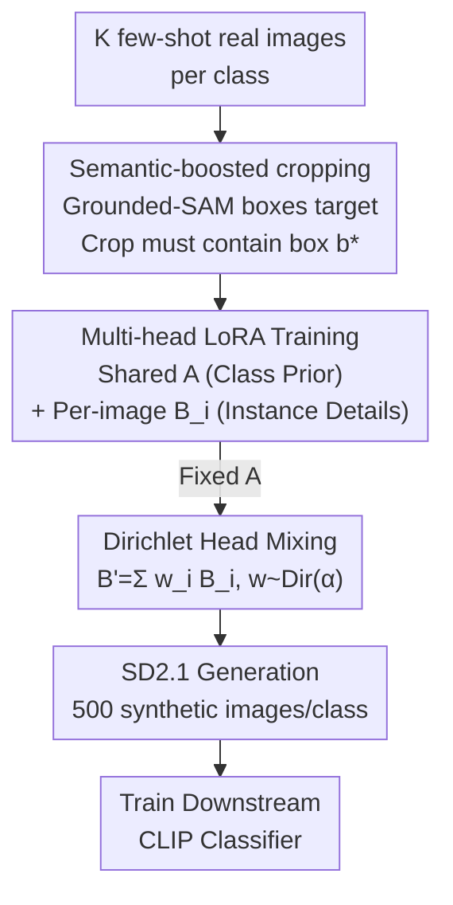

# ChimeraLoRA: Multi-Head LoRA-Guided Synthetic Datasets

**Conference**: CVPR 2026  
**Paper**: [CVF Open Access](https://openaccess.thecvf.com/content/CVPR2026/html/Kim_ChimeraLoRA_Multi-Head_LoRA-Guided_Synthetic_Datasets_CVPR_2026_paper.html)  
**Code**: https://cskhy16.github.io/chimeralora (Project Page)  
**Area**: Image Generation / Diffusion Models  
**Keywords**: Synthetic Datasets, Multi-head LoRA, Diffusion Model Fine-tuning, Few-shot, Long-tail Classification  

## TL;DR
To address data scarcity in few-shot and long-tail scenarios, ChimeraLoRA decomposes the LoRA of diffusion models into a shared matrix A (encoding class priors) and multiple per-image B heads (encoding instance details). By mixing multiple B heads with Dirichlet weights and applying Grounded-SAM box constraints during cropping to preserve target objects, the method synthesizes training sets that are both diverse and detail-rich. Downstream classification accuracy improves by an average of 2.1 percentage points across 9 datasets compared to the state-of-the-art.

## Background & Motivation
**Background**: In specialized domains such as fine-grained recognition and medical imaging, data is naturally scarce and often follows a long-tail distribution, where tail classes may have only a few annotated images. A popular remedy is using pre-trained text-to-image diffusion models (e.g., Stable Diffusion) to synthesize additional training samples. However, images generated solely from text prompts often deviate from the target distribution, potentially degrading downstream accuracy.

**Limitations of Prior Work**: To align synthetic images with the real distribution, recent methods fine-tune LoRA using few-shot real images, but suffer from a granularity trade-off:
- **image-wise LoRA** (e.g., LoFT): Training a LoRA on a single reference image yields high fidelity but results in near-duplicate generations with **poor diversity**.
- **class-wise LoRA** (e.g., DataDream): Training one LoRA on all shots of a class encodes class-level priors and offers better diversity but **ignores instance details**, often failing to accurately depict the target object (e.g., failing to generate a complete camera).

**Key Challenge**: This trade-off stems from adapting the diffusion model at a single granularity (either image-level or class-level). Since diversity comes from class priors and fidelity from instance details, single-granularity LoRA cannot satisfy both simultaneously.

**Key Insight**: Prior analyses suggest that the roles of A and B within a single LoRA are asymmetric—A acts as a projection (encoder) independent of the input distribution, while B fits the specific input distribution (decoder). Thus, a shared A can capture the "class appearance" commonalities, while independent B heads can memorize "individual instance identities," unifying class-level generalization and image-level fidelity within one model.

**Core Idea**: A non-symmetric multi-head structure consisting of "one shared LoRA A (class prior) + K per-image LoRA B heads (instance details)" is used to fine-tune the diffusion model. During generation, A is fixed, and B heads are mixed via Dirichlet sampling to produce a synthetic training set that is both diverse and detailed.

## Method

### Overall Architecture
The goal of ChimeraLoRA is to produce a diverse and high-fidelity synthetic set to augment downstream classification training, given $K$ few-shot real images per class (typically $K=4$). The pipeline consists of three steps: first, using Grounded-SAM to box the target object in each reference image (for semantic cropping); second, **jointly training** an asymmetric multi-head LoRA (shared A + one B per image); third, fixing A and mixing $K$ B-heads into $B'$ using Dirichlet weights to generate images through SD2.1. Finally, a CLIP classifier is trained on the synthetic set.

The underlying LoRA approximates weight updates as the product of two low-rank matrices: given frozen pre-trained weights $W_0 \in \mathbb{R}^{d_1\times d_2}$, it introduces trainable $B \in \mathbb{R}^{d_1\times r}$ and $A \in \mathbb{R}^{r\times d_2}$ ($r \ll \min(d_1,d_2)$), such that the effective weight is $W_0 + BA$. ChimeraLoRA modifies this by sharing $A$ across all images in a class while assigning an independent $B_i$ to each image.

### Key Designs

**1. Asymmetric Multi-Head LoRA: Shared A for Class Priors, Per-Image B for Instance Details**

This core design addresses the granularity trade-off. The adapter is split into a **shared LoRA A** across all $K$ images of a class and a set of **individual LoRA heads** $\mathcal{B}=\{B_i\}_{i=1}^K$ for each image. During training, the base diffusion model is frozen, and A and all $B_i$ are optimized jointly. The reconstruction loss for image $x_i$ follows the standard diffusion denoising objective:

$$\mathcal{L}(A,B_i) := \mathbb{E}_{\epsilon\sim\mathcal{N}(0,1),\,t}\big[\,\|\epsilon - \epsilon_{\theta,A,B_i}(z_{i,t},t,\tau(y))\|_2^2\,\big]$$

where $z_{i,t}$ is the noisy latent from an augmented view $f_{\text{aug}}(x_i)$ and $\tau(y)$ is the text embedding. The shared A is optimized by averaging the target across all $K$ images: $\mathcal{L}(A,\mathcal{B}) = \frac{1}{K}\sum_{i=1}^K \mathcal{L}(A,B_i)$. Initialization follows standard LoRA (Gaussian for A, zero for $B_i$). To stabilize A, it is assigned a **lower learning rate** than B ($1\times10^{-4}$ vs. $1\times10^{-3}$).

This decomposition is effective because A acts as an encoder projecting features into a shared rank-$r$ subspace, while B acts as a decoder mapping representations back to the model space. Shared A facilitates "class-consistent encoding," while individual B-heads reconstruct high-frequency structures. Reversing the setup (**shared B, per-image A**) resulted in distorted objects (e.g., truncated headphones, deformed staplers), confirming that A should be the shared component. This also reduces trainable parameters by 37.5% compared to LoFT/DataDream.

**2. Semantic Boosting: Locking Targets with Grounded-SAM to Prevent Cropping Loss**

This step prevents data augmentation from "cropping out" the target object. Standard training uses random cropping, which may remove parts of the subject, causing misalignment with text prompts or failure to generate the target class.

The method uses Grounded-SAM with the class name as a prompt to detect the **minimum bounding box** $b^\star$ of the target in image $x$. A crop region $R$ is sampled with slight scaling/translation jitter but is **strictly constrained** such that $b^\star \subseteq R$. If the original image is too small to contain the jittered box, it is **zero-padded** to ensure $b^\star$ remains intact while meeting target dimensions. This ensures the model consistently observes the "complete target," better preserving aspect ratios and fine-grained structures.

**3. Dirichlet Mixing of LoRA Heads: Interpolating Instance Details on Class Skeletons**

After training, $K$ heads $B_i$ are available. Rather than using a single $B_i$ (which covers only one point in the distribution), the method creates a convex combination:

$$B' = \sum_{i=1}^K w_i B_i,\qquad (w_1,\ldots,w_K)\sim \text{Dirichlet}(\alpha),\quad \alpha=\alpha\mathbf{1}_K$$

$B'$ and the fixed shared A are integrated into the base model. The concentration parameter $\alpha$ controls diversity: $\alpha<1$ yields sparse weights, approaching **image-wise** mode (high fidelity, low diversity); $\alpha>1$ converges toward uniform weights, approaching **class-wise** mode. $\text{Dir}(1)$ (uniform sampling on the simplex) provides the widest coverage. Resampling $w$ for every generated image applies different instance detail combinations to the "class skeleton A," resulting in sample consistency and diversity.

### Loss & Training
The training objective is the multi-head diffusion denoising loss. SD2.1 is frozen; only shared A and $B_i$ are updated with differential learning rates. For downstream tasks, a CLIP ViT-B/16 with rank-16 LoRA on both image and text encoders is trained for 60 epochs on the augmented set using AdamW and cosine annealing. A guidance scale of 2 is used during generation.

## Key Experimental Results

### Main Results
**Few-shot (4-shot, synthesizing 500 images per class for CLIP training)**: ChimeraLoRA achieved an average of 74.6% across 9 datasets, 2.1pp higher than the strongest baseline LoFT and **surpassing the 71.8% baseline using only 4-shot real images**. Most baseline methods failed to exceed the 4-shot real image performance, highlighting a "synthetic-to-real gap."

| Method | AIR | CAR | DTD | EUR | FLO | PET | ISIC | AVG (9 sets) |
|------|-----|-----|-----|-----|-----|-----|------|------|
| CLIP 4-shot (Real) | 41.3 | 74.3 | 62.0 | 83.5 | 89.9 | 93.3 | 19.6 | 71.8 |
| IsSynth | 39.9 | 71.5 | 60.1 | 73.4 | 89.0 | 91.6 | 23.8 | 70.1 |
| DataDream (Class-wise) | 44.3 | 81.7 | 56.0 | 72.2 | 92.9 | 92.2 | 20.7 | 71.3 |
| LoFT (Image-wise) | 41.7 | 78.0 | 58.0 | 85.0 | 91.3 | 92.4 | 25.6 | 72.5 |
| **Ours** | **46.0** | 79.6 | 61.6 | **86.3** | **93.4** | **93.4** | **29.2** | **74.6** |

The gain on the medical dataset ISIC (+3.6pp over LoFT) underscores the value of diverse yet faithful synthetic data in specialized domains.

**Long-tail (Head classes have $\le 500$ real images; tail classes have 4-shot plus 500 synthetic images)**: Ours improved performance by an average of +7.62pp over real images only, with a **+14.74pp gain specifically for tail classes**.

| Dataset | Real (Avg) | Ours (Avg) | Tail (Real $\rightarrow$ Ours) |
|--------|-----------|------------------|------|
| CIFAR-10 | 84.5 | **89.6** | 70.1 $\rightarrow$ **81.0** |
| EuroSAT | 56.4 | **74.5** | 13.6 $\rightarrow$ **51.3** |
| Flowers102 | 93.5 | **95.4** | 94.2 $\rightarrow$ **96.9** |

### Ablation Study
**Component Ablation** (AIR/FLO; removing both defaults to LoFT):

| Multi-head LoRA | Semantic Boosting | AIR | FLO | Description |
|:---:|:---:|-----|-----|------|
| ✗ | ✗ | 41.7 | 91.3 | Baseline (LoFT) |
| ✓ | ✗ | 43.9 | 93.1 | Shared A improves results |
| ✗ | ✓ | 44.4 | 92.2 | Box-constrained crop improves results |
| ✓ | ✓ | **46.0** | **93.4** | Best combination |

**Synthetic-to-Real Gap** (Avg across 9 sets, FID calculated in CLIP space):

| Method | FID@4 $\downarrow$ | CLIP score $\uparrow$ | Centroid Sim $\uparrow$ |
|------|---------|--------------|------|
| DataDream | 0.23 | 29.67 | 87.8 |
| LoFT | 0.22 | 30.04 | 90.1 |
| **Ours** | **0.20** | **30.31** | **90.5** |

### Key Findings
- **Complementary Components**: Semantic boosting performed better on AIR, while multi-head LoRA was stronger on FLO; combining them yielded the best results overall.
- **Sharing A is Critical**: Replacing it with a shared B produced higher variation but incomplete objects, validating the A=encoder/B=decoder hypothesis.
- **Scalability**: Unlike baselines that sometimes degraded performance as synthetic volume increased, ChimeraLoRA remained robust and scaled positively with data volume.
- **Coverage Visualization**: t-SNE plots show ChimeraLoRA samples uniformly covering the region spanned by real anchors (Coverage=0.93), whereas LoFT collapsed into tight clusters and DataDream drifted from the real distribution.

## Highlights & Insights
- **Turning analytical observations into a framework**: By applying the insight that LoRA A and B roles are asymmetric, the authors effectively mapped class commonalities to A and instance details to B.
- **Unified diversity-fidelity control**: The Dirichlet parameter $\alpha$ acts as a continuous "dial" between image-wise and class-wise approaches.
- **Practical hard-constrained cropping**: Explicitly ensuring $b^\star \subseteq R$ via Grounded-SAM is a low-cost, high-impact technique for any pipeline requiring object integrity.
- **Parameter efficiency**: Sharing matrix A reduces trainable parameters by 37.5% while outperforming more complex baselines.

## Limitations & Future Work
- Medical domain validation is limited; while general-purpose Grounded-SAM was used, domain-specific tools (e.g., MedSAM) might be more appropriate.
- The method relies on the detector's reliability; failures in Grounded-SAM on extremely rare or fine-grained classes could degrade results.
- Scalability to very large $K$ (shots) was not explored, as mixing costs increase with the number of heads.
- Generating with per-image Dirichlet sampling can be slow; there is a trade-off between throughput and diversity (e.g., using uniform mixing vs. sampling).

## Related Work & Insights
- **vs. LoFT**: While LoFT mixes contributions from independent LoRAs, it suffers from diversity collapse. ChimeraLoRA's shared A provides a unified "class skeleton" that better supports interpolation.
- **vs. DataDream**: ChimeraLoRA recovers instance details that class-wise methods typically lose, while semantic boosting ensures object completeness.
- **Conceptual Heritage**: While asymmetric multi-head LoRAs have appeared in NLP (e.g., HydraLoRA for instruction tuning), this is the first application to few-shot synthetic data generation for diffusion models, augmented with Dirichlet mixing and box-constrained cropping.

## Rating
- Novelty: ⭐⭐⭐⭐ Combines asymmetric LoRA roles with Dirichlet mixing and box-constrained cropping for synthetic data.
- Experimental Thoroughness: ⭐⭐⭐⭐⭐ Comprehensive evaluation across 11 datasets and two settings (few-shot/long-tail) with detailed ablations.
- Writing Quality: ⭐⭐⭐⭐ Clear motivation and intuitive visualizations.
- Value: ⭐⭐⭐⭐ Highly practical for data augmentation in specialized and low-data regimes.

<!-- RELATED:START -->

## Related Papers

- [\[CVPR 2026\] AHS: Adaptive Head Synthesis via Synthetic Data Augmentations](ahs_adaptive_head_synthesis.md)
- [\[ICML 2026\] UnHype: CLIP-Guided Hypernetworks for Dynamic LoRA Unlearning](../../ICML2026/image_generation/unhype_clip-guided_hypernetworks_for_dynamic_lora_unlearning.md)
- [\[CVPR 2026\] MapReduce LoRA: Advancing the Pareto Front in Multi-Preference Optimization for Generative Models](mapreduce_lora_advancing_the_pareto_front_in_multi-preference_optimization_for_g.md)
- [\[ICML 2025\] Synthetic Face Datasets Generation via Latent Space Exploration from Brownian Identity Diffusion](../../ICML2025/image_generation/synthetic_face_datasets_generation_via_latent_space_exploration_from_brownian_id.md)
- [\[CVPR 2026\] Head-wise Adaptive Rotary Positional Encoding for Fine-Grained Image Generation](head-wise_adaptive_rotary_positional_encoding_for_fine-grained_image_generation.md)

<!-- RELATED:END -->
## Related Papers

- [\[CVPR 2026\] AHS: Adaptive Head Synthesis via Synthetic Data Augmentations](ahs_adaptive_head_synthesis.md)
- [\[CVPR 2026\] Quantization with Unified Adaptive Distillation to enable multi-LoRA based one-for-all Generative Vision Models on edge](quantization_with_unified_adaptive_distillation_to_enable_multi-lora_based_one-f.md)
- [\[CVPR 2026\] MapReduce LoRA: Advancing the Pareto Front in Multi-Preference Optimization for Generative Models](mapreduce_lora_advancing_the_pareto_front_in_multi-preference_optimization_for_g.md)
- [\[CVPR 2026\] InterEdit: Navigating Text-Guided Multi-Human 3D Motion Editing](interedit_navigating_textguided_multihuman_3d_moti.md)
- [\[ICML 2025\] Synthetic Face Datasets Generation via Latent Space Exploration from Brownian Identity Diffusion](../../ICML2025/image_generation/synthetic_face_datasets_generation_via_latent_space_exploration_from_brownian_id.md)

<!-- RELATED:END -->
