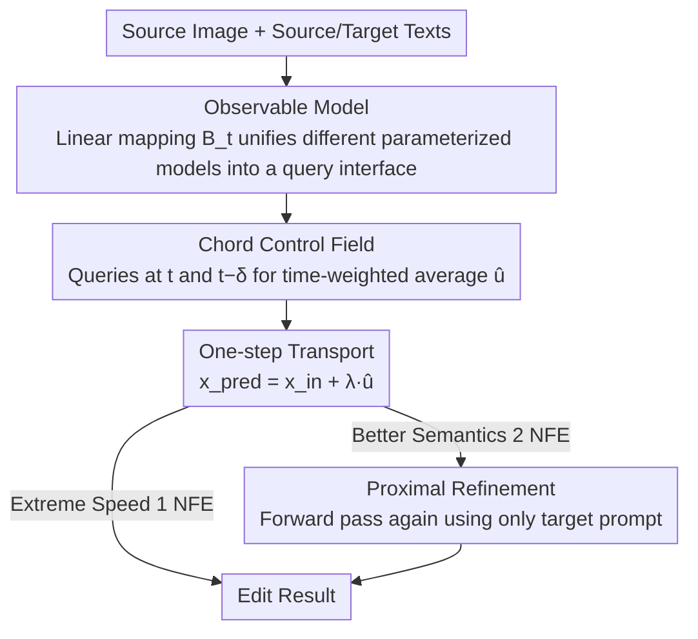

<!-- Generated automatically by src/gen_stubs.py -->
# ChordEdit: One-Step Low-Energy Transport for Image Editing

**Conference**: CVPR 2026  
**arXiv**: [2602.19083](https://arxiv.org/abs/2602.19083)  
**Code**: Available (Project Page: [https://chordedit.github.io](https://chordedit.github.io))  
**Area**: Image Generation  
**Keywords**: Image Editing, Optimal Transport, One-step Inference, Diffusion Distillation Models, Training-free Editing

## TL;DR

Based on dynamic optimal transport theory, a low-energy Chord control field is derived to smooth the unstable naive edit field. This achieves training-free, inversion-free, high-fidelity real-time image editing for distilled one-step T2I models for the first time.

## Background & Motivation

### 1. Background

One-step text-to-image (T2I) models, such as SD-Turbo, SwiftBrush-v2, and InstaFlow, have achieved unprecedented generation speeds through the distillation of large-scale diffusion models, generating high-quality images in a single forward pass. This real-time generation capability naturally raises expectations for its application in text-guided image editing—if generation takes only one step, can editing also be real-time?

### 2. Limitations of Prior Work

Existing image editing methods face a dilemma between two camps:

- **Multi-step methods** (DDIM+PnP, FlowEdit, etc.): Require 30-50 inference steps, with running times ranging from 7 to 80 seconds, making real-time interaction impossible.
- **Trained one-step methods** (SwiftEdit): Require training specialized inversion networks, sacrificing model-agnosticism and relying on precise inversion.
- **Training-free differential methods** (InfEdit, FlowEdit): Work well on multi-step models but fail completely on one-step models—resulting in severe object distortion and collapse of non-edited regions.

### 3. Key Challenge

The distillation process of one-step models makes the mapping from text conditions to vector fields highly non-linear and sensitive. The naive edit field (target drift - source drift) is essentially the arithmetic difference between two large-magnitude, divergent trajectories, producing an unstable high-energy control field. In multi-step models, this instability is gradually absorbed through iterative small-step integration. However, in one-step models, the process must be completed in a single step; the massive integration step size dramatically amplifies errors, leading to total editing failure.

### 4. Goal

How to achieve high-fidelity text-guided image editing for one-step T2I models under the premise of being **training-free and inversion-free**, while maintaining real-time speed.

### 5. Key Insight

The authors move beyond the "simple arithmetic on drift" approach, redefining the editing problem as a **dynamic optimal transport (OT) problem**—finding a low-energy transport path between the source and target distributions. Building on the Benamou-Brenier framework, a theoretically guaranteed control field estimator is derived.

### 6. Core Idea

Replace naive differentiation with time-weighted averaging to construct a low-energy, low-variance Chord control field, allowing editing transport to be stably completed even with one-step large-step integration.

## Method

### Overall Architecture

ChordEdit aims to enable distilled T2I models that run in a single step to perform text-guided editing without training or inversion. Its key insight is to stop using naive differentiation like "target drift minus source drift" for image propagation. Instead, it reformulates editing as an optimal transport problem to find a lower-energy control field that remains stable even with large step sizes.

The entire pipeline (Algorithm 1) consists of three main components: first, querying the model at two adjacent time points $t$ and $t-\delta$, and performing time-weighted averaging to obtain the Chord control field $\hat{u}$; then, performing a one-step transport $x^{\rm pred} = x_{\rm in} + \lambda \hat{u}$; and finally, optionally running a forward pass on the result using only the target prompt for "proximal refinement" to strengthen semantics. The inputs are the source image $x_{\rm src}$, source/target texts $c_{\rm src}, c_{\rm tar}$, and four hyperparameters $t, \delta, \lambda, t_c$. The entire editing process requires only 1-2 network forward evaluations (NFE), taking 0.20-0.38 seconds.

### Key Designs

**1. Observable Model: Unifying different parameterized one-step models into a single query interface**

One-step models vary significantly—SD-Turbo outputs noise predictions, while InstaFlow outputs velocity predictions. Directly calculating their difference would fail due to different parameterization scales. The observable model first fixes the editing anchor at the clean source image $x_\tau = x_1$, synthesizes a noisy proxy $z$ via the forward noising kernel $K_t(\cdot|x_\tau)$, and then queries the model to get the observable output $Q(z, t, c)$. The key is introducing a time-dependent linear mapping $\mathcal{B}_t$ to project various outputs (noise, velocity, etc.) into the same drift/velocity space, thereby defining the observable proxy field:

$$\mathbf{R}(x_\tau, t) = \mathbb{E}_{z \sim K_t}[\mathcal{B}_t \Delta Q(z, t)]$$

This unified interface allows ChordEdit to be model-agnostic—the same formula can be applied to three different one-step models without modification.

**2. Chord Control Field: Suppressing the energy of the naive edit field to prevent explosion in large steps**

This is the core of the paper. The naive edit field $\mathbf{R}$ is essentially the arithmetic difference of two large-magnitude, divergent trajectories, causing energy to spike in the one-step limit (experiments show that as steps $S \to 1$, the energy of the naive field surges and PSNR collapses). Multi-step models can absorb this instability through iterative small steps, but one-step models must complete it at once, where the huge integration step size amplifies errors. ChordEdit takes a different perspective: viewing the observable field $\mathbf{R}$ as an observation of the true field $u_t$ superimposed with zero-mean noise $\varepsilon_t$. Within a short time window $[t-\delta, t]$, it minimizes a strictly convex quadratic proxy objective (balancing the reduction of recursive energy priors with fitting new observations). The resulting optimal estimate is a time-weighted average:

$$\hat{u}_t(x_\tau) = \frac{t \cdot \mathbf{R}(x_\tau, t-\delta) + \delta \cdot \mathbf{R}(x_\tau, t)}{t + \delta}$$

This is essentially a causal unilateral kernel smoothing operator. It works because, by Jensen’s inequality, time averaging directly yields $L^2$ contraction $\int\|\hat{u}\|^2 \leq \int\|\mathbf{R}\|^2$. Simultaneously, the field's $L^\infty$ norm, time derivative, and spatial gradient are also contracted, reducing the consistency constant $\mathcal{C}(u)$ of the explicit Euler method. This directly tightens the global $O(h)$ error bound for $h=1$, making one-step integration stable.

**3. Proximal Refinement: Separating "structure preservation" from "semantic enhancement" for user-defined balance**

Chord transport is conservative, preserving structure well (high PSNR) but providing weaker semantic enhancement (lower CLIP). Proximal refinement performs an additional forward pass on the transport result $x^{\rm pred}$ using only the target prompt $c_{\rm tar}$:

$$\operatorname{prox}(x^{\rm pred}, t_c, c_{\rm tar}) = \mathcal{B}_{t_c} Q(x^{\rm pred}, t_c, c_{\rm tar})$$

This way, structure preservation is handled by the transport, while semantic enhancement is handled by the refinement, making the two functions orthogonal. This is an optional step: skip it for extreme speed (1 NFE, 0.20s) or include it for stronger target semantics (2 NFE, 0.38s), allowing users to decide the trade-off.

### Loss & Training

ChordEdit is a **completely training-free** method. Its core formula (Eq. 4.5) is derived analytically from optimal transport theory and requires no learning process. The only requirements are tuning the inference hyperparameters:

- $t=0.90$: Step time point
- $\delta=0.15$: Smoothing window width (controls the trade-off between stability vs. semantic strength)
- $\lambda=1.00$: Step size scaling
- $t_c=0.30$: Noise level for proximal refinement

## Key Experimental Results

### Main Results

Comprehensive comparison with multi-step, few-step, and one-step methods on PIE-bench (700 samples, 10 edit categories, 512×512):

| Type | Method | PSNR↑ | MSE↓(×10³) | LPIPS↓(×10³) | CLIP-Whole↑ | CLIP-Edited↑ | Training-free | Inversion-free | Steps | NFE | Time (s) | Memory (MiB) |
|------|------|-------|-----------|-------------|-------------|-------------|--------|--------|------|-----|------------|-----------|
| Multi-step | DirectInv+PnP | 21.43 | 8.10 | 106.26 | 25.48 | 22.63 | ✓ | ✗ | 50 | 150 | 28.03 | 9262 |
| Multi-step | FlowEdit (SD3) | 22.17 | 7.69 | 104.81 | **26.64** | **23.69** | ✓ | ✓ | 33 | 33 | 7.22 | 17140 |
| Few-step | InfEdit (SD1.4) | **24.14** | 6.82 | **55.69** | 24.89 | 21.88 | ✓ | ✓ | 4 | 4 | 1.41 | **6502** |
| One-step | SwiftEdit | 21.71 | 8.22 | 91.22 | 24.93 | 21.85 | ✗ | ✗ | 1 | 2 | 0.54 | 15060 |
| One-step | **ChordEdit (SD-Turbo)** | 22.20 | 6.84 | 128.25 | 25.58 | 22.96 | ✓ | ✓ | **1** | 2 | **0.38** | 6988 |
| One-step | ChordEdit (w/o prox) | 23.89 | 5.05 | 88.36 | 24.97 | 21.87 | ✓ | ✓ | **1** | **1** | **0.20** | 6988 |

Ablation study of transport and refinement:

| Method | Naive Field PSNR↑ | Naive Field CLIP-Edited↑ | Chord Field PSNR↑ | Chord Field CLIP-Edited↑ | NFE |
|------|-------------|-------------------|-------------|---------------------|-----|
| w/o prox | 21.89 | 20.83 | **23.89** | 21.87 | 1 |
| w/ prox | 21.38 | 21.96 | 22.20 | **22.96** | 2 |

### Ablation Study

**Model Agnosticism Verification**: Testing on three different one-step T2I models, ChordEdit consistently outperforms naive baselines:

| T2I Model | Naive PSNR | ChordEdit PSNR | Naive CLIP-Ed | ChordEdit CLIP-Ed |
|----------|----------|---------------|-------------|------------------|
| InstaFlow | 22.05 | **23.05** | 20.19 | **21.39** |
| SwiftBrush-v2 | 20.52 | **22.04** | 21.06 | **22.58** |
| SD-Turbo | 21.38 | **22.20** | 21.96 | **22.96** |

**Noise Sample Count Analysis**: With $n=1$, ChordEdit's Pareto frontier almost overlaps with $n=2, 3, 4$, and strictly Pareto-dominates the naive method at $n=4$. The CLIP CoV across 20 seeds is only 0.20%, and PSNR CoV is only 0.07%.

### Key Findings

1. **Energy vs. Stability**: As steps $S \to 1$, naive field energy surges and PSNR collapses; the Chord field energy remains low, and PSNR is stable.
2. **Pareto Dominance**: On the LPIPS-CLIP trade-off curve, ChordEdit ($\delta \neq 0$) strictly Pareto-dominates the naive baseline ($\delta = 0$).
3. **Significant Speed Advantage**: 19× faster than FlowEdit, 208× faster than Direct Inversion, with VRAM usage roughly 46% of SwiftEdit.
4. **User Study**: Participants overwhelmingly preferred ChordEdit in both edit semantics (42.5%) and background preservation (48.3%).

## Highlights & Insights

1. **Theoretical Elegance**: Editing control fields are derived from dynamic optimal transport (Benamou-Brenier) rather than heuristic designs. Jensen's inequality guarantees energy contraction, and the tightening of the consistency constant provides error bound guarantees for one-step integration.
2. **Minimalist Implementation**: The core formula is just a one-line weighted average (Eq. 4.5), requiring no extra networks, no inversion, and no masks—true plug-and-play.
3. **Modular Decoupling**: The problem is split into "low-energy transport for structure preservation" + "optional refinement for semantic enhancement," with orthogonal functions allowing flexible user choice.
4. **Single Noise Sufficiency**: Proven low-variance characteristics of the Chord field make Monte Carlo averaging unnecessary; $n=1$ is sufficient for seed-robust results.
5. **Parameterization Unification**: Through the design of the linear mapping $\mathcal{B}_t$, different parameterized models (noise, velocity, etc.) are unified into a single framework.

## Limitations & Future Work

1. **Higher LPIPS**: The LPIPS for full ChordEdit (with prox) is 128.25, higher than InfEdit's 55.69, indicating that proximal refinement sacrifices perceptual similarity while enhancing semantics.
2. **Limited Edit Strength**: As a training-free method, it may struggle with complex structural edits (e.g., large-scale pose changes).
3. **Hyperparameter Sensitivity**: $\delta$ controls the stability vs. semantics trade-off, and $t_c$ controls refinement strength; different scenarios might require different combinations.
4. **Text-guided Only**: Currently only supports the source/target prompt pair editing mode, not yet extended to other control methods (e.g., image references, regional masks).
5. **Future Directions**: Exploring adaptive $\delta$ selection strategies, combining with attention control methods, or extending the OT framework to video editing.

## Related Work & Insights

- **FlowEdit**: Also training-free and inversion-free, but relies on multi-step integration to average out instability; ChordEdit solves the one-step problem theoretically.
- **SwiftEdit**: The only one-step editing competitor, but requires training an inversion network and has high VRAM overhead (15GB vs 7GB).
- **InfEdit**: Best background preservation among few-step methods (PSNR 24.14), but still requires 4 inference steps.
- **Dynamic OT Inspiration**: Applying the Benamou-Brenier framework to generative model editing is a novel perspective that may inspire more OT-guided generative control methods.

## Rating

⭐⭐⭐⭐ — Solid and elegant theoretical derivation, minimalist and efficient method, and strong model agnosticism make this a major breakthrough in one-step image editing. High LPIPS and limited edit strength are the main weaknesses, but the core contribution (theoretical guarantees for low-energy transport fields + real-time performance) is highly valuable.

## Rating
- Novelty: TBD
- Experimental Thoroughness: TBD
- Writing Quality: TBD
- Value: TBD

<!-- RELATED:START -->

## Related Papers

- [\[CVPR 2026\] Language-Free Generative Editing from One Visual Example](language-free_generative_editing_from_one_visual_example.md)
- [\[CVPR 2026\] InverFill: One-Step Inversion for Enhanced Few-Step Diffusion Inpainting](inverfill_one-step_inversion_for_enhanced_few-step_diffusion_inpainting.md)
- [\[CVPR 2026\] WaDi: Weight Direction-aware Distillation for One-step Image Synthesis](wadi_weight_direction-aware_distillation_for_one-step_image_synthesis.md)
- [\[CVPR 2026\] Low-Resolution Editing is All You Need for High-Resolution Editing](low-resolution_editing_is_all_you_need_for_high-resolution_editing.md)
- [\[CVPR 2026\] ImageRAGTurbo: Towards One-step Text-to-Image Generation with Retrieval-Augmented Diffusion Models](imageragturbo_towards_one-step_text-to-image_generation_with_retrieval-augmented.md)

<!-- RELATED:END -->
