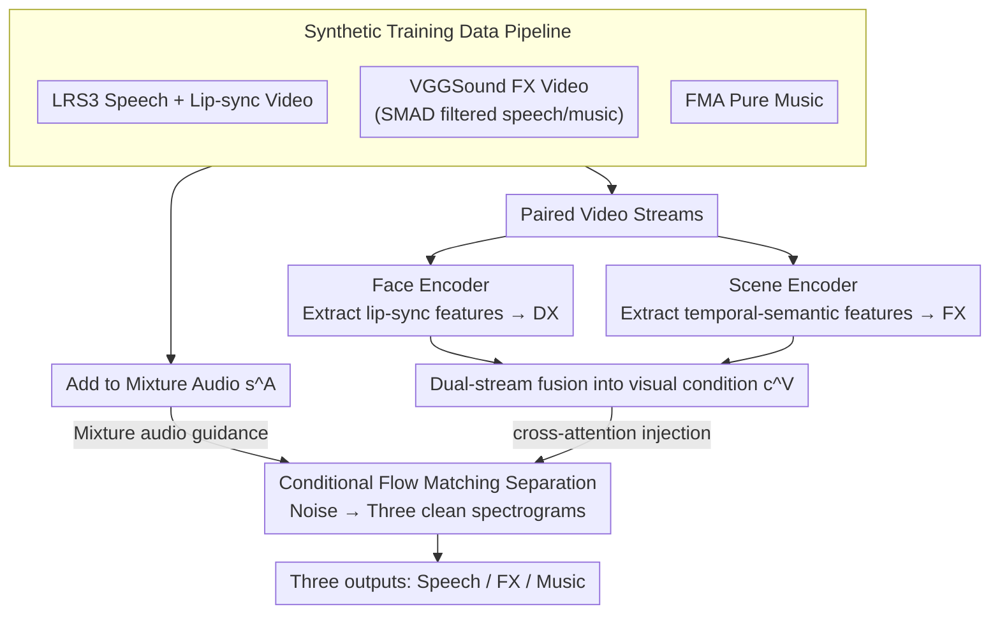

# Cinematic Audio Source Separation Using Visual Cues

**Conference**: CVPR 2026  
**arXiv**: [2603.26113](https://arxiv.org/abs/2603.26113)  
**Code**: [Project Page](https://cass-flowmatching.github.io)  
**Area**: Image Generation (Audio-Visual Multimodal)  
**Keywords**: Cinematic Audio Source Separation, Audio-Visual Learning, Conditional Flow Matching, Synthetic Training Data, Multi-Source Separation

## TL;DR

Ours proposes the first audio-visual cinematic audio source separation (AV-CASS) framework, utilizing visual cues from dual video streams (facial and scene) via conditional flow matching for generative three-way audio separation (Speech/Effects/Music). The model is trained solely on synthetic data but generalizes to real-world movies.

## Background & Motivation

**Background**: Cinematic Audio Source Separation (CASS) was formalized as a three-way separation problem (Dialogue/Effects/Music) with the introduction of the DnR dataset. Methods like BandIt have advanced audio-side performance, but all existing approaches ignore the multimodal nature of films.

**Limitations of Prior Work**: (a) CASS methods are audio-only, ignoring visual cues (lip movements for speech, scene actions for effects); (b) Lack of datasets providing both source-separated tracks and time-aligned video; (c) Predictive separation models often produce spectral-hole artifacts.

**Key Challenge**: While visual information clearly aids audio separation, obtaining isolated tracks from real movies is nearly impossible.

**Goal**: Train an effective AV-CASS model using independently available audio-visual data in the wild, given the absence of real isolated cinematic tracks.

**Key Insight**: A synthetic training data pipeline (Facial video → Speech, Scene video → Effects, Pure music) combined with a generative flow matching separation model.

**Core Idea**: Use dual video streams (facial + scene) for training, and extract both streams from a single real movie video during inference for zero-shot generalization.

## Method

### Overall Architecture

This paper addresses cinematic audio separation with visual accompaniment: given a mixed cinematic soundtrack and the corresponding video, it is decomposed into three tracks: Dialogue (DX), Effects (FX), and Music (MX), using visual frames to guide the assignment of audio segments. The pipeline consists of two parts. The first is a dual-stream visual encoder that extracts two visual signals—one focusing on faces (lip movements corresponding to speech) and the other on the whole scene (actions and objects corresponding to effects)—fusing them into a unified visual condition $\mathbf{c}^V$. The second part is a conditional flow matching generative model. Instead of predicting masks to "keep or erase" specific frequencies, it starts from pure noise and, guided by the mixture audio $\mathbf{s}^A$ and visual condition $\mathbf{c}^V$, iteratively generates three clean spectrograms. To enable learning, the first contribution is a synthetic training pipeline that "assembles" mixtures with ground truth from independent sources. During training, the dual visual streams come from separate source videos; during inference, they are extracted from the same real movie clip, allowing the paradigm to transfer from synthetic data to real movies without architectural changes.

### Key Designs

**1. Synthetic Training Data Pipeline: Filling GC gaps with "assembled" mixtures**

The primary obstacle for AV-CASS is the lack of data—isolated DX/FX/MX tracks for real movies are unavailable, especially with aligned video. Ours bypasses this by synthetic assembly: single-source "audio + video" data is abundant. Speech is sourced from LRS3 (lip-sync video + speech, 152K clips), effects from VGGSound (daily events audio + video, filtered by SMAD to remove speech/music, ~62K clips), and music from FMA (pure music, filtered ~49K clips). These are summed into a mixture $\mathbf{a}^A = \mathbf{a}^{DX} + \mathbf{a}^{FX} + \mathbf{a}^{MX}$. Since the mixture is synthesized, ground truth for each track is perfectly controlled, and each track includes matched video streams for the dual-stream encoder.

**2. Dual-Stream Visual Encoder and Fusion: Linking faces to speech and scenes to effects**

Visual cues aid separation because two of the three tracks are naturally tied to visual elements—human speech is synchronized with lip movements, and scene actions/objects are synchronized with effects. Ours employs two encoders: a face encoder (from AVDiffuSS) for lip-sync features and a scene encoder (from CAVP) for temporal-semantic alignment features. Both are frozen, projected, and concatenated along the time axis to form $\mathbf{c}^V \in \mathbb{R}^{(T_f+T_s) \times C'}$, which is injected into the generative model via cross-attention in the U-Net. Since music lacks a stable visual counterpart, no specific visual stream is assigned to it.

**3. Conditional Flow Matching Multi-source Separation: Generative instead of masking**

Rather than traditional spectral masking (which often leaves "spectral holes" or artifacts), ours uses conditional flow matching. The three spectrograms are concatenated along the channel dimension as the target $\mathbf{x}_1$. Starting from noise $\mathbf{x}_0$, a vector field is learned to push noise toward the clean spectrograms along a straight path. The training objective is:

$$\mathcal{L} = \mathbb{E}_{t, \pi_1, \pi_0} \|\mathbf{u}_\theta(\mathbf{x}_t, t \mid \mathbf{c}) - (\mathbf{x}_1 - \mathbf{x}_0)\|_2^2$$

The condition $\mathbf{c}$ includes both the mixture audio and visual conditions, with time steps sampled via logit-normal distribution (focusing computation on mid-level noise). Compared to diffusion, flow matching's straight paths allow for fewer inference steps; compared to masking, it directly "draws" clean spectrograms, resulting in more natural audio without artifacts.

### Loss & Training

To prevent over-reliance on visual cues initially, a two-stage strategy is used: first, an audio-only denoising warm-up stage to stabilize separation; second, the gradual introduction of visual conditions via zero-initialized convolutions (ControlNet-style), allowing visual influence to grow from zero weight. Optimization used Adam at 1e-4 for 600K steps on 4×RTX 4090, with 128 inference steps.

## Key Experimental Results

### Main Results

| Method | Real Movie MOS↑ | AVDnR FAD↓ | AVDnR PESQ↑ | AVDnR WPR↓ |
|------|------------|-----------|-------------|-----------|
| MRX | 2.55 | 3.47 | 1.89 | 14.91 |
| BandIt | 3.78 | 2.15 | 2.15 | 4.65 |
| DAVIS-Flow (AV) | - | 5.94 | 1.96 | 12.14 |
| **AV-CASS** | **4.13** | **0.84** | **2.26** | **1.84** |

### Ablation Study

| Configuration | FAD↓ | WPR↓ | Description |
|------|------|------|------|
| Audio-only | 1.63 | 2.01 | Pure audio baseline |
| AV-CASS | **0.84** | **1.84** | Visual cues improve FAD by 48% |
| DAVIS-Flow | 5.94 | 12.14 | General AV separation fails for CASS |

### Key Findings

1. Visual cues reduced FAD from 1.63 to 0.84 (48% improvement) and WPR from 2.01 to 1.84.
2. Qualitative Analysis: Birdsongs misclassified as music in audio-only models were correctly assigned to FX by AV-CASS via scene visuals.
3. Successful generalization from synthetic training to real movies (MOS 4.13/5).
4. CASS $\neq$ General AV separation: DAVIS-Flow showed low WPR on FX but performed poorly on DX/MX.

## Highlights & Insights

- Elegant paradigm shift: Training uses dual video streams (independent sources), while inference extracts both face and scene streams from a single movie video without architectural changes.
- Flow matching demonstrates superior perceptual quality in audio separation.
- Innovative WPR metric—measures cross-track leakage without requiring ground truth references.
- Audio warm-up and progressive visual injection prevent premature visual dependency.

## Limitations & Future Work

- Visual correlation for music is weak; visual gains for MX separation are limited.
- 128 inference steps are relatively slow; distillation could be explored.
- Currently 16kHz mono; theatrical-grade 48kHz multi-channel remains to be validated.

## Related Work & Insights

- The synthetic-to-real generalization paradigm is inspiring for other multimodal tasks lacking paired data.
- Applications of conditional flow matching in audio generation are expanding rapidly.

## Rating

- Novelty: ⭐⭐⭐⭐⭐ First AV-CASS + Synthetic pipeline + Dual-stream design.
- Experimental Thoroughness: ⭐⭐⭐⭐⭐ Real movie MOS + Full synthetic metrics + Public benchmarks.
- Writing Quality: ⭐⭐⭐⭐⭐ Clear logic and strong motivation.
- Value: ⭐⭐⭐⭐⭐ Opens a new direction for AV-CASS with direct cinematic applications.

<!-- RELATED:START -->

## Related Papers

- [\[CVPR 2026\] Preserving Source Video Realism: High-Fidelity Face Swapping for Cinematic Quality](preserving_source_video_realism_high-fidelity_face_swapping_for_cinematic_qualit.md)
- [\[AAAI 2026\] MACS: Multi-source Audio-to-Image Generation with Contextual Significance and Semantic Alignment](../../AAAI2026/image_generation/macs_multi-source_audio-to-image_generation_with_contextual_significance_and_sem.md)
- [\[CVPR 2026\] Probing and Bridging Geometry–Interaction Cues for Affordance Reasoning in Vision Foundation Models](probing_and_bridging_geometry-interaction_cues_for_affordance_reasoning_in_visio.md)
- [\[NeurIPS 2025\] A Data-Driven Prism: Multi-View Source Separation with Diffusion Model Priors](../../NeurIPS2025/image_generation/a_data-driven_prism_multi-view_source_separation_with_diffusion_model_priors.md)
- [\[ICML 2026\] From Talking to Singing: A New Challenge for Audio-Visual Deepfake Detection](../../ICML2026/image_generation/from_talking_to_singing_a_new_challenge_for_audio-visual_deepfake_detection.md)

<!-- RELATED:END -->
