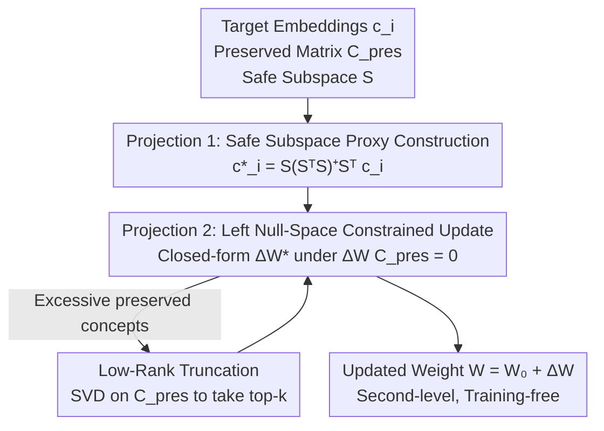

# Closed-Form Concept Erasure via Double Projections

**Conference**: CVPR 2026  
**Paper**: [CVF Open Access](https://openaccess.thecvf.com/content/CVPR2026/html/Zhang_Closed-Form_Concept_Erasure_via_Double_Projections_CVPR_2026_paper.html)  
**Code**: Available (link provided in the abstract)  
**Area**: Image Generation / Diffusion Models / AI Safety  
**Keywords**: Concept Erasure, Diffusion Models, Closed-Form Solution, Null-Space Projection, Model Editing  

## TL;DR
This paper proposes Double Projections (DP), which reformulates "concept erasure" for diffusion/flow-matching models into a two-step closed-form projection. It first projects target concepts into a "safe subspace" to obtain proxy vectors, and then constrains weight updates within the left null-space of preserved concepts. This achieves clean erasure of target concepts with near-zero damage to unrelated concepts in seconds without training.

## Background & Motivation
**Background**: While generative models like Stable Diffusion and FLUX are powerful, they can reproduce copyrighted content or generate harmful/biased images. This has led to the research line of "concept erasure"—selectively removing specific objects, artistic styles, or identities from model representations. Existing approaches include fine-tuning (ESD), cross-attention editing (UCE), pruning (ConceptPrune), and adversarial guidance (AGE).

**Limitations of Prior Work**: Iterative optimization methods (ESD/CP/AGE) achieve decent erasure but require minutes to hours of training and often cause "unintended degradation"—where target removal significantly drops the performance of unrelated concepts (e.g., Table 1 shows ESD and CP often result in >20% drops on preserved concepts).

**Key Challenge**: The goals of erasure and preservation are naturally coupled. Even existing closed-form methods like UCE, which explicitly add a preservation term in their least-squares objective, cannot guarantee that unrelated concepts remain undisturbed. This paper identifies the reason using geometric intuition: least squares only finds the "best-fit line" for global loss minimization and does not guarantee that every individual concept point remains on that line. When target and preserved concepts are correlated or non-orthogonal in latent space, the preserved concepts are inevitably shifted. The paper quantifies this in Theorem 3.1: under single-target editing, the perturbation to a preserved vector $p$ satisfies $\|\Delta W p\|_2 \ge \lambda \|\Delta W c\|_2$, meaning as long as $p$ overlaps with the target $c$ direction ($\lambda > 0$), the preserved concept will be modified.

**Goal**: To provide provable geometric guarantees for "preserving unrelated concepts" while maintaining a closed-form, training-free, and second-level execution speed, rather than relying on soft constraints in loss functions.

**Core Idea**: Decompose erasure into two geometric projections. The first step "purifies" the target concept into a safe subspace to obtain a proxy target. The second step strictly restricts weight changes to the **left null-space** of preserved concepts, ensuring updates are orthogonal to them and mathematically guaranteeing zero disturbance. Both steps have closed-form solutions.

## Method

### Overall Architecture
DP targets a linear mapping $W_0 \in \mathbb{R}^{p \times n}$ within a pretrained model (practically the Key/Value matrices in attention layers, or embedding layers in FLUX). Inputs include target concept embeddings $c_i$, a matrix of preserved concepts $C_{\text{pres}} = [c_1, \dots, c_m]$, and a safe subspace $S$ spanned by "safe concepts." The output is a modified matrix $W = W_0 + \Delta W$ that no longer generates target content for target prompts while remaining unchanged for preserved prompts.

Formally, DP solves a joint optimization for $\Delta W$ and proxy vectors $c_i^*$:
$$\min_{W,\,c_i^*\in S}\ \|W c_i - W_0 c_i^*\|_2^2 + \|W C_{\text{pres}} - W_0 C_{\text{pres}}\|_F^2$$
The first term maps $c_i$ to a "neutral proxy" $W_0 c_i^*$ (erasure), and the second term requires no change on preserved concepts. While this is typically an alternating optimization problem requiring iterative gradient descent, DP decomposes it into two steps with closed-form solutions:

### Key Designs

**1. Projection 1: Constructing proxy vectors in the safe subspace to "purify" target concepts**

The first step of erasure defines what to replace the target concept with. While UCE simply picks a neutral anchor as the proxy $c_i^*$, this anchor might still contain directional components that interfere with preserved concepts. DP instead orthogonally projects the target $c_i$ onto a subspace $S \in \mathbb{R}^{n \times k}$ spanned by several safe concepts:
$$c_i^* = \mathrm{proj}_S(c_i) = S(S^\top S)^{+}S^\top c_i,$$
where $(S^\top S)^{+}$ is the Moore–Penrose pseudoinverse, ensuring validity even if base vectors are linearly dependent. This step extracts components of the target concept that lie in "safe (non-target) directions," effectively filtering out directions that would interfere with preservation. The authors note this step is **optional**: a richer safe subspace $S$ results in a smaller update magnitude $\|\Delta W\|_F$ and less perturbation to the original model. If $S$ collapses to a single concept vector ($k=1$), it reverts to the UCE case—making DP a generalization of UCE.

**2. Projection 2: Constraining updates to the left null-space of preserved concepts for provable zero disturbance**

This is the indispensable step of DP that differentiates it from existing closed-form methods. Theorem 3.1 shows that any update overlapping with preserved concepts will modify them. DP’s countermeasure is direct—**force the update to be orthogonal to preserved concepts**: restrict $\Delta W$ to the left null-space of $C_{\text{pres}}$, such that $\Delta W \, C_{\text{pres}} = 0$. Consequently, for any $v \in \mathrm{col}(C_{\text{pres}})$, $W v = W_0 v$, and preserved concepts are **exactly** maintained (Theorem 4.1).

Solving this: let $U_2 \in \mathbb{R}^{n \times (n-r)}$ be the orthonormal basis for the left null-space of $C_{\text{pres}}$ where $r = \mathrm{rank}(C_{\text{pres}})$. Any feasible update can be written as $\Delta W = Z \, U_2^\top$. Let $x = U_2^\top c_i$ and $b = W_0(c_i^* - c_i)$. The minimum-norm solution for the constrained least squares $\min_Z \|Zx - b\|_2^2$ is:
$$Z^\star = \frac{b \, x^\top}{\|x\|_2^2}, \qquad \Delta W^\star = \frac{W_0(c_i^* - c_i) \, x^\top}{\|x\|_2^2} \, U_2^\top.$$
This process is purely analytical, devoid of iterations or gradients. It succeeds by upgrading "preservation" from a soft constraint (a term in the loss that might be sacrificed for global optimality) to a **hard constraint** (null-space geometry, making it structurally impossible to move preserved concepts), with the only trade-off being the reduction of erasure degrees of freedom to $n-r$ dimensions.

**3. Low-Rank Truncation: Scalable approximation for large preservation sets**

When $C_{\text{pres}}$ contains a vast amount of concepts, the left null-space becomes too small, leaving insufficient room for erasure. DP performs SVD on $C_{\text{pres}} = U_1 \Sigma V^\top$, keeping only the top-$k$ principal singular directions $U_{1,k}$. The update is modified to $\Delta W = Z \, U_{2,k}^\top$, remaining closed-form. This "strictly protects the directions with the most energy while sacrificing redundant low-energy directions" to gain more space for erasure. The paper provides error bounds: preservation perturbation is controlled by the $(k+1)$-th singular value $\|(W' - W_0)p_i\|_2 \le \|Z^\star\|_2 \, \sigma_{k+1}(C_{\text{pres}})$ (Theorem 4.2), and gives a lower bound for erasure strength (Theorem 4.3). Additionally, drawing from AGE, the paper notes that erasing one concept primarily affects a small cluster of semantically adjacent concepts, so $C_{\text{pres}}$ can be a compact relevant subset rather than every possible concept.

### Loss & Training
No training is involved. $c_i^*$ and $C_{\text{pres}}$ are shared across all layers. Both projections are analytical closed-form updates. The entire editing process completes in seconds on a GPU (~7.4s for SD1.4) without the need for sampling images or backpropagation through the generative model.

## Key Experimental Results

### Main Results
Evaluations were conducted on SD1.4 / SD1.5 / FLUX for object erasure (10 ImageNet classes, Measured by ResNet-50 Top-1 Accuracy) and style erasure (5 artists, measured by CLIP text-image similarity). For both metrics, lower is better: lower Erased Accuracy indicates cleaner erasure, and lower Preservation Drop indicates less harm to unrelated concepts.

SD1.4 Object Erasure (Table 1, mean of 10 classes; Original Acc 85.9):

| Method | Erased Acc ↓ | Preservation Drop ↓ | Notes |
| :--- | :--- | :--- | :--- |
| ESD | 7.2 | 19.5 | Iterative fine-tuning; high preservation drop |
| ConceptPrune | 5.7 | 32.5 | Pruning; most severe unintended degradation |
| AGE | 9.6 | 5.6 | Adversarial guidance |
| UCE | 7.8 | 6.7 | Closed-form but weak preservation constraint |
| **DP (Ours)** | **0.8** | **2.4** | Cleanest erasure, best preservation |

SD1.4 Style Erasure (Table 2, mean of 5 artists; Original CLIP 79.5 / 90.3):

| Method | Erased ↓ | Preservation Drop ↓ |
| :--- | :--- | :--- |
| ESD | 21.0 | 8.8 |
| ConceptPrune | 19.2 | 16.7 |
| AGE | 17.2 | 6.7 |
| UCE | 14.5 | 1.1 |
| **DP (Ours)** | **11.7** | **0.5** |

FLUX Flow-Matching Model Object Erasure (Table 3, mean; ESD/Pruning/AGE are incompatible with Flow-Matching, so compared only with UCE):

| Method | Erased Acc ↓ | Preservation Drop ↓ |
| :--- | :--- | :--- |
| UCE | 23.9 | 2.2 |
| **DP (Ours)** | **1.0** | **0.6** |

DP reduces residual accuracy to near 0 on FLUX, whereas UCE leaves high residuals on complex classes like "Church" and "Gas Pump," indicating that single-step linear projection fails to fully capture the flow field's geometry.

### Ablation Study

| Dimension | Configuration | Results | Explanation |
| :--- | :--- | :--- | :--- |
| Compute Time (Fig 2, SD1.4/3090) | ESD | 11.2 min | Iterative optimization |
| | ConceptPrune | 6.2 min | Iterative pruning |
| | AGE | 91.4 min | Adversarial, slowest |
| | UCE | 7.2 s | Closed-form |
| | **DP (Ours)** | **7.4 s** | Closed-form, same scale as UCE |
| Projection 1 | Removed (Direct UCE proxy) | Still functional, but $\|\Delta W\|_F$ is larger | Step 1 is optional; helps minimize update magnitude |
| Projection 2 | Removed Null-space constraint | Degrades to UCE; preservation drop increases | Step 2 is essential for zero-perturbation guarantee |

### Key Findings
- **Projection 2 (Null-space constraint) is the core contributor**: It transforms preservation from a soft constraint into a hard constraint, which is why DP significantly outperforms UCE (Object 2.4 vs 6.7; Style 0.5 vs 1.1). Projection 1 is a refinement that reduces update magnitude.
- **Closed-form does not mean a good solution**: UCE is also a second-level closed-form method, but its preservation term is just one part of the loss and can be sacrificed for global optimality. DP uses geometric structure to guarantee preservation, proving that speed and non-interference can coexist.
- **Cross-architecture generalization**: DP achieves near-zero residuals across both diffusion and flow-matching paradigms because it operates on linear mappings rather than model-specific generation dynamics.
- **Why is preservation not perfect?** ⚠️ Theoretically, DP should yield zero disturbance, but minor drops are observed in practice. The authors attribute this to positional encodings $z_j = c_j + q_j$ in diffusion models: DP guarantees $\Delta W c_j = 0$, but the additive coupling of the positional term $q_j$ (and cross-token interactions in self-attention) introduces small, consistent biases. Editing the embedding layer in FLUX bypasses positional encodings, yielding cleaner preservation.

## Highlights & Insights
- **Upgrading preservation to a geometric hard constraint**: Using left null-space projection to make unrelated concept invariance a structural requirement is far more reliable than adding a soft penalty in least squares.
- **UCE as a special case of DP**: When the safe subspace is limited to a single concept ($k=1$), DP collapses to UCE, demonstrating that DP is a strict generalization with low migration costs.
- **Diagnosis precedes method**: The authors first quantify "closed-form $\neq$ good solution" (preservation perturbation $\ge \lambda$ times target perturbation) before designing the null-space constraint, providing a concrete rather than generic motivation.
- **Transferability**: The null-space/subspace constraint approach can be applied to any scenario involving "editing a linear layer while locking specific directions," such as MLP editing in LLMs (the paper references null-space editing for LLM MLPs; this work applies it to attention/embedding layers in vision models).

## Limitations & Future Work
- **Imperfect Preservation**: Coupling between positional encodings and self-attention causes theoretical zero-disturbance to falter in practice. The authors mitigate this by changing the edited layer in FLUX, but the bias in diffusion models remains.
- **Dependency on Selection of $S$ and $C_{\text{pres}}$**: The quality of the safe subspace and preserved set directly impacts performance. While the paper uses the "locality" assumption from AGE to narrow $C_{\text{pres}}$, there is no systematic scheme for automatically constructing an optimal safe subspace. ⚠️ Robustness of safe set selection and adversarial robustness (circumventing erasure via prompt engineering) were not fully evaluated in the main text.
- **Limited to Linear Layers**: The method acts on linear mappings like Attention K/V or embeddings. Whether this is sufficient for concept representations distributed in non-linear structures remains an open question.
- **Future Directions**: Incorporating positional encodings into the null-space constraint or developing a global optimal subspace sharing scheme for multi-concept erasure could further approach perfect preservation.

## Related Work & Insights
- **vs UCE**: Both are closed-form, second-level methods operating on attention linear maps. UCE uses soft constraints, which can be sacrificed for the global optimum; DP uses hard null-space constraints + safe subspace proxies, achieving lower preservation drops (0.6 vs 2.2 on FLUX) and encompassing UCE as a special case.
- **vs ESD / ConceptPrune / AGE**: These iterative/pruning/adversarial methods are effective but slow (6 to 90 minutes) with high collateral damage (5.6%–32.5% preservation drop). Furthermore, pruning/adversarial methods are often incompatible with flow-matching models; DP is second-level, cross-architecture, and offers superior preservation.
- **vs Null-space editing in LLMs**: While sharing the null-space intuition, prior work targeted MLP layers in LLMs. This paper applies the concept to attention and embedding layers in visual generative models and adds the critical safe subspace proxy step.

## Rating
- Novelty: ⭐⭐⭐⭐ Reformulating concept erasure as two-step projections with a provable preservation guarantee; clear geometric perspective that generalizes UCE.
- Experimental Thoroughness: ⭐⭐⭐⭐ Covers SD1.4/1.5/FLUX, object/style tasks, and time efficiency. However, some ablations are qualitative, and many details (LPIPS/FID, adversarial robustness) are deferred to the appendix.
- Writing Quality: ⭐⭐⭐⭐⭐ Strong logical flow from diagnosing the "closed-form limitation" to the proposed solution; excellent balance of theorems and geometric intuition.
- Value: ⭐⭐⭐⭐ A second-level, training-free, "drop-in" tool for concept erasure with high practical utility for safe model editing.

<!-- RELATED:START -->

## Related Papers

- [\[CVPR 2026\] Neighbor-Aware Localized Concept Erasure in Text-to-Image Diffusion Models](neighbor-aware_localized_concept_erasure_in_text-to-image_diffusion_models.md)
- [\[CVPR 2026\] Beyond Text Prompts: Precise Concept Erasure through Text–Image Collaboration](beyond_text_prompts_precise_concept_erasure_through_text-image_collaboration.md)
- [\[CVPR 2026\] Prototype-Guided Concept Erasure in Diffusion Models](prototype-guided_concept_erasure_in_diffusion_models.md)
- [\[AAAI 2026\] Mass Concept Erasure in Diffusion Models with Concept Hierarchy](../../AAAI2026/image_generation/mass_concept_erasure_in_diffusion_models_with_concept_hierarchy.md)
- [\[CVPR 2026\] MapRoute: Semantic Routing for Precise Concept Erasure with Mapper](maproute_semantic_routing_concept_erasure.md)

<!-- RELATED:END -->
