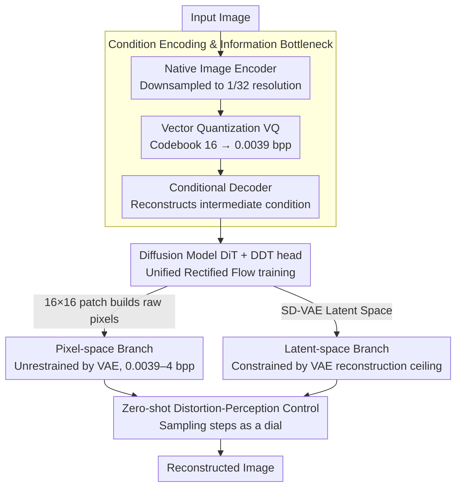

# CoD: A Diffusion Foundation Model for Image Compression

**Conference**: CVPR 2026  
**arXiv**: [2511.18706](https://arxiv.org/abs/2511.18706)  
**Code**: [GitHub](https://github.com/microsoft/GenCodec/tree/main/CoD)  
**Area**: Image Compression / Diffusion Models  
**Keywords**: Compression-oriented Diffusion, Foundation Model, rectified flow, Pixel-space Diffusion, Rate-Distortion-Perception

## TL;DR

Ours proposes CoD, the first compression-oriented diffusion foundation model. By learning joint end-to-end compression-generation optimization from scratch, it replaces Stable Diffusion in downstream diffusion codecs to achieve SOTA performance at ultra-low bitrates (0.0039 bpp), with training costs only 0.3% of SD.

## Background & Motivation

Existing diffusion codecs (PerCo, DiffEIC, OSCAR, etc.) are typically built upon Stable Diffusion to inherit its generative priors. However, text conditioning is suboptimal from a compression perspective:

**Limited Text Descriptive Power**: Human text struggles to precisely describe the spatial and textural details of natural images.

**Non-differentiable Discrete Vocabulary**: Text encoders (e.g., BLIP-2) and diffusion models (e.g., SD) cannot be jointly optimized end-to-end, preventing effective rate-distortion optimization.

**Empirical Evidence**: Zero-shot experiments from DiffC show that text conditioning actually **hurts** compression performance at low bitrates.

Key Insight: If an image captioner is viewed as an encoder and the diffusion model as a decoder, the setup is essentially a compression system—but text as an intermediate representation is inefficient. Replacing text with neural-learned native image tokens and jointly training compression and generation end-to-end is the correct direction.

## Method

### Overall Architecture

The starting point of CoD is to treat image compression as an "encoder (image captioner) + decoder (diffusion model)" system. Recognizing the inefficiency of text as an intermediate representation, Ours replaces text with neural-learned native image tokens and jointly trains compression and generation end-to-end. The architecture is straightforward: native image encoder → information bottleneck (vector quantization) → conditional decoder → diffusion model (DiT backbone + DDT head), with implementations for both pixel and latent spaces.

### Key Designs

**1. Condition Encoding & Information Bottleneck: Forcing 0.0039 bpp with a codebook of size 16**

The encoder uses residual blocks and attention layers to compress the image to 1/32 resolution. The information bottleneck employs Vector Quantization (VQ) with a codebook size of $N = 2^4 = 16$, corresponding to an ultra-low bitrate of $4 \text{ bits} / (32 \times 32) = 0.0039 \text{ bpp}$. Such an aggressive bottleneck forces the diffusion model to learn strong generative capabilities to compensate for information loss. The conditional decoder then reconstructs the quantized tokens into an intermediate condition at 1/16 resolution.

**2. Unified Rectified Flow Training: Naturally integrating distortion terms into flow matching**

CoD predicts the velocity field $v_t = x - \epsilon$ (using the linear interpolation schedule $x_t = t \cdot x + (1-t) \cdot \epsilon$) with a rectified flow loss. The authors found that standard RF loss **only ensures structural consistency rather than color**, so they propose unified training: randomly selecting $\alpha\%$ of samples to train with $t \in [0,1]$ (perceptual optimization), and training the rest with $t=0$. At $t=0$, the RF loss perfectly degrades into single-step MSE reconstruction:

$$\mathcal{L}_{\text{RF}}|_{t=0} = \text{MSE}(v_0, v_0^{\text{pred}}) = \text{MSE}(x, \hat{x}_0)$$

This naturally embeds the distortion term within the continuous flow framework, achieving joint rate-distortion-perception optimization.

**3. Pixel Space vs. Latent Space: Breaking the VAE reconstruction ceiling**

Latent CoD operates in the SD-VAE latent space (2×2 patch embedding → 1/16), but it is limited by the VAE reconstruction upper bound (approx. 26 dB PSNR, 0.6 bpp bitrate ceiling). Pixel-space CoD uses 16×16 patch embeddings to directly model raw pixels, with the DDT head predicting a neural field for each feature to reconstruct the 16×16 patch. Consequently, it is not restricted by VAE, covering a wide bitrate range of 0.0039-4 bpp and reaching near-lossless levels (~47 dB PSNR).

**4. Zero-shot Distortion-Perception Control: Sampling steps as a dial**

Unified training provides CoD with a free capability—adjusting the distortion-perception trade-off directly via sampling steps. 25 steps yield the best perceptual quality; reducing to 1 step results in a 3.4 dB PSNR Gain (from 16.2 to 19.6 dB), with smooth interpolation at intermediate steps, all without additional training.

### Loss & Training

$$\mathcal{L} = \mathcal{L}_{\text{RF}} + \lambda \cdot \mathcal{L}_{\text{REPA}} + \beta \cdot \mathcal{L}_C + \gamma \cdot \mathcal{L}_{\text{aux}}$$

Where $\mathcal{L}_{\text{REPA}}$ is the DINOv2 feature alignment loss, $\mathcal{L}_C$ is the codebook commitment loss, and $\mathcal{L}_{\text{aux}}$ is the auxiliary head loss (reconstructing raw pixels + DINOv2 features). Training follows a two-stage process: 256×256 (400k steps) → 512×512 (150k steps), taking approximately 5 days on 4 A100 GPUs.

## Key Experimental Results

### Main Results

**Pixel-space comparison** (Kodak 512×512):

| Method | Bitrate (bpp) | PSNR↑ | FID↓ | Description |
|------|-----------|-------|------|------|
| VTM | ~0.2 | Baseline | - | Traditional codec |
| Pixel-CoD+DiffC | ~0.2 | **≈VTM** | **Far superior** | BD-Rate -2.1% vs VTM |
| MS-ILLM (GAN) | ~0.2 | Lower | Higher | Perceptual quality at the expense of PSNR |
| HiFiC (GAN) | ~0.2 | Low | Medium | Ditto |

**Latent-space comparison** (Ultra-low bitrate):

| Method | Bitrate (bpp) | Reconstruction Quality | Description |
|------|-----------|---------|------|
| CoD (latent) + DiffC | <0.02 | **SOTA** | Significant advantage at ultra-low bitrates |
| SD-based DiffC | <0.02 | Poor | Text condition is harmful at low bitrates |
| PerCo (SD) | 0.0036 | Medium | Relies on text+image conditions |
| OSCAR | ~0.01 | Better | Text-free but still based on SD |

### Ablation Study / Scaling Law

| Model Scale (# Params) | Compression Performance | Description |
|-----------------|---------|------|
| 49M CoD | Better than MS-ILLM (181M) | GAN methods have more params but perform worse |
| 114M CoD | Significantly better | |
| 330M CoD | Further Gain | Clear scaling law trend |

### Key Findings

- **The potential of pixel diffusion is severely underestimated**: Pixel-space CoD can simultaneously achieve VTM-level PSNR and superior perceptual quality compared to GANs, proving for the first time that diffusion codecs can win in both distortion and perception.
- **Text conditioning is indeed harmful**: Adding text conditions to DiffC on SD leads to worse LPIPS at low bitrates, whereas CoD conditioning provides a direct Gain.
- **Extremely low training costs**: ~20 A100 GPU days vs ~6250 days for SD (0.3%), reproducible with fully open-source data.
- **49M parameters can beat 181M GAN codecs**, proving that compression performance gains stem from the algorithm rather than model size.

## Highlights & Insights

- Re-examined the "role of text conditioning in diffusion codecs" from a compression theory perspective, reaching the counter-intuitive conclusion that text is harmful and providing a clear theoretical explanation.
- Unified RF training equates single-step reconstruction at $t=0$ to MSE distortion optimization, naturally incorporating rate-distortion-perception tripartite optimization into the continuous flow framework.
- Controlling the distortion-perception trade-off via sampling steps is a zero-cost side capacity that requires no additional training.
- Comprehensive revival of pixel-space diffusion: While latent spaces were previously thought to be superior, Ours proves pixel-space has irreplaceable advantages for high bitrates and wide ranges.

## Limitations & Future Work

- Currently supports only 512×512 resolution; scaling to 2K+ requires a significant increase in computational cost.
- Like all diffusion codecs, the inference speed does not meet real-time encoding requirements (though single-step distilled versions are near real-time).
- The minimum bitrate is fixed at 0.0039 bpp (limited by VQ codebook size); flexible bitrate control requires additional design.
- Not yet validated on video compression; temporal expansion is a natural future direction.

## Related Work & Insights

- **DiffC** [Theis et al.] proposed the theoretical framework for zero-shot diffusion compression; CoD provides a more suitable foundation model for it.
- **PerCo** [Careil et al.] demonstrated the potential of diffusion models for ultra-low bitrate compression but relied on text conditions.
- **CDC** [Yang et al.] was an early exploration of pixel-space diffusion codecs, though it required perceptual loss and did not consider scaling laws.
- The Rate-Distortion-Perception perception-distortion trade-off theory [Blau & Michaeli] serves as the theoretical basis for the optimization goal in this work.

## Rating

- **Novelty**: ⭐⭐⭐⭐⭐ First diffusion foundation model for compression; unified training strategy and pixel-space revival are significant contributions.
- **Experimental Thoroughness**: ⭐⭐⭐⭐⭐ Dual-track pixel/latent comparison + multiple benchmarks + scaling law + zero-shot control + visual comparison.
- **Writing Quality**: ⭐⭐⭐⭐⭐ Deep insights with a logical flow from problem analysis to method design to experimental validation.
- **Value**: ⭐⭐⭐⭐⭐ 0.3% training cost + fully open-source data + SOTA performance; provides a foundational push for the diffusion compression field.

<!-- RELATED:START -->

## Related Papers

- [\[ICML 2026\] Compression as Adaptation: Implicit Visual Representation with Diffusion Foundation Models](../../ICML2026/image_generation/compression_as_adaptation_implicit_visual_representation_with_diffusion_foundati.md)
- [\[CVPR 2026\] MatPedia: A Universal Generative Foundation for High-Fidelity Material Synthesis](matpedia_a_universal_generative_foundation_for_high-fidelity_material_synthesis.md)
- [\[CVPR 2026\] DiT-IC: Aligned Diffusion Transformer for Efficient Image Compression](ditic_aligned_diffusion_transformer_for_efficient.md)
- [\[CVPR 2026\] DA-VAE: Plug-in Latent Compression for Diffusion via Detail Alignment](da-vae_plug-in_latent_compression_for_diffusion_via_detail_alignment.md)
- [\[CVPR 2026\] UniPercept: A Unified Diffusion Model for Generalizable Visual Perception](unipercept_a_unified_diffusion_model_for_generalizable_visual_perception.md)

<!-- RELATED:END -->
