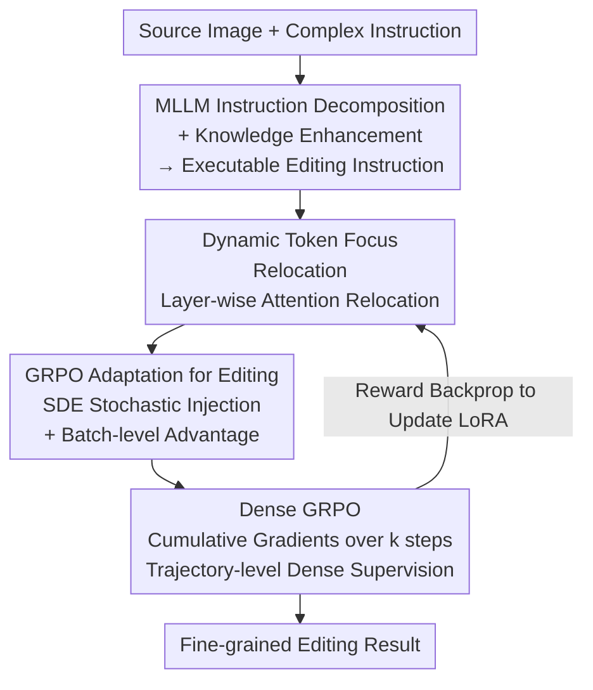

# CogniEdit: Dense Gradient Flow Optimization for Fine-Grained Image Editing

**Conference**: CVPR 2026  
**Paper**: [CVF Open Access](https://openaccess.thecvf.com/content/CVPR2026/html/Li_CogniEdit_Dense_Gradient_Flow_Optimization_for_Fine-Grained_Image_Editing_CVPR_2026_paper.html)  
**Code**: https://github.com/yl4467/CogniEdit  
**Area**: Diffusion Models / Image Editing  
**Keywords**: Instructed Image Editing, Fine-grained Alignment, GRPO, Dense Reward Optimization, Multimodal Reasoning

## TL;DR
CogniEdit utilizes an MLLM to decompose complex instructions into executable editing commands and employs dynamic token focus to let different network layers attend to attributes of varying granularities. It transforms GRPO from "single-step independent optimization" into "trajectory-level dense optimization" by accumulating gradients across consecutive denoising steps. The approach achieves SOTA performance on Kris-Bench and GEdit-Bench for fine-grained instructions involving color, quantity, and position without sacrificing general editing capabilities.

## Background & Motivation
**Background**: Instructed image editing (e.g., InstructPix2Pix, Qwen-Image-Edit, OmniGen2) relies on diffusion models and supervised learning on paired data to modify images based on natural language. Recent works have begun using Reinforcement Learning (RL), specifically GRPO, to align generation results with human preferences or instructions.

**Limitations of Prior Work**: Both supervised and RL-based approaches struggle with **fine-grained** instructions. Requests specifying precise **color, position, or quantity**—such as "change the purple eyes to red" or "add five on the left"—are frequently missed. Furthermore, instructions requiring reasoning or domain knowledge often face an "understanding gap" between instruction semantics and editing actions, leading to semantic errors or unrealistic outputs.

**Key Challenge**: There are two root causes. First, supervised learning on paired data only optimizes the **overall visual similarity** between the generated and target images, failing to explicitly optimize the alignment between "specific fine-grained attributes in text" and "corresponding regions in the image." Second, existing GRPO applications treat **each sampling step as an independent decision point**, resulting in sparse feedback. Since gradients do not flow between consecutive sampling steps, the model learns to "fix a single step" rather than ensuring the "evolution of the entire denoising trajectory from coarse structure to fine detail." For editing tasks, consistency between the source image and edited regions is vital; the lack of cross-step gradient flow hinders fine-grained alignment, causes artifacts, and makes training convergence difficult.

**Goal**: To simultaneously address "semantic understanding of complex instructions" and "precise execution of fine-grained attributes," ensuring that alignment is achieved through the **optimization process itself** rather than just preprocessing instructions.

**Core Idea**: To unify "MLLM reasoning + dynamic attention relocation + dense trajectory-level GRPO" into a single framework. By allowing supervision signals to flow along the entire denoising trajectory (dense gradient flow), fine-grained alignment is embedded directly into the optimization.

## Method

### Overall Architecture
CogniEdit uses Qwen-Image-Edit as the base (fine-tuned via LoRA), taking a source image and a user instruction as input to produce an edited image. The pipeline consists of three stages: first, an **MLLM decomposes and enhances the instruction** into clear, executable editing commands. Second, the editing model employs **Dynamic Token Focus Relocation** to focus on different semantic tokens across layers. Third, **Dense GRPO** is applied during training to accumulate gradients across a random window of $k$ consecutive sampling steps, providing trajectory-level dense reward supervision. GRPO is specifically adapted for editing (Deterministic ODE → SDE for stochasticity, batch-level advantage). These three stages collaborate: the MLLM ensures "correct understanding," token focus ensures "correct attention," and Dense GRPO ensures "correct trajectory optimization."

### Key Designs

**1. MLLM Instruction Decomposition + Knowledge Enhancement: Translating "Unclear Instructions" to "Executable Commands"**

To address the "understanding gap," where editing models fail to parse complex or domain-specific instructions through simple visual pattern matching, CogniEdit employs a Multimodal Large Language Model (MLLM/VLM). The MLLM examines both the source image and the original instruction to generate a **knowledge-enhanced instruction**. This supplements semantic and contextual information and breaks down vague requests into clear, executable steps. Unlike methods like Step1X-Edit or GenArtist that only use MLLM for preprocessing, CogniEdit uses this as the **entry point** for an optimization process that ensures "correct execution" following "correct understanding."

**2. Dynamic Token Focus Relocation: Directing Shallow Layers to High-Level Semantics and Deep Layers to Fine-Grained Attributes**

The authors observed that models often fixate on **generic action verbs** (e.g., "change," "add") across all layers while ignoring fine-grained semantic tokens (e.g., "purple," "five," "on the left"). Intuitively, shallow layers should handle high-level semantics while deep layers handle fine-grained attributes. This design **adaptively relocates attention** to the most relevant tokens for each layer.

Formally, for an encoded instruction token $h_i^l \in \mathbb{R}^{l\times d}$ at layer $i$, a lightweight predictor $p_\eta$ predicts the starting position $pos = p_\eta(h_i^l)$ that should be emphasized, where $pos \in [0, l-\xi]$ and $\xi$ is the number of tokens to highlight. Learnable soft tokens $s_i^{1:\xi}=E(i)\in\mathbb{R}^{\xi\times d}$ serve as "attention anchors," substituted into the predicted position:

$$h_i^{pos:pos+\xi} \leftarrow s_i^{1:\xi}, \qquad a_i^{pos:pos+\xi} = s_i^{1:\xi}\cdot A^l$$

The predictor $p_\eta$ and layer-wise soft tokens $\{s_i^{1:\xi}\}_{i=1}^N$ are trained end-to-end, learning a **hierarchical attention pattern**: shallow layers focus on abstract concepts like "the color," middle layers shift to specific attributes like "purple/red," and deep layers settle on the "change" action. This compositional semantic grounding is significantly more accurate than focusing solely on action verbs.

**3. GRPO Adaptation for Editing: Controllable Stochasticity for Deterministic Editing + Batch-level Advantage**

Applying standard flow-matching GRPO to editing presents two challenges. First, editing requires high consistency with the source image and usually employs **deterministic ODEs**. However, GRPO needs multiple samples from the same input to calculate relative advantages; deterministic trajectories yield identical samples, making advantage calculation impossible. The solution is to discretize the ODE into an SDE using Euler-Maruyama, injecting controlled noise: $x_{t+\Delta t}=x_t+s_\theta(x_t,t)\Delta t+\sqrt{\Delta t}\,\sigma_t\epsilon$, where $\epsilon\sim\mathcal N(0,1)$ and $\sigma_t$ controls noise levels to ensure sample diversity without degrading quality.

Second, even with stochasticity, diversity remains limited, leading to **high variance in per-instance normalized advantages**. This is addressed by calculating statistics across a batch of $B$ instances: $\hat A_b=\frac{1}{G}\sum_{i=1}^G \frac{R(x_0^{b,i},c_b)-\mu_{batch}}{\sigma_{batch}}$, where $\mu_{batch}$ and $\sigma_{batch}$ are the mean and standard deviation of rewards across the entire batch. Batch-level normalization stabilizes advantage estimation while preserving signals for fine-grained control.

**4. Dense GRPO Trajectory-level Optimization: Cumulative Gradients over Consecutive k Steps**

This is the core design addressing the "sparse feedback from independent steps" issue. In diffusion editing, each step refines the image; a poor early decision cannot be recovered even if the final step is optimized. Dense GRPO selects a **random starting step $r \in [0, T-k]$ and proceeds for $k$ consecutive steps**, allowing gradients to flow backward through this trajectory segment. Each step is sampled as $x_{t-1}=x_t-\frac{1}{T}s_\theta(\mathrm{sg}(x_t),t)+\frac{\sigma_t}{\sqrt{T}}\epsilon$, where $\mathrm{sg}(\cdot)$ is a stop-gradient used to precisely control gradient flow to the previous step.

The log-probability ratios for these $k$ steps are accumulated:

$$\psi_b^{r:r-k}(\theta)=\sum_{t=r}^{r-k+1}\log\frac{p_\theta(x_{t-1}^b\mid x_t^b,c_b)}{p_{\theta_{old}}(x_{t-1}^b\mid x_t^b,c_b)}$$

After applying clipping to get $\tilde r_b^{r:r-k}(\theta)$, the final objective $J_{Dense}(\theta)$ uses the **final reward** after $k$ steps to calculate $\hat A_b$. The model learns that the "entire trajectory segment must evolve in the right direction." This trajectory-level gradient flow provides much denser supervision than single-point optimization, leading to stabler training and better fine-grained alignment.

### Loss & Training
The base model is Qwen-Image-Edit, using LoRA (rank=4) for PEFT. Training spans 500 steps using AdamW with $lr=1e-5$ and a batch size of 4. A 10% linear warmup is followed by cosine decay. Gradient clipping max norm is 1.0. Hyperparameters include $k=5$ (consecutive steps) and $\xi=64$ (highlighted tokens). Training utilized 8×A800-80G GPUs. Data consists of 3k samples from SEED-Data-Edit and 1k from COCO 2017, with instructions rewritten by a VLM for knowledge enhancement.

## Key Experimental Results

### Main Results
Evaluation on Kris-Bench using four metrics: VC (Visual Consistency), VQ (Visual Quality), IF (Instruction Following), and KP (Knowledge Preservation), assessed by GPT-4 across three domains:

| Method | Social Science Avg | Natural Science Avg | Knowledge Reasoning Avg | Three-Domain VQ |
|------|---------|------------|------------|--------|
| InstructPix2Pix | 22.56 | 26.56 | 31.00 | Low |
| Step1X-Edit | 51.94 | 52.69 | 48.50 | Mid |
| OmniGen2 | 50.46 | 47.76 | 33.90 | High |
| Qwen-Image-Edit | 66.40 | 57.30 | 53.39 | High |
| Qwen-Image-Edit-r1 | **77.99** | 64.78 | 55.48 | High |
| **CogniEdit** | 77.64 | **67.42** | **59.29** | **92.40 / 90.47 / 91.72** |

CogniEdit achieves the **highest VQ across all domains** and the highest total scores in Natural Science and Knowledge Reasoning. While slightly behind Qwen-Image-Edit-r1 in Social Science (77.64 vs 77.99), it maintains superior visual quality. This suggests dense optimization achieves a better balance between fine-grained following and visual fidelity.

### Ablation Study
Ablation on Kris-Bench Knowledge Reasoning (Avg):

| Config | VC | VQ | IF | KP | Avg | Note |
|------|----|----|----|----|-----|------|
| w/o Dense GRPO | 41.67 | 75.00 | 35.04 | 32.72 | 46.11 | Largest performance drop |
| w/o Dynamic | 62.67 | 86.17 | 41.73 | 36.09 | 54.66 | Lower than base model |
| w/o both (base) | 71.33 | 88.37 | 35.03 | 27.55 | 55.48 | Equivalent to Qwen-Image-Edit-r1 |
| **CogniEdit (Full)** | 71.50 | 91.72 | 40.14 | 33.33 | **59.29** | Full model |

### Key Findings
- **Dense GRPO is the primary contributor**: Removing it causes Avg to plummet from 59.29 to 46.11, proving trajectory-level supervision is crucial for learning fine-grained semantic correspondence.
- **Dynamic Token Focus depends on joint optimization**: Removing only "Dynamic" results in 54.66, which is lower than the base model (55.48). This indicates that dynamic attention relocation must be optimized alongside trajectory-level rewards to be effective.
- **Efficiency**: Dense GRPO achieves higher CLIP scores with lower FLOPs compared to standard GRPO. Its learning curve is steeper and more stable, whereas standard GRPO shows significant score fluctuations due to endpoint-only gradients.
- **Attention Visualization**: With dynamic relocation, for the prompt "Change the color of the purple eyes to red," the model focuses on "the color" in shallow layers, shifts to "purple/red" in middle layers, and targets "change" in deep layers. Without it, the model fixates almost entirely on "change."

## Highlights & Insights
- **Trajectory-level Dense GRPO is a major innovation**: By using stop-gradients and cumulative log-probability ratios over $k$ steps, a single final reward can inform an entire trajectory. This concept is transferable to any diffusion RL task where process quality determines the endpoint (e.g., video generation).
- **Practical GRPO adaptation for editing**: Converting ODE to SDE for diversity and using batch-level advantages to stabilize variance provides a solid blueprint for applying GRPO in controlled generation tasks.
- **Hierarchical attention specialization**: Using learnable soft tokens to emphasize different granularities across layers, confirmed via visualization (abstract → concrete → action), provides a controllable mechanism for semantic intervention.
- **Counter-intuitive ablation**: The finding that the Dynamic component alone can degrade performance serves as a reminder that individual components must be jointly optimized to resolve mutual dependencies.

## Limitations & Future Work
- Many core details (data construction, stop-gradient implementation, human evaluation, and GEdit-Bench results) are relegated to the appendix, leaving the main text somewhat thin on implementation intricacies. IF scores are not lead comprehensively in all domains.
- ⚠️ Evaluated primarily on Kris-Bench/GEdit-Bench with a fixed base (Qwen-Image-Edit + LoRA rank 4). The scale (4k pairs, 500 steps) and generalization need further validation. The influence of the chosen reward model on results is not fully explored.
- Sensitivity analysis for hyperparameters like $k$ (consecutive steps) and $\xi$ (emphasized tokens) is missing. Memory and compute costs for trajectory-level backprop scale with $k$, potentially limiting scalability for long trajectories.
- Future work could include adaptive $k$ (dynamically selecting segments based on step importance) or using more granular, attribute-level reward models to bridge the "correct understanding but imprecise execution" gap.

## Related Work & Insights
- **vs. Standard GRPO (e.g., DanceGRPO)**: Standard approaches optimize sampling steps independently, leading to sparse feedback. CogniEdit provides dense, trajectory-level supervision, resulting in higher accuracy and stability at lower FLOPs.
- **vs. MLLM Preprocessing (e.g., Step1X-Edit, GenArtist)**: These methods stop at "understanding the instruction" before proceeding to standard supervised generation. CogniEdit uses MLLM as a starting point and utilizes the optimization process itself for alignment.
- **vs. Supervised Editing (e.g., InstructPix2Pix, OmniGen2)**: Supervised methods optimize global similarity but lack explicit alignment for fine-grained text attributes. CogniEdit optimizes this alignment directly through token focus and Dense GRPO.

## Rating
- Novelty: ⭐⭐⭐⭐ Upgrading GRPO to trajectory-dense optimization and hierarchical token relocation is a novel combination addressing specific editing pain points.
- Experimental Thoroughness: ⭐⭐⭐⭐ Includes dual benchmarks, ablations, and attention analysis, though details are appendix-heavy and the scale is relatively small.
- Writing Quality: ⭐⭐⭐⭐ Clear logic from motivation to experiment, though formula notation for stop-gradients requires careful reading.
- Value: ⭐⭐⭐⭐ The Dense GRPO trajectory flow and editing adaptation techniques are highly transferable to the broader field of controllable diffusion.

<!-- RELATED:START -->

## Related Papers

- [\[CVPR 2026\] Fine-Grained GRPO for Precise Preference Alignment in Flow Models](fine-grained_grpo_for_precise_preference_alignment_in_flow_models.md)
- [\[CVPR 2026\] SliderEdit: Continuous Image Editing with Fine-Grained Instruction Control](slideredit_continuous_image_editing_with_fine-grained_instruction_control.md)
- [\[CVPR 2026\] Towards Fine-Grained Attribution: Instance-Aware Preference Optimization for Aligning Diffusion Models](towards_fine-grained_attribution_instance-aware_preference_optimization_for_alig.md)
- [\[CVPR 2026\] PromptEnhancer: Taming Your Rewriter for Text-to-Image Generation via Fine-Grained Reward](promptenhancer_taming_your_rewriter_for_text-to-image_generation_via_fine-graine.md)
- [\[CVPR 2026\] SkyReels-Text: Fine-Grained Font-Controllable Text Editing for Poster Design](skyreels-text_fine-grained_font-controllable_text_editing_for_poster_design.md)

<!-- RELATED:END -->
