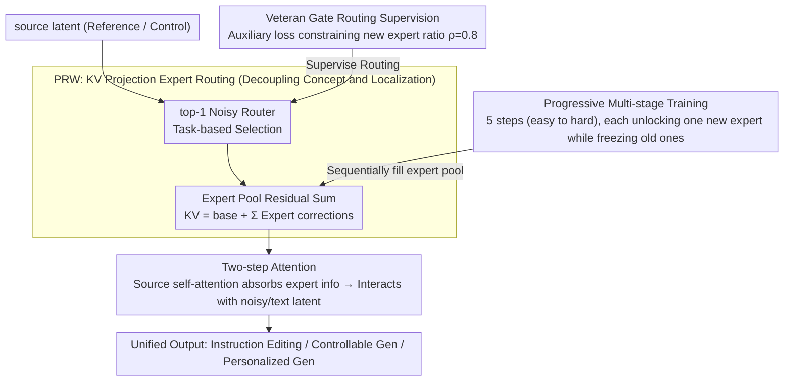

# CoLoGen: Progressive Learning of Concept-Localization Duality for Unified Image Generation

**Conference**: CVPR 2026  
**arXiv**: [2602.22150](https://arxiv.org/abs/2602.22150)  
**Code**: None  
**Area**: Unified Image Generation / Diffusion Models  
**Keywords**: Unified Generation Framework, Concept-Localization Duality, Progressive Training, Expert Routing, FLUX

## TL;DR

Ours proposes CoLoGen, a unified image generation framework based on "Concept-Localization Duality." By employing progressive multi-stage training and a Progressive Representation Weaving (PRW) dynamic expert routing architecture, it simultaneously reaches or exceeds the performance of specialized models across instruction editing, controllable generation, and personalized generation.

## Background & Motivation

Unified multimodal image generation (encompassing mask inpainting, visual grounding, controllable generation, personalized generation, and instruction editing) faces a core dilemma of **representation conflict**:

- **Concept Representation $\mathcal{R}_c$**: Encodes semantic consistency and object-level understanding; specialized for tasks like controllable generation (e.g., Canny/depth/seg conditions).
- **Localization Representation $\mathcal{R}_l$**: Encodes spatial alignment, geometric, and structural consistency; essential for personalized generation to precisely locate identity features from reference images.

Existing unified frameworks force these two heterogeneous representations to share parameters, leading to mutual interference between conceptual understanding and spatial accuracy (optimizing $f_c$ may degrade $f_l$). This explains why universal models often perform well in some tasks but deteriorate in others.

## Method

### Overall Architecture

CoLoGen aims to enable a single generative model to perform instruction editing, controllable generation, and personalized generation simultaneously without maintaining separate representations for conceptual and spatial capabilities. Based on the FLUX.1 MMDiT backbone, it introduces two key designs: first, the KV projection of the source latent in each multimodal attention block is transformed into a dynamically routable expert pool (PRW), allowing the model to select appropriate representation paths per task. Second, a 5-step progressive training pipeline (from easy to hard) sequentially activates these experts; previously learned capabilities are frozen, and only new experts are unlocked for subsequent tasks. When data flows from the source latent to the attention block, a router selects and fuses experts before interacting with noisy/text latents. Conceptual and localization representations utilize distinct expert paths throughout the process, avoiding mutual interference.

### Key Designs

**1. Progressive Representation Weaving (PRW): Decoupling Concept and Localization via KV Layer Expert Routing**

The primary bottleneck for unified frameworks is forcing concept representation $\mathcal{R}_c$ and localization representation $\mathcal{R}_l$ into the same shared parameters. PRW addresses this by modifying only the KV projection layer of the source latent, augmenting it with an expert pool $\{E_k\}_{k=1}^N$ and a noisy top-1 router. Routing weights are calculated from the current hidden state $h$, with an additive noise term for exploration:

$$\mathbf{w} = hW_r + \epsilon \odot \text{softplus}(hW_n), \quad \epsilon \sim \mathcal{N}(0, \mathbf{I})$$

Selected experts are added as residuals to the base KV projection, providing task-specific corrections without destroying original FLUX representations:

$$(K_{\hat{h}}, V_{\hat{h}}) = \text{KV\_proj}_{\text{base}}(h) + \sum_{k \in \mathcal{S}} \text{softmax}(\mathbf{w})_k E_k(h)$$

The attention mechanism proceeds in two steps: the source latent self-attention incorporates the selected expert information, followed by the interaction between the noisy/text latent and this "task-colored" source representation. Since routing occurs within each block and only affects KV projections, different tasks activate different experts, keeping conceptual and spatial paths non-overlapping.

**2. Progressive Multi-stage Training: Sequential Expert Activation to Prevent Forgetting**

Mixing all tasks from the start causes conflicts that prevent the model from mastering any specific task. CoLoGen splits training into 5 steps based on capability dependencies: Step 0-1 involves endogenous pre-training (3M synthetic samples for Mask Inpainting to develop concept capabilities, and 1M for Visual Grounding for localization). Step 2 introduces conditional signals using 20M samples (Canny/Depth/HED/Lineart/Seg). Step 3-4 focuses on instruction-image alignment (200K samples for Customized Generation, 1.6M for Instruction Editing). Critically, each step unlocks only one new expert $E_{N-1}$ while freezing all previous ones, ensuring new tasks do not overwrite existing capabilities—a form of parameter isolation for lifelong learning.

**3. Veteran Gate Routing Supervision: Constraining New Expert Density**

Freezing old experts is insufficient if the router "lazily" assigns all tokens to the newest expert. CoLoGen introduces a veteran gate loss to supervise the routing ratio $U_t$ of the new expert $E_{N-1}$, pulling it toward a target density $\rho$:

$$\mathcal{L}_{\text{veteran}} = \alpha \cdot |U_t - \rho|, \quad U_t = \frac{1}{L_n} \sum_{i=1}^{L_n} \mathbb{I}(e_i = N-1)$$

Setting $\rho = 0.8$ allows the new expert to handle 80% of tokens while forcing 20% to rely on historical experts, ensuring old capabilities remain active during inference. This is combined with the task loss: $\mathcal{L}_{\text{total}} = \mathcal{L}_{\text{task}} + \mathcal{L}_{\text{veteran}}$.

### Loss & Training

- Main Loss: Standard diffusion generation loss $\mathcal{L}_{\text{task}}$ (Flow Matching).
- Auxiliary Loss: Veteran Gate Routing Supervision $\mathcal{L}_{\text{veteran}}$ with weight $\alpha = 0.5$.
- PRW experts are implemented using LoRA (rank=128) for parameter efficiency.
- Each stage is trained for 200K-400K iterations with a global batch size of 128-256.
- Total training data: ~25M samples.

## Key Experimental Results

### Main Results

| Task / Dataset | Metric | CoLoGen | Prev. SOTA | Gain |
|--------------|------|---------|-----------|------|
| Instruction Editing / Emu Edit | DINO ↑ | **0.843** | 0.831 (UniReal) | +0.012 |
| Instruction Editing / MagicBrush | DINO ↑ | **0.932** | 0.879 (Emu Edit) | +0.053 |
| Instruction Editing / MagicBrush | CLIP_out ↑ | **0.301** | 0.308 (UniReal) | -0.007 |
| Controllable Gen / MultiGen-20M | Canny CLIP-S ↑ | **33.31** | 32.15 (ControlNet) | +1.16 |
| Controllable Gen / MultiGen-20M | Depth RMSE ↓ | **31.79** | 33.83 (PixWizard) | -2.04 |
| Personalized Gen / DreamBench | DINO ↑ | **0.714** | 0.702 (UniReal) | +0.012 |
| Personalized Gen / DreamBench | CLIP-T ↑ | 0.315 | **0.326** (UniReal) | -0.011 |

### Ablation Study

| Configuration | CLIP-T ↑ | CLIP-I ↑ | DINO ↑ | Description |
|------|---------|---------|--------|------|
| Baseline (w/o $\mathcal{R}_l$ & $\mathcal{R}_c$) | 0.260 | 0.889 | 0.901 | No experts on MagicBrush |
| w $\mathcal{R}_l$ only | 0.279 | 0.922 | 0.927 | Localization improves structure |
| w $\mathcal{R}_c$ only | 0.302 | 0.881 | 0.905 | Concept improves faithfulness |
| Co-training ($\mathcal{R}_c$ & $\mathcal{R}_l$) | 0.269 | 0.918 | 0.922 | Joint training lags behind |
| CoLoGen (Progressive) | **0.301** | **0.931** | **0.932** | Resolves conflicts |

### Key Findings

- Co-training strategies result in lower DINO and CLIP-I scores in personalized generation compared to the baseline, validating the "representation conflict" hypothesis.
- Progressive training outperforms co-training across all metrics, proving phased learning mitigates concept-localization conflicts.
- Veteran Gate Routing with $\rho = 0.8$ is optimal; excessively large $\alpha$ values restrict flexibility.
- LoRA rank=128 provides the best performance setting.

## Highlights & Insights

- **Concept-Localization Duality** provides deep theoretical insight into the difficulties of unified image generation by formalizing requirements as two competing subspaces.
- The PRW architecture intelligently adapts MoE concepts by restricting them to the KV projection layer with top-1 routing, maintaining efficiency.
- Progressive training combined with expert freezing is an effective application of lifelong learning in generative models, mitigating catastrophic forgetting.
- Meticulous data engineering: three types of masks for inpainting (random, object-shaped, Bessel curve) in a 20:40:40 sampling ratio.

## Limitations & Future Work

1. Memory footprint of PRW increases with the number of tasks and experts, limiting scalability.
2. Only 5 tasks were validated; generalization to other conditions (e.g., pose, sketch) remains unknown.
3. Some metrics remain slightly lower than specialized models like UniReal, indicating a performance gap for unified models.
4. Parameters for LoRA rank=128 are significant; the performance gap compared to full fine-tuning is not reported.

## Related Work & Insights

- Compared to OmniGen (unified multimodal generation without explicit representation management), CoLoGen achieves a better balance of editing and customization via PRW.
- Compared to general editing models like PixWizard and UniReal, CoLoGen's competitive advantage lies in its strength in controllable generation.
- Insight: Unified generation should not aim for a single representation for all tasks but should use dynamic routing to allow task-adaptive representation switching.

## Rating

- **Novelty**: ⭐⭐⭐⭐ Fresh perspective on duality; systematic design of PRW and progressive training.
- **Experimental Thoroughness**: ⭐⭐⭐⭐ Covers major task lines with 6 benchmarks and deep ablation studies.
- **Writing Quality**: ⭐⭐⭐⭐ Clear problem definition, high-quality illustrations, and detailed strategies.
- **Value**: ⭐⭐⭐⭐ Provides a theoretically grounded and practical solution for unified generation; PRW is transferable to other multi-task scenarios.

<!-- RELATED:START -->

## Related Papers

- [\[CVPR 2026\] DCoAR: Deep Concept Injection into Unified Autoregressive Models for Personalized Text-to-Image Generation](dcoar_deep_concept_injection_into_unified_autoregressive_models_for_personalized.md)
- [\[CVPR 2026\] PureCC: Pure Learning for Text-to-Image Concept Customization](purecc_pure_learning_for_text-to-image_concept_customization.md)
- [\[CVPR 2026\] NAMI: Efficient Image Generation via Bridged Progressive Rectified Flow Transformers](nami_efficient_image_generation_via_bridged_progressive_rectified_flow_transform.md)
- [\[CVPR 2026\] UniVerse: A Unified Modulation Framework for Segmentation-Free, Disentangled Multi-Concept Personalization](universe_a_unified_modulation_framework_for_segmentation-free_disentangled_multi.md)
- [\[CVPR 2026\] iMontage: Unified, Versatile, Highly Dynamic Many-to-many Image Generation](imontage_unified_versatile_highly_dynamic_many-to-many_image_generation.md)

<!-- RELATED:END -->
