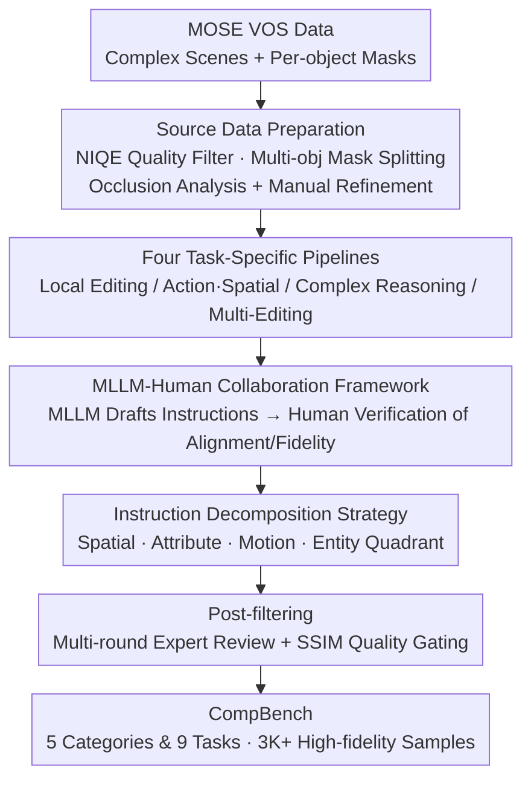

# CompBench: Benchmarking Complex Instruction-guided Image Editing

**Conference**: CVPR 2026  
**Paper**: [CVF OpenAccess](https://openaccess.thecvf.com/content/CVPR2026/html/Jia_CompBench_Benchmarking_Complex_Instruction_guided_Image_Editing_CVPR_2026_paper.html)  
**Project Page**: https://comp-bench.github.io/  
**Area**: Image Generation  
**Keywords**: Instruction-guided Image Editing, Benchmark, Complex Scenes, MLLM-Human Collaboration, Instruction Decomposition, SSIM Quality Control

## TL;DR
CompBench is the first benchmark for instruction-guided image editing oriented toward **complex real-world scenarios**. By extracting high-density occlusion scenes from the Video Object Segmentation (VOS) dataset MOSE and employing an MLLM-Human collaboration framework with an instruction decomposition strategy, the authors constructed 3K+ high-fidelity editing samples across 9 tasks in 5 categories. This work systematically reveals fundamental shortcomings of current editing models in multi-object handling, spatial reasoning, and implicit reasoning.

## Background & Motivation

**Background**: Instruction-guided image editing allows image manipulation using only a natural language instruction without requiring masks or additional visual inputs. This has become a prominent direction for diffusion model applications (e.g., InstructPix2Pix, SmartEdit, Step1X-Edit, FLUX.1 Kontext). Evaluating these models requires high-quality benchmarks.

**Limitations of Prior Work**: The authors identify three critical flaws in existing editing benchmarks:

1.  **Oversimplified Scenarios**: Benchmarks like MagicBrush and Reason-Edit often draw images from general datasets like MS COCO, which feature sparse layouts, few objects, and light occlusion. However, real editing needs involve dense object interactions and complex spatial relationships. Benchmark creators often intentionally avoid heavy occlusion or dynamic scenes due to the difficulty of labeling ground truth, leading to a "high benchmark score but poor real-world performance" gap.
2.  **Imprecise Instructions**: Existing instructions are often vague (e.g., "Replace the car"), failing to test a model's visual localization, context understanding, and complex reasoning capabilities.
3.  **Low Editing Quality**: Many editing results within existing datasets suffer from instruction misalignment, geometric distortion, and background inconsistency. This introduces noise into the evaluation, making it impossible to distinguish between truly robust models and those that only "look okay" but are flawed.

**Key Challenge**: There is an inherent conflict between benchmark complexity and controllability—the more complex the scene, the harder it is to guarantee ground truth quality. Consequently, researchers settle for simple scenarios, which fail to evaluate the true capabilities of models in real-world complex tasks.

**Key Insight**: Instead of general image datasets, the authors leverage the **Video Object Segmentation (VOS) dataset** MOSE. These data inherently contain dense scenes, multiple objects, and heavy occlusions, and provide high-quality per-object masks, perfectly filling the gap of "complex scenes + precise annotations." This is paired with an MLLM-human collaboration pipeline to ensure every sample represents a successful edit.

## Method

### Overall Architecture

CompBench is not a model but a **dataset construction pipeline**. It consists of two main stages: first, filtering high-quality, high-complexity images and object masks from MOSE video segmentation data (Source Data Preparation); second, generating editing samples using four specialized pipelines for 9 editing tasks. All pipelines share a collaboration framework where "MLLM generates drafts and humans provide oversight," combined with an instruction decomposition strategy to ensure instructions are both natural and precise. Finally, all samples undergo multiple rounds of expert review and SSIM quality filtering, resulting in 3K+ high-fidelity samples.

### Key Designs

**1. Leveraging VOS Data (MOSE) as Scene Source: Solving "Scenario Simplification" at the Root**

This is the most critical design choice. Existing benchmarks use general image sets like COCO with sparse objects. CompBench uses the MOSE video object segmentation dataset instead. VOS tasks naturally require video frames with dense, multi-object, and heavily occluded scenes. Consequently, these frames have much higher complexity than general images and come with high-quality per-object masks, satisfying both "complex scenes" and "precise object annotation." During preparation, NIQE metrics filter out corrupted frames, followed by manual review, splitting multi-object masks into instances, and refining masks to the pixel level. Statistics confirm this choice: CompBench averages 13.58 objects per image (~36.3% higher than GEdit-Bench), 5.87 categories, 98.47% occlusion rate, and 86.38% out-of-frame rate—surpassing all existing benchmarks.

**2. MLLM-Human Collaboration + Four Specialized Pipelines: Ensuring Successful Edits in Complex Scenarios**

Mass-producing complex editing samples automatically is extremely difficult—direct model generation often results in high failure rates. CompBench designs four targeted pipelines: local editing (Add/Delete/Replace), action and spatial editing (Action, Position, Viewpoint), complex reasoning (Implicit context reasoning), and multi-editing (Multi-object, multi-round). These pipelines share a unified MLLM-Human framework: an MLLM (e.g., Qwen-VL) analyzes the scene and editing goal to generate initial task-specific instructions, which human experts then verify for alignment and fidelity. Unsuccessful edits are iterated or discarded, ensuring every entry in the database is a successful edit. This combines the scale of MLLM generation with human quality control.

**3. Instruction Decomposition Strategy: Structuring Vague Instructions into Four Dimensions**

Instructions for complex edits can easily become ambiguous ("Replace that car" - which one? into what?), yet being too rigid loses the flexibility of natural language. CompBench proposes **Instruction Decomposition**: organizing each instruction across four dimensions—Spatial Position (e.g., "Left of the table"), Visual Attribute (Color/Texture), Motion State (e.g., "In flight"), and Object Entity. Generation follows two stages: MLLM produces "dimension-aware" candidate instructions based on visual context, and humans refine them for precision and consistency. This systematically covers every aspect of an edit while maintaining natural expression.

### Example
Consider "Remove the tiger furthest from the water" (Implicit Reasoning task): In the source stage, a complex frame with multiple tigers and a water body is taken from MOSE, with refined masks for each tiger. In the complex reasoning pipeline, the MLLM first understands that "furthest from water" requires spatial reasoning to locate the target tiger, generating a structured instruction (Spatial Position=furthest from water, Entity=tiger). Human experts verify if the instruction uniquely identifies the object and if the edit results in clean removal with background consistency. After passing SSIM gating, it enters the benchmark. This sample tests a model's ability to "reason first, locate precisely, then edit while maintaining complex background consistency."

## Key Experimental Results

The authors evaluated 15 mainstream models (InstructPix2Pix, MagicBrush, SmartEdit, Step1X-Edit, Bagel, FLUX.1 Kontext, Qwen-Image-Edit, etc.). A **foreground-background decoupled** evaluation was used for local/multi-object/implicit tasks: foreground measures editing accuracy (LC-T: CLIP text similarity between foreground and description; LC-I: CLIP image similarity with GT), while background measures consistency (PSNR/SSIM/LPIPS).

### Benchmark Complexity Comparison (Table 1 Excerpt)
| Benchmark | Scale | Avg. Objects | Avg. Categories | Occlusion % | Out-of-frame % |
| :--- | :--- | :--- | :--- | :--- | :--- |
| MagicBrush | 10K | 9.22 | 5.04 | 91.71 | 78.30 |
| GEdit-Bench | 0.6K | 9.96 | 4.93 | 67.67 | 65.40 |
| RefEdit | 20K | 9.74 | 5.26 | 91.02 | 69.00 |
| **CompBench (Ours)** | **3K** | **13.58** | **5.87** | **98.47** | **86.38** |

### Key Findings
-   **Leading Complexity Metrics**: The average number of objects is ~36.3% higher than the runner-up (GEdit-Bench). The occlusion rate (98.47%) and out-of-frame rate (86.38%) are the highest recorded, proving that using VOS data significantly enhances scene complexity.
-   **Exposure of Model Shortcomings**: Under decoupled evaluation, current SOTA models struggle to balance "accurate foreground editing" and "background consistency" in complex tasks like multi-object and implicit reasoning.
-   **Superior Sample Quality**: All samples passed multi-round expert review; SSIM is significantly higher than other datasets, ensuring evaluation results are not contaminated by low-quality sample noise.

## Highlights & Insights
-   **Cross-task Innovation**: Repurposing VOS datasets as source material for image editing benchmarks solves the dual problem of "complex scenes + precise masks" simultaneously. This idea is transferable to other vision tasks requiring complex annotations.
-   **MLLM Scale + Human Expertise**: This collaboration paradigm makes the mass production of high-quality complex samples feasible.
-   **Instruction Decomposition**: Resolving the tension between "naturalness vs. precision" into four orthogonal dimensions is a clean and reusable prompt engineering strategy.
-   **Decoupled Evaluation**: Separating "editing effectiveness" from "background preservation" provides a more nuanced understanding of model capabilities than single metrics.

## Limitations & Future Work
-   The scale (~3K+) is smaller than million-scale training sets; it is positioned as a **benchmark**, not a training corpus. Coverage of extreme long-tail scenarios remains limited.
-   Source data is limited to the MOSE dataset; since most scenes involve segmentable objects in natural/daily life settings, there may be distribution bias, with insufficient coverage of document, chart, or artistic editing.
-   Heavily reliant on manual review for quality assurance, which entails high construction costs and makes scaling up labor-intensive.
-   ⚠️ Some experimental figures (PSNR/SSIM for specific models) are derived from large tables in the CVF PDF; refer to Table 2 in the original paper for exact per-model values.

## Related Work & Insights
-   **vs. MagicBrush / EMU-Edit / Reason-Edit**: These involve simpler scenes and vaguer instructions; CompBench maximizes complexity via VOS data and enhances precision via instruction decomposition.
-   **vs. Complex-Edit / ComplexBench-Edit**: These focus on "complexity" through "Chain-of-Edit" combined instructions or sequential dependencies. CompBench differentiates itself by emphasizing **visual complexity of the scene itself** (dense objects + heavy occlusion).
-   **vs. RefEdit**: RefEdit focuses on referring expression localization for specific objects; CompBench covers a broader range of 9 tasks and emphasizes implicit reasoning.
-   **Insight**: When a task lacks data with both "complex scenes" and "precise annotations," leveraging existing annotations from adjacent tasks (like Segmentation/Detection/VOS) is often more efficient than labeling from scratch.

<!-- RELATED:START -->

## Related Papers

- [\[CVPR 2026\] Towards Robust Sequential Decomposition for Complex Image Editing](towards_robust_sequential_decomposition_for_complex_image_editing.md)
- [\[CVPR 2026\] FlowDC: Flow-Based Decoupling-Decay for Complex Image Editing](flowdc_flow-based_decoupling-decay_for_complex_image_editing.md)
- [\[CVPR 2026\] WiseEdit: Benchmarking Cognition- and Creativity-Informed Image Editing](wiseedit_benchmarking_cognition-_and_creativity-informed_image_editing.md)
- [\[ICLR 2026\] Visual Autoregressive Modeling for Instruction-Guided Image Editing](../../ICLR2026/image_generation/visual_autoregressive_modeling_for_instruction-guided_image_editing.md)
- [\[CVPR 2026\] DreamOmni2: Multimodal Instruction-based Generation and Editing](dreamomni2_multimodal_instruction-based_generation_and_editing.md)

<!-- RELATED:END -->
