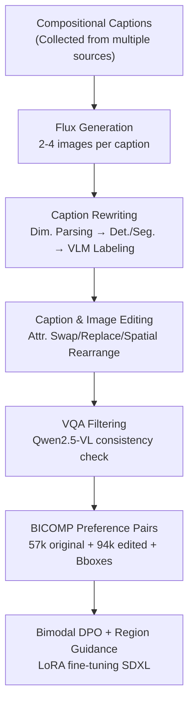

# Compositional Text-to-Image Generation Via Region-aware Bimodal Direct Preference Optimization

**Conference**: CVPR 2026  
**Paper**: [CVF Open Access](https://openaccess.thecvf.com/content/CVPR2026/html/Liu_Compositional_Text-to-Image_Generation_Via_Region-aware_Bimodal_Direct_Preference_Optimization_CVPR_2026_paper.html)  
**Code**: https://github.com/anzeameol/BiDPO  
**Area**: Diffusion Models / Image Generation  
**Keywords**: Compositional Generation, Direct Preference Optimization (DPO), Bimodal Alignment, Region-level Guidance, Preference Dataset  

## TL;DR
To address the difficulty of text-to-image models in handling compositional prompts such as "multiple objects + attribute binding + spatial relationships," BIDPO extends Diffusion DPO into a bimodal (image + text) preference optimization. It incorporates a region-level loss weighting based on bounding boxes and an automated pipeline generating 94,000 preference pairs. On T2I-CompBench, it improves attribute binding by approximately 17% and overall performance by 10%.

## Background & Motivation
**Background**: Diffusion models like Stable Diffusion 3, DALL-E 3, and Flux show strong image quality and aesthetics. However, "compositionality"—the presence of multiple objects in a single image, each bound to specific attributes (color/shape/texture) and spatial/action relationships—remains a significant challenge. Benchmarks like T2I-CompBench, GenEval, and DPG-Bench consistently show that SOTA models struggle with fine-grained attribute binding and spatial reasoning.

**Limitations of Prior Work**: Existing solutions follow two main paths, both with notable costs. The first involves providing additional structural information (layouts, scene graphs, semantic panels) during generation; while effective, these structural annotations are difficult to obtain in real-world scenarios. The second uses Large Language Models (LLMs) or Multimodal LLMs as tools to enhance understanding, which introduces instability and high inference overhead. Both deviate from the simple "generate from text only" setting.

**Key Challenge**: Compositional failure is essentially a failure of "fine-grained cross-modal alignment"—the model fails to precisely bind an attribute word in the text to its corresponding region in the image. Direct Preference Optimization (DPO), which could address this, has previously been used almost exclusively for "global image quality/safety." It typically performs pairwise image comparisons, ignoring textual contrastive signals and failing to focus on relevant local regions.

**Goal**: To enhance the compositional generation capability of diffusion models under pure text conditions (without relying on external modalities or tools), specifically by: (1) extending DPO to include the text modality; (2) focusing contrastive signals on relevant regions; and (3) constructing a high-quality compositional preference dataset with region annotations.

**Key Insight**: Upgrade Diffusion DPO to "Bimodal DPO (BIDPO)"—simultaneously contrasting image and text preferences. The authors observe that "pairwise image contrast can be implicitly derived from two pairwise text contrasts." Furthermore, a region-level mask is applied to focus the loss on the edited object regions.

## Method

### Overall Architecture
BIDPO is a post-training framework that fine-tunes base diffusion models using preference data without changing their architecture. It consists of three components: ① **BICOMP**, an automated data pipeline that transforms standard captions into "minimal-difference" text-image preference pairs (including bounding boxes); ② **Bimodal DPO (BIDPO)**, which introduces a TextDPO objective alongside Diffusion DPO to optimize preferences across both modalities; ③ **Region-level Guidance**, which applies element-wise weighting to the loss using masks of edited regions to concentrate supervision signals. The base model used is SDXL, fine-tuned via LoRA (rank=8).

The data pipeline is visualized as follows:

### Key Designs

**1. Bimodal DPO: Integrating Text Preference to Implicitly Derive Image Contrast**

Standard Diffusion DPO contrasts images: given a pair of "preferred image $x_0^w$ / rejected image $x_0^l$," the loss suppresses the diffusion process of $x_0^l$ and enhances $x_0^w$:

$$\mathcal{L}(\theta) = -\mathbb{E}\,\log\sigma\!\Big(-\beta T\omega(\lambda_t)\big[(\|\epsilon^w-\epsilon_\theta^w\|^2-\|\epsilon^w-\epsilon_{\mathrm{ref}}^w\|^2)-(\|\epsilon^l-\epsilon_\theta^l\|^2-\|\epsilon^l-\epsilon_{\mathrm{ref}}^l\|^2)\big]\Big)$$

However, this ignores the text modality, which is critical for compositional reasoning. The authors first define **TextDPO**: for a fixed preferred image $x_0^w$, the "preferred sample" is (preferred image + preferred caption $y^w$) and the "rejected sample" is (the same image + rejected caption $y^l$). Noise prediction is then conditioned on text embeddings $c^w$ / $c^l$:

$$\mathcal{L}_{\text{TextDPO}}(\theta)=-\mathbb{E}\,\log\sigma\!\Big(-\beta T\omega(\lambda_t)\big[(\|\epsilon^w-\epsilon_\theta(x_t^w,t,c^w)\|^2-\|\epsilon^w-\epsilon_{\mathrm{ref}}(x_t^w,t,c^w)\|^2)-(\|\epsilon^l-\epsilon_\theta(x_t^w,t,c^l)\|^2-\|\epsilon^l-\epsilon_{\mathrm{ref}}(x_t^w,t,c^l)\|^2)\big]\Big)$$

The intuition is to make the model prefer the correct caption $y^w$ over $y^l$ for the same image.

**BIDPO** runs TextDPO twice for a minimal-difference pair $(x_0^w,y^w)$ and $(x_0^l,y^l)$, constructing training samples $(x_0^w,y^w,y^l)$ and $(x_0^l,y^l,y^w)$. The elegance lies here: the first sample makes the model prefer $y^w$ for $x_0^w$, and the second makes it prefer $y^l$ for $x_0^l$. Combined, for the same caption $y^l$, $x_0^l$ becomes the preferred image relative to $x_0^w$. Thus, **pairwise image contrast (ImageDPO) is implicitly achieved through two explicit pairwise text contrasts**.

**2. Region-level Guidance: Focusing Loss on Edited Object Regions**

Even with bimodal contrast, models may perform "global" comparisons in complex scenes without knowing where to look. Region-level guidance uses a mask $M$ to weight the BIDPO loss element-wise:

$$\mathcal{L}_{\text{BIDPO-region}}(\theta)=\mathcal{L}_{\text{BIDPO}}(\theta)\odot M$$

The mask $M$ is derived from the bounding boxes of edited objects: the region of interest (ROI) is weighted at 1, while exterior regions are weighted at 0.5. This focuses supervision on where attributes actually change. Crucially, this guidance is **not** used for "number" and "spatial relationship" dimensions, as these require global context.

**3. BICOMP Data Pipeline: Automated Generation of Minimal-Difference Pairs**

DPO performance depends on preference pairs being identical except for the target edit. Since such region-annotated datasets were unavailable, the authors created an automated pipeline: (a) Collect captions from benchmarks (CONPAIR, T2I-CompBench, etc.) and generate images using Flux.1-dev; (b) Rewrite captions—parsing dimensions (color, shape, etc.) using DeepSeek-V3, extracting objects with DeepSeek-R1, and obtaining masks via Grounding DINO + SAM2; (c) Edit—generate modified regional info with Qwen2.5-VL and edit the original image using Qwen-Image-Edit (swapping or replacing attributes); (d) Filter using Qwen2.5-VL via VQA. The final BICOMP dataset contains 57,474 original and 94,502 edited images.

### Loss & Training
The framework uses SDXL with LoRA (rank=8), fine-tuned for 200 steps with an effective batch size of 2048. The learning rate is $4 \times 10^{-8}$ (scaled by batch size) with a constant schedule and 50 warm-up steps. Training took 13 hours on 4 $\times$ H100 GPUs. The training set includes 42k BICOMP samples and 12k VisMin real-world samples to maintain diversity.

## Key Experimental Results

### Main Results
On T2I-CompBench, BIDPO significantly improves attribute binding for SDXL, outperforming layout-conditioned models like GLIGEN / LMD+ using **text prompts only**:

| Dimension | Metric | SDXL(base) | SDXL-BIDPO | Gain |
|-----------|--------|------------|------------|------|
| Color | ↑ | 58.90 | 79.35 | +20.4 |
| Shape | ↑ | 46.90 | 60.47 | +13.6 |
| Texture | ↑ | 53.13 | 71.36 | +18.2 |
| Spatial | ↑ | 21.23 | 23.41 | +2.2 |

On GenEval, the overall score increased from 0.53 to 0.62. In sub-tasks like "single object" and "colors," it even surpassed DALL-E 3 and Flux.1-dev despite BIDPO being a smaller model trained on less data:

| Sub-task | SDXL | SDXL-BIDPO | DALL-E 3 | FLUX |
|----------|------|------------|----------|------|
| Single Obj. | 0.95 | 1.00 | 0.96 | 0.98 |
| Two Obj. | 0.68 | 0.86 | 0.87 | 0.81 |
| Overall | 0.53 | **0.62** | 0.67 | 0.66 |

### Ablation Study
Comparison of five configurations (overall scores) highlighting the impact of SFT, ImageDPO, TextDPO, and BIDPO:

| Configuration | T2I-CompBench | GenEval | DPG-Bench | Note |
|---------------|---------------|---------|-----------|------|
| SDXL | 43.57 | 53.29 | 73.38 | Baseline |
| SDXL-SFT | 43.34 | 52.29 | 73.23 | Supervised fine-tuning; ineffective |
| SDXL-ImageDPO | 45.58 | 53.00 | 75.70 | Image-only preference; limited gain |
| SDXL-TextDPO | 13.48 | 4.71 | 23.98 | Text-only preference; model collapses |
| BIDPO w/o region | 53.10 | 60.71 | 77.53 | Bimodal; significant gain |
| BIDPO w/ region | **54.37** | **62.14** | **78.84** | Full model |

### Key Findings
- **Bimodal setup is the primary driver**: The jump from ImageDPO (45.58) to BIDPO (53.10) on T2I-CompBench is the largest, proving combined text/image contrast is superior.
- **Stand-alone TextDPO fails**: Without visual supervision, the model loses control over image quality and detail, leading to collapse.
- **SFT is ineffective**: Supervised fine-tuning on compositional data actually degrades performance, suggesting this task requires contrastive signals rather than just positive examples.
- **Region-level Guidance provides stable gains**: It adds an incremental +1.2% to +1.4%, effectively refining the bimodal alignment.

## Highlights & Insights
- **Implicit Image Contrast via TextDPO is a clever observation**: It allows a single TextDPO loss to supervise both modalities simultaneously, making the training signal denser without needing a separate ImageDPO branch.
- **First systematic application of DPO to compositional generation**: While DPO was previously used for global aesthetics, this work pushes it to fine-grained attribute binding, outperforming layout-dependent methods.
- **The "Minimal-Difference + Region Mask" combination is transferable**: This approach can be applied to any task requiring fine-grained alignment, such as controllable editing or local attribute correction.
- **The BICOMP pipeline is a template for chaining specialized models**: Flux (generation), DeepSeek (parsing), Grounding DINO/SAM2 (localization), and Qwen (labeling/editing/filtering) are combined to produce high-quality data without expensive manual labeling.

## Limitations & Future Work
- **Model Scope**: Currently only verified on diffusion models; extensions to autoregressive text-to-image models are planned.
- **Spatial/Counting Dimensions**: Gains in spatial (+2.2) and numeracy dimensions are smaller than attribute binding. Since these were excluded from region guidance (requiring global context), relationship-based composition remains a weakness.
- **Dependency on External Models**: Data quality is bound by the performance of the Flux/DeepSeek/Qwen chain. Failures in detection or segmentation in crowded scenes can introduce noise.
- **Hyperparameter Sensitivity**: The ROI weight (1 vs 0.5) is a fixed hyperparameter; more adaptive weighting schemes were not explored.

## Related Work & Insights
- **vs Diffusion DPO**: Existing DPO focuses on global aesthetics; BIDPO introduces text-side contrast and region guidance for fine-grained alignment.
- **vs Structure-Guided Methods (GLIGEN / LMD+)**: These require layout inputs during inference. BIDPO is a post-training method that remains text-only at inference while remaining competitive.
- **vs LLM-Augmented Methods**: Instead of using LLMs as online tools during inference, BIDPO uses them offline for data generation, avoiding runtime overhead.

## Rating
- Novelty: ⭐⭐⭐⭐ Bimodal DPO and region-aware loss are well-integrated, though grounded in Diffusion DPO.
- Experimental Thoroughness: ⭐⭐⭐⭐⭐ Comprehensive coverage across four benchmarks, multiple architectures (SDXL/SD3-M), and aesthetics.
- Writing Quality: ⭐⭐⭐⭐ Clear logic, though some version of the CVF paper contains minor formatting errors in formulas.
- Value: ⭐⭐⭐⭐ Provides a model-agnostic path to enhance compositional generation with a reusable data pipeline.

<!-- RELATED:START -->

## Related Papers

- [\[CVPR 2026\] GlyphPrinter: Region-Grouped Direct Preference Optimization for Glyph-Accurate Visual Text Rendering](glyphprinter_region-grouped_direct_preference_optimization_for_glyph-accurate_vi.md)
- [\[CVPR 2026\] Synthetic Curriculum Reinforces Compositional Text-to-Image Generation](synthetic_curriculum_reinforces_compositional_text-to-image_generation.md)
- [\[CVPR 2026\] Fusion in Your Way: Aligning Image Fusion with Heterogeneous Demands via Direct Preference Optimization](fusion_in_your_way_aligning_image_fusion_with_heterogeneous_demands_via_direct_p.md)
- [\[CVPR 2026\] OSPO: Object-Centric Self-Improving Preference Optimization for Text-to-Image Generation](ospo_object-centric_self-improving_preference_optimization_for_text-to-image_gen.md)
- [\[CVPR 2026\] Style-GRPO: Semantic-Aware Preference Optimization for Image Style Transfer Guided by Reward Modeling](style-grpo_semantic-aware_preference_optimization_for_image_style_transfer_guide.md)

<!-- RELATED:END -->
