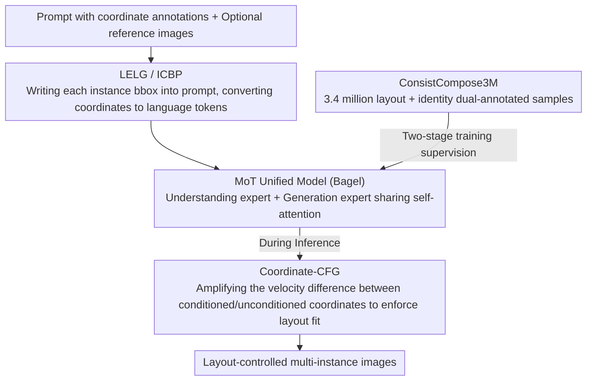

# ConsistCompose: Unified Multimodal Layout Control for Image Composition

**Conference**: CVPR 2026  
**arXiv**: [2511.18333](https://arxiv.org/abs/2511.18333)  
**Code**: None  
**Area**: Image Generation / Layout Control  
**Keywords**: Layout-controlled generation, Multi-instance image synthesis, LELG, Coordinate embedded prompt, Identity preservation

## TL;DR
The paper proposes ConsistCompose, achieving layout-controllable multi-instance image generation within a unified multimodal framework by directly embedding layout coordinates into language prompts (the LELG paradigm). It constructs the ConsistCompose3M dataset with 3.4 million samples to provide layout and identity supervision. Coupled with a coordinate-aware CFG mechanism, it achieves a 7.2% mIoU Gain and a 13.7% AP Gain on COCO-Position while maintaining general multimodal understanding capabilities.

## Background & Motivation

**Background**: Unified multimodal models (e.g., Bagel, OmniGen2) are already capable of both understanding and generation within a single architecture, but they primarily focus on visual grounding; precise layout control on the generation side remains weak.

**Limitations of Prior Work**: Existing methods for layout-controlled generation face fundamental obstacles: (a) Diffusion-based methods (GLIGEN, InstanceDiffusion) rely on specialized layout-image fusion modules or region-aware U-Nets, which are incompatible with unified Transformer generation frameworks; (b) Autoregressive models (LayoutSAM, PlanGen) treat layout as an independent modality, limiting them to layout tasks and preventing them from balancing general capabilities like visual reasoning and understanding; (c) Most methods only support text-conditioned layout control, failing to address the more difficult multi-reference identity preservation scenarios.

**Key Challenge**: Layout control traditionally requires task-specific branches or encoders, which contradicts the philosophy of a "unified" framework. How can precise layout control be achieved without introducing additional architectural modules?

**Goal**: Support layout-grounded text-to-image generation, identity-consistent multi-instance synthesis with multiple references, and general multimodal understanding simultaneously—all using a single model.

**Key Insight**: Layout is essentially information that can be expressed through language. Rather than designing specialized spatial encoders, coordinates can be encoded as text tokens, allowing the Transformer to naturally learn spatial grounding through language understanding.

**Core Idea**: Language as Layout Control—embed coordinates into prompts so the unified model learns spatial layout via the text flow, requiring no architectural modifications.

## Method

### Overall Architecture
This paper addresses whether precise layout control can be achieved in a unified multimodal model without adding specialized layout branches. The answer is to treat layout as language. The entire system is built on Bagel's MoT (Mixture of Transformers) architecture, where an Understanding expert and a Generation expert share the same self-attention mechanism. The input consists of a text prompt with coordinate annotations plus optional reference images; after reading this text, the model directly generates multi-instance images that satisfy the layout constraints. Making this pipeline work depends on three components: the LELG paradigm is used to write instance coordinates into the prompt (teaching the model to "read coordinates and place objects" during training), Coordinate-CFG is used during inference to amplify the influence of coordinate conditions, and the ConsistCompose3M dataset provides the necessary layout and identity annotations to train the system.

### Key Designs

**1. LELG Paradigm + Instance-Coordinate Binding Prompt (ICBP): Writing bboxes directly into prompts to turn coordinates into language tokens**

Prior layout control either modified architectures (e.g., adding gated Transformer layers in GLIGEN, multimodal fusion modules in InstanceDiffusion, or SiamLayout in CreatiLayout) or built independent layout branches—both of which conflict with the "unified model" concept. The LELG approach returns to the input layer: for the $i$-th instance, its normalized bbox $b_i = (x_1^i, y_1^i, x_2^i, y_2^i) \in [0,1]^4$ is written using three decimal places immediately following its corresponding subject phrase, forming a sentence like "a brown sofa <bbox>[0.123, 0.456, 0.789, 0.901]</bbox>". Coordinates thus become regular language tokens that enter the same self-attention framework as phrases, allowing the model to naturally learn that "this noun should appear at this position" through language understanding. This offers multiple benefits: no layout encoders or extra attention modules are needed (zero architectural change); understanding and generation share the same token space, so spatial reasoning learned in understanding tasks transfers to generation; and three-place decimals discretize continuous coordinates into roughly $1000^3$ positions, providing sufficient precision while remaining compatible with existing tokenizers.

**2. Coordinate-aware Classifier-Free Guidance (Coordinate-CFG): Extending CFG from semantic guidance to spatial guidance**

While ICBP embeds spatial signals in the prompt, the model may not always "obey" these signals—positions might drift during generation. Coordinate-CFG adopts the logic of text-based CFG but compares the velocity difference between predictions "with coordinate conditions" and "without coordinate conditions," amplifying this difference to force the generation to strictly adhere to the layout:

$$\mathbf{v}_t^{\text{coord-cfg}} = \mathbf{v}_t^{\text{uncond}} + s_{\text{coord}}(\mathbf{v}_t^{\text{coord}} - \mathbf{v}_t^{\text{uncond}})$$

where $s_{\text{coord}}$ controls the intensity of spatial guidance. To prevent velocity magnitude explosion after amplification, a normalization coefficient $\alpha = \|\mathbf{v}_t^{\text{base}}\| / \|\mathbf{v}_t^{\text{coord-cfg}}\|$ is added to pull the magnitude back to the baseline. Experiments show that as $s_{\text{coord}}$ increases from 1 to 3, positional accuracy improves, though excessively high values slightly sacrifice perceptual quality, indicating an optimal point. This mechanism is decoupled from and can be used alongside text CFG and can be migrated to any generation model that supports CFG.

**3. ConsistCompose3M Dataset: Filling the gap in large-scale training data with both layout and identity annotations**

A practical reason for the slow progress in layout-controlled generation is the lack of large-scale multi-instance datasets containing both layout and identity annotations. ConsistCompose3M assembles 3.4 million samples by repurposing existing data into two subsets. The T2I subset (2.6 million) re-processes data via LayoutSAM, appending bbox coordinates to captions in the ICBP format to train the model to "read coordinates and generate multi-instance images." The Reference-conditioned subset (0.8 million) reuses subject materials from Subjects200K and UNO, re-assembling the same subjects into multi-subject scenes under different layouts and filtering samples with identity drift using CLIP/DINO similarity. This ensures that "the same subject looks the same at different positions." This strategy of "re-processing existing data to build new-purpose datasets" is low-cost and effectively fills the gap for both layout and identity supervision.

## Loss & Training
- **Two-stage Training**: First, an alignment stage (mixing general understanding data + ConsistCompose3M to inject layout awareness), followed by a hybrid SFT stage (joint training of understanding/generation/editing/multi-subject reference generation + ConsistCompose3M).
- **Training Target**: A weighted combination of Flow Matching loss $\mathcal{L}_{\text{FM}}$ and Language Model loss $\mathcal{L}_{\text{LM}}$, with no additional coordinate regression loss—spatial grounding is learned implicitly from the language stream.
- **High-resolution Fine-tuning**: Further balances layout control and general image generation performance.

## Key Experimental Results

### Main Results (COCO-Position)

| Method | Instance Success Avg↑ | Image Success Avg↑ | mIoU↑ | AP↑ | AP50↑ | AP75↑ |
|------|---------------------|-------------------|-------|-----|-------|-------|
| GLIGEN | 82.6 | 52.1 | 69.0 | 40.5 | 75.9 | 39.1 |
| InstanceDiffusion | 87.8 | 65.5 | 78.1 | 57.2 | 83.6 | 65.5 |
| MIGC++ | 86.8 | 63.4 | 74.9 | 48.3 | 79.2 | 52.6 |
| CreatiLayout | 74.0 | 42.5 | 64.9 | 32.4 | 61.1 | 31.6 |
| PlanGen | 82.5 | 50.3 | 66.2 | 31.9 | 74.0 | 21.5 |
| **Ours** | **92.6** | **76.1** | **85.3** | **70.9** | **89.1** | **76.9** |

- Compared to the strongest baseline, InstanceDiffusion: layout mIoU +7.2%, AP +13.7%, and Image Success Avg +10.6%.

### Ablation Study

| Stage | Instance Success Avg | mIoU | AP |
|------|---------------------|------|-----|
| Alignment only | 88.4 | 79.1 | 58.3 |
| + Hybrid SFT | **92.6** | **85.3** | **70.9** |

### Key Findings
- **LELG Effectiveness**: By only embedding coordinates through language (no extra architecture), layout accuracy significantly exceeds all specially designed baselines.
- **Maintenance of General Capabilities**: Performance on MMMU and MMBench is on par with the Bagel backbone, indicating layout control training does not harm general understanding.
- **Effect of Coordinate-CFG**: $s_{\text{coord}}$ gradually improves positional accuracy from 1 to 3, with an optimal point (values too high slightly damage quality).
- **Necessity of Two-stage Training**: The Hybrid SFT stage further improves AP by 12.6% over the Alignment base.

## Highlights & Insights
- The **simplicity of the LELG paradigm** is impressive: it simplifies "layout control"—which seemingly requires specialized modules—to "inserting coordinates into the prompt," achieving SOTA layout precision with zero architectural changes. This suggests that many conditional controls (depth, edges, keypoints) might be unified through language interfaces.
- **Coordinate-CFG** cleverly extends CFG from "semantic guidance" to "spatial guidance" and works independently of text CFG, allowing for stacked usage. This design is transferable to any CFG-supported generation model.
- The **dataset construction strategy** is noteworthy: high efficiency is achieved by repurposing existing data (LayoutSAM→T2I, Subjects200K→Reference) to create datasets for new purposes.

## Limitations & Future Work
- Coordinate discretization at three decimal places may lack precision in high-resolution scenarios (error of ~0.1% image width).
- Currently only supports bounding box-level layout control; it does not support finer-grained masks, keypoints, or depth conditions.
- Dependence on Bagel as a backbone limits performance to Bagel’s base generation quality and training scale.
- Building the ConsistCompose3M dataset involves non-trivial data preparation costs.
- Performance may degrade in multi-instance scenes with a high count (e.g., >6), as COCO-Position tests up to 6 instances.

## Related Work & Insights
- **vs GLIGEN [Li et al., 2023]**: GLIGEN introduces bbox constraints using gated Transformer layers, which is an architectural change. Ours LELG paradigm is more lightweight and effective (AP +30.4%).
- **vs InstanceDiffusion [Wang et al., 2024]**: InstanceDiffusion achieves instance-level control via multimodal input fusion but remains in the U-Net paradigm. Ours surpasses it within the Transformer generation paradigm.
- **vs PlanGen [Gong et al., 2024]**: PlanGen generates layout first and then images. Ours end-to-end approach is more unified and yields better results.

## Rating
- Novelty: ⭐⭐⭐⭐⭐ LELG is a paradigm innovation in layout-controlled generation, unifying spatial control via language interfaces.
- Experimental Thoroughness: ⭐⭐⭐⭐⭐ Comprehensive assessments across COCO-Position, MS-Bench, GenEval, MMMU, and MMBench.
- Writing Quality: ⭐⭐⭐⭐ Clear structure, rich diagrams, and sufficient technical detail.
- Value: ⭐⭐⭐⭐⭐ Provides a simple and effective solution for layout control in unified multimodal models.

<!-- RELATED:START -->

## Related Papers

- [\[AAAI 2026\] Laytrol: Preserving Pretrained Knowledge in Layout Control for Multimodal Diffusion Transformers](../../AAAI2026/image_generation/laytrol_preserving_pretrained_knowledge_in_layout_control_fo.md)
- [\[CVPR 2026\] Scone: Bridging Composition and Distinction in Subject-Driven Image Generation via Unified Understanding-Generation Modeling](scone_bridging_composition_and_distinction_in_subject-driven_image_generation_vi.md)
- [\[AAAI 2026\] EchoGen: Cycle-Consistent Learning for Unified Layout-Image Generation and Understanding](../../AAAI2026/image_generation/echogen_cycle-consistent_learning_for_unified_layout-image_generation_and_unders.md)
- [\[CVPR 2026\] MICON-Bench: Benchmarking and Enhancing Multi-Image Context Image Generation in Unified Multimodal Models](micon-bench_benchmarking_and_enhancing_multi-image_context_image_generation_in_u.md)
- [\[CVPR 2026\] ChArtist: Generating Pictorial Charts with Unified Spatial and Subject Control](chartist_generating_pictorial_charts_with_unified_spatial_and_subject_control.md)

<!-- RELATED:END -->
