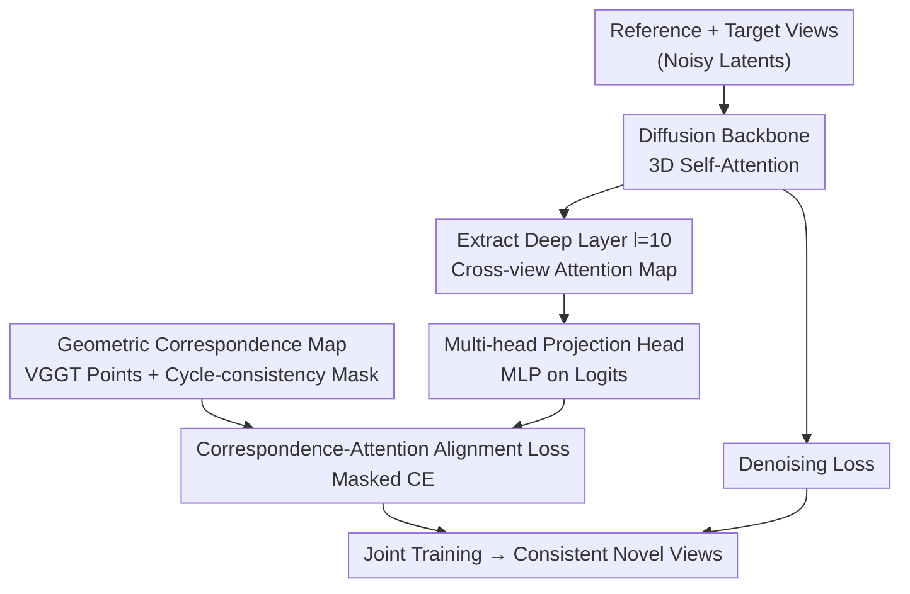

# Correspondence-Attention Alignment for Multi-View Diffusion Models

**Conference**: CVPR 2026  
**Paper**: [CVF Open Access](https://openaccess.thecvf.com/content/CVPR2026/html/Kwon_Correspondence-Attention_Alignment_for_Multi-View_Diffusion_Models_CVPR_2026_paper.html)  
**Code**: https://cvlab-kaist.github.io/CAMEO/ (Project Page)  
**Area**: Diffusion Models / Novel View Synthesis  
**Keywords**: Multi-view Diffusion, Novel View Synthesis, 3D Self-attention, Geometric Correspondence, Attention Supervision

## TL;DR
The authors reveal that 3D self-attention in multi-view diffusion models spontaneously learns "cross-view geometric correspondence" in deep layers, but this signal degrades under large viewpoint changes. Based on this, they propose CAMEO—a method that directly supervises a **single deep attention layer** with geometric correspondence maps. This approach doubles convergence speed, improves novel view synthesis quality, and is universal across different multi-view diffusion models.

## Background & Motivation
**Background**: Novel View Synthesis (NVS) is shifting from per-scene optimization (NeRF / 3DGS) to generative pipelines. Multi-view diffusion models (CAT3D, MVGenMaster, etc.) incorporate a **3D self-attention** layer on top of 2D diffusion priors—concatenating tokens from $N$ reference views and $M$ target views into a long sequence. This allows each query token to attend to all spatial positions across all views, thereby generating cross-view consistent images.

**Limitations of Prior Work**: This consistency often fails under large rotations or in scenes with complex geometry, leading to cross-view misalignments and structural distortions (e.g., CAT3D misaligning roofs or bricks in Figure 1). More importantly, the specific mechanism by which 3D self-attention maintains view consistency **remains unclear**, making targeted improvements difficult.

**Key Challenge**: The standard denoising score matching objective only implicitly encourages consistency; it does not directly inform the model which pixel in another view corresponds to a specific query point. Consequently, the model must slowly "discover" geometric correspondence through massive iterations, often incompletely—the authors' measurements show that while accuracy approaches VGGT levels for small angles, it drops significantly for large angles.

**Key Insight**: The authors perform a diagnostic analysis (representing half the value of this paper)—quantifying the geometric correspondence within attention maps. Three findings emerge: ① Geometric correspondence is **concentrated in deep layers** (e.g., $l=10$ in U-Net, $l=32$ in DiT) and is almost absent in shallow layers; ② Correspondence accuracy increases monotonically during training and correlates strongly with PSNR; ③ The signal is incomplete, showing a clear gap compared to VGGT, especially at large viewpoints.

**Core Idea**: Since "cross-view correspondence" is already the internal key for consistency but learned slowly and roughly, CAMEO uses **ground-truth correspondence maps from an off-the-shelf geometric model (VGGT) to directly supervise that single deep attention layer**. This turns implicit learning into explicit alignment—requiring only one layer and leaving the rest of the architecture untouched.

## Method

### Overall Architecture
CAMEO adds a **supervision branch** on top of regular multi-view diffusion training while keeping the main network architecture unchanged. During the forward pass, $N$ reference views and $M$ target views (total $F=N+M$) are input into the diffusion backbone's 3D self-attention blocks. At the deep layer identified as having the "strongest correspondence" (e.g., $l=10$ for CAT3D), the cross-view attention map $A^l_{i,j}\in\mathbb{R}^{hw\times hw}$ between a pair of views $(i,j)$ is extracted. Interdependently, a **geometric correspondence map** $P_{i,j}$ (row-wise one-hot, marking the GT corresponding token in the other view) is computed offline using a geometric model (VGGT points + DUSt3R nearest neighbor matching). CAMEO aligns the former with the latter—passing attention through an MLP projection head and applying a masked cross-entropy loss alongside the standard denoising loss. This modification targets only one attention layer, making it "model-agnostic": it can be applied to MVGenMaster (U-Net, $l=10$) or Hunyuan-DiT ($l=32$).

### Key Designs

**1. Deep Attention as Geometric Correspondence: Quantifying Consistency**

This is the foundation of the paper. The authors define cross-view attention as the normalized $A^l_{i,j}=\mathrm{softmax}\!\big(Q^l_i (K^l_j)^\top/\sqrt{d}\big)$. For each query token $x_i$, the key position with the maximum weight is treated as the "predicted correspondence." They then calculate Precision@2cm using ground-truth from the NAVI dataset. The evidence is robust: CAT3D's correspondence accuracy at $l=10$ approaches DINOv3-L and even matches VGGT for small viewpoints (0–30°). Conversely, shallow layers and initial SD2.1 weights show negligible correspondence. Using a PAG-style perturbation where a 3D self-attention layer is forced to identity (blocking cross-view attention), they show that perturbing shallow layers barely affects quality, while perturbing deep layers causes the scene to collapse into geometrically implausible distortions. This confirms that deep attention carries consistency.

**2. Correspondence Map Construction: Token-level One-hot Ground Truths**

To supervise attention, one needs ground truth for where tokens "should" attend. The authors use VGGT to obtain point maps and find pixel-level correspondences in 3D space via nearest neighbors (similar to DUSt3R), then downsample/interpolate to the token resolution $h\times w$. For each query token $x_i$, a one-hot vector $P_{i,j}(x_i)\in\mathbb{R}^{hw}$ is constructed (1 at the corresponding token $x_j$, 0 elsewhere), forming the map $P_{i,j}\in\mathbb{R}^{hw\times hw}$. Crucially, a **visibility mask** is introduced to handle occlusions—since not every point is visible in another view, hard supervision on occluded points would introduce noise. They use cycle-consistency: $x_i \to x_j \to \hat x_i$. The mask $M_{i,j}(x_i)=1$ only if the round-trip error $\|p(x_i)-p(\hat x_i)\|_2 \le \varepsilon$ (where $p(\cdot)$ maps indices to 2D coordinates and $\varepsilon=1.5$). Ablations show that removing this filter (setting $\varepsilon=\infty$) degrades performance.

**3. Single-layer Alignment Loss: Masked Cross-Entropy for Distribution Alignment**

Given $A^l_{i,j}$ and $P_{i,j}$, the alignment loss pulls each row of the attention map (a probability distribution) toward the one-hot ground truth. This is treated as a $hw$-way classification problem using cross-entropy (CE) rather than L1 (CE performed significantly better in ablations). The loss is defined as:

$$L_{\text{CAMEO}} = \mathbb{E}_{(i,j),\,x_i}\Big[\, M_{i,j}(x_i)\cdot \mathrm{CE}\big(A^{l}_{i,j}(x_i),\,P_{i,j}(x_i)\big)\Big]$$

This is averaged over all visible query tokens and view pairs. The final objective is $L_{\text{total}} = L_{\text{denoise}} + \lambda L_{\text{CAMEO}}$ with $\lambda=0.02$. Remarkably, supervising only one layer ($l=10$) is sufficient to achieve faster convergence, better image quality, and more robust correspondence.

**4. Multi-head Projection Head: Preserving Expressivity**

Adding the alignment loss directly to the original attention logits can have side effects. Multi-view diffusion uses multi-head attention; different heads are meant to capture different patterns. Forcing **all heads** to align to a single geometric correspondence map would sacrifice architectural flexibility. The solution is a lightweight MLP projection head applied to attention logits before the softmax. The CAMEO loss is calculated on this projected version, allowing the supervision to act on a "learnable correspondence view" without over-constraining the original multi-head distribution. Ablations confirm that including the MLP head is superior to excluding it across PSNR/SSIM/LPIPS.

### Loss & Training
Total loss: $L_{\text{total}}=L_{\text{denoise}}+\lambda L_{\text{CAMEO}}$ with $\lambda=0.02$ and $\varepsilon=1.5$. Supervision is applied to $l=10$ for CAT3D/MVGenMaster and $l=32$ for Hunyuan-DiT. Training utilizes AdamW, a fixed learning rate of 2.5e-5, weight decay of 0.01, and batch size of 6. A 10% probability is used for dropping camera conditions (CFG training). Inference uses 50-step DDIM with a CFG weight of 2.0. Experiments ran on 2×A100 (40GB) at 512×512 resolution. Each sample has $F=4$ views, with 1–3 randomly chosen as target views.

## Key Experimental Results

### Main Results
The baseline is CAT3D (reproduced via MVGenMaster, SD2.1 initialization), compared against REPA (feature alignment to DINOv2) and Geometry Forcing (alignment to VGGT features). Results for RealEstate10K (scene-level) and DTU (OOD, object-level):

| Dataset | Iter | Metric | CAT3D | +REPA | +Geo.F. | +CAMEO (Ours) |
|---|---|---|---|---|---|---|
| RealEstate10K | 80k | PSNR↑ | 18.99 | 18.70 | 18.92 | **19.40** |
| RealEstate10K | 320k | PSNR↑ | 19.88 | 19.76 | – | **20.16** |
| RealEstate10K | 320k | LPIPS↓ | 0.287 | 0.286 | – | **0.279** |
| DTU (OOD) | 80k | PSNR↑ | 10.29 | 10.31 | 10.43 | **11.45** |
| DTU (OOD) | 320k | PSNR↑ | 12.23 | 11.71 | – | **12.16** |

**Key conclusion**: CAMEO reaches a PSNR > 19.4 at 80k iterations, while the baseline requires over 160k iterations to catch up—representing a **roughly 2× training speedup**. Even after convergence (320k), CAMEO remains superior. Attention-level alignment (CAMEO) consistently outperforms feature-level alignment (REPA/Geo.F.), supporting the claim that consistency is rooted in attention maps.

### Ablation Study

| Configuration | 80k PSNR↑ | Description |
|---|---|---|
| Supervise $l=10$ | **19.08** | Strongest correspondence layer, best |
| Supervise $l=2$ | 18.80 | Sub-optimal, shallow layer |
| Supervise $l=6$ | 18.19 | Worst among layers |
| w/o MLP head | 18.08 (40k) | Performance drop without projection |
| w/ MLP head | 18.31 (40k) | Full CAMEO |
| Loss = L1 | 17.84 (40k) | L1 significantly worse than CE |
| Loss = CE | 18.31 (40k) | Full CAMEO |
| Threshold $\varepsilon=\infty$ | 18.18 (40k) | Drop without visibility filtering |
| Threshold $\varepsilon=1.5$ | 18.31 (40k) | Full CAMEO |

### Key Findings
- **Layer selection is critical**: $l=10$ (strongest correspondence layer) is significantly better than intermediate layers, aligning with the diagnostic analysis. For Hunyuan-DiT, $l=32$ was best.
- **Three components are essential**: The MLP head, CE loss, and the $\varepsilon=1.5$ threshold all contribute positively.
- **Model-agnosticism verified**: Significant gains were observed on MVGenMaster (SOTA with geometric conditions) and Hunyuan-DiT (DiT-based). For Hunyuan-DiT at 20k iterations, PSNR improved from 14.40 to **16.17**, showing massive early-stage gains.
- **OOD Generalization**: Models trained on scenes generalized well to objects (DTU), suggesting the model learns general geometric understanding rather than overfitting the training distribution.

## Highlights & Insights
- **"Explain First, Improve Second" Paradigm**: Instead of arbitrarily adding a loss, the authors used Precision@2cm and attention perturbations (identity replacement) to prove that "deep attention = geometric correspondence carrier" before applying precise supervision.
- **The Elegance of Single-layer Supervision**: Modifying just one layer with one CE term achieves 2× speedup and higher quality with zero architectural changes.
- **Cycle-consistency Masking**: This technique for visibility can be transferred to any scenario involving geometric/flow ground truth supervision of attention or features—it’s a clean filter for occlusions.
- **Decoupling via Projection**: It highlights a common pitfall: when supervising multi-head attention with strong structural priors, do not constrain every head; using a learnable projection preserves representational capacity.

## Limitations & Future Work
- **Dependency on External Geometric Models**: The quality is capped by the VGGT point maps. In scenes where VGGT fails (extreme lighting, mirrors, textureless surfaces), the supervision signal becomes noisy. ⚠️ The paper does not report degradation levels in these cases.
- **Manual Layer Selection**: It requires a diagnostic step for every new architecture to find the "strongest layer," which adds analysis overhead.
- **Offline Computation Cost**: Pre-calculating VGGT + DUSt3R matches for the training set is required. ⚠️ Quantified costs are presumably in the appendix.
- **Future Directions**: Exploring multi-layer joint supervision, adaptive layer selection, or replacing offline VGGT with lighter online estimators.

## Related Work & Insights
- **vs REPA / Geometry Forcing (Feature Alignment)**: These distill single-view features to semantic (DINOv2) or geometric (VGGT) features. They constrain individual views, not cross-view consistency. CAMEO supervises the **cross-view attention map**, the direct carrier of consistency.
- **vs CAT3D / MVGenMaster (Base Models)**: These rely on implicit consistency learned through massive iterations. CAMEO does not change their structure but transforms "implicit slow learning" into "explicit fast learning."
- **vs NVComposer / Track4Gen (Feature Supervision via Points/Tracking)**: Shares similar goals but different targets—CAMEO focuses on attention rather than features and uses specific engineering (visibility masks, MLP heads) to ensure effective supervision.

## Rating
- Novelty: ⭐⭐⭐⭐⭐ Unique diagnostic and single-layer supervision approach.
- Experimental Thoroughness: ⭐⭐⭐⭐⭐ Tested on 3 architectures across multiple datasets and iterations.
- Writing Quality: ⭐⭐⭐⭐⭐ Seamless flow from analysis to methodology; clear visualizations.
- Value: ⭐⭐⭐⭐ Highly practical for training multi-view diffusion with minimal intrusion and 2× convergence.

<!-- RELATED:START -->

## Related Papers

- [\[CVPR 2026\] InstructMix2Mix: Consistent Sparse-View Editing Through Multi-View Model Personalization](instructmix2mix_consistent_sparse-view_editing_through_multi-view_model_personal.md)
- [\[CVPR 2026\] MultiCrafter: High-Fidelity Multi-Subject Generation via Disentangled Attention and Identity-Aware Preference Alignment](multicrafter_high-fidelity_multi-subject_generation_via_disentangled_attention_a.md)
- [\[ICLR 2026\] MOSAIC: Multi-Subject Personalized Generation via Correspondence-Aware Alignment and Disentanglement](../../ICLR2026/image_generation/mosaic_multi-subject_personalized_generation_via_correspondence-aware_alignment_.md)
- [\[CVPR 2026\] Coupled Diffusion Sampling for Training-Free Multi-View Image Editing](coupled_diffusion_sampling_for_training-free_multi-view_image_editing.md)
- [\[CVPR 2026\] LaRP: Efficient Multi-View Inpainting with Latent Reprojection Priors](larp_efficient_multi-view_inpainting_with_latent_reprojection_priors.md)

<!-- RELATED:END -->
