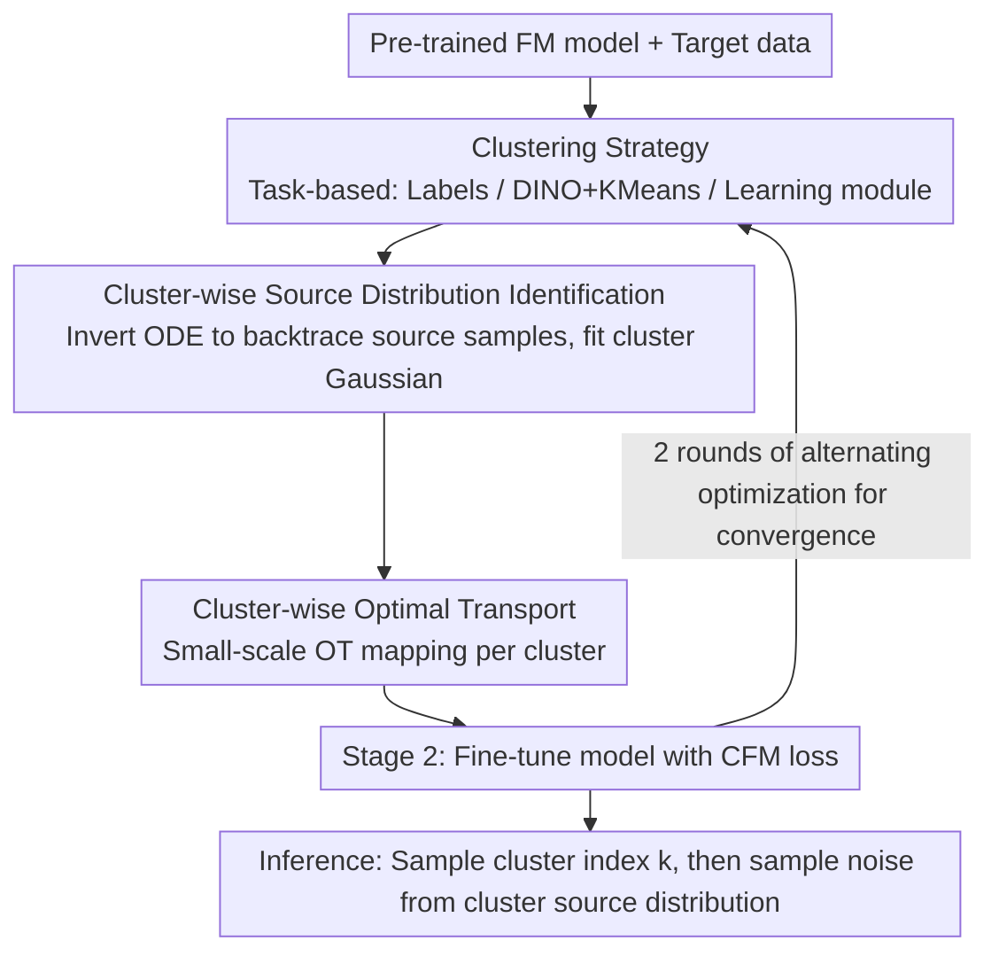

# COT-FM: Cluster-wise Optimal Transport Flow Matching

**Conference**: CVPR 2026  
**arXiv**: [2603.13395](https://arxiv.org/abs/2603.13395)  
**Code**: [Project Page](https://embodiedai-ntu.github.io/cotfm)  
**Area**: Generative Models / Flow Matching  
**Keywords**: Flow Matching, Optimal Transport, Clustering, Vector Field Straightening, Accelerated Sampling

## TL;DR

Ours proposes COT-FM, a plug-and-play enhancement framework for Flow Matching. By clustering target samples, inverting the pre-trained model to obtain cluster-wise source distributions, and approximating optimal transport within each cluster, it significantly straightens the transport paths. This simultaneously accelerates sampling and improves generation quality without modifying the model architecture.

## Background & Motivation

Flow Matching (FM) generates samples by learning a velocity field that maps a simple source distribution to a complex data distribution. Inference is performed by integrating the ODE along the velocity field. The core problem lies in **path curvature**:

- **Random Coupling**: Although each pair $(x_0, x_1)$ generates a straight path, the velocity directions of different pairs at the same point often conflict. The aggregated marginal velocity field becomes curved.
- **Batch Optimal Transport (Batch OT)**: This only approximates OT within small batches, and its precision is limited by locality.
- **Consequences of Curved Paths**: Increased time discretization errors result in reduced sampling quality for low-step regimes. Shortcut methods (e.g., MeanFlow) reduce the number of steps but do not straighten the paths.

Calculating global OT has a cubic complexity relative to the number of samples, making it unsuitable for large-scale data.

## Method

### Overall Architecture

COT-FM aims to resolve the path curvature issue in Flow Matching: random coupling causes marginal velocity fields to conflict and curve, leading to poor generation in low-step sampling. Based on a pre-trained FM model, it alternates between two stages. It first clusters target samples, inverts the ODE to estimate the source distribution for each cluster, and calculates optimal transport mappings within clusters (Stage 1). Then, it fine-tunes the model using the constructed cluster-wise vector fields (Stage 2). Convergence is typically reached after 2 alternating rounds. During inference, it adds only one step: first sample the cluster index $k$, then sample the initial noise from the corresponding source distribution $p_{0,k}$.

### Key Designs

**1. Clustering Strategy: Segmenting target data to establish a foundation for divide-and-conquer OT**

The complexity of global OT is cubic relative to the sample size, making it computationally infeasible. The first step involves partitioning target data into several clusters, upon which all subsequent stages are built. Clustering methods are chosen flexibly according to the scenario: class labels are used for conditional generation; DINO features + K-Means (K=100) are used for unconditional generation (CIFAR-10); and a module is learned to predict the source distribution for new observations in robotics policy tasks. Effective clustering ensures that samples within the same cluster have similar trajectories with fewer path intersections, making subsequent source distribution estimation and intra-cluster OT meaningful.

**2. Cluster-wise Source Distribution Identification: Bootstrapping source distributions using model reversibility**

After clustering, a source distribution must be assigned to each cluster. Utilizing the reversibility of the pre-trained FM model, the source sample is backtraced for each data sample $x_1$ in cluster $\mathcal{C}_k$ via $\hat{x}_0 := x_1 - \int_0^1 v_\theta(\hat{x}_t, t) \, dt$. This batch of backtraced samples $\hat{X}_{0,k}$ is then approximated as a Gaussian $p_{0,k}(x) = \mathcal{N}(x; \boldsymbol{\mu}_{0,k}, \boldsymbol{\Sigma}_{0,k})$. Since the paths of the pre-trained model do not naturally cross, the backtraced source distributions remain separated between clusters without requiring additional annotations.

**3. Intra-cluster Optimal Transport Approximation: Breaking down unsolvable global OT into K small OTs**

With cluster-wise source distributions, global OT can be decomposed into $K$ small-scale OTs. For each cluster $\mathcal{C}_k$, source samples $X_{0,k} \sim p_{0,k}$ are sampled and the intra-cluster OT mapping $\pi_k = \text{OT}(X_{0,k}, \mathcal{C}_k)$ is computed. This reduces the number of samples per OT problem, improving the accuracy of Batch OT approximations and restricting the source distribution space for more efficient velocity field learning.

**4. Alternating Optimization Strategy: Interleaving vector field construction and model fine-tuning**

After Stage 1 constructs the cluster-wise vector fields, Stage 2 fine-tunes the model using the standard CFM loss: $\mathcal{L}_{\text{CFM}}(\theta) = \mathbb{E}_{t, (x_0, x_1) \sim B} \|v_\theta(x_t, t) - (x_1 - x_0)\|_2^2$. Training batches are sampled according to cluster size proportions $P(k) = \frac{|\mathcal{C}_k|}{\sum_j |\mathcal{C}_j|}$. Empirically, convergence is reached after 2 alternating rounds; a 3rd round leads to minor degradation due to overfitting.

### Loss & Training

- Standard CFM loss (linear interpolation path $x_t = (1-t)x_0 + tx_1$).
- Does not modify model architecture or input/output mechanisms, only changes the source-target coupling strategy during training.
- The only change during inference: sampling initial noise from a cluster-wise source distribution instead of a global Gaussian.

## Key Experimental Results

### Main Results

| Dataset | Metric | COT-FM | Prev. SOTA | Gain |
|--------|------|--------|-----------|------|
| 2D Mix-5-Gaussian | Wasserstein ↓ | **0.1995** | 0.5421 (RF) | -63.2% |
| 2D Mix-5-Gaussian | Curvature ↓ | **0.0084** | 0.0104 (OT-CFM) | -19.2% |
| CIFAR-10 (1-step) | FID ↓ | **205.0** | 378.0 (RF) | -45.8% |
| CIFAR-10 (10-step) | FID ↓ | **8.23** | 12.6 (RF) | -34.7% |
| CIFAR-10 (50-step) | FID ↓ | **3.97** | 4.45 (RF) | -10.8% |
| CIFAR-10 (MeanFlow 1-step) | FID ↓ | **2.60** | 2.92 (MeanFlow) | -11.0% |
| ImageNet 256 (SiT-B/2, 10-step) | FID ↓ | **7.52** | 8.25 (RF) | -8.8% |
| LIBERO-Long (1 NFE) | Success Rate ↑ | **94.5%** | 91.5% (2-RF) | +3.0% |

### Ablation Study

| Configuration | FID (50-step) ↓ | Description |
|------|-----------------|------|
| Rectified Flow (0 iter.) | 4.45 | Baseline |
| COT-FM (1 iter.) | 4.23 | 1 alternating round, -0.22 |
| COT-FM (2 iter.) | **3.97** | 2 rounds optimal, -0.48 |
| COT-FM (3 iter.) | 4.17 | Slight degradation, overfitting |
| Uniform Cluster Sampling | 4.26 | Inferior to proportional sampling |
| Proportional Cluster Sampling | **3.97** | Proportional to cluster size is optimal |

### Key Findings

- Introducing cluster-wise random coupling alone (without OT) reduces 1-step FID from 378 to 296, indicating that clustering itself significantly reduces path intersections.
- COT-FM reduces 1-step FID on CIFAR-10 from 378 to 205 (-45.8%), showing particularly significant gains in low-step scenarios.
- In LIBERO robot manipulation tasks, COT-FM achieves 96.1% (Spatial) and 94.5% (Long) with 1 NFE, surpassing FLOWER results with 4 NFEs (97.1% and 93.5%).
- Generalization validation: The FID gap between the training set and test set remains consistent (3.97/8.19 vs. 4.45/8.55), showing no overfitting.
- Learned paths in MeanFlow remain curved, verifying that shortcut methods do not straighten the underlying velocity field.

## Highlights & Insights

- **Divide-and-Conquer OT is the core insight**: Decomposing unsolvable global OT into $K$ solvable cluster-wise OTs balances theoretical rigor with computational feasibility.
- Utilizing the reversibility of the pre-trained FM model to estimate cluster-wise source distributions is an elegant bootstrapping strategy—it requires no extra labels and naturally inherits the structure already learned by the model.
- It strictly maintains the model architecture and inference workflow (changing only the initial sampling), making it a truly plug-and-play universal enhancement.
- Cross-domain validation (2D point clouds, image generation, robot manipulation) demonstrates the strong versatility of the method.

## Limitations & Future Work

1. Constructing cluster-wise vector fields requires inverting the ODE for the entire training set, which increases computational overhead as data scales.
2. Gaussian approximation may not be suitable for source distributions with complex shapes, especially in high-dimensional spaces.
3. Clustering quality has a direct impact on performance—K-Means might not be the optimal choice for high-dimensional features.
4. Validated only on CIFAR-10 and ImageNet 256; not yet extended to higher resolutions or text-to-image generation.
5. The reasons for convergence at 2 alternating rounds and degradation at the 3rd round have not been analyzed in depth.

## Related Work & Insights

- Compared to k-Rectified Flow (which iteratively optimizes coupling using self-generated samples), COT-FM avoids the risk of model collapse.
- Compared to OT-CFM (batch-level OT), COT-FM restricts batch OT to smaller ranges via clustering, significantly improving approximation accuracy.
- Compared to MeanFlow (which learns the mean velocity field), COT-FM fundamentally straightens the velocity field instead of just skipping steps.
- Insight: The critical space for improving Flow Matching lies in coupling strategies rather than model architectures; structural utilization at the data level (clustering) is an overlooked dimension.

## Rating

- **Novelty**: ⭐⭐⭐⭐ The combination of cluster-wise OT and pre-trained model ODE inversion to estimate source distributions is novel and elegant.
- **Experimental Thoroughness**: ⭐⭐⭐⭐⭐ Validation across three domains (2D, image, robotics), multiple baseline comparisons, and rich ablations (alternating rounds, generalization, sampling strategy).
- **Writing Quality**: ⭐⭐⭐⭐ Rigorous motivational derivation, clear algorithm pseudocode, and intuitive illustrations.
- **Value**: ⭐⭐⭐⭐⭐ Highly practical as a universal plug-and-play solution that does not change architecture or inference workflows; significant improvement in low-step scenarios.

<!-- RELATED:START -->

## Related Papers

- [\[ICCV 2025\] Contrastive Flow Matching (ΔFM)](../../ICCV2025/image_generation/contrastive_flow_matching.md)
- [\[NeurIPS 2025\] On the Relation between Rectified Flows and Optimal Transport](../../NeurIPS2025/image_generation/on_the_relation_between_rectified_flows_and_optimal_transport.md)
- [\[ICML 2026\] Pareto-Guided Optimal Transport for Multi-Reward Alignment](../../ICML2026/image_generation/pareto-guided_optimal_transport_for_multi-reward_alignment.md)
- [\[CVPR 2026\] BiFM: Bidirectional Flow Matching for Few-Step Image Editing and Generation](bifm_bidirectional_flow_matching_for_few-step_image_editing_and_generation.md)
- [\[CVPR 2026\] ChordEdit: One-Step Low-Energy Transport for Image Editing](chordedit_one-step_low-energy_transport_for_image_editing.md)

<!-- RELATED:END -->
