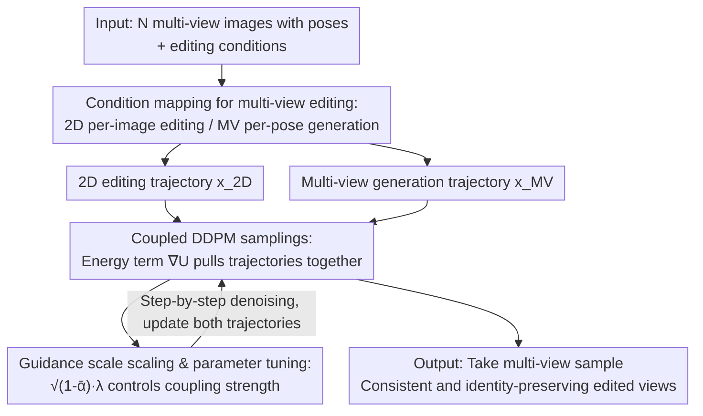

# Coupled Diffusion Sampling for Training-Free Multi-View Image Editing

**Conference**: CVPR 2026  
**Paper**: [CVF Open Access](https://openaccess.thecvf.com/content/CVPR2026/html/Alzayer_Coupled_Diffusion_Sampling_for_Training-Free_Multi-View_Image_Editing_CVPR_2026_paper.html)  
**Code**: [Project Page coupled-diffusion.github.io](https://coupled-diffusion.github.io)  
**Area**: Diffusion Models / Image Generation & Editing  
**Keywords**: Multi-View Editing, Training-Free, Diffusion Sampling, Coupled Guidance, 3D Consistency

## TL;DR
To address the issues where editing 2D images individually leads to cross-view inconsistencies, while explicit 3D representation methods (such as NeRF/3DGS) are slow and blurry, this paper proposes **coupled diffusion sampling**: a pre-trained 2D editing model and a multi-view generation model run parallel sampling trajectories during the denoising process, coupled by an energy term that pulls the two trajectories closer. Consequently, **without training any new models**, the method yields results that satisfy both the editing objectives and multi-view consistency. It significantly outperforms baselines in user preference rates (80%/47%/46%) across three tasks: spatial editing, stylization, and relighting.

## Background & Motivation

**Background**: Diffusion-based 2D image editing (relighting, spatial structure editing, stylization) has achieved highly realistic results via end-to-end training with paired data. When attempting to extend this editing capability to a set of multi-view photographs of the same scene, a natural approach is to edit images individually using a 2D model, or to supervise an explicit 3D representation (NeRF or 3D Gaussian Splatting) using 2D models.

**Limitations of Prior Work**: Per-image independent editing results in inconsistent changes across views (e.g., the color and shadow of the same car vary visually across views). Conversely, methods relying on explicit 3D representations to "average out" inconsistencies require time-consuming scene-specific optimization, demand dense input views, are unstable under sparse views, and generate blurry results or Janus (multi-headed) artifacts. Another line of work that directly trains a multi-view diffusion model for each editing task is computationally expensive and suffers from the extreme scarcity of multi-view or 4D training data.

**Key Challenge**: The fundamental issue is that **2D diffusion models naturally lack 3D consistency awareness**, whereas traditional means of achieving 3D consistency (explicit reconstruction) discard benefits such as being training-free, feedforward, and applicable to sparse views. Meanwhile, simply feeding a single edited image into a multi-view generation model to synthesize the remaining views is highly under-constrained; it permits infinitely many solutions and often loses the identity information of the input.

**Goal**: To elevate the editing capabilities of off-the-shelf 2D editing models to multi-view consistency **without training any new models or performing explicit 3D optimization**.

**Key Insight**: The authors' key observation is that **any image sequence generated by a pre-trained multi-view diffusion model inherently possesses multi-view consistency**. Therefore, rather than using 2D data/models to supervise the training of a 3D representation, it is better to treat the multi-view diffusion model as an "implicit 3D regularizer", directly leveraging its score during the sampling stage to constrain the 2D editing results.

**Core Idea**: To allow the 2D editing model and the multi-view generation model to **run parallel diffusion trajectories during sampling and guide each other**—the multi-view model infuses "multi-view consistency" into the 2D editing, while the 2D model infuses "edited content/input identity" into the multi-view generation, ultimately taking the sample from the multi-view trajectory as the output.

## Method

### Overall Architecture
The proposed method aims to solve the following problem: given a set of multi-view images with poses $\{I_k, P_k\}_{k=1}^N$ and an editing condition (e.g., an environment map for relighting, a text prompt for stylization, or a coarse transformation for spatial editing), it outputs a set of **multi-view consistent** edited results. The overall conceptual approach consists of "two trajectories + one coupling term": one trajectory is driven by a 2D editing model $\epsilon_{\theta,\text{2D}}$ and is responsible for correct editing; the other is driven by a multi-view generation model $\epsilon_{\theta,\text{MV}}$ and ensures multi-view consistency. At each denoising timestep, a coupling energy term $\nabla U$ pulls the two trajectories closer, forcing them to align while retaining their respective prior distributions. Ultimately, the sample from the multi-view trajectory is taken as the final output (as it resides in the multi-view distribution, ensuring natural consistency).

The concrete workflow is as follows: first, a single reference image $I_{1,\text{edited}}$ is edited using the 2D model. This image is then fed into the multi-view model along with the remaining view poses $\{P_k\}_{k=2}^N$ for novel view synthesis. To ensure the results remain faithful to the other original input views (rather than only the single reference image), the two models are coupled during joint sampling. The coupling occurs in the latent space; in the experiments of this section, both the 2D and multi-view models operate in the latent space of Stable Diffusion 2.1.

### Key Designs

**1. Condition mapping for multi-view editing: Aligning 2D editing and multi-view generation onto the same set of poses**

To make "coupling" meaningful for multi-view editing, the two models must first be projected onto the same coordinate system. For the 2D editing model, the authors condition it **independently and per-image** on each input image $I_k$ (allocating it solely to edit that specific image). For the multi-view model, it is conditioned on one edited reference image $I_{1,\text{edited}}$ and the remaining view poses $\{P_k\}_{k=2}^N$ to perform novel view synthesis. The coupling is then conducted per-view between the "2D latent variable conditioned on $I_k$" and the "multi-view latent variable corresponding to pose $P_k$". This design offers distinct advantages: the 2D side adheres to each real input view (preserving identity/content), while the multi-view side conforms to the camera poses (ensuring geometric consistency), and the coupling aligns these two constraints for every single view. If one only feeds a single edited image to the multi-view model, the problem becomes under-constrained and identity is lost; per-view coupling is precisely the key to addressing this constraint.

**2. Coupled DDPM sampling: Driving mutual guidance between two diffusion trajectories via an energy term**

This is the core contribution. Given two diffusion models $\epsilon_{\theta_A}$ and $\epsilon_{\theta_B}$ sharing the same data domain and the same DDPM noise schedule, the goal is to sample two instances $x^A$ and $x^B$ that respectively belong to the pre-trained distributions $p^A_\text{data}$ and $p^B_\text{data}$ while remaining close to each other. The authors introduce a coupling function to measure the proximity of the two samples, defined in Euclidean distance as $U(x,x')=-\frac{\lambda}{2}\lVert x-x'\rVert_2^2$, formulating the objective as

$$\max_{x^A,x^B}\ \mathcal{J}^A(x^A,x^B)+\mathcal{J}^B(x^A,x^B),\quad \mathcal{J}^A(x;x'):=p^A_\text{data}(x)\,\exp U(x,\text{sg}(x')),$$

where $\text{sg}$ denotes the stop-gradient operator. Taking its gradient yields $\nabla_x \mathcal{J}^i = \nabla_x \log p^i(x) + \nabla_x U(x,x')$—where the first term represents the standard diffusion score, and **the second term $\nabla_x U(x,x')=-\lambda(x-x')$ biases the trajectories from "independent denoising" towards "mutual attraction"**. In the practical sampling algorithm (Algorithm 1): at each timestep, the clean estimates $\hat{x}_{0,\text{MV}}$ and $\hat{x}_{0,\text{2D}}$ are first calculated to perform one DDPM step, producing $\hat{x}_{t-1}$; then, a coupled guidance step is added:

$$x_{t-1}^A = \hat{x}_{t-1}^A + \sqrt{1-\bar\alpha_{t-1}}\,\nabla_{\hat{x}_0^A}U(\hat{x}_0^A,\hat{x}_0^B),$$

which is symmetric for $B$. When $\hat{x}_0^B$ is fixed, $\exp U(\hat{x}_0^A,\hat{x}_0^B)\propto \mathcal{N}(\hat{x}_0^B, \tfrac{1}{\sqrt{\lambda}}I)$. This treats the clean estimate of the other trajectory as a Gaussian prior, assigning high energy when $\hat{x}_0^A$ is excessively far from $\hat{x}_0^B$—essentially functioning as a **soft regularization** that encourages proximity without forcing equality. Its fundamental difference from composition sampling like "score averaging / product-of-experts" is that the latter requires samples to fall within the **intersection** of the supports of both models; if no common support exists, it fails and pushes samples off their respective manifolds (causing flickering). In contrast, coupled sampling ensures each sample **always remains within the prior distribution of its own model**, merely being "nudged" by the counterpart to satisfy the cross-model constraint.

**3. $\sqrt{1-\bar\alpha}$ scaling of guidance strength and the $\lambda$ parameter tuning interval**

The key to successful coupling lies in regulating its intensity. The coefficient $\lambda$ directly dictates the coupling strength: $\lambda=0$ degenerates into standard DDPM (two trajectories running independently), while increasing $\lambda$ strengthens the coupling. However, similar to other guidance-based methods, **excessively strong guidance can cause sampling collapse, leading to out-of-distribution (OOD) results**. To alleviate this, the authors scale the coupled guidance term by $\sqrt{1-\bar\alpha_{t-1}}$, restricting the KL divergence between the training and inference distributions at each timestep and adaptively decaying the injected guidance during the denoising process (details are in the appendix). Experiments (guidance strength analysis, corresponding to Figure 9 in the text) confirm the existence of a **sweet spot**: when $\lambda$ is too small, the output is close to image-to-MV, leading to low reconstruction quality; increasing $\lambda$ improves reconstruction, but an excessively large $\lambda$ causes multi-view consistency to plunge and eventually collapse. A proper interval exists that optimizes both reconstruction and consistency, demonstrating the value of coupled sampling.

### A Full Example
Taking multi-view spatial editing as a concrete walkthrough: the input comprises several photos of the same car with poses, and the editing condition is to "translate and rotate the car by an angle." ① First, for each image, depth maps are used to unproject the target object into 3D space, apply the 3D transform, and then project it back to images, obtaining coarse per-image edits that serve as conditions for the 2D model (Magic Fixup). ② One edited image is taken as a reference and fed along with the remaining poses to the multi-view model for novel view synthesis. ③ The process enters the coupled DDPM sampling loop: at each step, both trajectories are denoised by one step and then pulled together using $\nabla U$—the 2D trajectory passes "correct translation and rotation of the car with reasonable shadows/reflections" to the multi-view trajectory, while the multi-view trajectory passes "geometric consistency across views and stable back-views" back to the 2D trajectory. ④ After convergence, the multi-view sample is extracted as the output. The result shows that the car is accurately transformed, displaying smooth shadows across views and a stable back-view, avoiding the flickering or identity loss seen in the baselines.

## Key Experimental Results

Three tasks are implemented by coupling three off-the-shelf 2D models with the same multi-view model [63]: Magic Fixup for spatial editing, ControlNet (canny-edge-controlled) for stylization, and Neural-Gaffer (with input environment maps) for relighting. Standard baselines include Liu et al. [31], Du et al. [13] (general diffusion composition methods), per-image 2D editing, and "single-image edit + image-to-MV". Consistency is measured using MEt3r, alongside a user study on Prolific featuring 25 participants per task (best-of-n preference).

### Main Results (Spatial Editing, Evaluated Against GT 3D Transform Renderings)

| Method | PSNR ↑ | SSIM ↑ | LPIPS ↓ | MEt3r ↓ | User Preference ↑ |
|------|--------|--------|---------|---------|-----------|
| Per-image [2] | 16.5 | 0.550 | 0.253 | 0.353 | - |
| Image-to-MV [63] | 12.84 | 0.400 | 0.556 | 0.417 | - |
| Liu et al. [31] | 16.5 | 0.530 | 0.354 | 0.368 | 9% |
| Du et al. [13] | 16.7 | 0.548 | 0.411 | 0.344 | 1% |
| SDEdit [36] | 15.4 | 0.458 | 0.468 | 0.393 | 11% |
| **Coupled Sampling (Ours)** | **17.0** | **0.550** | 0.421 | **0.335** | **80%** |

Ours achieves the best scores across PSNR/SSIM and multi-view consistency MEt3r, with an 80% user preference rate that vastly outperforms all baselines. Note that although the per-image baseline has a lower LPIPS (0.253), it suffers from multi-view inconsistency (poor MEt3r of 0.353) and cannot yield usable multi-view outputs.

### Stylization (VBench Evaluated for Temporal/Subject Consistency, MEt3r for Geometric Consistency, CLIP for Editing Prompt)

| Method | CLIP ↑ | Temporal ↑ | Subject ↑ | MEt3r ↓ | User ↑ | Mesh-Free |
|------|--------|-----------|-----------|---------|--------|--------|
| Per-image [60] | 30.0 | 0.922 | 0.740 | 0.546 | - | ✓ |
| Image-to-MV [63] | 29.5 | 0.927 | 0.787 | 0.382 | - | ✓ |
| TEXTure [43] | 28.4 | 0.967 | 0.748 | 0.426 | 14% | ✗ |
| Hunyuan3D [47] | 29.9 | 0.952 | 0.754 | 0.391 | 8% | ✗ |
| Liu et al. [31] | 30.1 | 0.934 | 0.759 | 0.461 | 19% | ✓ |
| Du et al. [13] | 30.2 | 0.926 | 0.762 | 0.461 | 12% | ✓ |
| **Coupled Sampling (Ours)** | 29.68 | 0.946 | **0.807** | 0.392 | **47%** | ✓ |

Ours achieves the highest subject consistency (Subject: 0.807) and a geometric consistency MEt3r (0.392) that closely approaches image-to-MV, leading with a 47% user preference. Note that TEXTure and Hunyuan3D are **privileged baselines that utilize GT meshes** (with ✗ indicating mesh requirement); their temporal consistency is naturally high (due to mesh-based rendering), yet Ours achieves higher user preference without requiring access to meshes.

### Relighting (Evaluated Against GT Relighting, 7 Objects × 5 Lights = 35 sets)

| Method | PSNR ↑ | SSIM ↑ | LPIPS ↓ | MEt3r ↓ | User ↑ |
|------|--------|--------|---------|---------|--------|
| Per-image [20] | 22.7 | 0.862 | 0.159 | 0.243 | - |
| Image-to-MV [63] | 19.3 | 0.815 | 0.193 | 0.229 | - |
| Liu et al. [31] | 23.2 | 0.871 | 0.152 | 0.220 | 10% |
| Du et al. [13] | 22.1 | 0.863 | 0.158 | 0.217 | 19% |
| GT NeRF + Neural Gaffer [20] | 22.4 | 0.865 | 0.162 | 0.217 | 25% |
| **Coupled Sampling (Ours)** | **23.2** | **0.868** | **0.157** | **0.217** | **46%** |

Under relighting, the per-image baseline can be viewed as a rough upper bound due to its small distribution variance. With coupling, **Ours presents no degradation in reconstruction**, performs on par with the best in consistency, and gains a 46% user preference—surpassing the privileged GT NeRF baseline (25%).

### Key Findings
- **A sweet spot exists in coupling strength**: As $\lambda$ increases, reconstruction improves but consistency drops, and excessively large values cause collapse. There exists an optimal interval that simultaneously maximizes reconstruction quality and consistency (Figure 9), validating the "soft regularization, remaining within respective priors" design.
- **Generalization beyond multi-view**: Applying the method to Flux (a text-to-image flow-based model) for dual-prompt coupled sampling results in two spatially aligned images that still adhere faithfully to their respective prompts. When applied to the video model Wan2.1, it yields robust frame-by-frame alignment—demonstrating that the coupling mechanism is not limited to multi-view/DDPM but is equally effective for flow models and video generation.
- **Why score-averaging compositions (Liu/Du) underperform**: By averaging scores from two models, they push samples away from the multi-view manifold, causing inter-frame flickering. Coupled sampling keeps samples firmly within the multi-view distribution, yielding vastly superior consistency.

## Highlights & Insights
- **"Mutual guidance" rather than "score averaging"**: The most elegant aspect is treating the two models as double coupled trajectories pulled by a simple Gaussian soft regularization $\nabla U=-\lambda(x-x')$. This ensures that neither sample deviates from its own prior manifold while satisfying cross-model constraints—bypassing the hard constraint of product-of-experts requiring a common support, which otherwise fails.
- **Implicit 3D regularization**: Utilizing the observation that "sequences generated by multi-view diffusion models are inherently consistent", the multi-view model serves as an implicit 3D regularizer. This completely eliminates the need for scene-specific optimization and dense input views associated with NeRF/3DGS, producing results via feedforward sampling.
- **Extremely strong generalizability**: Without modifying a single line of training code, the same sampling framework applies directly to three distinct tasks (spatial editing, stylization, relighting), different backbones (SD2.1, Flux, Wan2.1), varied latent spaces, and even image $\leftrightarrow$ video paradigms. This "plug-and-play, sampling-level coupling" scheme easily translates to other generative tasks requiring cross-instance alignment (e.g., multi-view/multi-frame editing, style unification).
- **The ingenuity of $\sqrt{1-\bar\alpha}$ scaling**: Restricting the KL divergence between the training and inference distributions with a scale factor that decays along the denoising process is the practical key to preventing "over-guidance," serving as a valuable trick to reuse in other guided sampling schemes.

## Limitations & Future Work
- The authors explicitly state that the method **inherits the strengths and weaknesses of the underlying models**—coupling merely guides sampling; hence, the limitations of the 2D editing and multi-view models themselves (editing performance caps, generation artifacts) are preserved as-is.
- The guidance strength $\lambda$ is a hyperparameter that requires manual tuning, as excessive strength leads to OOD collapse. This lacks an adaptive selection mechanism, potentially requiring search for new sweet spots across different tasks/scenes.
- The evaluation scale is relatively small (10 edits for spatial editing, 35 comparison pairs for relighting), and certain metrics (such as MEt3r and reconstruction scores) are insensitive to subtle lighting flickers, meaning the conclusions rely heavily on user studies. ⚠️ Refer to the original paper for accuracy.
- **Future Work**: The authors envision extending this coupling paradigm to video editing—coupling an image editing model with a video diffusion model to unlock video editing capabilities without incurring additional training costs.

## Related Work & Insights
- **vs. Explicit 3D Methods (NeRF/3DGS + 2D supervision, e.g., Instruct-NeRF2NeRF [16])**: They rely on explicit reconstruction to "average out" inconsistencies, requiring scene-specific optimization and dense input views, and yielding instability and blurriness in sparse settings. In contrast, this paper uses implicit 3D (multi-view diffusion prior) as a regularizer, enabling pure feedforward sampling without optimization or training.
- **vs. Directly Training Multi-View Editing Models**: That approach requires dedicated training for each editing task, which is expensive and constrained by scarce data. This paper reuses an off-the-shelf multi-view generation model + an off-the-shelf 2D editing model, requiring zero additional training.
- **vs. Composition Sampling (product-of-experts [17,62] / MultiDiffusion [5] / SyncTweedies [23] / Liu et al.[31] / Du et al.[13])**: These methods mostly combine trajectories within the **same modality** and rely on score averaging or require samples to reside in the intersection of support sets, which pushes them off the manifold and induces flickering. This paper crosses the 2D $\leftrightarrow$ 3D modality and emphasizes "staying within respective prior distributions and only doing soft alignment", specifically designed to solve the practical challenge of scarce 3D data.
- **vs. Test-Time Guidance (classifier guidance [12], differentiable objectives [4,15], inverse problems [11,21,51])**: These typically guide towards a **fixed** target. In this paper, the guidance target is the **current sample of the other trajectory** (a dynamic target), which enables capturing complex edits that cannot be depicted by differentiable functions and achieves multi-view editing without paired data.

## Rating
- **Novelty**: ⭐⭐⭐⭐⭐ The sampling paradigm of "two trajectories soft-coupled via mutual guidance" is elegant and generalizable, bridging 2D $\leftrightarrow$ 3D cross-modally, and distinctly differing from score-averaging composition techniques.
- **Experimental Thoroughness**: ⭐⭐⭐⭐ Covers three tasks + multiple backbones + image/video generalization + parameter analysis comprehensively, though the sample size per task is relatively small, and certain metrics are insensitive to flickering, relying moderately on user studies.
- **Writing Quality**: ⭐⭐⭐⭐⭐ The thread of motivation-observation-methodology-formulations-algorithms flows exceptionally clearly, and the trajectory schematic in Figure 3 makes the core mechanism highly intuitive.
- **Value**: ⭐⭐⭐⭐⭐ Being training-free, plug-and-play, and transferable to broader generative tasks like video editing, it holds significant practical value.

<!-- RELATED:START -->

## Related Papers

- [\[CVPR 2026\] InstructMix2Mix: Consistent Sparse-View Editing Through Multi-View Model Personalization](instructmix2mix_consistent_sparse-view_editing_through_multi-view_model_personal.md)
- [\[CVPR 2026\] Dynamic-eDiTor: Training-Free Text-Driven 4D Scene Editing with Multimodal Diffusion Transformer](dynamic-editor_training-free_text-driven_4d_scene_editing_with_multimodal_diffus.md)
- [\[CVPR 2026\] UniEdit-I: Training-free Image Editing for Unified VLM via Iterative Understanding, Editing and Verifying](uniedit-i_training-free_image_editing_for_unified_vlm_via_iterative_understandin.md)
- [\[CVPR 2026\] Correspondence-Attention Alignment for Multi-View Diffusion Models](correspondence-attention_alignment_for_multi-view_diffusion_models.md)
- [\[CVPR 2026\] Denoising as Path Planning: Training-Free Acceleration of Diffusion Models with DPCache](dpcache_denoising_path_planning_diffusion_accel.md)

<!-- RELATED:END -->
