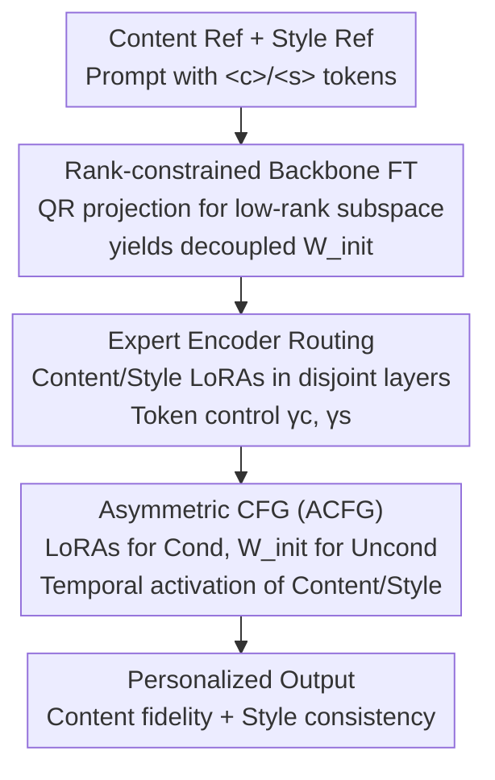

# CRAFT-LoRA: Content-Style Personalization via Rank-Constrained Adaptation and Training-Free Fusion

**Conference**: CVPR 2026  
**Paper**: [CVF Open Access](https://openaccess.thecvf.com/content/CVPR2026/html/Li_CRAFT-LoRA_Content-Style_Personalization_via_Rank-Constrained_Adaptation_and_Training-Free_Fusion_CVPR_2026_paper.html)  
**Code**: https://github.com/Skylanding/CraftLoRA (Available)  
**Area**: Diffusion Models / Image Generation  
**Keywords**: LoRA Fusion, Content-Style Decoupling, Personalized Generation, Classifier-Free Guidance, Low-Rank Constraint  

## TL;DR
CRAFT-LoRA employs a triad of "rank-constrained backbone fine-tuning (to create a decoupling-friendly initialization) + expert encoder branch routing (assigning content/style LoRAs to disjoint layers via prompt tokens) + temporal asymmetric CFG (stabilizing training-free fusion during inference)." This allows independently trained content and style LoRAs to combine cleanly, achieving SOTA in content similarity, style similarity, and overall GPT-4o scores.

## Background & Motivation
**Background**: In personalized image generation, LoRA is the most efficient customization method, inserting small low-rank matrices into frozen text-to-image diffusion models to learn a specific "content" (identity, structure) or "style" (texture, color) from a single reference image. Ideally, multiple independently trained LoRAs can be mounted simultaneously during inference to achieve "specified subject + specified style" combinations.

**Limitations of Prior Work**: Directly summing or merging multiple LoRA weights often leads to quality degradation—content and style representations become entangled, resulting in structural distortion or diluted styles. Existing fusion methods have drawbacks: ZipLoRA requires learning column-wise mixing coefficients for every pair (additional optimization), B-LoRA relies on functional division of attention modules, and K-LoRA selectively applies LoRAs to different attention layers. These methods focus on "how to merge downstream" without addressing the "entangled upstream backbone."

**Key Challenge**: Pre-trained diffusion models were never explicitly trained to support LoRA combinations, so content and style factors naturally overlap in their latent space. Remedying this only at the fusion stage either requires iterative optimization or alters original LoRA weights (leading to identity/style loss) while incurring significant computational overhead.

**Goal**: Decomposition into three sub-problems: (1) How to force the backbone to place content/style into non-overlapping subspaces from the start; (2) How to precisely inject semantic adapters and control their intensity; (3) How to stabilize fusion during inference without training or damaging original LoRA weights.

**Key Insight**: The authors draw inspiration from MAML—rather than "firefighting" at the fusion stage, it is better to find an initialization that is "conducive to fast, generalizable adaptation." This is implemented via PaRa-style rank-constrained fine-tuning: compressing the backbone's generative space into a more compact, decoupled representation before training LoRAs on this foundation.

**Core Idea**: A three-stage complementary design—"Rank-constrained initialization (decoupled base) + Token-routed expert encoder (precise injection) + Asymmetric CFG (training-free stable fusion)"—shifts content-style decoupling from "post-hoc fusion" to a coordinated "Backbone + Training + Sampling" pipeline.

## Method

### Overall Architecture
CRAFT-LoRA is a unified personalized synthesis pipeline consisting of three stages: **Rank-constrained backbone fine-tuning** to transform the backbone into a more separated initialization $W_{init}$; **Independent training of content LoRA $\Delta W_c$ and style LoRA $\Delta W_s$** on this base, constrained to disjoint layer sets using `<c>`/`<s>` prompt tokens; and **Inference routing** via an expert encoder into content/style intensity scalars $\gamma_c, \gamma_s$, followed by **Temporal Asymmetric CFG (ACFG)** to selectively activate LoRA paths across denoising steps, completing stable fusion without training.

### Key Designs

**1. Rank-Constrained Backbone Fine-Tuning: Compressing the backbone into a non-overlapping base**

To address the root cause of entanglement, the U-Net of SDXL undergoes a one-time rank-constrained fine-tuning before LoRA training. For each layer, a learnable base matrix $B_l \in \mathbb{R}^{d_{in}\times r_l}$ (rank $r_l \ll \min(d_{out}, d_{in})$) is introduced. QR decomposition $B_l = Q_l R_l$ yields an orthogonal basis $Q_l$ ($Q_l^\top Q_l = I$), and the backbone weights are projected along this low-rank subspace:

$$W_l = W_l^{(0)} - Q_l Q_l^\top W_l^{(0)}.$$

This constrains updates to directions orthogonal to the learned low-rank subspace, imposing a structural inductive bias to reduce content-style overlap. Rank is distributed via linear decay $r_l = r_{max} - \frac{l-1}{L-1}(r_{max}-r_{min})$ ($r_{max}=128, r_{min}=4$), giving higher rank to early layers where low-level structure and texture are most entangled. Content and style bases $B_l^{content}, B_l^{style}$ are trained separately; their orthogonal subspaces are concatenated and merged via QR ($Q_l^{merged} = [Q_l^{content} \mid Q_l^{style}]$) to ensure disjoint low-rank subspaces.

**2. Expert Encoder Routing: Precise injection into disjoint layers via prompt tokens**

To solve the lack of granular control in existing methods, a prompt-guided expert encoder is added. Given a prompt with explicit tokens (e.g., "A photo of a person `<c>` smiling in a watercolor style `<s>`"), the tokens are stripped for the standard SDXL text encoder to get semantic embeddings $e_{sem}$, while content embeddings $e_c$ and style embeddings $e_s$ are extracted to provide isolated semantic guidance. During training, content matrices $A_i^{(c)}$ and style matrices $A_i^{(s)}$ are assigned to **disjoint layer sets** $I_c$ (shallow/mid layers for structure) and $I_s$ (deep layers for texture), forcing architectural independence. During inference, the weights are aggregated as:

$$W^{agg} = W_{init} + \sum_{i\in I_c} E_i\big(\gamma_c \Delta W_i^{(c)}\big) + \sum_{i\in I_s} E_i\big(\gamma_s \Delta W_i^{(s)}\big),$$

where $E_i(\cdot)$ injects the input into layer $i$. Users can adjust $\gamma_c, \gamma_s$ to achieve "fixed content, changed style" combinations without retraining.

**3. Asymmetric CFG (ACFG): Stable training-free fusion during inference**

Standard CFG uses the same weights for conditional and unconditional paths. When LoRAs are attached, the unconditional path becomes contaminated, leading to instability. ACFG introduces **asymmetry**: the conditional path uses LoRA-adapted weights, while the unconditional path is always anchored to the rank-constrained base $W_{init}$ ($W_i^{uncond}(t) = W_i^{init}, \forall t,i$). It also uses temporal scheduling $\gamma_c(t)=\mathbb{1}_{t\in T_c}$ and $\gamma_s(t)=\mathbb{1}_{t\in T_s}$ (e.g., content active during steps [1, 35], style during [15, 50]), aligning with the coarse-to-fine nature of diffusion. The guidance estimate is:

$$\epsilon_\theta^{acfg} = (1+\omega)\,\epsilon_{cond} - \omega\,\epsilon_{uncond}.$$

By anchoring the unconditional path to $W_{init}$, the guidance signal $\epsilon_{cond}-\epsilon_{uncond}$ isolates the net effect of the LoRA adapters at each timestep without mixing with the unconditional baseline.

### Loss & Training
Based on SDXL, LoRAs are trained via DreamBooth ($r=64$, Adam-8bit, 1000 steps, LR $1\times10^{-5}$) on NVIDIA 4090s. Rank-constrained fine-tuning is a one-time cost: 5000 steps on 2×4090 to obtain $W_{init}$, which is then reused. ACFG inference overhead is <5% compared to standard CFG.

## Key Experimental Results

### Main Results

| Method | Content Sim. (CLIP-I) ↑ | Style Sim. (CLIP-I) ↑ | Comb. Score (GPT-4o) ↑ |
|------|------|------|------|
| Direct Merging | 0.65 | 0.60 | 0.62 |
| StyleDrop | 0.68 | 0.76 | 0.70 |
| ZipLoRA | 0.70 | 0.69 | 0.73 |
| KLoRA | 0.71 | 0.72 | 0.76 |
| BLoRA | 0.74 | 0.70 | 0.77 |
| LoRA.rar | 0.73 | 0.71 | 0.76 |
| **Ours** | **0.79** | **0.80** | **0.83** |

Baselines often favor one aspect: StyleDrop prioritizes style over structure, whereas ZipLoRA/BLoRA offer better balance but limited coordination. Ours achieves the highest scores across all metrics.

### Ablation Study

| Rank-FT | Router | ACFG | Content Sim. ↑ | Style Sim. ↑ | Comb. Score ↑ |
|:---:|:---:|:---:|:---:|:---:|:---:|
| | | | 0.65 | 0.60 | 0.62 |
| ✓ | | | 0.73 | 0.70 | 0.72 |
| ✓ | ✓ | | 0.76 | 0.76 | 0.80 |
| ✓ | ✓ | ✓ | **0.79** | **0.80** | **0.83** |

Rank-FT provides the largest contribution (Content +0.08, Style +0.10). Router provides complementary gains through layer-wise routing, and ACFG stabilizes fusion quality.

### Key Findings
- **Rank-FT is the primary driver**: Removing it leads to the largest performance drop. Freq-domain analysis shows mutual interference decreases by 12% with Rank-FT.
- **Data Diversity > Quantity**: 50 pairs of contrastive content-style samples achieve 95% of the performance of 200 pairs.
- **Failures**: Occur when content and style are highly entangled in the reference (e.g., cartoon characters) or when styles are dominated by low frequencies (misidentified as content).

## Highlights & Insights
- **Shifting decoupling to initialization**: Using PaRa/MAML-style rank constraints to create a decoupled backbone base is the key breakthrough. It treats the root cause rather than symptoms.
- **Efficient ACFG trick**: Anchoring the unconditional path to $W_{init}$ isolates the adapter effect with zero extra parameters and <5% overhead. It is plug-and-play for standard LoRAs.
- **Temporal scheduling matches diffusion physics**: Activating content LoRAs early for structure and style LoRAs late for texture aligns with the coarse-to-fine generation process.

## Limitations & Future Work
- Layer allocation (content vs. style layers) is architecture-dependent and manually specified.
- Performance depends on text embedding quality.
- Frequency-domain separation fails for flat/low-frequency styles.

## Related Work & Insights
- **vs ZipLoRA**: ZipLoRA requires per-pair optimization; Ours is training-free during fusion and achieves higher scores (0.83 vs 0.73).
- **vs B-LoRA / K-LoRA**: These focus on downstream integration (attention division/selective layering), while Ours addresses backbone entanglement through initialization.

## Rating
- Novelty: ⭐⭐⭐⭐ 
- Experimental Thoroughness: ⭐⭐⭐⭐ 
- Writing Quality: ⭐⭐⭐⭐ 
- Value: ⭐⭐⭐⭐ 

<!-- RELATED:START -->

## Related Papers

- [\[CVPR 2026\] SplitFlux: Learning to Decouple Content and Style from a Single Image](splitflux_learning_to_decouple_content_and_style_from_a_single_image.md)
- [\[CVPR 2026\] A Training-Free Style-Personalization via SVD-Based Feature Decomposition](a_training-free_style-personalization_via_svd-based_feature_decomposition.md)
- [\[CVPR 2026\] OrthoFuse: Training-free Riemannian Fusion of Orthogonal Style-Concept Adapters for Diffusion Models](orthofuse_training-free_riemannian_fusion_of_orthogonal_style-concept_adapters_f.md)
- [\[CVPR 2025\] K-LoRA: Unlocking Training-Free Fusion of Any Subject and Style LoRAs](../../CVPR2025/image_generation/k-lora_unlocking_training-free_fusion_of_any_subject_and_style_loras.md)
- [\[ECCV 2024\] Implicit Style-Content Separation using B-LoRA](../../ECCV2024/image_generation/implicit_style-content_separation_using_b-lora.md)

<!-- RELATED:END -->
