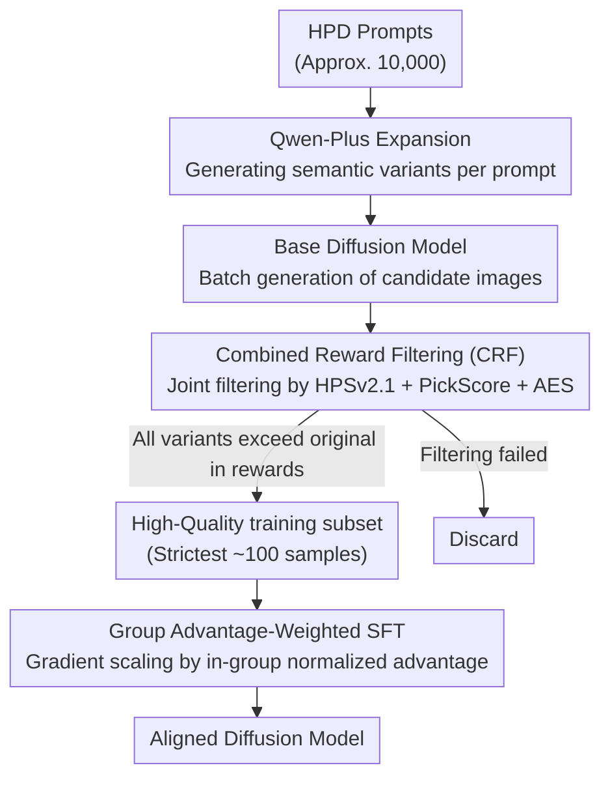

# CRAFT: Aligning Diffusion Models with Fine-Tuning Is Easier Than You Think

**Conference**: CVPR 2026  
**arXiv**: [2603.18991](https://arxiv.org/abs/2603.18991)  
**Code**: None  
**Area**: Image Generation / Diffusion Model Alignment  
**Keywords**: Diffusion model alignment, Human preference, Combined Reward Filtering, Supervised Fine-Tuning, Data-efficient  

## TL;DR

CRAFT proposes an ultra-lightweight alignment method for diffusion models. It automatically constructs high-quality training sets using a Combined Reward Filtering (CRF) strategy and executes an enhanced SFT. Theoretically, CRAFT is proven to optimize the lower bound of Group Reinforcement Learning (RL), surpassing SOTA methods that require thousands of preference pairs using only 100 samples, while being 11-220x faster in training.

## Background & Motivation

1. **Background**: Post-training alignment for diffusion models follows three main paths: SFT (requires high-quality data), DPO-style preference optimization (requires large-scale preference pairs), and online RL methods (high computational overhead).
2. **Limitations of Prior Work**: SFT relies on high-quality images that are difficult to obtain; DPO methods like Diff-DPO depend on large-scale preference datasets with inconsistent quality; online methods like SPO require repeated sampling and evaluation, making them extremely expensive.
3. **Key Challenge**: The dual challenge of data efficiency and computational efficiency—existing methods require either massive data or intensive computation, making it hard to achieve both.
4. **Goal**: To design a fine-tuning method that is both data-efficient and computationally lightweight.
5. **Key Insight**: Eliminate the need for external high-quality data or preference pairs by having the model generate candidate images and filtering the optimal samples through multi-dimensional rewards.
6. **Core Idea**: Data filtering via combined reward models + advantage-weighted SFT, which is theoretically equivalent to the lower bound optimization of Group RL.

## Method

### Overall Architecture

CRAFT seeks to align diffusion models with human preferences without relying on external high-quality images or large-scale preference pairs. Its pipeline is entirely self-contained: the model generates data, filters it, and fine-tunes itself. The process consists of three steps: first, sampling approximately 10,000 prompts from the HPD dataset, expanding each into multiple semantic variants using Qwen-Plus, and generating candidate images in batches using the base model; second, using a set of complementary reward models for joint filtering of candidate images, retaining only those that show clear quality improvement; finally, performing a "weighted" standard SFT on this high-quality subset, allowing gradients to scale adaptively based on sample quality. Crucially, the first two steps delegate the definition of "quality" to reward models, while the third step translates this quality into gradient weights, enabling a standard SFT process to achieve preference alignment typically requiring RL.

### Key Designs

**1. Combined Reward Filtering (CRF): Auto-curating training sets via multi-dimensional rewards**

The primary difficulty of SFT is acquiring high-quality images, while DPO requires thousands of preference pairs. CRAFT allows the model to generate candidates and utilizes reward models to select superior images. It employs three complementary reward models—HPSv2.1 for human preference, PickScore for selection preference, and AES for aesthetic scoring—and designs a multi-level filtering mechanism: Single-reward filtering $\mathcal{I}_\xi$ retains samples if any reward is higher than the original; Double-reward filtering $\mathcal{I}_{ha}$ requires two simultaneous improvements; Triple-reward filtering $\mathcal{I}_{hpa}$ is the strictest, requiring improvements in all three. This self-curated approach avoids distilling stronger models or purchasing preference datasets, while the intersection of multi-dimensional rewards ensures consistent improvement and prevents bias from over-optimizing a single reward.

**2. Group Advantage-Weighted SFT: Translating sample quality into gradient weights**

Selecting good samples is insufficient; CRAFT differentiates quality among the retained samples by giving higher-quality images more influence during fine-tuning. It calculates a normalized advantage for each group:

$$\hat{A}^{(i,j)} = \frac{r^{(i,j)}_{\text{total}} - \text{mean}}{\text{std} + \epsilon},$$

which represents how many standard deviations a sample is "better" than its group average. This advantage value weights the standard noise prediction SFT loss $\|\epsilon_\theta(x^{(i,j)}_t, t, c) - \epsilon^{(i,j)}_t\|^2$, with an indicator function zeroing out samples that failed the filter. Consequently, gradients for superior samples are amplified while weaker ones are suppressed, embedding an implicit reward-guided signal into SFT without repetitive RL sampling.

**3. Theoretical Guarantee (Theorem 3.1): Proving weighted SFT as a lower bound for Group RL**

CRAFT provides a theoretical basis for why selective SFT can substitute for RL. Under the assumption of a small learning rate, the paper proves that the advantage-weighted SFT loss optimizes a lower bound of the Group RL objective $\hat{J}(\theta)$. Maximizing this lower bound directly improves the true RL objective. This elevates "SFT with selected data" from a heuristic engineering trick to a theoretically grounded alignment method.

> ⚠️ The exact form and assumptions of the theorem are subject to the original paper.

### Loss & Training

The loss function is an advantage-weighted noise prediction MSE loss. The UNet is fine-tuned using the AdamW optimizer with full parameters. SD1.5 is trained for 120 steps, and SDXL for 200 steps, with a batch size of 128 and a learning rate of 5e-5. Total training requires approximately 4 GPU hours (SDXL on H100).

## Key Experimental Results

### Main Results

| Benchmark/Metric | SDXL Baseline | Diff-DPO | SPO | CRAFT | Gain vs. SPO |
|-----------|----------|----------|-----|-------|------------|
| HPDv2 HPSv2.1↑ | 27.93 | 29.76 | 32.32 | **32.67** | +0.35 |
| HPDv2 ImgReward↑ | 0.819 | 1.037 | 1.103 | **1.312** | +0.209 |
| HPDv2 MPS↑ | 14.35 | 14.70 | 15.36 | **15.62** | +0.26 |
| Parti HPS↑ | 27.32 | 28.74 | 30.54 | **31.10** | +0.56 |

CRAFT leads across all metrics and datasets. Notably, it improves on ImageReward and MPS metrics which were not used during training, demonstrating strong generalization.

### Ablation Study

| Configuration | HPSv2.1 | Training Size | GPU Time |
|------|---------|-----------|---------|
| CRAFT ($\mathcal{I}_{hpa}$) | 32.67 | 100 | ~4h |
| CRAFT ($\mathcal{I}_{ha}$) | 32.45 | ~300 | ~4h |
| CRAFT ($\mathcal{I}_h$) | 32.12 | ~1000 | ~4h |
| SFT (No Filter) | 31.80 | 10000 | ~4h |

### Key Findings

- The strictest triple filtering $\mathcal{I}_{hpa}$ yields the best results, indicating that data quality is significantly more important than quantity.
- CRAFT surpasses SPO (which requires 4,000 samples) using only 100 samples, a 40x improvement in data efficiency.
- Training speed is 19.7x faster than SPO (SDXL) and 60.1x faster than SmPO.
- Performance on the GenEval compositional reasoning benchmark reflects that alignment capabilities transfer to instruction following.
- Superior performance on unseen reward metrics suggests the model is not simply overfitting to training rewards.

## Highlights & Insights

- **Extreme Data Efficiency**: Surpassing preference-based methods with only 100 samples challenges the notion that alignment requires massive preference datasets.
- **Self-Curated Data Pipeline**: No external data required; the model generates, filters, and trains on its own, making it fully self-contained.
- **Theoretical Elegance**: Proving that selective SFT is equivalent to RL lower-bound optimization bridges the gap between the two paradigms.
- **Immediate Value**: Aligning SDXL in just 4 GPU hours significantly lowers the barrier for post-training diffusion models.

## Limitations & Future Work

- Dependence on reward model quality; biases in reward models may propagate to the fine-tuned model.
- Validation is limited to SD1.5 and SDXL, without testing on newer architectures like DiT or FLUX.
- The theoretical proof relies on a small learning rate assumption, which may not hold at higher rates.
- Future work could explore applications in video diffusion models or 3D generation.

## Related Work & Insights

- **vs Diff-DPO**: DPO requires many preference pairs and is inefficient; CRAFT achieves better results using SFT.
- **vs SPO**: SPO requires online sampling and evaluation; CRAFT is completely offline and 20x faster.
- **vs RLHF/GRPO**: CRAFT is theoretically equivalent to RL but significantly simpler to implement.

## Rating

- Novelty: ⭐⭐⭐⭐ (Innovative combination of reward filtering and theoretical bridging)
- Experimental Thoroughness: ⭐⭐⭐⭐⭐ (Comprehensive comparison across multiple benchmarks and baselines)
- Writing Quality: ⭐⭐⭐⭐ (Clear structure, effective combination of theory and experiment)
- Value: ⭐⭐⭐⭐⭐ (High practical utility, drastically reduces cost of diffusion model alignment)

<!-- RELATED:START -->

## Related Papers

- [\[NeurIPS 2025\] Aligning Text to Image in Diffusion Models is Easier Than You Think](../../NeurIPS2025/image_generation/aligning_text_to_image_in_diffusion_models_is_easier_than_you_think.md)
- [\[CVPR 2026\] Towards Fine-Grained Attribution: Instance-Aware Preference Optimization for Aligning Diffusion Models](towards_fine-grained_attribution_instance-aware_preference_optimization_for_alig.md)
- [\[CVPR 2026\] Reward Sharpness-Aware Fine-Tuning for Diffusion Models](reward_sharpness-aware_fine-tuning_for_diffusion_models.md)
- [\[CVPR 2026\] Do Less, Achieve More: Do We Need Every-Step Optimization for RL Fine-tuning of Diffusion Models?](do_less_achieve_more_do_we_need_every-step_optimization_for_rl_fine-tuning_of_di.md)
- [\[CVPR 2026\] Memory-Efficient Fine-Tuning Diffusion Transformers via Dynamic Patch Sampling and Block Skipping](memory-efficient_fine-tuning_diffusion_transformers_via_dynamic_patch_sampling_a.md)

<!-- RELATED:END -->
