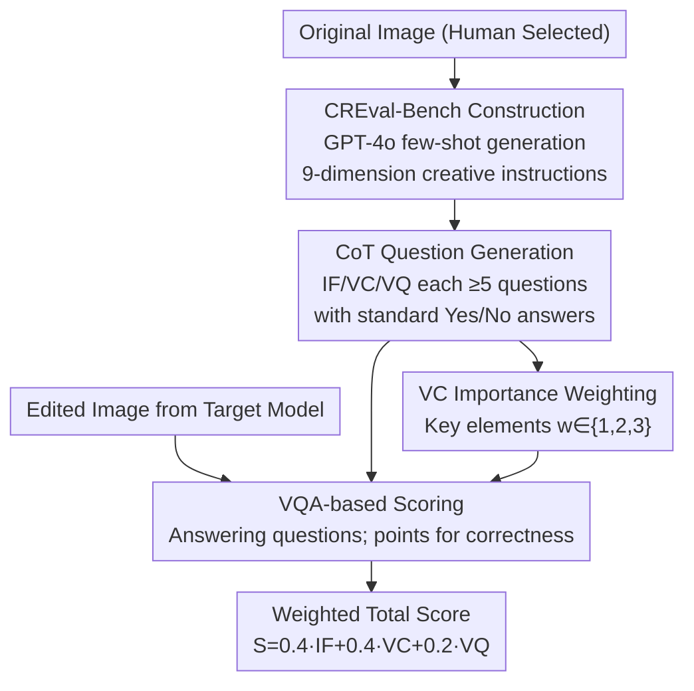

# CREval: An Automated Interpretable Evaluation for Creative Image Manipulation under Complex Instructions

**Conference**: CVPR 2026  
**Paper**: [CVF Open Access](https://openaccess.thecvf.com/content/CVPR2026/html/Wang_CREval_An_Automated_Interpretable_Evaluation_for_Creative_Image_Manipulation_under_CVPR_2026_paper.html)  
**Code**: https://github.com/ChonghuinanWang/CREval  
**Area**: Image Generation / Evaluation Benchmarks  
**Keywords**: Instruct-based Image Editing, Creative Editing Evaluation, VQA Scoring, MLLM Evaluation, Benchmark Construction

## TL;DR
CREval replaces the "black-box scoring" of MLLMs with a VQA paradigm—generating truth-grounded binary questions and awarding points only for correct answers. Accompanied by CREval-Bench (874 samples across 3 categories and 9 dimensions), it decomposes evaluation into three interpretable metrics: Instruction Following (IF), Visual Consistency (VC), and Visual Quality (VQ). It reveals that current models still struggle with "free-form creative editing," particularly in preserving identity-defining elements of the original image.

## Background & Motivation
**Background**: Instruct-based image editing models (e.g., GPT-Image-1, Gemini 2.5 Flash Image, Qwen-Image-Edit, Seedream 4.0, FLUX Kontext) have advanced rapidly in complex instruction understanding. However, reliable automated evaluation is needed. Existing benchmarks (ImgEdit-Bench, KRIS-Bench, GEdit-Bench, etc.) primarily rely on MLLMs to provide a subjective total score.

**Limitations of Prior Work**: Direct MLLM scoring suffers from two flaws. First, it is a **black box and uninterpretable**—it is unclear how scores are derived or where points are deducted, leading to instability or missed details. Second, it lacks **comprehensive coverage**—a single score cannot distinguish whether a model failed to follow instructions, lost the original subject, or produced poor image quality.

**Key Challenge**: Evaluating an edited image requires simultaneously verifying two opposing goals: ensuring required changes are executed (to change) and ensuring unmentioned visual/semantic elements are preserved (not to change). Compressing these into a single score inevitably loses information and hinders error attribution.

**Goal**: (1) Design an **automated, interpretable, and human-aligned** evaluation pipeline for creative editing; (2) Fill the gap in benchmarks for "free-form creative editing" (e.g., turning a pet into a figurine, designing posters, or surreal reimaginings).

**Key Insight**: Rather than letting MLLMs "score by feeling," evaluation is decomposed into a series of **binary questions with ground-truth answers**. Each question targets a verifiable fact ("Is the chibi keychain hanging on a silver ring?"). MLLMs only need to answer Yes/No, and points are awarded for correctness, making the process transparent and dimensional.

**Core Idea**: Replace "black-box MLLM scoring" with "QA-based VQA evaluation," decomposing the score into IF, VC, and VQ metrics.

## Method

### Overall Architecture
CREval is an integrated solution of a benchmark and an evaluation pipeline. The process consists of three sequential stages: **Stage 1 Instruction Generation** (GPT-4o generates instructions for high-quality images across 9 creative dimensions to form CREval-Bench) → **Stage 2 Evaluation Question Generation** (For each pair, CoT generates $\geq 5$ Yes/No questions for IF, VC, and VQ, totaling $\geq 15$ questions per sample) → **Stage 3 Evaluation and Scoring** (Edited images are fed to an MLLM judge to answer questions; scores are awarded for correctness and aggregated).

Input: "Original image + Creative instruction + Edited image." Output: IF/VC/VQ sub-scores and a weighted total score.

### Key Designs

**1. VQA-based Evaluation: Truth-grounded binary questions instead of black-box scoring**

This is the central paradigm shift. CREval does not ask the MLLM for a score. Instead, for every image-instruction pair, a set of questions $\{Q, A\}$ with `YES`/`NO` labels is generated. During evaluation, the triplet $[I_i, I_o, Q]$ is processed by the MLLM judge. Points are awarded only if the prediction matches the reference answer. This ensures every point is tied to a verifiable fact, improving both interpretability and coverage.

**2. Three-Metric Decomposition (IF/VC/VQ): Separating change, preservation, and quality**

To address the limitations of unified scoring, CREval uses three complementary metrics, each with its own CoT-generated question set: **IF (Instruction Following)** assesses if the edits match the prompt; **VC (Visual Consistency)** checks if identity-defining elements from the original image are preserved; **VQ (Visual Quality)** measures realism and identifies artifacts (distortions, geometric fractures).

**3. VC Importance Weighting and Aggregation: Not all elements are equal**

In VC evaluation, failing to preserve a critical feature is worse than losing a minor detail. CREval assigns an importance weight $w \in \{1, 2, 3\}$ to each element being tracked. For example, in *Girl with a Pearl Earring*, the pearl is assigned $w=3$ as it is a defining characteristic. The final score $S$ is aggregate as follows:

$$S = 0.4 \cdot S_{IF} + 0.4 \cdot S_{VC} + 0.2 \cdot S_{VQ}$$

The lower weight for VQ (0.2) is intentional, as MLLMs are currently less sensitive to subtle visual quality artifacts compared to semantic instruction following.

**4. CREval-Bench: 3 Categories × 9 Dimensions**

CREval-Bench covers: **Customization** (morphological restructuring like reimagined roles), **Contextualization** (placing objects in specific scenes/commercial designs), and **Stylization** (artistic style transfer, material conversion). It contains 874 image-instruction pairs and approximately 13K total evaluation questions.

## Key Experimental Results

### Main Results
Evaluation results (normalized to 100) using GPT-4o as the judge:

| Model | Type | IF | VC | VQ | Overall avg |
|------|------|----|----|----|----|
| Seedream 4.0 | Closed | 89.12 | 73.44 | 92.01 | **83.43** |
| Gemini 2.5 Flash Image | Closed | 83.38 | **74.79** | 90.37 | 81.34 |
| Qwen-Image-Edit-2509 | Open | **85.82** | 68.50 | 90.26 | 79.78 |
| GPT-Image-1 | Closed | 88.34 | 63.46 | 91.23 | 78.97 |
| FLUX.1 Kontext [dev] | Open | 70.13 | 73.88 | 86.03 | 74.81 |
| Bagel | Open | 78.32 | 53.69 | 80.07 | 68.82 |

Closed-source models generally lead, with Seedream 4.0 being the strongest. **VC is the universal bottleneck**, showing that most models struggle to preserve original identifiers during creative editing.

### Human Preference Alignment
Comparison of CREval with baselines against human scores (HumanScore):

| Model | VIEScore | EditScore | CREval (GPT-4o) | HumanScore |
|------|----------|-----------|-----------------|-----------|
| Qwen-Image-Edit | 6.83 | 7.97 | 79.18 | 63.49 |
| Seedream 4.0 | 7.49 | 8.13 | **84.31** | **72.01** |

CREval rankings align closely with human judgments. The relative rankings remain stable even when switching the judge MLLM (e.g., to Qwen3-VL), demonstrating robustness.

### Key Findings
- **VC is a major bottleneck**: Preservation of identity is the hardest task for current editing models.
- **Preservation vs. Inaction**: UniWorld-V1 showed high VC scores but low IF, indicating it preserved the original image by simply ignoring the instructions.
- **Thinking modules**: "Reasoning" or "thinking" variants (like Step1X-Edit think) did not necessarily improve instruction following and sometimes slightly degraded it.
- **VQ convergence**: Most high-end models achieve similar VQ scores, justifying the lower weight assigned to this dimension during aggregation.

## Highlights & Insights
- **Interpretability via QA**: Interpretability is achieved through the verifiability of binary questions rather than MLLM self-explanation, effectively bypassing the black-box nature.
- **Importance Weighting**: Recognizing that certain elements (the "pearl earring" points) are more critical than others for identity preservation.
- **Metric Decoupling**: The correlation analysis between IF and VC prevents "lazy" models that don't edit from being falsely identified as "highly consistent."
- **Pragmatic weighting**: Acknowledging the sensitivity limits of MLLMs for visual quality and adjusting the final score formula accordingly.

## Limitations & Future Work
- **Judge Capability Ceiling**: Scores are bounded by the MLLM judge's vision abilities.
- **Self-referential Bias**: Since GPT-4o generates the instructions and acts as the judge, there is a potential for "homogenous bias."
- **Binary Granularity**: Yes/No answers may struggle to capture nuanced aesthetic differences that are a matter of degree rather than fact.
- **Future Directions**: Multi-judge integration, cross-family MLLM instruction generation, and more nuanced question levels for aesthetic evaluation.

## Related Work & Insights
- **vs. Score-based MLLMs**: Unlike EditScore or VIEScore, CREval provides a diagnostic breakdown (IF/VC/VQ).
- **vs. RISE-Bench**: While RISE focuses on spatial/logical complexity, CREval focuses on the "creative" and "generative" aspects of transformation.
- **vs. Detector-based Evaluators**: CREval is not limited by pre-trained object detectors (like COCO classes) and can handle any creative concept via open-ended VQA.

## Rating
- Novelty: ⭐⭐⭐⭐
- Experimental Thoroughness: ⭐⭐⭐⭐
- Writing Quality: ⭐⭐⭐⭐
- Value: ⭐⭐⭐⭐

<!-- RELATED:START -->

## Related Papers

- [\[CVPR 2026\] PSDesigner: Automated Graphic Design with a Human-Like Creative Workflow](psdesigner_automated_graphic_design_with_a_human-like_creative_workflow.md)
- [\[CVPR 2026\] Score2Instruct: Scaling Up Video Quality-Centric Instructions via Automated Dimension Scoring](score2instruct_scaling_up_video_quality-centric_instructions_via_automated_dimen.md)
- [\[CVPR 2026\] Towards Robust Sequential Decomposition for Complex Image Editing](towards_robust_sequential_decomposition_for_complex_image_editing.md)
- [\[ICCV 2025\] CAP: Evaluation of Persuasive and Creative Image Generation](../../ICCV2025/image_generation/cap_evaluation_of_persuasive_and_creative_image_generation.md)
- [\[CVPR 2026\] FlowDC: Flow-Based Decoupling-Decay for Complex Image Editing](flowdc_flow-based_decoupling-decay_for_complex_image_editing.md)

<!-- RELATED:END -->
