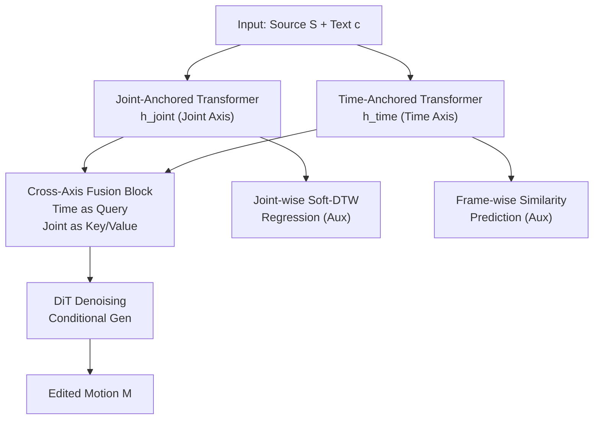

# Cross-Axis Feature Fusion with Joint-Wise Motion Difference Prediction for Text-Based 3D Human Motion Editing

**Conference**: CVPR 2026  
**arXiv**: [2606.01014](https://arxiv.org/abs/2606.01014)  
**Code**: None  
**Area**: Diffusion Models / 3D Vision / Human Motion Editing  
**Keywords**: Text-driven motion editing, Axis-anchored Transformer, Cross-axis fusion, Soft-DTW, Joint-level supervision

## TL;DR
Addressing text-driven 3D human motion editing, this paper utilizes "joint-anchored" and "time-anchored" Transformers to model the joint and time axes separately, integrating them via cross-axis fusion blocks. It incorporates an auxiliary task of regressing the Soft-DTW distance of source/target rotation trajectories, enabling the model to learn not only "when" to edit but also "which joints" to edit, achieving SOTA on MotionFix.

## Background & Motivation

**Background**: Text-driven 3D human motion editing (given a source motion + natural language instruction → generate a target motion preserving style/structure with local changes) has gained attention with the release of the MotionFix dataset (instruction-source-target triplets). Mainstream approaches train diffusion models under this supervised setting: TMED concatenates CLIP text embeddings with linear projections of source motions as conditioning for a diffusion transformer (DiT); SimMotionEdit adds a condition transformer to fuse text and motion features before the DiT and introduces a "frame-wise motion similarity prediction" task to learn "when changes should occur in the sequence."

**Limitations of Prior Work**: The feature encoder in SimMotionEdit aggregates along the joint dimension at each timestep (yielding frame-wise $h_{\text{motion}}\in\mathbb{R}^{N,D}$). This aggregation naturally collapses joint-level decoupled information, restricting its auxiliary supervision to the frame level—predicting only "frame-wise similarity." This answers "when to edit" but provides almost no information regarding "which body parts/joints to edit."

**Key Challenge**: Motion editing instructions are inherently joint-level ("lift the right leg instead of the left," "change the arm that is raised"), but existing architectures discard joint information during frame aggregation. This leaves the encoder's understanding of joint-level control under-constrained, limiting semantic alignment between conditions and editing results.

**Goal**: Enable the encoder to simultaneously understand "when" to edit along the time axis, "which joints" to edit along the joint axis, and the magnitude of the change.

**Key Insight**: Capturing the global characteristics of each joint across the sequence is as important as understanding the temporal characteristics of each frame's pose. Thus, these two axes should be modeled **separately** using two independent anchored Transformers and then fused, rather than aggregating joints into frame-wise features prematurely.

**Core Idea**: Replace the single frame-wise encoder with two axis-anchored Transformers (joint-axis + time-axis) plus a cross-axis fusion block, while injecting joint-level supervision into the encoder via a "joint-wise Soft-DTW distance regression" task that is robust to temporal shifts.

## Method

### Overall Architecture
The model generates an edited motion $M$ from a source motion $S\in\mathbb{R}^{N\times K}$ ($N$ frames, $K=207$ dimensional pose vector: 126D for 6D rotations of 21 joints + 66D for 22 joint positions + 3D global translation + 12D global orientation) and text instruction $c$ using a diffusion model. **Mechanism**: Source motion and text are input into two axis-anchored Transformers, producing joint-anchored features $h_{\text{joint}}\in\mathbb{R}^{K,D}$ and time-anchored features $h_{\text{time}}\in\mathbb{R}^{N,D}$. The cross-axis fusion block uses $h_{\text{time}}$ as Query and $h_{\text{joint}}$ as Key/Value for multi-head attention to obtain fused features $h_{\text{fusion}}$. These features are concatenated with noisy motion and fed into the DiT, which predicts the noise to sample the edited motion. During training, two auxiliary heads are used: frame-wise similarity prediction on the time-anchored branch and joint-wise Soft-DTW distance regression on the joint-anchored branch.

### Key Designs

**1. Dual Axis-Anchored Transformers: Modeling axes separately to preserve joint info**

To address SimMotionEdit's loss of joint-level info through frame-wise aggregation, this work uses two branches with the same structure (4-layer Transformer encoder, 8 heads, 512D) but different "anchored axes." The joint-anchored Transformer aggregates along the time direction to extract global trajectory features $h_{\text{joint}}\in\mathbb{R}^{K,D}$ for **each joint**. The time-anchored Transformer aggregates along the joint direction to extract full-body pose features $h_{\text{time}}\in\mathbb{R}^{N,D}$ for **each frame**. Both take $(S,c)$ as input. This explicitly preserves "which joints to move" info in $h_{\text{joint}}$.

**2. Cross-Axis Fusion Block: Allowing frame-wise context to "attend to" joint-wise context**

The fusion block uses multi-head cross-attention (8 heads, 512D) where $h_{\text{time}}$ acts as the Query and $h_{\text{joint}}$ acts as Key and Value. **Design Motivation**: By using "full-body pose at each frame" to retrieve "global trajectory context for each joint," the fused features $h_{\text{fusion}}$ carry both "when to change" (from the time axis) and "which joints to change" (from the joint axis). $h_{\text{fusion}}$ guides the DiT denoising process, ensuring results are faithful to instructions without deviating from the source.

**3. Joint-wise Soft-DTW Distance Prediction: Joint-level supervision robust to temporal shifts**

To force the joint-anchored Transformer to learn which joints should move, a regression head $\varphi_{\text{reg}}$ uses a sub-tensor of $h_{\text{joint}}$ corresponding to 21 SMPL joint 6D rotations ($h'_{\text{joint}}\in\mathbb{R}^{K'\times D}, K'=126$) to predict a scalar $\hat{d}_j$ for each rotation channel, fitting the distance between source and target rotation trajectories. Soft-DTW is used as the distance metric because many edits change timing or speed without changing the motion shape. Frame-wise L2 would over-penalize these shifts. Soft-DTW replaces the hard minimum with a soft version (log-sum-exp) controlled by temperature $\gamma>0$:

$$\mathrm{SoftDTW}_{\gamma}(x,y)=\operatorname{softmin}^{(\gamma)}_{\pi\in\mathcal{A}}\sum_{(n,m)\in\pi} d(x_n,y_m)$$

The target is the per-channel Soft-DTW distance $d_j=\mathrm{SoftDTW}_{\gamma}(S'_j,T'_j)$. This task teaches the encoder to distinguish joints to be modified based on trajectory shape rather than absolute time.

### Loss & Training
The primary loss is the standard diffusion noise prediction loss $\mathcal{L}_{\text{diff}}=\mathbb{E}_{\tau,\epsilon}\big[\lVert g(T_\tau; f(S,c),\tau)-\epsilon\rVert_2^2\big]$. The joint-level auxiliary loss is Mean Squared Error $\mathcal{L}_{\text{aux}}=\frac{1}{K'}\sum_{j=1}^{K'}(\hat{d}_j-d_j)^2$, alongside the frame-wise similarity task. Training uses AdamW (LR $10^{-4}$, batch 64) for 1500 epochs on an RTX 4090 (~12 hours). Inference uses DDPM with 300 steps and a cosine noise schedule, with a guidance scale of 2.0.

## Key Experimental Results

The MotionFix dataset (6,730 triplets) is used. Evaluation follows the "motion-to-motion" retrieval benchmark based on pretrained TMR, reporting Top-K retrieval accuracy (R@1/2/3) and Average Rank (AvgR) for both batch (size 32) and full test sets, with FID for distribution fidelity.

### Main Results

| Method | R@1↑ (Batch) | R@2↑ | R@3↑ | AvgR↓ | R@1↑ (Test) | AvgR↓ (Test) | FID↓ |
|------|------|------|------|------|------|------|------|
| MDM-BP | 39.10 | 50.09 | 54.84 | 6.46 | 8.69 | 180.99 | – |
| TMED | 62.90 | 76.51 | 83.06 | 2.71 | 14.51 | 56.63 | 0.167 |
| MotionReFit | 66.33 | 80.05 | 84.98 | 2.64 | – | – | – |
| SimMotionEdit | 70.62 | 82.92 | 88.12 | 2.38 | 25.49 | 23.49 | 0.110 |
| **Ours** | **74.38** | **88.54** | **92.08** | **1.92** | **29.45** | **16.42** | **0.097** |

Ours outperforms all baselines: R@1 increases from 70.62 (SimMotionEdit) to 74.38, AvgR drops from 2.38 to 1.92, and FID improves to 0.097. On the test set, R@1 improves to 29.45 and AvgR significantly drops to 16.42.

### Ablation Study

| Motion Sim. | Joint Delta | R@1↑ (Batch) | AvgR↓ | R@1↑ (Test) | FID↓ |
|------|------|------|------|------|------|
| ✗ | ✗ | 72.08 | 2.13 | 30.24 | 0.122 |
| ✗ | L2 | 71.46 | 2.16 | 29.25 | 0.113 |
| ✗ | Soft-DTW | 72.92 | 2.07 | 28.85 | 0.108 |
| ✓ | ✗ | 71.04 | 2.03 | 29.45 | 0.143 |
| ✓ | L2 | 71.04 | 1.97 | 26.48 | 0.113 |
| ✓ | **Soft-DTW** | **74.38** | **1.92** | 29.45 | **0.097** |

Ablations compare "Frame-wise Similarity (Motion Sim.)" and "Joint-wise Distance (Joint Delta)" with L2 vs. Soft-DTW metrics.

### Key Findings
- **Both auxiliary tasks are essential and pair best with Soft-DTW**: Using Soft-DTW for Joint Delta (✓+Soft-DTW) achieves a batch R@1 of 74.38, compared to only 71.04 when using L2.
- **L2 metrics can be detrimental**: Without other tasks, L2 (71.46) performed worse than some configurations without the task, confirming that frame-wise L2 misleads supervision by over-penalizing harmless temporal shifts.
- **Architecture and Supervision Synergy**: The improvement in FID (0.097, the lowest in the table) indicates that generated motions are more semantically aligned and follow the real motion distribution more closely.

## Highlights & Insights
- **Split-axis modeling captures task structure**: Motion data is inherently 2D (Joint × Time). Premature aggregation collapses this structure; independent modeling recognizes the nature of the task.
- **Clever use of Soft-DTW**: Transforming "whether to change a joint" into a "trajectory shape difference" using a temporal-invariant metric avoids pseudo-differences where edits only change timing.
- **Intentional Cross-Axis Fusion Direction**: Querying joint features with time features allows frame representations to absorb joint-level context, creating a specific "when × where" coupling.

## Limitations & Future Work
- **Reliance on MotionFix**: Only 6,730 triplets; limited edit types and diversity. Generalization across datasets is unverified.
- **No code availability**: High reproduction cost; results may be sensitive to hyperparameters like $\gamma$ and loss weights.
- **Evaluation bias**: Focuses on retrieval and FID; perceptual quality (e.g., physical plausibility, foot sliding) is mainly covered qualitatively.
- **Future Work**: Explore fine-grained joint-time joint supervision or extend Soft-DTW to positions/contacts.

## Related Work & Insights
- **vs. TMED**: TMED fuses via self-attention inside the DiT; Ours establishes fine-grained alignment before the DiT, increasing R@1 from 62.90 to 74.38.
- **vs. SimMotionEdit**: Both use auxiliary tasks; however, SimMotionEdit's frame-only supervision ("when") is surpassed by our joint-level Soft-DTW supervision ("which joints"), improving FID from 0.110 to 0.097.
- **vs. MotionReFit / MDM-BP**: Ours does not rely on external LLMs for part labeling, instead learning joint-level control directly from Soft-DTW targets.

## Rating
- Novelty: ⭐⭐⭐⭐ Dual-axis anchoring + Soft-DTW is a well-targeted response to motion structures.
- Experimental Thoroughness: ⭐⭐⭐⭐ SOTA on MotionFix with clear ablations, though limited to one dataset.
- Writing Quality: ⭐⭐⭐⭐ Logical flow from motivation to design with complete notation.
- Value: ⭐⭐⭐⭐ Provides a practical paradigm for joint-level control in motion editing.

<!-- RELATED:START -->

## Related Papers

- [\[CVPR 2026\] InterEdit: Navigating Text-Guided Multi-Human 3D Motion Editing](interedit_navigating_textguided_multihuman_3d_moti.md)
- [\[CVPR 2025\] Nonisotropic Gaussian Diffusion for Realistic 3D Human Motion Prediction](../../CVPR2025/image_generation/nonisotropic_gaussian_diffusion_for_realistic_3d_human_motion_prediction.md)
- [\[CVPR 2026\] Causal Motion Diffusion Models for Autoregressive Motion Generation](causal_motion_diffusion_models_for_autoregressive_motion_generation.md)
- [\[CVPR 2026\] OneHOI: Unifying Human-Object Interaction Generation and Editing](onehoi_unifying_human-object_interaction_generation_and_editing.md)
- [\[ECCV 2024\] Realistic Human Motion Generation with Cross-Diffusion Models](../../ECCV2024/image_generation/realistic_human_motion_generation_with_cross-diffusion_models.md)

<!-- RELATED:END -->
