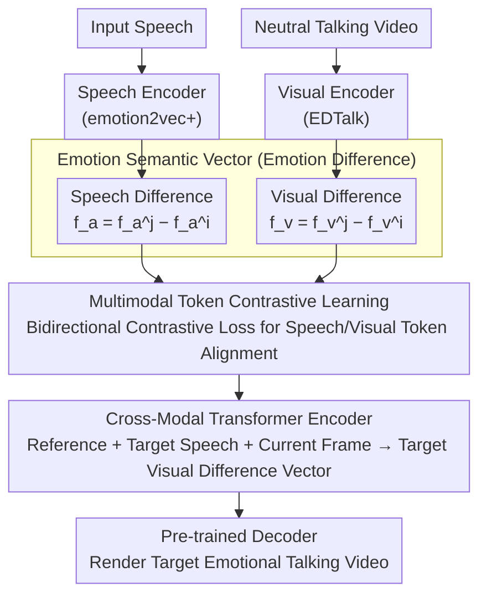

# Cross-Modal Emotion Transfer for Emotion Editing in Talking Face Video

**Conference**: CVPR 2026  
**arXiv**: [2604.07786](https://arxiv.org/abs/2604.07786)  
**Code**: [https://chanhyeok-choi.github.io/C-MET/](https://chanhyeok-choi.github.io/C-MET/)  
**Area**: Image Generation / Talking Face  
**Keywords**: Emotion editing, cross-modal transfer, talking face generation, emotion semantic vector, expanded emotions

## TL;DR
Ours proposes C-MET (Cross-Modal Emotion Transfer), which models the mapping of emotion semantic vectors between speech and facial expression spaces. It achieves speech-driven generation of extended emotions (e.g., sarcasm, charm) in talking face videos for the first time, with emotion accuracy exceeding SOTA by 14%.

## Background & Motivation

**Background**: Emotion talking face generation is a core application of generative models, aiming to convert neutral talking videos into videos with target emotions. Existing methods are categorized by emotion source: label-driven, speech-driven, and image-driven.

**Limitations of Prior Work**: (1) Label-driven methods only support predefined discrete emotion categories (e.g., 8 basic emotions) and cannot represent complex or subtle emotions; (2) In speech-driven methods, emotion and linguistic content are entangled and cannot be separated; (3) Image-driven methods require high-quality frontal reference images, making reference data for extended emotions (e.g., sarcasm) difficult to obtain.

**Key Challenge**: How to utilize rich speech emotion information to drive facial expression generation, especially for extended emotions unseen during training, without collecting additional annotated data?

**Goal**: Cross-modal (speech $\to$ visual) emotion transfer, while supporting zero-shot generation of extended emotions.

**Key Insight**: Instead of directly predicting facial expressions, learn the mapping of "emotion semantic vectors"—the difference between two different emotion embeddings—between the speech space and the visual space.

**Core Idea**: Emotion Semantic Vector = Target Emotion Embedding − Input Emotion Embedding. Mapping from speech semantic vectors to visual semantic vectors is learned via a cross-modal Transformer.

## Method

### Overall Architecture
C-MET consists of three parts: (a) Pre-trained encoders extract speech/visual embeddings and calculate emotion semantic vectors (the difference between two emotion embeddings); (b) Multimodal token contrastive learning aligns speech and visual representation spaces; (c) A cross-modal Transformer encoder regresses the target speech difference vector into the target visual difference vector, which is then added back to the current embedding for a pre-trained decoder to reconstruct the emotional video. Only the intermediate contrastive alignment module and the regressor are trained; front-end encoders and back-end decoders reuse existing models.

### Key Designs

**1. Emotion Semantic Vector: Using "Emotion Difference" instead of "Emotion Itself" for zero-shot capability in extended emotions**

Extended emotions (sarcasm, charm) are difficult because they lack labels and reference images, making them unseen during training. C-MET bypasses this by modeling "the direction to move from one emotion to another" rather than "what a specific emotion looks like." Specifically, given input emotion $i$ and target emotion $j$, it takes the difference in the speech space $f_a^{i \to j} = f_a^j - f_a^i$ and the difference in the visual space $f_v^{i \to j} = f_v^j - f_v^i$, defining these difference vectors as emotion semantic vectors. This transforms the absolute "emotion recognition" problem into a relative "emotion transfer" problem. Since difference vectors can be added and combined in a continuous embedding space, training on the 8 basic emotions of MEAD allows the synthesis of unseen transfer directions during inference by subtracting any two emotion embeddings. Extended emotions naturally fall within this continuous space. This approach draws inspiration from EmoKnob's control over speech emotion, extending it from the speech domain to the visual domain.

**2. Multimodal Token Contrastive Learning: Aligning speech and face before cross-modal regression**

Speech emotion and facial expressions belong to two vastly different modalities. Directly regressing visual semantic vectors from speech semantic vectors leads to misalignment and inaccurate regression. C-MET performs representation alignment before regression: a 1D convolution serves as a visual tokenizer $T_v$ and a projection layer as an audio tokenizer $T_a$ to segment the modalities into tokens. A bidirectional contrastive loss pulls paired speech and visual tokens closer in the embedding space while pushing unpaired ones apart:

$$L_{\text{cnt}} = \frac{L_{v \to a} + L_{a \to v}}{2}$$

The bidirectional nature (averaging $v \to a$ and $a \to v$) ensures symmetric alignment. Once aligned, the "emotion directions" of the two spaces become comparable, justifying the subsequent regression. In ablation studies, this module alone contributed 4% to emotion accuracy.

**3. Cross-modal Transformer Encoder: Feeding "reference, target speech, and current frame" into the same sequence to regress the target visual difference vector**

With aligned representations, the final step is predicting the "speech $\to$ visual" cross-modal mapping. C-MET concatenates three sources—reference visual semantic vector $z_r$, target speech semantic vector $z_a$, and current input visual embedding $z_v$—into a single token sequence for the Transformer encoder, which outputs the target visual semantic vector:

$$\hat{f}_{v,t}^{i \to j} = P_v\big(TE(\{z_{r,t'}\} \,\|\, \{z_a\} \,\|\, \{z_{v,t}\})\big)$$

To distinguish between the reference, speech, and current frame segments, each source is assigned a type embedding. Attention mechanisms can thus correctly model cross-modal dependencies without confusing the different sources. The predicted visual semantic vector is added back to the input visual embedding $z_v$ to obtain the target emotion embedding, which is then fed into the pre-trained decoder to render the final video.

### Loss & Training
- Reconstruction loss (bidirectional): $L_{\text{recon}} = L_{i \to j} + L_{j \to i}$
- Directional loss: $L_{\text{dir}} = 1 + \frac{\langle \hat{f}_v^{i \to j}, \hat{f}_v^{j \to i} \rangle}{\|\hat{f}_v^{i \to j}\| \|\hat{f}_v^{j \to i}\|}$ (ensures forward and backward vectors are in opposite directions)
- Total loss: $L = L_{\text{recon}} + \lambda_{\text{cnt}} \cdot L_{\text{cnt}} + \lambda_{\text{dir}} \cdot L_{\text{dir}}$
- $\lambda_{\text{cnt}} = 0.1$, $\lambda_{\text{dir}} = 0.05$

## Key Experimental Results

### Main Results

| Method | Emotion Source Type | Acc_emo↑ (MEAD) | Acc_emo↑ (CREMA-D) | FID↓ | AITV↓ |
|------|----------|----------------|-------------------|------|-------|
| EAMM | Image | 18.81 | 19.15 | 161.6 | 3.745 |
| EAT | Label | 41.56 | 39.97 | 91.0 | 12.575 |
| EDTalk | Image | 41.99 | 29.69 | **76.4** | 2.827 |
| FLOAT | Speech | 13.21 | 29.11 | 92.8 | 1.434 |
| **C-MET** | **Speech** | **55.91** | **43.47** | 90.8 | 2.643 |

### Ablation Study

| Loss Configuration | Acc_emo↑ (MEAD) | Description |
|---------|----------------|------|
| $L_{\text{recon}}$ only | 49.43 | Baseline |
| + $L_{\text{cnt}}$ | 53.46 | Contrastive learning contribution +4% |
| + $L_{\text{cnt}}$ + $L_{\text{dir}}$ | **55.91** | Directional loss further +2.4% |

Plug-and-play verification:

| Backbone | Original Acc_emo | + C-MET Acc_emo | AITV Change |
|---------|------------|----------------|----------|
| PD-FGC | 33.36 | 36.82 (+3.46) | 1.247 $\to$ 1.180 (Faster) |
| EDTalk | 41.99 | **55.91 (+13.92)** | 2.827 $\to$ 2.643 (Faster) |

### Key Findings
- Emotion accuracy improved significantly (14% higher than SOTA), though with slight concessions in visual quality metrics like FID/FVD—reflecting the inherent trade-off between emotional expression intensity and visual fidelity.
- In user studies, C-MET obtained overwhelming preference (>75%) in both basic and extended emotion settings.
- C-MET can serve as a plug-and-play module to replace heavy expression encoders while reducing inference time.

## Highlights & Insights
- **Novelty**: First method to explicitly model the speech-visual emotion semantic vector mapping.
- **Zero-shot Extended Emotions**: Trained only on 8 basic emotions from MEAD, but can generate unseen extended emotions like sarcasm and charm during inference.
- **Value**: Can be seamlessly integrated into existing decoupled networks (EDTalk, PD-FGC) to replace heavyweight expression encoders.

## Limitations & Future Work
- Visual quality metrics (FID, FVD) are slightly inferior to image-driven methods; strong emotional expression leads to larger facial motion deviations.
- Depends on pre-trained emotion2vec+large and EDTalk encoders/decoders; the model ceiling is limited by these components.
- Quantitative evaluation of extended emotions lacks a standard benchmark, currently verified only through user studies.

## Related Work & Insights
- Comparison with FLOAT (speech-driven but emotion-content entangled) validates the necessity of a decoupled design.
- EmoKnob's speech emotion control concept is effectively generalized to the visual generation domain.
- The strategy of using contrastive learning for modal alignment can be extended to other cross-modal transfer tasks.

## Rating
- Novelty: ⭐⭐⭐⭐⭐ The concept of emotion semantic vector mapping is novel, and zero-shot generation of extended emotions is pioneering.
- Experimental Thoroughness: ⭐⭐⭐⭐ Quantitative + qualitative + user study + ablation are complete, but there is a lack of standard evaluation for extended emotions.
- Writing Quality: ⭐⭐⭐⭐ Structure is clear, though notation is somewhat heavy.
- Value: ⭐⭐⭐⭐⭐ High practical application value, solving key bottlenecks in emotional talking face generation.

<!-- RELATED:START -->

## Related Papers

- [\[CVPR 2026\] EmoStyle: Emotion-Driven Image Stylization](emostyle_emotion-driven_image_stylization.md)
- [\[CVPR 2026\] MOS: Mitigating Optical-SAR Modality Gap for Cross-Modal Ship Re-Identification](mos_mitigating_optical-sar_modality_gap_for_cross-modal_ship_re-identification.md)
- [\[CVPR 2026\] Harmony: Harmonizing Audio and Video Generation through Cross-Task Synergy](harmony_harmonizing_audio_and_video_generation_through_cross-task_synergy.md)
- [\[CVPR 2026\] Preserving Source Video Realism: High-Fidelity Face Swapping for Cinematic Quality](preserving_source_video_realism_high-fidelity_face_swapping_for_cinematic_qualit.md)
- [\[CVPR 2026\] VideoCoF: Unified Video Editing with Temporal Reasoner](videocof_unified_video_editing_with_temporal_reasoner.md)

<!-- RELATED:END -->
