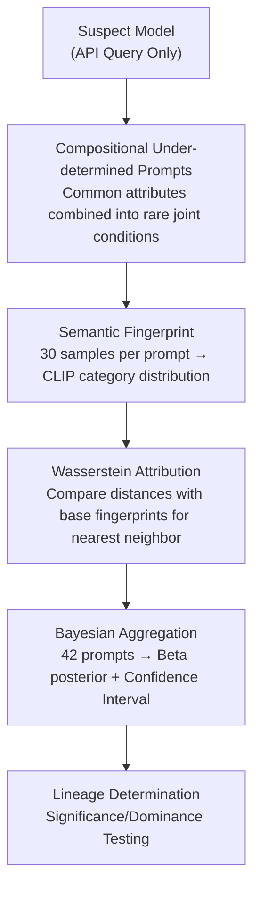

# CSF: Black-box Fingerprinting via Compositional Semantics for Text-to-Image Models

**Conference**: CVPR 2026  
**arXiv**: [2604.16363](https://arxiv.org/abs/2604.16363)  
**Code**: None  
**Area**: Diffusion Models / Model Copyright / Black-box Fingerprinting  
**Keywords**: Text-to-Image, Model Lineage, Black-box Fingerprinting, Compositional Semantics, Bayesian Attribution

## TL;DR
CSF treats text-to-image (T2I) models as "semantic category generators." It samples repeatedly using a batch of **compositional semantic prompts** that are extremely rare in fine-tuning data (e.g., "a dangerous urban nocturnal animal") to extract the model's category distribution for ambiguous prompts as a fingerprint. Using Wasserstein distance and Bayesian attribution, it identifies the protected base family of a suspect model accessible only via API—passing the "dominance" criterion across 6 base families and 13 fine-tuned variants.

## Background & Motivation

**Background**: Text-to-image models (FLUX, Stable Diffusion, Kandinsky, etc.) are high-value commercial assets often distributed under restrictive licenses (non-commercial / research only). To make licenses enforceable, it is necessary to detect infringement scenarios where a protected model is fine-tuned and used commercially via an API, a process known as **attribution** to a protected base lineage.

**Limitations of Prior Work**: Two existing categories of methods are unsuitable for this demanding scenario. ① Watermarking requires injecting triggers **before deployment**, which can degrade model quality and be removed if discovered; it is powerless against already deployed "vanilla" models. ② Fingerprinting passively extracts features from deployed models, but mainstream approaches either rely on **white-box/gray-box** access (weights, layer activations, diffusion trajectories) or are validated only on toy datasets, failing to handle fine-tuned variants—whereas commercial APIs only provide "input text, return image" query interfaces.

**Key Challenge**: Fine-tuning drastically changes style, color schemes, content preferences, and generation quality, completely overwhelming subtle signals in pixel-level and CLIP visual features (t-SNE in Fig. 3 shows CLIP features cluster by style, not family); even text spaces from image-to-captioning leak style information, leading to cross-family confusion. However, **deep semantic preferences inherited from pre-training** often persist after fine-tuning. The problem is how to decouple "semantic identity" from "visual appearance" in a black-box setting with only text-image pairs.

**Goal**: Design a fingerprint $\phi_M$ under query-only black-box access that satisfies both **discriminability** (different bases $\phi_{M_i} \neq \phi_{M_j}$) and **robustness** (fine-tuned variants $\phi_{M'} \approx \phi_M$), while providing statistical determination with uncertainty quantification.

**Key Insight**: The authors reverse the logic of watermarking—watermarks survive fine-tuning because rare trigger inputs do not appear in fine-tuning data and receive no update signals. Instead of injecting triggers, the method **actively identifies prompts that are naturally rare and capable of exposing the base model's semantic preferences**.

**Core Idea**: Abstract the model as a "text $\rightarrow$ category" generator. Use **compositional under-determined prompts** (combinations of common semantic attributes that are extremely rare when joined) to probe the model's category distribution under ambiguous conditions, using this distribution as a fingerprint for Bayesian attribution.

## Method

### Overall Architecture
CSF answers the question: "Which protected base family does this API-only suspect model originate from?" Its core transformation is: **compare semantics, not pixels**—treating the T2I model as a generator that produces a **category distribution** for "ambiguous prompts," reflecting preferences inherited from pre-training that are difficult for fine-tuning to override. The pipeline is: design compositional under-determined prompts $\rightarrow$ sample $N=30$ images per prompt from the suspect model $\rightarrow$ convert each image into a category probability vector via CLIP zero-shot classification to form an empirical distribution (fingerprint) $\rightarrow$ calculate the Wasserstein distance between the suspect model and base fingerprints for nearest-neighbor determination per trial $\rightarrow$ aggregate across 42 prompts using a Bayesian Beta-Binomial model to provide a lineage determination with a 95% confidence interval.

### Key Designs

**1. Semantic Fingerprint: Abstracting the model as a "text $\rightarrow$ category" generator to decouple style from semantics**

The limitation is that visual features and captions are contaminated by styles altered during fine-tuning, causing fingerprints to cluster by style rather than family. CSF constrains the semantic space to a set of **pre-defined categories** (e.g., tiger/lion/wolf under "animal"). It no longer asks "what is in the image" but "which category does this image correspond to." Given an under-determined prompt $C$ (e.g., "a photo of an animal"), the model's random sampling induces a category distribution $P(Y \mid C, M)$. Each generation is classified via CLIP zero-shot to obtain a vector $\mathbf{p} \in \Delta^{K-1}$ on a $(K-1)$-dimensional probability simplex. The model fingerprint is the distribution of these category vectors $P(\mathbf{p} \mid C, M)$, estimated using $N$ i.i.d. samples. This is effective because "how a model interprets ambiguous conditions" is a deep preference injected during pre-training, decoupled from specific art styles or colors.

**2. Compositional Under-determined Prompts: Locking base preferences where fine-tuning cannot reach**

Semantic abstraction alone is insufficient—simple broad prompts (e.g., "an animal") correspond to categories common in fine-tuning data, allowing fine-tuning to easily overwrite base preferences. CSF's solution is **compositional under-determination**: combining a hypernym category $T$ ("animal") with multiple semantic attributes $\{c_1, c_2, \dots\}$ to form $C=$ "A photo of $c_1 \, c_2 \, \cdots \, c_k \, T$." The key property is the **monotonic decrease of joint rarity**:

$$P(T) \gg P(T \cap c_1) \gg P(T \cap c_1 \cap c_2) \gg \cdots \gtrsim 0$$

Each attribute is common individually, but their joint probability decreases exponentially, entering a "rare zone" nearly non-existent in fine-tuning data. In this rare zone, fine-tuning exerts almost no update pressure on this semantic behavior, so $P(\mathbf{p} \mid C, M') \approx P(\mathbf{p} \mid C, M)$, preserving the base fingerprint. This utilizes the same robustness principle as backdoor watermarking—rare conditions receive no update signals—but CSF requires no trigger injection and is training-agnostic. This creates an **asymmetric advantage for the defender**: an infringer must block all possible combinations to remove the fingerprint, which is impossible due to exponential space; a verifier, however, can construct entirely new rare combinations at any time post-deployment.

**3. Wasserstein Distance + Bayesian Attribution: Upgrading single determination to statistical adjudication**

IP disputes require statistically sound evidence, not just "looking similar." For each prompt $C$, the $N$ category vectors form an empirical measure $\phi = \frac{1}{N} \sum_i \delta_{\mathbf{p}_i}$. Two models are compared using the **2-Wasserstein distance**:

$$W_2(\phi_1, \phi_2) = \left( \inf_{\gamma \in \Gamma(\phi_1, \phi_2)} \mathbb{E}_{(i, j) \sim \gamma} \|\mathbf{p}_i - \mathbf{p}_j\|_2^2 \right)^{1/2}$$

Wasserstein distance is preferred over JSD because it treats category vectors as geometric points in the simplex, preserving joint structures across categories (Table 2 shows Wasserstein attribution confidence is $+13.7\%$ to $+54.5\%$ higher than JSD). For a single trial, the nearest-neighbor base is $\hat M_{\text{base}}(C) = \arg\min_{M_i} W_2(M'(C), M_i(C))$. Aggregating over $T=42$ prompts yields success count $s$ and failure count $f$, using a Beta conjugate prior for Bayesian aggregation: $\theta \mid s, f \sim \mathrm{Beta}(\alpha + s, \beta + f)$ (using uninformative prior $\mathrm{Beta}(1, 1)$). The posterior mean estimates attribution accuracy, and the 95% credible interval quantifies uncertainty. Two criteria are used: **significance test** (lower bound $> 1/K \approx 17\%$, better than random) and **dominance test** (lower bound $> 0.5$, meaning the correct base is more likely than all others combined).

### Loss & Training
The method is **training-agnostic** and requires no model modification. Implementation: For each compositional prompt, sample $N=30$ images from the suspect model and perform CLIP zero-shot classification $\phi_i = \mathrm{softmax}(\mathrm{CLIP}_{\text{visual}}(I_i) \cdot \mathrm{CLIP}_{\text{text}}(\{y_1, \dots, y_K\}))$, where sub-categories are from Wikipedia, existing dataset labels, or LLM generation. Prompts use a three-part structure: ① an **under-determined semantic attribute** (forcing the model to make subjective choices), ② a **hypernym category** (defining the domain), and ③ a **specific contextual condition** (constraining composition, object count, and scene complexity to ensure one identifiable subject, avoiding interference from multi-object/empty backgrounds). Systematically varying attributes under fixed contexts yields 42 prompts per model ($42 \times 30 = 1260$ samples), costing about \$50 per model on commercial APIs.

## Key Experimental Results

### Main Results
Testing included 6 base families (FLUX, Kandinsky, SD1.5/2.1/3.0/XL) and 13 fine-tuned variants, covering LoRA, full fine-tuning, cocktail merging, DPO/RLHF, distilled few-step models, and component replacement (VAE swap). Table 1 reports posterior means, where a `*` on the diagonal (true base) indicates passing the dominance test (CI lower bound $> 0.5$); **all 13 variants met dominance**.

| Finetuned Variant | True Base | True Base Score | Next Highest Base | Conclusion |
|-------------------|-----------|-----------------|-------------------|------------|
| Flux-LoRA         | Flux      | 0.932*          | 0.068 (SDXL)      | Dominant   |
| Flux-Turbo-Alpha  | Flux      | 0.977*          | 0.023             | Dominant (Distilled) |
| Kandinsky-Naruto  | Kandinsky | 0.977*          | 0.023             | Dominant   |
| Kandinsky-Pokemon | Kandinsky | 0.829*          | 0.098 (SD2.1)     | Dominant   |
| SD1.5-DreamShaper | SD1.5     | 0.659*          | 0.159 (SDXL)      | Dominant (Merge+DPO) |
| SD2.1-DPO         | SD2.1     | 0.977*          | 0.023             | Dominant   |
| SD3-Reality-Mix   | SD3       | 0.705*          | 0.136 (Flux)      | Dominant (Full Refit) |
| SDXL-DPO          | SDXL      | 0.977*          | 0.023             | Dominant   |
| SDXL-Lightning    | SDXL      | 0.864*          | 0.091 (Kandinsky) | Dominant (4-step) |

Even the hardest cases (SD3-Reality-Mix with full retraining altering semantic priors, DreamShaper merging cocktails and DPO, and Lightning/Turbo distillation losing subtle preferences) passed the dominance test, showing compositional semantic preferences persist under aggressive adaptation.

### Ablation Study

| Configuration | Key Metric | Explanation |
|---------------|------------|-------------|
| Full CSF (Compositional) | 13/13 satisfy dominance | Full method |
| Base prompts only (No constraints) | Failed/Confused | DreamShaper mistaken for Kandinsky; SD1.2 vs SDXL posterior 0.429 |
| Distance: Wasserstein vs JSD | Confidence +13.7%~+54.5% | Wasserstein preserves simplex geometry (Table 2) |
| Adversarial Concept Erasure | Attribution persists | True base $\approx 0.714 \sim 0.857$ even after erasing animal concepts (Table 3) |
| Human Study ("Name That Dataset") | Naive 18% vs CSF 71% | CSF preferences align with human intuition as supporting evidence |

### Key Findings
- **Compositional under-determination is a necessity**: Removing compositional constraints and using only base prompts causes attribution to collapse into cross-family confusion, proving the "rare zone" mechanism is critical for fingerprint survival.
- **Wasserstein outperforms JSD**: The confidence gap is as high as $+54.5\%$ on Kandinsky-Naruto because categories possess correlated structures that should not be treated independently.
- **Black-box access is an advantage**: White-box methods fail when distillation changes generation trajectories; CSF successfully attributes distilled models like SDXL-Lightning and FLUX-Turbo.
- **Resilience to adversarial erasure**: Attribution remains stable after UCE concept erasure because defeating CSF would require erasing broad semantic segments, severely damaging model utility.
- **Failure Modes**: Attribution fails if a model cannot follow compositional prompts (e.g., generating unidentifiable objects). Such unreliable prompts can be automatically filtered using an **entropy threshold**.

## Highlights & Insights
- **Ingenious reversal of watermark logic**: While watermarks use "active injection," CSF uses "passive discovery" of naturally rare compositional semantics. This inherits robustness while bypassing pre-deployment requirements and offering an asymmetric defender advantage with infinite prompt generation.
- **Statistical adjudication for IP protection**: By using Beta-Binomial posteriors and significance/dominance criteria, the method provides evidence with 95% confidence intervals rather than subjective similarity, matching legal requirements for IP disputes.
- **Portability of "Compositional Rarity"**: This strategy of "combining common atoms into rare joint conditions" is transferable to other scenarios, such as detecting LLM lineage or dataset contamination.
- Cost-effective (~\$50/model), training-agnostic, and requires no pre-deployment intervention.

## Limitations & Future Work
- **Dependency on CLIP reliability**: Classification fails when generated objects fall outside target categories (though detectable via entropy filtering).
- **Manual/Semi-automatic prompt design**: 42 prompts and sub-categories currently require extraction from Wikipedia/LLMs; the cost of prompt engineering in entirely new domains is unknown.
- **Limited evaluation scale**: While 6 families were tested, closed-source commercial APIs (DALL-E, Midjourney) were not evaluated in a real-world attribution scenario.
- **Unquantified false positive upper bound**: Dominance testing ensures the true base is the best fit, but the boundary between highly similar lineages (e.g., SD1.5 vs SD2.1) or resilience against adaptive attackers mimicking specific semantic preferences requires further study.

## Related Work & Insights
- **vs Watermarking**: Watermarking injects triggers pre-deployment, affects quality, and can be removed; CSF is training-agnostic, probe-based, and applicable to "vanilla" models.
- **vs White-box/Gray-box Fingerprinting**: These require weights or activations (unavailable via API) and fail on distilled models; CSF requires only text-image queries and succeeds on distilled models.
- **vs Naive Visual/Text Feature Clustering**: CLIP features and captions leak style; CSF moves the problem to the "text $\rightarrow$ category" semantic space, preserving pre-trained preferences while stripping style.

## Rating
- Novelty: ⭐⭐⭐⭐⭐ First pure query-only black-box T2I lineage attribution; fresh perspective on "reversing watermark logic."
- Experimental Thoroughness: ⭐⭐⭐⭐ Covers 13 variants and aggressive adaptation; includes adversarial testing but lacks closed-source API validation.
- Writing Quality: ⭐⭐⭐⭐ Clear motivation and well-explained robustness principles.
- Value: ⭐⭐⭐⭐⭐ Directly addresses IP protection in the API era; training-agnostic, low-cost, and statistically sound.

<!-- RELATED:START -->

## Related Papers

- [\[CVPR 2026\] Black-box Membership Inference Attacks on the Pre-training Data of Image-generation Models](black-box_membership_inference_attacks_on_the_pre-training_data_of_image-generat.md)
- [\[CVPR 2026\] BlackMirror: Black-Box Backdoor Detection for Text-to-Image Models via Instruction-Response Deviation](blackmirror_black-box_backdoor_detection_for_text-to-image_models_via_instructio.md)
- [\[CVPR 2026\] HiCoGen: Hierarchical Compositional Text-to-Image Generation in Diffusion Models via Reinforcement Learning](hicogen_hierarchical_compositional_text-to-image_generation_in_diffusion_models_.md)
- [\[CVPR 2026\] Synthetic Curriculum Reinforces Compositional Text-to-Image Generation](synthetic_curriculum_reinforces_compositional_text-to-image_generation.md)
- [\[CVPR 2026\] Selectively Extracting and Injecting Visual Attributes into Text-to-Image Models](selectively_extracting_and_injecting_visual_attributes_into_text-to-image_models.md)

<!-- RELATED:END -->
