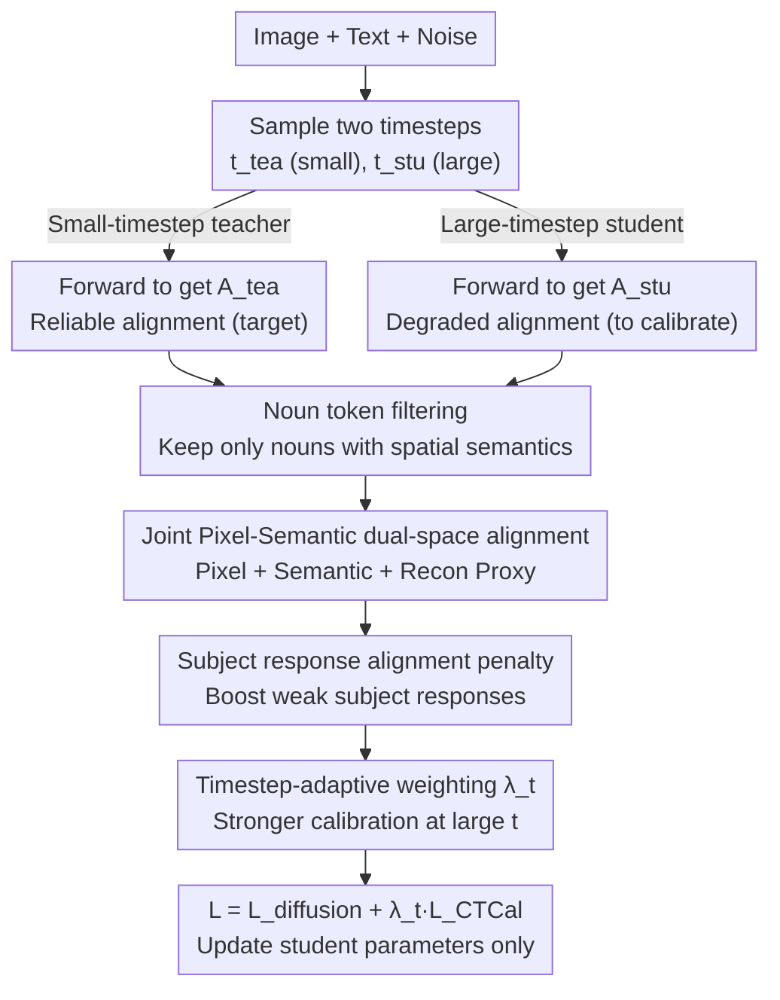

# CTCal: Rethinking Text-to-Image Diffusion Models via Cross-Timestep Self-Calibration

**Conference**: CVPR 2026  
**arXiv**: [2603.20741](https://arxiv.org/abs/2603.20741)  
**Code**: [https://github.com/xiefan-guo/ctcal](https://github.com/xiefan-guo/ctcal)  
**Area**: Image Generation / Text-to-Image Diffusion Models  
**Keywords**: Text-to-Image Generation, Diffusion Models, Cross-Attention Alignment, Self-Calibration, Compositional Generation

## TL;DR
Proposes CTCal (Cross-Timestep Self-Calibration), which utilizes reliable text-image alignment (cross-attention maps) formed at small timesteps (low noise) to calibrate representation learning at large timesteps (high noise). This provide explicit cross-timestep self-supervision for text-to-image generation, outperforming existing methods on T2I-CompBench++ and GenEval.

## Background & Motivation

**Background**: Diffusion models dominate text-to-image (T2I) generation, but precise text-image alignment (especially in compositional generation for complex prompts) remains an open challenge.

**Limitations of Prior Work**: (1) Traditional diffusion loss provides only implicit supervision, making it difficult to capture fine-grained text-image correspondences; (2) Inference-time optimization methods (e.g., Attend-and-Excite) suffer from poor generalization and lack of scalability; (3) Significant noise at large timesteps causes cross-attention map degradation, preventing the establishment of correct alignment—a critical bottleneck for generation quality.

**Key Challenge**: Alignment at small timesteps is accurate but "too easy," while alignment at large timesteps is poor but "critical" (determining generation quality in the initial stages of inference).

**Goal**: How to provide explicit supervision to establish correct text-image correspondences at large timesteps for diffusion models?

**Key Insight**: **Key Observation**—For the same image-text-noise triplet, the quality of cross-attention maps extracted at different timesteps during training varies significantly: maps at small timesteps are highly consistent with real image structure and semantics, while those at large timesteps are completely degraded.

**Core Idea**: Use reliable attention maps from small timesteps ("teacher") to calibrate those at large timesteps ("student"), achieving a self-teaching mechanism.

## Method

### Overall Architecture
Given an image, text, and noise, two timesteps $t_{\text{tea}} < t_{\text{stu}}$ are sampled. Cross-attention maps $\mathbf{A}_{\text{tea}}$ and $\mathbf{A}_{\text{stu}}$ are obtained through forward passes. $\mathbf{A}_{\text{tea}}$ serves as the target to calibrate $\mathbf{A}_{\text{stu}}$, optimizing only the network parameters corresponding to $t_{\text{stu}}$. The pipeline is a "self-teaching" dual-branch structure: the same triplet produces reliable teacher alignment in the small-timestep branch and degraded student alignment in the large-timestep branch. Calibration signals are then injected into the diffusion loss through noun filtering, dual-space alignment, subject balancing, and adaptive weighting.

### Key Designs

**1. Noun token selection: Calibrating only attention that carries spatial semantics**

Aligning large-timestep cross-attention maps directly with small-timestep versions faces a pitfall: tokens like "the", "and", and "of" do not point to specific objects. Their attention distributions are divergent and meaningless. Forcing the student to fit this noise misaligns useful object localization. CTCal uses Stanza for POS tagging to isolate the noun set $\mathcal{Y}_{\text{noun}}$, and the calibration loss is only accumulated over these tokens:

$$\mathcal{L}_{\text{CTCal}} = \frac{1}{N_{\text{noun}}} \sum_{\mathbf{y}_i \in \mathcal{Y}_{\text{noun}}} \mathcal{D}(\mathbf{A}_{\text{stu},\mathbf{y}_i}, \mathbf{A}_{\text{tea},\mathbf{y}_i})$$

Where $\mathcal{D}$ measures the difference between student and teacher attention maps. This filtering is crucial—ablation shows that applying constraints to all tokens (naive version) causes Color scores to drop from 0.463 to 0.629 and 2D-Spatial from 0.178 to 0.169.

**2. Joint Pixel-Semantic dual-space alignment: Aligning positions, meanings, and preventing collapse**

Pixel-level alignment catches spatial information but misses high-level semantic consistency. While a semantic encoder could map these, it risks a degenerate solution (mode collapse). CTCal employs a lightweight autoencoder $(f^{\text{enc}}, f^{\text{dec}})$ with a reconstruction proxy task:

$$\mathcal{L}_{\text{CTCal}} = \lambda_1 \underbrace{\mathcal{D}(\mathbf{A}_{\text{stu}}, \mathbf{A}_{\text{tea}})}_{\text{Pixel}} + \lambda_2 \underbrace{\mathcal{D}(f^{\text{enc}}(\mathbf{A}_{\text{stu}}), f^{\text{enc}}(\mathbf{A}_{\text{tea}}))}_{\text{Semantic}} + \lambda_3 \underbrace{\mathcal{D}(f^{\text{dec}}(\mathbf{A}_{\text{tea}}), \mathbf{A}_{\text{tea}})}_{\text{Reconstruction}}$$

The pixel term ensures spatial alignment, the semantic term ensures high-level consistency, and the reconstruction term forces the encoder to retain sufficient information, preventing it from mapping all inputs to a constant.

**3. Subject response alignment regularization: Preventing dominant subjects from suppressing weak ones**

In compositional generation, a typical failure is "cat and dog" resulting in only a "cat" because its attention response is significantly higher. Strong subjects occupy the frame during early denoising. CTCal adds a regularization term to align subject responses toward the current maximum:

$$\mathcal{R}_{\text{subject}} = \frac{1}{N_{\text{noun}}} \sum \text{ReLU}\big(\mathcal{S}_{\text{attn}} - \max(\mathbf{A}_{\text{stu},\mathbf{y}_i}) - \tau\big)$$

Using ReLU with a threshold $\tau$ applies a penalty only when the response gap exceeds a certain tolerance, "lifting" lagging subjects to ensure balanced representation.

**4. Timestep-adaptive weighting: Focusing calibration on large timesteps**

CTCal prioritizes large timesteps where alignment is degraded. At small timesteps, alignment is already sufficient and traditional diffusion loss is effective. It uses a weighting factor $\lambda_t = t_{\text{stu}} / T_{\text{train}}$ that increases linearly with the timestep, ensuring supervision is targeted at the high-noise bottleneck.

### Loss & Training
- $\mathcal{L} = \mathcal{L}_{\text{diffusion}} + \lambda_t \mathcal{L}_{\text{CTCal}}$
- Uses LoRA to fine-tune text encoder self-attention layers and denoising network attention layers.
- Sets $t_{\text{tea}}=0$ for SD 2.1; for SD 3, $t_{\text{tea}}$ is selected based on the logit-normal sampling distribution.
- Dataset: High-quality text-image pairs selected from generated data using reward-driven methods.

## Key Experimental Results

### Main Results — T2I-CompBench++

| Method | Color↑ | Shape↑ | 2D-Spatial↑ | Numeracy↑ | Complex↑ |
|------|--------|--------|------------|----------|---------|
| SD 2.1 | 0.507 | 0.422 | 0.134 | 0.458 | 0.339 |
| SD 2.1 + AE | 0.640 | 0.452 | 0.146 | 0.477 | 0.340 |
| SD 2.1 + GORS | 0.643 | 0.486 | 0.178 | 0.486 | 0.337 |
| **SD 2.1 + CTCal** | **0.723** | **0.515** | **0.214** | **0.508** | **0.340** |
| SD 3 (2B) | 0.813 | 0.589 | 0.320 | 0.617 | 0.377 |
| **SD 3 + CTCal** | **0.844** | **0.597** | **0.348** | **0.629** | **0.381** |

### GenEval

| Method | Overall↑ | Two Object↑ | Counting↑ | Colors↑ | Position↑ |
|------|---------|-------------|----------|---------|-----------|
| SD 3 (2B) | 0.62 | 0.74 | 0.63 | 0.67 | 0.34 |
| **SD 3 + CTCal** | **0.69** | **0.85** | **0.70** | **0.79** | **0.38** |

### Ablation Study

| Configuration | Color↑ | 2D-Spatial↑ | Description |
|------|--------|------------|------|
| SD 2.1 + GORS Baseline | 0.643 | 0.178 | - |
| + Naive full token constraint (a) | 0.629 (-2.2%) | 0.169 (-4.6%) | Performance decrease! |
| + Noun selection (b) | Sig. Improve | Sig. Improve | Noun selection is vital |
| + Pixel+Semantic (c) | Sig. Improve | Sig. Improve | Joint optimization works |
| + Response alignment (d) | Sig. Improve | Sig. Improve | Subject balance helps |
| + Adaptive weighting (e) | **Optimal** | **Optimal** | Full CTCal |

### Key Findings
- Noun selection is the most critical design—unconstrained alignment of all tokens harms performance.
- CTCal is effective for both UNet-based SD 2.1 and MM-DiT-based SD 3, demonstrating universality.
- User studies show overwhelming preference for CTCal (SD 2.1: 76.67%, SD 3: 54.17%).

## Highlights & Insights
- **Training Phase Perspective**: Unlike inference-time optimization, CTCal addresses alignment during training, providing lasting effects without inference overhead.
- **Self-Supervised Paradigm**: The model teaches its noisier self using its own low-noise output, requiring no additional labels or teacher models.
- **Model Agnostic**: Compatible with both U-Net (SD 2.1) and Transformer (SD 3) architectures.

## Limitations & Future Work
- Training data construction relies on reward-driven sampling, which is computationally expensive.
- LoRA is used for fine-tuning; the effects of full fine-tuning remain unexplored.
- Noun selection depends on POS tagging tools, with unknown applicability to non-English prompts.

## Related Work & Insights
- Inference-time methods like Attend-and-Excite inspired the focus on cross-attention, but CTCal solves the problem more elegantly at the training stage.
- GORS's reward-driven data selection provides a foundation upon which CTCal adds explicit alignment supervision.

## Rating
- Novelty: ⭐⭐⭐⭐⭐ Cross-timestep self-calibration is a novel and elegant idea.
- Experimental Thoroughness: ⭐⭐⭐⭐⭐ Validated across benchmarks, two model architectures (SD 2.1/SD 3), and user studies.
- Writing Quality: ⭐⭐⭐⭐⭐ Logical flow from observation to design to verification.
- Value: ⭐⭐⭐⭐⭐ Offers substantial improvement for T2I text-image alignment.

<!-- RELATED:START -->

## Related Papers

- [\[CVPR 2026\] RebRL: Reinforcing Discrete Visual Diffusion Models with Rebalanced Timestep Credits](rebrl_reinforcing_discrete_visual_diffusion_models_with_rebalanced_timestep_cred.md)
- [\[CVPR 2026\] A Self-Conditioned Representation Guided Diffusion Model for Realistic Text-to-LiDAR Scene Generation](a_self-conditioned_representation_guided_diffusion_model_for_realistic_text-to-l.md)
- [\[CVPR 2026\] OctoT2I: A Self-Evolving Agentic Text-to-Image Router](octot2i_a_self-evolving_agentic_text-to-image_router.md)
- [\[CVPR 2026\] Neighbor-Aware Localized Concept Erasure in Text-to-Image Diffusion Models](neighbor-aware_localized_concept_erasure_in_text-to-image_diffusion_models.md)
- [\[CVPR 2026\] Self-Evaluation Unlocks Any-Step Text-to-Image Generation](self-evaluation_unlocks_any-step_text-to-image_generation.md)

<!-- RELATED:END -->
