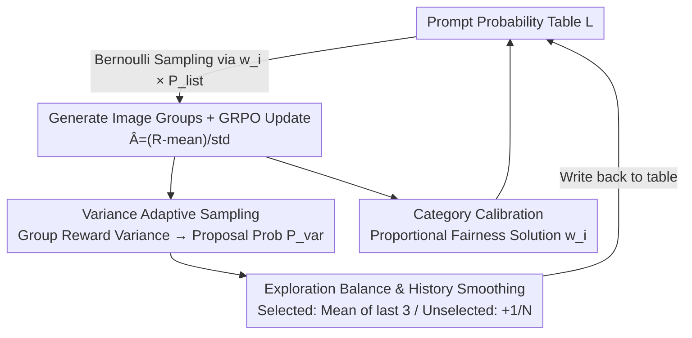

# Curriculum Group Policy Optimization: Adaptive Sampling for Unleashing the Potential of Text-to-Image Generation

**Conference**: CVPR 2026  
**Paper**: [CVF Open Access](https://openaccess.thecvf.com/content/CVPR2026/html/Li_Curriculum_Group_Policy_Optimization_Adaptive_Sampling_for_Unleashing_the_Potential_CVPR_2026_paper.html)  
**Code**: https://github.com/PRIS-CV/CGPO  
**Area**: Text-to-Image / Reinforcement Learning / GRPO  
**Keywords**: GRPO, T2I, Curriculum Learning, Adaptive Sampling, Reward Variance

## TL;DR
To address the issue in GRPO training for text-to-image (T2I) where "uniform sampling causes half the prompts to yield no learning gain," CGPO utilizes the **reward variance** of an image group per prompt as an online signal for "partially mastered but unstable" learning. By adaptively increase sampling for prompts in this learning "sweet spot" and applying proportional fairness for category calibration, CGPO achieves performance gains and accelerates training speed by 2x on GenEval, T2I-CompBench++, and DPG Bench.

## Background & Motivation
**Background**: Reinforcement learning (RL) fine-tuning for text-to-image (T2I) generation is shifting from PPO to GRPO. GRPO eliminates the need for a separate value network by sampling a group of images for the same prompt and estimating gradients using relative intra-group advantages. This avoids the cost of training a critic in high-dimensional visual spaces. Flow-GRPO further integrates this with flow matching models, establishing it as a mainstream approach.

**Limitations of Prior Work**: Most existing methods rely on **uniform sampling**, where each prompt has an equal probability of being selected. However, the "learning gain" of different prompts varies significantly under the current policy: simple prompts that are already handled stably provide almost no new signal, while difficult prompts far beyond the model's current capability remain unlearnable. Uniform sampling fills batches with samples of low marginal utility, leading to poor sample utilization and slow convergence.

**Key Challenge**: The most informative prompts should be neither too easy nor too difficult, matching the model's **current** ability—a concept known in pedagogy as the "Zone of Proximal Development" (ZPD). However, difficulty is dynamic: as the model improves, the prompts located in the sweet spot constantly change. Traditional curriculum learning uses predefined difficulty labels to sort from easy to hard, which is difficult to define reliably for large-scale data and is **static**, failing to evolve with the model.

**Goal**: To identify "still learnable" prompts online and dynamically without any additional difficulty annotations, and to continuously tilt the sampling budget toward them.

**Key Insight**: Theoretically, the learning signal is strongest when the prompt success probability $p(x) \approx 0.5$ (inconsistent model performance). The authors' key observation is that since GRPO naturally generates a group of images and calculates a set of rewards for each prompt, the **variance** of these rewards serves as a natural online proxy for "prompt inconsistency." High variance indicates the model sometimes succeeds and sometimes fails, denoting a partially mastered state that falls exactly within the ZPD.

**Core Idea**: Treat group reward variance as a free online difficulty signal, increasing the sampling probability for high-variance prompts to allow the curriculum to evolve automatically with model capability, while using proportional fairness calibration to balance difficulty differences across multiple categories.

## Method

### Overall Architecture
CGPO seamlessly embeds an "adaptive curriculum" into the GRPO training loop, forming a closed loop that self-updates every iteration. The system maintains a prompt-probability table $L_{\text{probability}} = \{(p_1, P_1^{\text{list}}), \dots, (p_N, P_N^{\text{list}})\}$ to record the current sampling probability of each prompt. Each training round consists of four stages: **① Probabilistic Sampling** selects a batch of prompts based on current probabilities; **② Policy Update** generates image groups, calculates GRPO advantages, and updates the T2I model; **③ Probability Calculation** derives a "proposal probability" from the group reward variance; **④ Probability Update** applies historical smoothing for selected prompts and exploration compensation for unselected ones before updating the table. Concurrently, a **Category Calibration** module periodically calculates calibration coefficients $w_i$ based on average category rewards to balance difficulty at the category level.

Among the four stages, ② represents standard GRPO (scaffolding), while the core contributions involve "Variance $\to$ Sampling Probability" (①③), "Exploration Balance & History Smoothing" (④), and "Category Calibration."

### Key Designs

**1. Variance Adaptive Sampling: Reward Variance as an Online Proxy for ZPD**

This core component addresses the budgetary waste of uniform sampling on zero-gain samples. During training, each prompt $p$ generates a group of $G$ images. The reward model scores each image $R_{x_i}$, and the variance of these rewards is calculated as a measure of inconsistency:

$$V_p = \text{Var}(\{R_{x_1}, \dots, R_{x_G}\}) = \frac{1}{G}\sum_{i=1}^{G}(R_{x_i} - \mu_x)^2$$

High variance implies the model performs inconsistently on the same prompt—indicating samples that are partially mastered and have the most room for learning. Low variance indicates the model is either consistently correct or consistently wrong, offering little to learn. Within each batch $S_b$, variance is linearly normalized into a "proposal probability":

$$P^{\text{var}}(p) = \frac{V_p - \min(V)}{\max(V) - \min(V)}$$

Sampling uses a **Poisson/Bernoulli** approach: each prompt is treated as an independent Bernoulli trial. Rejection sampling is layered on top to fill the batch. This design ensures that a prompt's probability is not "squeezed out" by others, preserving opportunities for high-value prompts. The final sampling probability is $w_i \times P_i^{\text{list}}$. This mechanism relies purely on natural training signals, allowing the curriculum to drift as the model evolves. Visualizations show high-probability prompts shifting from Level 1 (3–4 objects) $\to$ Level 2 $\to$ Level 3 (9–10 objects), indicating the automatic progression of the ZPD.

**2. Exploration Balance & History Smoothing: Preventing Neglect and Forgetting**

Updating the probability table solely with proposal probabilities risks two issues: low-probability prompts might never be selected again (even as they become learnable), and abrupt drops in probability for selected prompts can lead to catastrophic forgetting. A piecewise update rule addresses both:

$$P^{\text{list}'}(p) = \begin{cases} \dfrac{1}{3}\sum_{t-2}^{t}P_{(t)}^{\text{var}}(p), & p \in S_b \\[2mm] P^{\text{list}}(p) + \dfrac{1}{N}, & p \notin S_b \end{cases}$$

For **selected** prompts, history smoothing via the mean of the last three $P^{\text{var}}$ values prevents sudden probability drops. For **unselected** prompts, a small increment of $1/N$ (where $N$ is the dataset size) is added each round, ensuring they eventually receive another chance to be sampled. This allows the sampling focus to migrate smoothly from easy to hard. Ablation shows this adds +0.59 to the overall score.

**3. Category Calibration: Biasing Budget toward Weak Categories**

Different reward "categories" (e.g., Counting, Position) often have varying evaluation standards and reward scales, leading to performance imbalances. The authors use **Proportional Fairness Optimization** to solve for calibration coefficients:

$$\max_{q} \sum_{i=1}^{c}\log(q_i) - \lambda \cdot \text{KL}(v\|q) \quad \text{s.t.} \ q_i \ge 0, \ \sum_{i=1}^{c}q_i = 1$$

Where $\sum\log(q_i)$ is the proportional fairness term and $-\lambda \cdot \text{KL}(v\|q)$ constrains the solution near a reference distribution $v$, where $v_i = \frac{1/r_i}{\sum_j 1/r_j}$ is based on the average reward $r_i$ of each category. The closed-form solution is $q_i = \frac{1+\lambda v_i}{c+\lambda}$. This tilts the budget toward categories with poorer performance.

### Loss & Training
The policy update follows GRPO, calculating relative advantages within image groups:

$$\hat{A}_i = \frac{R(x_i, p) - \text{mean}(\{R(x_i, p)\}_{i=1}^{G})}{\text{std}(\{R(x_i, p)\}_{i=1}^{G})}$$

Standard GRPO loss is used to update the T2I model. The baseline is SD3.5-Medium using the Flow-GRPO framework. LoRA fine-tuning ($\alpha=64, r=32$) is applied with 48 prompts per batch and $G=24$. Training uses 10 denoising steps for speed, while inference uses 40 steps for quality, all executed on 8 H100 GPUs.

## Key Experimental Results

### Main Results
Evaluation is conducted on GenEval, T2I-CompBench++, and DPG Bench.

GenEval (Same Model):

| Task | SD3.5-M | Flow-GRPO | CGPO (Ours) |
|------|---------|-----------|-------------|
| Single object | 0.98 | 1.00 | **1.00** |
| Two object | 0.78 | 0.99 | **0.99** |
| Counting | 0.50 | 0.95 | **0.96** |
| Colors | 0.81 | 0.93 | **0.94** |
| Position | 0.24 | 0.98 | **0.99** |
| Attribute | 0.52 | 0.82 | **0.89** |
| **Overall** | 0.63 | 0.94 | **0.96** |

CGPO leads in all tasks, specifically outperforming Flow-GRPO by 0.07 in Attribute Binding. On T2I-CompBench++, it achieves optimal results in most sub-tasks. In DPG Bench, it achieves an Overall score of 85.5.

**Training Efficiency**: To reach the peak performance of Flow-GRPO (0.944), CGPO requires only **160 GPU hours**, approximately **2x faster training speed** compared to Flow-GRPO.

### Ablation Study
Incremental gains on GenEval starting from Flow-GRPO (94.42%):

| Configuration | Overall (%) | Gain |
|------|-------------|---------------|
| baseline (Flow-GRPO) | 94.42 | – |
| + Probabilistic Sampling (Variance Adaptive) | 95.15 | +0.73 |
| + Exploration Balance | 95.74 | +1.32 |
| + Category Calibration | 96.10 | +1.68 |

### Key Findings
- **Variance Adaptive Sampling is the primary contributor**: Provides the foundation with a +0.73 gain, proving reward variance as an effective ZPD proxy.
- **Exploration balance recovers late-stage hard samples**: Adds +0.59. Without it, hard prompts are neglected early; with it, the sampling focus can shift dynamically.
- **Category calibration provides final refinement**: Adds +0.36 by mitigating inherent difficulty gaps between reward dimensions.
- **Curriculum evolution is verified**: High-probability prompts transition from Level 1 to Level 3 object counts as training steps increase, confirming the ZPD moves backward automatically.

## Highlights & Insights
- **Turning training by-products into free signals**: CGPO reuses reward variance with near-zero overhead as an online ZPD proxy, eliminating the need for pre-annotated difficulty.
- **Logical Chain**: The link between ZPD $\leftrightarrow$ success probability $0.5 \leftrightarrow$ reward variance provides a clean, computable metric transferable to any RLHF/GRPO scenario using multiple samples per input.
- **Balanced Mechanisms**: The combination of historical smoothing and $1/N$ increments provides a robust solution for the exploration-exploitation trade-off and catastrophic forgetting.

## Limitations & Future Work
- **Boundary of Reward Variance as a Proxy**⚠️: High variance could stem from reward model noise or prompt ambiguity rather than learnability. The paper does not explicitly distinguish "learnable inconsistency" from "noise-induced inconsistency."
- **Narrow Category Definition**: Category calibration relies on clear labels (like GenEval). Its application to open-ended data without explicit category divisions is less clear.
- **Efficiency over Absolute Gain**: The marginal performance gain over Flow-GRPO (+0.02) is small; the primary value lies in the 2x acceleration.
- **Hyper-parameter Sensitivity**: Sensitivity analysis for $\lambda$ and the $1/N$ increment step size is lacking, making the cost of tuning for new datasets uncertain.

## Related Work & Insights
- **vs Flow-GRPO**: While Flow-GRPO brings GRPO to flow matching, it uses uniform sampling. CGPO is an orthogonal enhancement that reallocates the budget for a 2x speedup.
- **vs Static Curriculum Learning**: Unlike methods that rely on predefined sorts or clustering, CGPO is fully online and requires no difficulty labels, evolving with the model's capabilities.
- **vs PCL (Prompt Curriculum Learning)**: PCL identifies the $0.5$ success probability threshold; CGPO implements this principle via the "group reward variance" metric without explicit probability estimation.

## Rating
- Novelty: ⭐⭐⭐⭐ Uses group reward variance as an online ZPD proxy for an adaptive curriculum—an elegant fit for the GRPO structure.
- Experimental Thoroughness: ⭐⭐⭐⭐ Solid results across three benchmarks with ablation and visualization, though lacking extensive hyper-parameter studies.
- Writing Quality: ⭐⭐⭐⭐ Clear logical progression from ZPD theory to implementation.
- Value: ⭐⭐⭐⭐ Plug-and-play sampling improvement with 2x training acceleration for T2I RL fine-tuning.

<!-- RELATED:START -->

## Related Papers

- [\[CVPR 2026\] Synthetic Curriculum Reinforces Compositional Text-to-Image Generation](synthetic_curriculum_reinforces_compositional_text-to-image_generation.md)
- [\[CVPR 2026\] MaskFocus: Focusing Policy Optimization on Critical Steps for Masked Image Generation](maskfocus_focusing_policy_optimization_on_critical_steps_for_masked_image_genera.md)
- [\[CVPR 2026\] POCA: Pareto-Optimal Curriculum Alignment for Visual Text Generation](poca_pareto-optimal_curriculum_alignment_for_visual_text_generation.md)
- [\[CVPR 2026\] Denoising, Fast and Slow: Difficulty-Aware Adaptive Sampling for Image Generation](denoising_fast_and_slow_difficulty-aware_adaptive_sampling_for_image_generation.md)
- [\[CVPR 2026\] Seeing What Matters: Visual Preference Policy Optimization for Visual Generation](seeing_what_matters_visual_preference_policy_optimization_for_visual_generation.md)

<!-- RELATED:END -->
