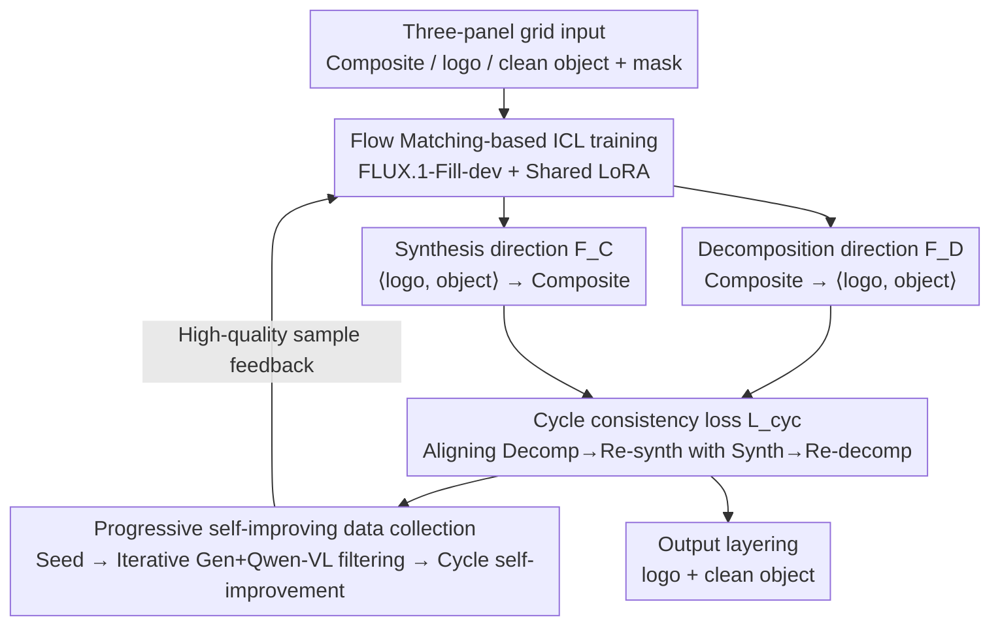

# Cycle-Consistent Tuning for Layered Image Decomposition

**Conference**: CVPR 2026  
**arXiv**: [2602.20989](https://arxiv.org/abs/2602.20989)  
**Code**: None (Project page available)  
**Area**: Image Decomposition / Image Editing  
**Keywords**: Image Decomposition, Cycle Consistency, Diffusion Models, LoRA Fine-tuning, In-Context Learning

## TL;DR

Ours proposes a cycle-consistent fine-tuning framework based on diffusion models. By jointly training a decomposition model and a synthesis model to achieve image layer separation (e.g., logo-object decomposition) and introducing a progressive self-improving data augmentation strategy, it achieves robust decomposition in non-linear layer interaction scenarios.

## Background & Motivation

Image decomposition (splitting an image into semantically or physically meaningful layers) is a classic problem in CV and CG:
- Traditional methods (e.g., intrinsic decomposition) are mostly limited to linear interactions (alpha blending), making it difficult to handle non-linear coupling such as lighting, perspective distortion, and material reflections.
- Separating logos from product photos involves global non-linear interactions (shadows, perspective deformation, surface reflections).
- Existing generative editing methods (e.g., ICEdit, Flux-Kontext) can remove logos but struggle to accurately isolate and extract them.
- Decomposition is an under-determined problem (more unknowns than inputs), requiring additional constraints.

**Key Insight**: This paper treats decomposition as the inverse process of synthesis: simultaneously learning decomposition and synthesis while imposing cycle-consistency constraints, using the determinacy of the synthesis direction to constrain the uncertainty of the decomposition direction.

## Method

### Overall Architecture

Based on FLUX.1-Fill-dev (a pre-trained diffusion inpainting model), light-weight fine-tuning is performed via LoRA for the decomposition task. An In-Context Learning paradigm is adopted: the input is a three-panel grid image (composite / logo / clean object), and the model learns to separate two layers from the composite image. Built upon this ICL foundation, this paper uses cycle consistency to bind the decomposition and synthesis directions into a dual loop for mutual supervision, with a progressive self-improving data collection strategy continuously feeding high-quality layered samples back into training.

### Key Designs

**1. Cycle-Consistent Decomposition-Synthesis Framework: Using synthesis determinacy to constrain decomposition under-determinacy**

Decomposition is an under-determined problem—there are infinite ways to split a logo and an object in a product image. Without additional constraints, models easily misattribute shadows or reflections to the wrong layer. This paper leverages the fact that "synthesis is the inverse of decomposition": it simultaneously learns a decomposition function $\mathcal{F}_D(I)=\langle A,B\rangle$ and a synthesis function $\mathcal{F}_C(\langle A,B\rangle)=I$, where both share the same LoRA parameters. During training, data flows in two directions: one decomposes $\langle A',B'\rangle$ from composite $I$ and then re-synthesizes $I'$, while the other synthesizes $I^*$ from known layers $A,B$ and then re-decomposes $\langle A^*,B^*\rangle$. The cycle-consistency loss aligns these two paths:

$$\mathcal{L}_{cyc} = \mathbb{E}\left[\|v_\theta(x_{t_1}^I, M_D, t_1, \tau_D) - v_\theta(x_{t_1}^{I^*}, M_D, t_1, \tau_D)\|_2^2\right] + \mathbb{E}\left[\|v_\theta(x_{t_2}^{\langle A,B\rangle}, M_C, t_2, \tau_C) - v_\theta(x_{t_2}^{\langle A',B'\rangle}, M_C, t_2, \tau_C)\|_2^2\right]$$

The synthesis direction is relatively deterministic (the composite of two layers is largely unique), serving as an "answer checker" for the decomposition direction: if the decomposition is wrong, the re-synthesized image will not match the original, and the cycle loss immediately penalizes it. This mutual supervision reduces dependence on large-scale pixel-level annotated layered data.

**2. Progressive Self-Improving Data Collection: Bootstrapping high-quality layered data from a hundred seed samples**

There is almost no off-the-shelf paired training data for logo-object decomposition. This paper scales up data using a three-stage bootstrap: first, a seed stage uses 100 manually annotated triplets plus GPT-4o assistance to train a rough initial IC-LoRA; then, an iterative generation stage uses the current IC-LoRA to batch-generate candidate triplets, filtering poor results with Qwen-VL and retraining with the remainder; finally, a cycle model self-improvement stage lets the cycle-consistent model perform a "decomposition → re-synthesis" loop on new composites, keeping only samples where the re-synthesis closely matches the original. A key piece of evidence is that the selection rate of high-quality samples increases monotonically with rounds—from ~20% in Round 1 to over 60% in Round 10—indicating the model effectively improves itself.

**3. Flow Matching-based ICL Training: Disguising layering tasks as inpainting to reuse pre-trained diffusion context capabilities**

To avoid training a layering model from scratch, this paper embeds the task into the FLUX.1-Fill-dev pre-trained inpainting framework. The input is a three-panel grid (composite / logo / clean object), using a mask to indicate which panels the model should generate (ones) and which are given contexts to keep (zeros). Layering thus becomes "inpainting corresponding layers in the empty panels of the grid." Only LoRA parameters are fine-tuned, with the training objective being the flow matching reconstruction loss:

$$\mathcal{L}_{rec} = \mathbb{E}_{x,t}\left[\|v_\theta(x_t, M, t, \tau) - \frac{\partial x_t}{\partial x}\|_2^2\right]$$

The benefit is that a single input can produce multiple layers at once (a visual version of in-context learning) while inheriting existing image priors from the base model at nearly zero cost, without changing the network architecture.

### Loss & Training

- Total Loss = Flow Matching Reconstruction Loss + Cycle Consistency Loss.
- Decomposition and synthesis share the same LoRA parameters to improve parameter efficiency and stabilize training.
- The self-improving data loop uses Qwen-VL for automatic filtering + simple manual checks.

## Key Experimental Results

### Main Results

| Method | Logo VQAScore↑ | Object VQAScore↑ | Mean VLMScore↑ |
|------|---------------|-----------------|--------------|
| AssetDropper | 0.42 | — | — |
| ICEdit | 0.31 | 0.31 | 2.55 |
| Flux-Kontext | 0.40 | 0.32 | 3.79 |
| Gemini | 0.42 | 0.32 | 4.20 |
| **Ours** | **0.43** | 0.31 | **4.22** |

Evaluated on 1.5K synthetic test samples, Ours achieves optimal logo extraction quality and the highest overall score.

### Ablation Study

| Configuration | Effect Description |
|------|---------|
| Round 0 IC-LoRA only | Poor separation quality, heavy logo residue |
| + Iterative data generation | Significant improvement in decomposition |
| + Cycle consistency | Significant boost in logo fidelity |
| + Self-improvement (Full model) | Further gains in object consistency and realism |

Generalization experiments: On intrinsic decomposition (MAW dataset), it achieved Intensity 0.57 / Chromaticity 3.54, close to dedicated SOTA methods.

### Key Findings

- Cycle consistency is the largest single contributor to decomposition quality improvement.
- The high-quality sample selection rate in the self-improving data strategy grows continuously across rounds (from ~20% to >60%).
- In user studies, the method was ranked first in over 50% of cases.
- The framework generalizes to different tasks like intrinsic decomposition and foreground-background separation.

## Highlights & Insights

- The insight that "decomposition and synthesis are dual processes" is elegant—using a deterministic process (synthesis) to constrain an under-determined problem (decomposition).
- The progressive data bootstrapping starts from only 100 seed samples and gradually expands the high-quality training set, demonstrating exceptional data efficiency.
- A single LoRA simultaneously encodes decomposition and synthesis capabilities, ensuring high parameter efficiency.
- Unlike manipulation-style methods (e.g., Attend-and-Excite), this method requires zero modifications to the base model.

## Limitations & Future Work

- Performance degrades when overlaid elements dominate the frame (e.g., large-scale wall advertisements).
- Currently only supports two-layer decomposition and cannot handle multiple overlapping logos.
- Restricted by the ICL grid paradigm; extending to more layers requires architectural adjustments.
- Training data is biased toward product logo scenarios; additional adaptation is needed for other types of overlays (e.g., watermarks, stickers).

## Related Work & Insights

- Comparison with AssetDropper: The latter uses reward-driven optimization to extract assets but cannot recover the underlying object.
- Difference from DecompDiffusion: The latter trains independent models for different layers, whereas Ours shares a single model.
- The cycle-consistency idea could potentially be extended to motion/lighting/multimodal decomposition.
- The progressive self-improving data strategy provides a broad reference for data-scarce scenarios.

## Rating

- Novelty: ⭐⭐⭐⭐ The combination of cycle consistency and self-improving data strategy is novel; the decomposition-synthesis duality is elegant.
- Experimental Thoroughness: ⭐⭐⭐⭐ Complete quantitative/qualitative/ablation/user study/generalization experiments.
- Writing Quality: ⭐⭐⭐⭐ Clear structure; smooth logic from motivation to method to verification.
- Value: ⭐⭐⭐ The application scenario (logo extraction) is relatively niche, but the framework's core idea is generalizable.

<!-- RELATED:START -->

## Related Papers

- [\[CVPR 2026\] Qwen-Image-Layered: Towards Inherent Editability via Layer Decomposition](qwen-image-layered_towards_inherent_editability_via_layer_decomposition.md)
- [\[CVPR 2026\] High-Fidelity Virtual Try-On beyond Paired Data Scarcity via Diffusion-based Cycle-Consistent Learning](high-fidelity_virtual_try-on_beyond_paired_data_scarcity_via_diffusion-based_cyc.md)
- [\[CVPR 2026\] From Inpainting to Layer Decomposition: Repurposing Generative Inpainting Models for Image Layer Decomposition](from_inpainting_to_layer_decomposition_repurposing_generative_inpainting_models_.md)
- [\[AAAI 2026\] EchoGen: Cycle-Consistent Learning for Unified Layout-Image Generation and Understanding](../../AAAI2026/image_generation/echogen_cycle-consistent_learning_for_unified_layout-image_generation_and_unders.md)
- [\[CVPR 2026\] Match-and-Fuse: Consistent Generation from Unstructured Image Sets](match-and-fuse_consistent_generation_from_unstructured_image_sets.md)

<!-- RELATED:END -->
