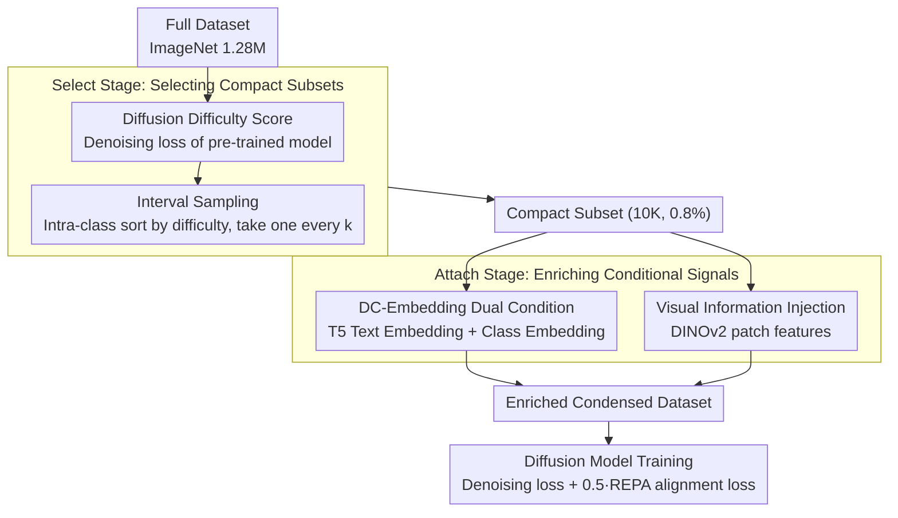

# D2C: Accelerating Diffusion Model Training under Minimal Budgets via Condensation

**Conference**: CVPR 2026  
**arXiv**: [2507.05914](https://arxiv.org/abs/2507.05914)  
**Code**: None (but method is fully reproducible)  
**Area**: Image Generation / Efficient Training / Dataset Distillation  
**Keywords**: Diffusion model training, Dataset Condensation, Difficulty Scoring, Interval Sampling, REPA acceleration  

## TL;DR
This work is the first to apply Dataset Condensation (DC) to diffusion model training, proposing the two-stage D2C framework. The Select stage uses a diffusion difficulty score and interval sampling to select a compact subset, while the Attach stage appends textual and visual representations to each sample. Using only 0.8% of ImageNet (10K images), it achieves an FID of 4.3 in 40K steps, which is 100× faster than REPA and 233× faster than vanilla SiT.

## Background & Motivation
Training diffusion models is extremely resource-intensive—SiT-XL/2 requires 7 million steps on 1.28 million images. While methods like REPA optimize from the model side (representation alignment), the possibility of reducing the training set from the data side remains unexplored. Dataset Condensation (DC) is well-studied for discriminative models, but directly applying existing DC methods (e.g., SRe2L, RDED) to diffusion training leads to collapse. This occurs because DC methods optimize for class-discriminative features rather than true image distributions, resulting in synthetic images with poor structural and semantic fidelity.

## Core Problem
Can dataset condensation reduce training data to 0.8–8% of its original size while maintaining the generation quality of diffusion models and significantly accelerating training convergence?

## Method

### Overall Architecture

D2C aims to address whether training data can be reduced to 0.8–8% while preserving generation quality and substantially accelerating convergence. It is a two-stage framework: the Select stage uses a pre-trained diffusion model to calculate a denoising difficulty score for each sample and selects a compact subset via interval sampling $k$ after sorting by difficulty; the Attach stage then appends two types of information to the selected samples (DC-Embedding for text+class and DINOv2 visual features for REPA-style alignment), enabling high-quality model training on minimal data.

### Key Designs

**1. Diffusion Difficulty Score: Measuring Sample Complexity via Denoising Loss**

To select samples, a difficulty metric is required. The authors use the average denoising loss of samples on a pre-trained diffusion model as the difficulty score: $s_{diff}(x) = -p_\theta(x|c) \propto -\mathbb{E}[\|\epsilon - \epsilon_\theta(x_t, t, c)\|^2]$. A high loss implies the model finds the sample hard to predict (complex or blurry). Through Bayesian derivation $p_\theta(c|x) \propto p_\theta(x|c)$, the denoising loss directly reflects the confidence of a sample belonging to a certain class. A key finding is that neither the easiest (Min) nor the hardest (Max) samples are optimal—Min samples lack diversity, while Max samples are too noisy to learn; medium-difficulty samples exhibit the smallest distribution discrepancy (U-shaped curve, Fig. 8 Right).

**2. Interval Sampling: Taking One Every k Samples by Difficulty**

Given the difficulty scores, samples must be selected uniformly. Within each class, samples are sorted by difficulty and one is taken every $k$ samples, where $k$ is proportional to the dataset size (e.g., $k=96$ for a 10K subset). This naturally covers the range from easy to medium-hard while avoiding extremely difficult samples. This performs better than "picking only the middle" (Medium) because skipping easy samples entirely results in a loss of base distribution coverage.

**3. DC-Embedding: Restoring Inter-class Semantic Relations via Text Embeddings**

This is the first type of additional information in the Attach stage. Pure class embeddings lose semantic relationships between classes (e.g., cats and dogs are just two unrelated one-hot vectors). The authors use a T5 encoder to encode class names (e.g., "a photo of a cat") into text embeddings, which are then fused with learnable class embeddings via 1D convolution and a residual MLP. This significantly outperforms pure class embeddings (FID 9.01 vs 14.96) because text embeddings naturally encode semantic relationships—similar dog breeds naturally cluster in T-SNE (Fig. 9).

**4. Visual Information Injection: Restoring Intra-class Details via DINOv2 Features**

This is the second type of additional information in the Attach stage. While text embeddings solve inter-class relations, they fail to capture intra-class instance differences (e.g., textures or poses of different individuals in the same class), which is critical for high-fidelity generation. For each selected image, a pre-trained visual encoder (DINOv2) extracts patch-level features $y_{vis} \in \mathbb{R}^{N \times d}$. Only the first $h$ tokens (where $h$ is the number of tokens in the diffusion transformer) are retained as a compact representation. Like text embeddings, these are pre-computed and stored as metadata. During training, following the REPA approach, the output of an intermediate layer of the diffusion backbone is aligned with $y_{vis}$ through a projection head $\phi$, injecting semantic priors of local realism and spatial consistency. Ablations show that visual injection alone reduces FID from 37.07 to 10.37, and combined with DC-Embedding, it drops further to 7.62. This remains effective across CLIP, MoCov3, or MAE (DINOv2 is best).

### Loss & Training
$\mathcal{L}_{total} = \mathcal{L}_{diff} + 0.5 \mathcal{L}_{proj}$, where $\mathcal{L}_{diff}$ is the standard denoising loss (conditioned on DC-Embedding) and $\mathcal{L}_{proj}$ is the DINOv2 feature alignment (REPA-style). Adam optimizer is used with lr=1e-4 on 8×A800/4090. Training on the 10K subset takes only 7.4 hours (101× less than the 750 hours required for REPA).

## Key Experimental Results
**ImageNet 256² (SiT-XL/2, CFG=1.5):**

| Method | Data Size | Training Steps | gFID-50K |
|--------|------|------|------|
| Vanilla SiT | 1.28M | 7M | 8.3 |
| + REPA | 1.28M | 4M | 5.9 |
| + REPA-E | 1.28M | 235K | 5.9 |
| + REG | 1.28M | 200K | 5.0 |
| **D2C** | **10K (0.8%)** | **40K** | **4.3** |
| **D2C** | **50K (4%)** | **180K** | **2.78** |

SRe2L/RDED completely collapse in diffusion training (FID > 80)—confirming that discriminative DC methods are unsuitable for generative tasks.

D2C also works on 512² and CIFAR-10: CIFAR-10 gFID 3.95 (vs. random 9.72).

### Ablation Study
- **Select is effective independently**: Selection alone (without Attach) reduces FID from 37.07 to 14.96.
- **DC-Embedding provides the largest contribution**: Select+DC Emb=9.01, Select+Visual=10.37, Select+Both=7.62.
- **All visual encoders help**: DINOv2-L(7.62) > CLIP-L(8.59) > MoCov3-L(8.78) > MAE-L(9.23) >> None(37.07).
- **Optimal $k$ scales with data size**: 10K → k=96, 50K → k=16 (approximately equal to data size/classes × ratio).
- **Pre-trained scorer is not mandatory**: Training a scorer from scratch (FID 4.9) still far outperforms random selection (37.07).

## Highlights
- **233× acceleration** is a staggering figure—meaning training that previously took weeks can now be completed in hours.
- First work to introduce dataset condensation to diffusion training—filling a significant literature gap.
- Elegant information-theoretic derivation of the "diffusion difficulty score"—showing equivalence between $p(c|x) \propto p(x|c)$ and denoising loss.
- Interval sampling outperforms K-Center/Herding/random in diffusion training—indicating that difficulty ordering is more important than geometric or feature diversity.
- Extremely low overhead—Select takes only 2h, and Attach is pre-computed and stored on disk.

## Limitations & Future Work
- Relies on a pre-trained diffusion model for difficulty scoring—requires an extra step in cold-start scenarios.
- Validated primarily on C2I (Class-to-Image); T2I (Text-to-Image) has only preliminary exploration (Appendix G).
- The interval $k$ requires manual selection—while there are rules of thumb, it is not fully automated.
- Category coverage in the 10K subset (10 samples/class) may limit intra-class diversity.
- Lack of direct comparison with T2I data efficiency methods (e.g., PixArt data curation).

## Related Work & Insights
- **vs REPA (Model-side acceleration)**: REPA accelerates but still uses the full dataset (1.28M). D2C uses only 0.8% data (10K) + REPA's visual alignment, achieving better results (4.3 vs 5.9) and 100× faster.
- **vs SRe2L/RDED (Discriminative DC)**: These fail in diffusion training (FID > 80) because their objective is discriminative features rather than pixel distributions.
- **vs Data Pruning (Pruning then Reweighting)**: Recent methods like Li et al. perform data selection but lack the Attach stage and are only validated at small scales.
- **vs HoneyBee (CVPR'26 VLM Data)**: HoneyBee studies data curation for VLM inference; D2C focuses on diffusion training—similar logic, different domains.

## Related Work & Insights
- The concept of "diffusion difficulty score" can be generalized to data selection for other generative models—such as autoregressive models or VAEs.
- **Potential Idea**: Apply D2C's Select strategy to **Continual Learning**—when new data arrives, select only the most informative samples to incrementally update the diffusion model.

## Rating
- Novelty: ⭐⭐⭐⭐⭐ First to introduce DC to diffusion training; the combination of difficulty scoring and interval sampling is an original contribution.
- Experimental Thoroughness: ⭐⭐⭐⭐⭐ 3 data ratios, 2 resolutions, 2 architectures (DiT/SiT), 5 baselines, and detailed ablations.
- Writing Quality: ⭐⭐⭐⭐⭐ Clear problem definition, theoretical derivation well-aligned with experiments, and extremely detailed appendix.
- Value: ⭐⭐⭐⭐⭐ 233× acceleration + extreme data condensation—sets a new benchmark for diffusion training efficiency.

<!-- RELATED:START -->

## Related Papers

- [\[ICML 2026\] Geometry-Aware Dataset Condensation for Diffusion Model Training](../../ICML2026/image_generation/geometry-aware_dataset_condensation_for_diffusion_model_training.md)
- [\[CVPR 2026\] Understanding, Accelerating, and Improving MeanFlow Training](understanding_accelerating_and_improving_meanflow_training.md)
- [\[CVPR 2026\] VDE: Training-Free Accelerating Rectified Flow Model via Velocity Decomposition and Estimation](vde_training-free_accelerating_rectified_flow_model_via_velocity_decomposition_a.md)
- [\[CVPR 2026\] SenCache: Accelerating Diffusion Model Inference via Sensitivity-Aware Caching](sencache_accelerating_diffusion_model_inference_via_sensitivity-aware_caching.md)
- [\[CVPR 2026\] One Model, Many Budgets: Elastic Latent Interfaces for Diffusion Transformers](one_model_many_budgets_elastic_latent_interfaces_for_diffusion_transformers.md)

<!-- RELATED:END -->
