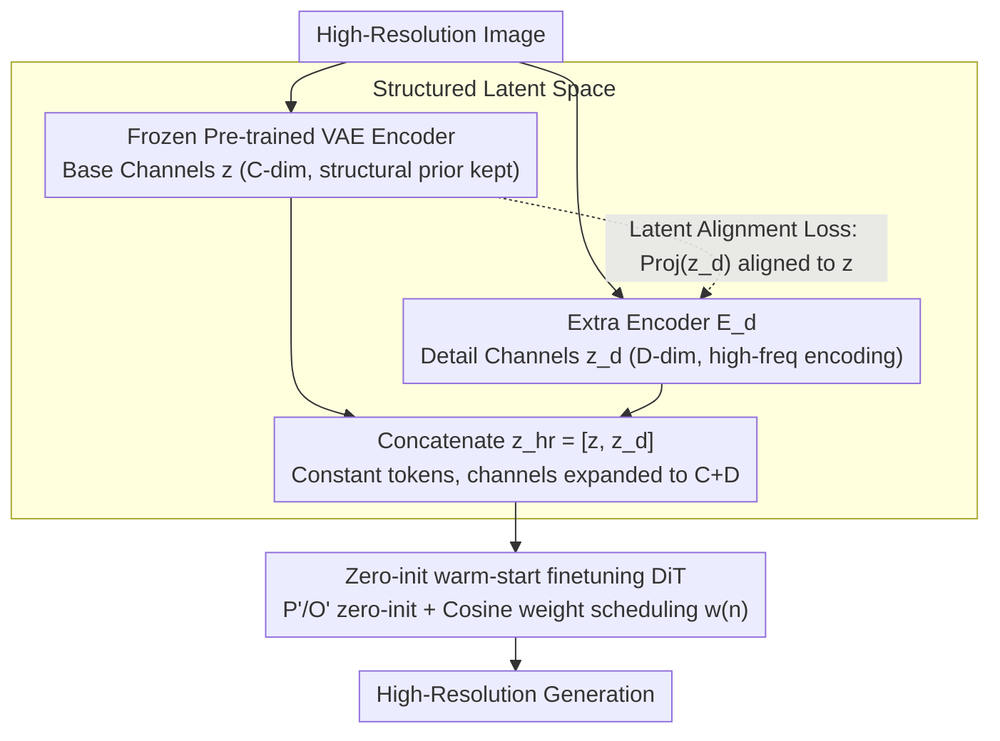

# DA-VAE: Plug-in Latent Compression for Diffusion via Detail Alignment

**Conference**: CVPR 2026  
**arXiv**: [2603.22125](https://arxiv.org/abs/2603.22125)  
**Code**: [caixin98.github.io/davae](https://caixin98.github.io/davae)  
**Area**: Image Generation  
**Keywords**: VAE Compression, Diffusion Model Acceleration, Latent Space Alignment, High-Resolution Generation, Token Efficiency

## TL;DR
The paper proposes Detail-Aligned VAE (DA-VAE), which introduces structured "detail channels" into the latent space of a pre-trained VAE with alignment constraints. This approach compresses token counts by 4x without retraining the diffusion model. It enables 1024 $\rightarrow$ 2048 generation for SD3.5 with only 5 H100-days of fine-tuning, achieving a 6x speedup.

## Background & Motivation

1. **Background**: The computational cost of current Diffusion Transformers (DiTs) increases quadratically with the number of tokens, making high-resolution generation extremely expensive.
2. **Limitations of Prior Work**: Existing high-compression tokenizers (e.g., DC-AE) require training a new diffusion model from scratch. Furthermore, the lack of meaningful structure in high-dimensional latent spaces makes diffusion training difficult. While some methods introduce semantic alignment or dropout constraints, they still necessitate full retraining.
3. **Key Challenge**: Increasing the compression ratio requires increasing the channel dimension $C$ per token. However, naively increasing channels disrupts the latent space structure, hindering downstream diffusion training. Conversely, reducing the token count requires expensive retraining of the diffusion model.
4. **Goal**: How to increase the VAE compression ratio while maintaining the pre-trained diffusion model and ensuring the latent space can be effectively modeled.
5. **Key Insight**: Pre-trained diffusion models already possess a structured low-dimensional latent space. It is simpler to extend the dimensions while maintaining the original structure than to learn a completely new space from scratch.
6. **Core Idea**: Divide the latent space into "base channels" (directly reusing the $C$ channels of the pre-trained VAE) and "detail channels" (additional $D$ channels encoding high-resolution details). Use alignment constraints to maintain structural consistency between the detail and base channels.

## Method

### Overall Architecture
DA-VAE addresses the conflict where high-resolution generation requires fewer tokens for efficiency, but reducing tokens usually necessitates a new high-dimensional latent space and costly retraining. The approach "thickens" the existing pre-trained VAE latent space: the token count remains consistent with the base resolution (keeping the DiT sequence length unchanged), but the channel count per token expands from $C$ to $C+D$. The first $C$ channels are inherited from the frozen pre-trained VAE to carry the structure already learned by the diffusion model, while an additional encoder $E_d$ extracts high-frequency details from the high-resolution image for the remaining $D$ channels.

$$\mathbf{z}_{hr} = [\mathbf{z}, \mathbf{z}_d] \in \mathbb{R}^{(C+D) \times \frac{H}{f} \times \frac{W}{f}}$$

Consequently, high-resolution images are encoded into the same number of tokens as the base resolution. The diffusion model only needs to process more channels over the same sequence length to generate higher-resolution results.

### Key Designs

**1. Structured Latent Space: Defining new channels as "details" rather than letting them grow freely**
Simply increasing the latent dimension from $C$ to $C+D$ is easy, but unconstrained new dimensions often disrupt the original structure, making diffusion modeling harder. DA-VAE assigns a clear semantic role to the $D$ new channels: the base channels $\mathbf{z} = E(\mathbf{I})$ are frozen to reuse the pre-trained VAE's encoding of base resolution images, keeping the prior intact. The detail channels $\mathbf{z}_d = E_d(\mathbf{I}_{hr})$ are trained separately to encode only the high-frequency details lost during compression. This division ensures the expanded space uses the original space as a backbone.

**2. Latent Alignment Loss: Forcing detail channels to inherit base channel structure**
Without guidance, reconstruction loss alone might cause $\mathbf{z}_d$ to degenerate into meaningless noise residuals to fit the reconstruction target rather than forming a semantically clustered structure. The alignment loss addresses this by using a parameter-free group pooling to project $D$ dimensions back to $C$, then calculating the L2 distance against the base channels.

$$\mathcal{L}_{align} = \|\text{Proj}(\mathbf{z}_d) - \mathbf{z}\|^2$$

While this slightly sacrifices reconstruction metrics (rFID increases from 0.47 to 0.59), it ensures the detail channels share a consistent clustering structure with the base channels, allowing the diffusion model to treat them as normal latent variables.

**3. Zero-initialization warm-start: Making the DiT equivalent to the original model at training start**
When the latent space expands, new patch embedders $P'$ and output layers $O'$ are required. Randomly initializing these would inject noise into the pre-trained features. DA-VAE uses zero-initialization for $P'$ and $O'$, so the model behaves identically to the original DiT at step zero. A cosine-annealed loss weight $w(n)$ then controls the influence of detail channels:

$$w(n) = \frac{1 - \cos(\pi n / N_{warm})}{2}$$

Early gradients come almost entirely from base channels, allowing the DiT to stabilize its original capabilities before gradually incorporating signal from the detail channels.

### Loss & Training

VAE side: $\mathcal{L} = \mathcal{L}_{rec} + \lambda_{align}\mathcal{L}_{align}$, where $\mathcal{L}_{rec}$ includes LPIPS, L1, adversarial loss, and KL regularization.

DiT fine-tuning side: Weighted diffusion loss $\mathcal{L}_{DiT}(n) = \frac{1}{|B| + w(n)|R|}(\|\hat{\boldsymbol{u}} - \boldsymbol{u}\|_2^2 + w(n)\|\hat{\boldsymbol{u}}_d - \boldsymbol{u}_d\|_2^2)$. LoRA with rank=256 is used on SD3.5 to fine-tune attention and FFN layers.

## Key Experimental Results

### Main Results

**ImageNet 512×512 Class-Conditional Generation**

| Method | AutoEncoder | Token Count | Training | FID-50k ↓ | IS ↑ |
|------|------------|----------|---------|-----------|------|
| DiT-XL (SD-VAE) | f8c4p2 | 32×32 | Scratch 2400ep | 3.04 | 255.3 |
| REPA | f8c4p2 | 32×32 | Scratch 200ep | 2.08 | 274.6 |
| DC-Gen-DiT-XL | f32c32p1 | 16×16 | Fine-tune 80ep | 2.22 | 122.5 |
| **DA-VAE (Ours)** | **f32c128p1** | **16×16** | **Fine-tune 80ep** | **1.68** | **314.3** |

**T2I SD3.5 Medium 1024×1024**

| Method | Token Count | Throughput (img/s) | FID ↓ | CLIP Score ↑ |
|------|----------|-------------|-------|-------------|
| SD3.5-medium Original | 64×64 | 0.25 | 10.31 | 29.74 |
| SD3.5-medium (p=2) | 32×32 | 1.03 | 12.04 | 30.17 |
| **Ours (DA-VAE)** | **32×32** | **1.03** | **10.91** | **31.91** |

### Ablation Study

| Configuration | FID-10k ↓ | Description |
|------|-----------|------|
| Full model | 9.27 | Alignment + Zero-init + Scheduling |
| w/o alignment | 16.37 | Detail channels lack structure; quality drops |
| w/o zero init | 29.73 | Destroys pre-trained prior; difficult convergence |
| w/o weight scheduler | 9.80 | Slight degradation |

### Key Findings
- While alignment loss slightly lowers reconstruction metrics (rFID 0.47 $\rightarrow$ 0.59), it significantly improves generation quality (FID 16.37 $\rightarrow$ 9.27).
- Zero-initialization is critical for convergence; random initialization results in 3x worse FID.
- $\lambda_{align}=0.5$ serves as the optimal trade-off point.

## Highlights & Insights
- **Simple and Effective**: Instead of changing the diffusion architecture, the method modifies only the VAE and uses alignment to inherit existing structures.
- **Plug-and-play**: Can be combined with other acceleration methods like quantization or distillation.
- Adapting SD3.5 requires only 5 H100-days, saving hundreds of times the computation compared to retraining from scratch.
- In 2048×2048 generation, while the original SD3.5 suffers from structural breakdown, the DA-VAE version maintains global consistency.

## Limitations & Future Work
- The alignment loss form is simple (group mean + L2); more optimal alternatives might exist.
- Testing on larger models like FLUX was restricted by the computational budget.
- Current fine-tuning uses synthetic data, leading to slightly lower realism than native SD3.5 outputs.
- Only explored a resolution upscaling factor of $s=2$.

## Related Work & Insights
- Orthogonal to high-compression tokenizers like DC-AE and VA-VAE which build new spaces and require retraining.
- The alignment concept could be extended to temporal dimension compression in video generation.
- The zero-init + progressive weight scheduling serves as a general adapter training paradigm.

## Rating
- **Novelty**: ⭐⭐⭐⭐ Simple but effective; the combination of structured latent space and alignment is innovative.
- **Experimental Thoroughness**: ⭐⭐⭐⭐ Covers ImageNet and SD3.5 with comprehensive ablations.
- **Writing Quality**: ⭐⭐⭐⭐⭐ Clear motivation, excellent figures, and logical flow.
- **Value**: ⭐⭐⭐⭐⭐ High practical value; achieves 4-6x acceleration with minimal cost.

<!-- RELATED:START -->

## Related Papers

- [\[CVPR 2026\] PromptLoop: Plug-and-Play Prompt Refinement via Latent Feedback for Diffusion Model Alignment](promptloop_plug-and-play_prompt_refinement_via_latent_feedback_for_diffusion_mod.md)
- [\[CVPR 2026\] VFM-VAE: Vision Foundation Models Can Be Good Tokenizers for Latent Diffusion Models](vfm-vae_vision_foundation_models_can_be_good_tokenizers_for_latent_diffusion_mod.md)
- [\[ICLR 2026\] Eliminating VAE for Fast and High-Resolution Generative Detail Restoration](../../ICLR2026/image_generation/eliminating_vae_for_fast_and_high-resolution_generative_detail_restoration.md)
- [\[CVPR 2026\] CoD: A Diffusion Foundation Model for Image Compression](cod_a_diffusion_foundation_model_for_image_compression.md)
- [\[CVPR 2026\] FlowFixer: Towards Detail-Preserving Subject-Driven Generation](flowfixer_towards_detail-preserving_subject-driven_generation.md)

<!-- RELATED:END -->
