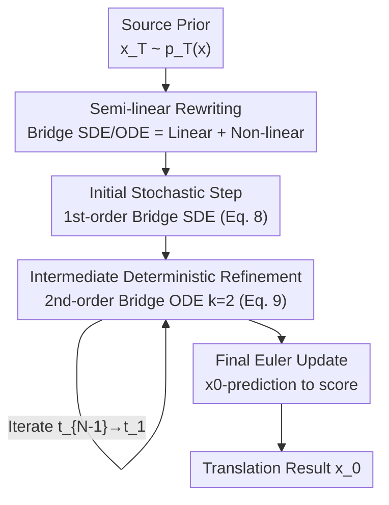

# DBMSolver: A Training-free Diffusion Bridge Sampler for High-Quality Image-to-Image Translation

**Conference**: CVPR 2026  
**arXiv**: [2605.05889](https://arxiv.org/abs/2605.05889)  
**Code**: https://github.com/snumprlab/dbmsolver  
**Area**: Diffusion Models / Image Generation / Image-to-Image Translation  
**Keywords**: Diffusion Bridge Models, Training-free Sampler, Exponential Integrator, Semi-linear Structure, High-order ODE Solver

## TL;DR
Addressing the slow sampling issue of Diffusion Bridge Models (DBM) in image-to-image translation (often requiring dozens or hundreds of network evaluations), DBMSolver requires no network modification or training. By revealing the "semi-linear structure" of Bridge SDEs/ODEs and deriving closed-form solutions using Exponential Integrators (EI), it surpasses previous SOTA results with only 6 steps (NFE). On DIODE, it reduces FID by 53% compared to second-order baselines at 20 NFE.

## Background & Motivation
**Background**: Image-to-image translation (I2I, e.g., inpainting, colorization, stylization, semantic-to-image) has shifted from GANs to diffusion models. Diffusion Bridge Models (DBM, DDBM) utilize Doob's h-transform to establish a "diffusion bridge" between the source distribution $p_T(\boldsymbol{x})$ and the target distribution $p_0(\boldsymbol{x})$. They are currently the backbone for high-fidelity I2I due to their theoretical elegance.

**Limitations of Prior Work**: DBM sampling is excessively slow. The original Hybrid Heun sampler requires **119** network forward passes (NFE) for coherent results. Subsequent DBIM-2/3 reduced this to 20 NFE, but their high-order solvers rely on **linear multi-step numerical approximations** (non-closed-form), which suffer from significant approximation errors at low NFE.

**Key Challenge**: The prior $p_T(\boldsymbol{x})$ for a diffusion bridge is an **arbitrary image** rather than pure Gaussian noise. This invalidates the theoretical foundation of fast solvers designed for "noise-to-image (N2I)" (e.g., DDIM, DPMSolver++), which assume $p_T(\boldsymbol{x})\approx\mathcal{N}(\boldsymbol{0},\sigma_T^2\boldsymbol{I})$. Consequently, DBMs have been restricted to specialized but slow samplers.

**Goal**: To derive a fast and accurate plug-and-play sampler for DBMs without additional training or architectural changes, reducing NFE by an order of magnitude while maintaining or improving quality.

**Key Insight**: The authors re-examine the Bridge SDE (Eq. 2) and Bridge PF ODE (Eq. 5) followed by the reverse process of DBMs. They discover a previously overlooked **semi-linear structure**—linear with respect to $\boldsymbol{x}_t$, with only the score term being non-linear. This structure is precisely what Exponential Integrators (EI) excel at solving accurately.

**Core Idea**: Utilize EI to obtain an **exact closed-form solution** for the linear term and apply Taylor expansion for the non-linear term containing the $\boldsymbol{x}_0$-prediction network. This derives a dedicated first-order SDE solver and a second-order ODE solver for DBMs, combined into a high-order sampling pipeline to replace crude numerical approximations.

## Method

### Overall Architecture
DBMSolver takes a source image (as a prior sample $\tilde{\boldsymbol{x}}_T\sim p_T(\boldsymbol{x})$) and a **pre-trained $\boldsymbol{x}_0$-predicting DBM** $\textbf{D}_{\boldsymbol{\theta}}$ as input, producing the translated target image $\tilde{\boldsymbol{x}}_0$ without altering network weights. The framework rewrites the DBM reverse SDE/ODE into a semi-linear form of "linear term + non-linear term," solves them separately, and organizes them into a **three-stage sampling schedule**:

- **Initial Stochastic Step**: Moves from $s=T$ to $t=T-\epsilon$ ($\epsilon\approx10^{-4}$) using the first-order Bridge SDE solver (Proposition 1, Eq. 8). This is handled separately because ODE solvers diverge as $s\to T$ (coefficient $\rho(\lambda_s,\lambda_T)\to0$).
- **Intermediate Deterministic Refinement**: Iterates from $t_{N-1}$ to $t_1$ using the second-order Bridge PF ODE solver with $k=2$ (Proposition 2, Eq. 9), gradually refining the noisy sample into a clean image.
- **Final Euler Step**: Moves from $t_1$ to $t_0=0$ by converting the $\boldsymbol{x}_0$-prediction to a score and applying a standard Euler update for high-fidelity output.

### Key Designs

**1. Revealing the Semi-linear Structure: The Key to Exact Solutions**
Previous DBM samplers failed to recognize the internal structure of the Bridge SDE/ODE, resorting to global numerical integration which introduces large errors. The authors substitute the $\boldsymbol{x}_0$-predictor $\textbf{D}_{\boldsymbol{\theta}}$ back into the Bridge PF ODE (Eq. 5), rewriting it into the semi-linear form $\frac{\text{d}\boldsymbol{x}_t}{\text{d}t}=\underbrace{L(t)\,\boldsymbol{x}_t}_{\text{Linear}}+\underbrace{N(\textbf{D}_{\boldsymbol{\theta}}(\boldsymbol{x}_t),t,\boldsymbol{x}_T)}_{\text{Non-linear}}$. Once the linear term is isolated, an Exponential Integrator can yield an **analytical exact solution** for it, confining numerical approximation errors solely to the non-linear term.

**2. First-order Bridge SDE Solver: Handling the Initial Stochastic Step**
Since ODE solutions diverge at $t=T$, a specialized initial solver is required. The authors apply the EI method to the semi-linear Bridge SDE and use a first-order Taylor expansion (error $O(\Delta t^2)$) to derive Proposition 1:
$$\boldsymbol{x}_t=\frac{\text{SNR}_s}{\text{SNR}_t}\frac{\alpha_t}{\alpha_s}\boldsymbol{x}_s+\alpha_t\left(1-\frac{\text{SNR}_s}{\text{SNR}_t}\right)\textbf{D}_{\boldsymbol{\theta}}(\boldsymbol{x}_s)+\sigma_t\sqrt{1-\frac{\text{SNR}_s}{\text{SNR}_t}}\,\boldsymbol{z}_t$$
where $\boldsymbol{z}_t\sim\mathcal{N}(\boldsymbol{0},\boldsymbol{I})$ and $\text{SNR}_t:=\alpha_t^2/\sigma_t^2$. Using this only over the **minimal interval** $s=T\to t=T-\epsilon$ ensures high accuracy even with a first-order approximation.

**3. Second-order Bridge PF ODE Closed-form Solution: Precise Intermediate Refinement**
Intermediate steps are critical for quality. While DBIM-2/3 uses linear multi-step numerical methods, the authors derive an **exact closed-form solution** (Proposition 2, Eq. 9) for the Bridge PF ODE by using EI and change of variables. The core is an "exponentially weighted integral" $\int_{\lambda_s}^{\lambda_t}\frac{e^{2\lambda}\textbf{D}_{\boldsymbol{\theta}}(\boldsymbol{x}_\lambda)}{\sqrt{\rho(\lambda,\lambda_T)}}\text{d}\lambda$, where $\lambda_t:=\log(\alpha_t/\sigma_t)$. By performing a $(k-1)$-order Taylor expansion on $\textbf{D}_{\boldsymbol{\theta}}$ and solving the remaining integral **analytically** (Eq. 10) with $k=2$, the solver achieves much tighter error bounds than numerical multi-step methods at low NFE.

**4. Three-stage Schedule and Order Selection: Why k=2?**
The authors combine the propositions into a coherent algorithm (Algorithm 1). The choice of $k=2$ is deliberate: for $k\ge3$, the resulting integrals involve **non-elementary antiderivatives** that cannot be expressed in closed form using standard functions. This would force a return to numerical multi-step methods, re-introducing the errors found in DBIM-2/3. DBMSolver maintains the "analytical" boundary at $k=2$ for the cleanest possible approximation.

## Loss & Training
This is a **training-free** sampler. It directly reuses existing DBM checkpoints (e.g., DDBM weights for E2H/DIODE, DBIM weights for ImageNet inpainting). For datasets without pre-trained weights (Face2Comics, CelebAMask-HQ), a standard DBM is trained from scratch using an ADM U-Net, and then DBMSolver is applied for sampling.

## Key Experimental Results

### Main Results
Evaluations include sketch-to-image (E2H), surface-normal-to-image (DIODE), face caricaturization (Face2Comics), class-conditional center inpainting (ImageNet), and semantic-label-to-face (CelebAMask-HQ). Metrics used are FID/IS/LPIPS/MSE/CA, with NFE representing efficiency.

FID Comparison on DIODE (256×256):

| Method | NFE | FID↓ | IS↑ | LPIPS↓ | MSE↓ |
|------|-----|------|-----|--------|------|
| Hybrid Heun | 119 | 4.43 | 6.21 | 0.244 | 0.084 |
| DBIM-1 | 20 | 4.99 | 6.10 | 0.201 | 0.017 |
| DBIM-2 | 20 | 4.40 | 6.11 | 0.200 | 0.017 |
| DBIM-3 | 20 | 4.23 | 6.05 | 0.201 | 0.017 |
| ODES3 | 28 | 2.29 | 5.92 | 0.203 | 0.018 |
| **DBMSolver (Ours)** | **6** | **3.38** | 6.00 | 0.196 | 0.015 |
| **DBMSolver (Ours)** | **20** | **2.06** | 6.00 | 0.198 | 0.018 |

At 20 NFE, FID is 2.06 vs. 4.40 for the second-order baseline DBIM-2, a **53% reduction**. At only 6 NFE, the FID of 3.38 already outperforms Hybrid Heun (119 NFE) and all 20 NFE DBIM variants.

Results on Face2Comics / ImageNet Inpainting:

| Task | Method | NFE | FID↓ | Note |
|------|------|-----|------|------|
| Face2Comics | DBIM-3 | 20 | 8.61 | — |
| Face2Comics | **DBMSolver** | 6 | **3.04** | 6 steps beats 20 steps DBIM |
| ImageNet Inpaint | DBIM-2 | 20 | 4.07 | Latency 13.67s |
| ImageNet Inpaint | **DBMSolver** | 6 | 4.98 | **Latency 3.66s (45.4x throughput)** |

### Ablation Study

| Configuration | Key Observation | Description |
|------|---------|------|
| $k=1$ (≈ DBIM-1) | Higher FID | 1st-order Taylor expansion, large approximation error |
| $k=2$ (DBMSolver) | Optimal FID | 2nd-order closed-form solution, smaller error bounds |
| $k\ge3$ | Non-analytical | Requires non-elementary integrals, reverts to numerical errors |
| 1st-order SDE Start | Stable | Avoids ODE coefficient divergence at $t=T$ |

### Key Findings
- **Semi-linear structure is the source of quality**: Exact solutions for linear terms combined with Taylor approximations for non-linear terms yield much smaller errors than the global numerical methods in DBIM-2/3.
- **$k=2$ is the optimal limit**: Higher orders ($k\ge3$) introduce numerical errors due to loss of analytical tractability, making $k=2$ the best trade-off between precision and analytical purity.
- **Visual detail at low NFE**: DBMSolver preserves fine structures (tree branches, textures, eye corners) at 6 NFE where DBIM remains blurry.

## Highlights & Insights
- **Dual Benefit of Training-free and Closed-form**: As a plug-and-play replacement for DBM sampling, it reduces NFE by an order of magnitude (e.g., 6 vs. 119) while improving quality.
- **Adapting EI to non-Gaussian priors**: DPMSolver was assumed incompatible with DBMs due to the non-Gaussian prior. This work proves Bridge SDEs/ODEs are also semi-linear, bringing the N2I acceleration "dividend" to I2I tasks.
- **Analytical Bound as an Error Bound**: The insight that "elementary antiderivatives" define the maximum usable order is a valuable heuristic for designing other high-order diffusion solvers.

## Limitations & Future Work
- **Dependency on $\boldsymbol{x}_0$-prediction**: The derivation is tied to DBMs trained with Bridge Score Matching. Other parameterizations would require re-derivation.
- **Resolution limited to 256×256**: Quality and speed gains at higher resolutions (512/1024) or in latent space DBMs haven't been fully explored.
- **Trade-off at extreme low NFE**: At 6 NFE on ImageNet, the FID is slightly higher than DBIM at 20 NFE, showing a remaining trade-off between extreme efficiency and absolute quality.

## Related Work & Insights
- **vs. Hybrid Heun (DDBM)**: HH alternates between 1st-order SDE and 2nd-order ODE solvers, requiring 119 NFE. DBMSolver uses EI for exact semi-linear solutions, achieving higher quality in only 6 NFE.
- **vs. DBIM-1/2/3**: DBIM is a non-Markovian sampler using numerical multi-step methods. DBMSolver provides **analytical closed-form** solutions at $k=2$, avoiding the accumulation of numerical errors.
- **vs. DPMSolver++**: DPMSolver++ assumes a Gaussian prior. DBMSolver fills the gap for a closed-form high-order EI solver for non-Gaussian bridge models.

## Rating
- Novelty: ⭐⭐⭐⭐⭐ First to reveal the semi-linear structure of Bridge SDEs/ODEs and derive dedicated closed-form EI solvers.
- Experimental Thoroughness: ⭐⭐⭐⭐ Covers 5 tasks and multiple baselines; however, resolution is capped at 256.
- Writing Quality: ⭐⭐⭐⭐ Clear hierarchical derivation (Semi-linear → SDE → ODE → Schedule).
- Value: ⭐⭐⭐⭐⭐ High practical value for real-time DBM deployment; code is open-source.

<!-- RELATED:START -->

## Related Papers

- [\[CVPR 2026\] PixelRush: Ultra-Fast, Training-Free High-Resolution Image Generation via One-step Diffusion](pixelrush_ultrafast_trainingfree_highresolution_im.md)
- [\[CVPR 2026\] Frequency-Aware Flow Matching for High-Quality Image Generation](freqflow_frequency_aware_flow_matching.md)
- [\[CVPR 2026\] Efficient and Training-Free Single-Image Diffusion Models](efficient_and_training-free_single-image_diffusion_models.md)
- [\[CVPR 2026\] Training-free, Perceptually Consistent Low-Resolution Previews with High-Resolution Image for Efficient Workflows of Diffusion Models](training-free_perceptually_consistent_low-resolution_previews.md)
- [\[CVPR 2026\] Residual Diffusion Bridge Model for Image Restoration](residual_diffusion_bridge_model_for_image_restoration.md)

<!-- RELATED:END -->
