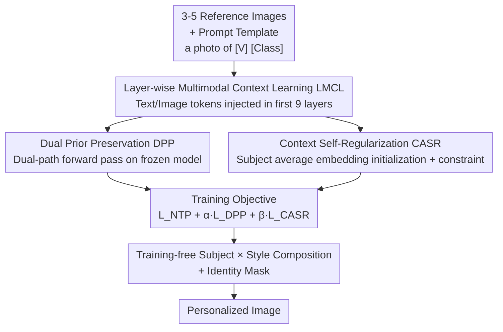

# DCoAR: Deep Concept Injection into Unified Autoregressive Models for Personalized Text-to-Image Generation

**Conference**: CVPR 2026  
**Paper**: [CVF Open Access](https://openaccess.thecvf.com/content/CVPR2026/html/Wu_DCoAR_Deep_Concept_Injection_into_Unified_Autoregressive_Models_for_Personalized_CVPR_2026_paper.html)  
**Code**: To be confirmed  
**Area**: Image Generation / Personalized Customization  
**Keywords**: Personalized Generation, Unified Autoregressive Models, Concept Injection, Style Customization, Parameter-Efficient

## TL;DR
DCoAR upgrades "concept injection" from a single-layer input token insertion to layer-wise injection of learnable multimodal tokens across multiple Transformer layers of a unified autoregressive model, incorporating two regularization terms: Dual Prior Preservation (DPP) and Context Self-Regularization (CASR). While completely freezing the backbone and maintaining trainable parameters under 0.1M, it achieves subject fidelity close to fine-tuning methods requiring hundreds of megabytes of parameters, while enabling training-free composition of any subject in any style.

## Background & Motivation
**Background**: Unified multimodal autoregressive (AR) models (e.g., Chameleon, Lumina-mGPT) unify text and images into a sequence of discrete tokens, performing comprehension and generation simultaneously via next-token prediction. These models have demonstrated strong generalizability in text-to-image, image captioning, and completion tasks. However, research applying them to "personalized generation" (generating a specific subject/style in new scenes based on a few reference images) remains scarce, with their potential far from being fully exploited.

**Limitations of Prior Work**: Existing approaches for personalizing AR models suffer from serious drawbacks. One category is **adaptation-based methods**, which adapt DreamBooth-like strategies using PEFT such as LoRA to modify weights. However, AR models are substantially more fragile than diffusion models; adjusting millions of parameters with only 3–5 images almost inevitably triggers overfitting, catastrophic forgetting, and destruction of the pre-trained prior. Moreover, storing a separate set of weights for each new concept incurs infinite storage costs, hindering scalable deployment. Another category is **concept-injection methods**, which freeze the backbone and only learn a few tokens (e.g., Yo'Chameleon, UniCTokens). Albeit scalable, they inject concepts solely at the **input layer**, leaving the signals un-reinforced as they propagate through dozens of Transformer layers.

**Key Challenge**: Shallow injection faces a "semantic attenuation bottleneck" where fine-grained identity cues gradually disintegrate in deeper layers, rendering the model incapable of binding concepts to complex prompts. Consequently, injection-based methods perform poorly in visual fidelity, context adaptability, and semantic consistency compared to fine-tuning methods, stuck in an awkward dilemma of being "scalable but inaccurate."

**Goal**: To close the fidelity gap with fine-tuning-based methods while preserving the advantages of a frozen backbone and scalability, while facilitating training-free, zero-shot subject-style composition.

**Key Insight**: The authors observe that since signals attenuate as they propagate through deeper layers, they should be **replenished progressively** rather than being fed only once at the input. Injecting concept tokens into multiple Transformer layers ensures that identity information is continuously reinforced during deep propagation.

**Core Idea**: Replace "shallow input injection" with "Deep Concept Injection" through Layer-wise Multimodal Context Learning (LMCL), accompanied by two regularization terms that stabilize the deep injection process against distribution shift and overfitting.

## Method

### Overall Architecture
DCoAR aims to solve the following: enabling a **completely frozen** unified AR model to learn a new subject by training an extremely small number of extra tokens, and reproducing this subject with high fidelity under any new scene/style. The entire pipeline revolves around a set of "multimodal context tokens." During the training stage, they are injected layer-by-layer into the Transformer, embedding the subject concept into these tokens via next-token prediction. Concurrently, DPP prevents the model's linguistic capabilities from drifting, while CASR prevents tokens from overfitting to training prompts. During the inference stage, context tokens from different subjects and styles are directly concatenated and used with an Identity Mask to achieve training-free subject-style composition.

The framework is composed of four modules: **LMCL** (progressive layer-wise injection of learnable multimodal tokens as concept carriers), **DPP** (anchoring on the frozen model to prevent the customized distribution from drifting from the original), **CASR** (initializing and constraining image tokens with the subject's average embedding to prevent overfitting and enhance recontextualization), and **Training-free Subject × Style Composition + Identity Mask** during inference. The first three modules operate on the same set of tokens to form the training objective, while the last module reuses the learned tokens during inference.

### Key Designs

**1. Layer-wise Multimodal Context Learning (LMCL): Replenishing concept signals along the Transformer depth to combat "shallow injection attenuation"**

This is the core of DCoAR, directly addressing the bottleneck where signals fed once at the input layer decay through deep layers. The authors define a set of shared multimodal learnable tokens $P = \{p_{[v]}, p_I\}$ for a single subject, where the text token $p_{[v]} \in \mathbb{R}^{1\times N\times D}$ and the image token $p_I$ possess the same shape, where $N$ is the number of inserted layers and $D$ is the embedding dimension. During training, a template `a photo of [V] [Class]` is constructed for each reference image, where $[V]$ represents the placeholder for the subject's identity. At the $i$-th layer, the original token sequence $U_i=\{y_1,\dots,y_L,x_1,\dots,x_T\}$ is rewritten as:

$$U'_i = \{y_1, \dots, p^{(i)}_{[v]}, \dots, y_L, p^{(i)}_I, x_1, \dots, x_T\}$$

Specifically, $p^{(i)}_{[v]}$ replaces $[V]$ in the text sequence, and $p^{(i)}_I$ is inserted right before the first image token. **This insertion is performed at every layer** rather than only at the initial input layer. Subsequently, the standard next-token prediction loss $L_{NTP}=-\sum_t \log p_\theta(x_t\mid x_{<t}, y)$ is applied to slowly encode the subject concept into these tokens. The backbone remains fully frozen, with only $\{p_{[v]}, p_I\}$ being updated, resulting in an exceptionally small parameter overhead (0.073M in practice). The fundamental difference from traditional injection methods is that the identity cues are continuously reinforced as they propagate deeper instead of attenuating to zero, thereby allowing the visual fidelity to catch up with fine-tuning-based methods.

**2. Dual Prior Preservation (DPP): Anchoring to the frozen model to prevent language drift after task adaptation**

Updating context tokens solely can still introduce side effects: the model may overfit to the limited reference images, leading to "language drift" and a subsequent loss of generalization and original generation diversity. DPP ports the prior preservation concept from continuous diffusion latents to the discrete token space of AR models. Specifically, a small batch (6-8 images) of class images is first generated using the pre-trained model with the prompt `a photo of a [Class]`. These images, together with their texts, are tokenized into a sequence $U_{cls}$. A **dual-path forward pass** is then conducted. Path one feeds the original $U_{cls}$ into the frozen model to obtain the zero-shot distribution $\text{logits}_{zs}$, while path two feeds $U'_{cls}$ (with layer-wise image context tokens inserted) into the current model to obtain $\text{logits}_{prior}$. The loss is formulated as:

$$L_{DPP} = \lambda_1 \cdot L_{NTP_{cls}}(\text{logits}_{prior}, \text{labels}_{cls}) + \lambda_2 \cdot D_{KL}(\text{logits}_{zs} \,\|\, \text{logits}_{prior})$$

The first term is the NTP loss on class images (ensuring the reconstruction of the class images themselves), and the second is the KL divergence $D_{KL}=\sum_{v\in V}\text{logits}_{zs}(v)\log\frac{\text{logits}_{zs}(v)}{\text{logits}_{prior}(v)}$, which pulls the updated output distribution back toward the native distribution of the frozen model. This dual-path design is the key adaption of prior preservation to discrete AR model distributions.

**3. Context Self-Regularization (CASR): Initializing and constraining tokens with subject embeddings to prevent overfitting and enhance recontextualization**

Tokens learned via LMCL are prone to memorizing the exact appearance details of the training images, leading to failures (poor recontextualization) in new scenes. CASR aims to constrain the tokens from drifting too far from the actual representation of the subject. Specifically, all reference images are fed into the frozen model, and the average embedding of all image tokens at the $i$-th layer, denoted as $E^{(i)}_{subject}$, is extracted. **This average representation is used to initialize** the learnable image context token $p^{(i)}_I$, ensuring training starts near the actual subject distribution to accelerate convergence. Additionally, a constraint loss is introduced:

$$L_{CASR} = \frac{1}{N}\sum_{i=1}^{N} \left\| p^{(i)}_I - E^{(i)}_{subject} \right\|_2$$

This consistently pulls $p^{(i)}_I$ toward the subject's embedding space. In this way, the tokens retain identity discriminativeness without over-specializing on the training prompts, significantly boosting recontextualization performance in new environments. The three losses combine into the total objective $L_{obj} = L_{NTP} + \alpha L_{DPP} + \beta L_{CASR}$ (where $\alpha=10^{-2}$ and $\beta=5\times10^{-4}$).

**4. Training-Free Subject-Style Composition + Identity Mask: Harnessing the frozen backbone for plug-and-play zero-shot composition**

Because the backbone parameters are completely unchanged, the pre-trained multimodal comprehension and generation capacities of the AR model are preserved. This naturally facilitates zero-shot composition of subjects and styles. During inference, one can **directly concatenate** the learned context tokens of a subject with those of a style (styles are trained using a single reference image injected only into the first 3 layers) to render any subject into any style without training. To prevent cross-contamination between the two types of tokens (e.g., the subject's colors leaking into other elements of the scene), the authors introduce an **Identity Mask**. This mask explicitly restricts the attention flow between the subject and style tokens within the attention layers, forcing them to decouple and contribute independently to the final output. Ablation analyses indicate that omitting this mask leads to severe concept contamination.

### Loss & Training
The total objective is $L_{obj} = L_{NTP} + \alpha L_{DPP} + \beta L_{CASR}$. Lumina-mGPT-7B FP-SFT is selected as the backbone and is frozen throughout, trained on a single H800 GPU. For subject customization: 1 text token and 1 image token are inserted per layer for the **first 9 layers**, with training lasting 1,000 steps. For style customization: the same configuration is applied but restricted to the **first 3 layers**, training with a single reference image for 600 steps. Hyperparameters include a learning rate of 1e-2, batch size of 1, $\alpha=10^{-2}$, $\beta=5\times10^{-4}$, $\lambda_1=\lambda_2=0.5$, and other hyperparameters inherited from Lumina-mGPT defaults.

## Key Experimental Results

### Main Results
**Subject Customization (DreamBench, 30 subjects)**: Subject fidelity is evaluated using CLIP-I / DINO, prompt fidelity via CLIP-T, and trainable parameter counts are reported.

| Method | Type | DINO | CLIP-I | CLIP-T | Trainable Parameters |
|------|------|------|--------|--------|-----------|
| Real Images | — | 0.774 | 0.885 | — | — |
| Textual Inversion | Diffusion | 0.569 | 0.780 | 0.255 | — |
| DreamBooth (Imagen) | Diffusion | 0.696 | 0.812 | 0.306 | — |
| Kosmos-G | Diffusion | 0.694 | 0.847 | 0.287 | — |
| Yo'Chameleon | Unified AR (Injection) | 0.542 | 0.795 | 0.225 | 0.13M |
| UniCTokens | Unified AR (Injection) | 0.599 | 0.782 | 0.304 | 0.13M |
| PersonalAR | Unified AR (Fine-tuning) | 0.671 | 0.805 | 0.302 | 1610.6M |
| Proxy-Tuning | Unified AR (Fine-tuning) | 0.752 | 0.809 | 0.312 | 142.6M |
| **DCoAR (Ours)** | Unified AR (Injection) | 0.723 | **0.815** | **0.318** | **0.073M** |

DCoAR achieves a CLIP-I of 0.8151, exceeding the runner-up DreamBooth (Imagen) by 0.4%, while setting a new state-of-the-art with a CLIP-T of 0.3184 (0.29% higher than the second-best Proxy-Tuning). While its DINO metric ranks second (0.723 vs. Proxy-Tuning's 0.752), DCoAR only tunes 0.073M parameters, whereas Proxy-Tuning requires training an auxiliary diffusion model and generating hundreds of augmented images per subject—making DCoAR substantially more efficient. Compared to equivalent injection methods (Yo'Chameleon / UniCTokens), DCoAR comprehensively outperforms them across all metrics.

**Style Customization (StyleDrop, single reference image, training-free)**:

| Method | Subject Alignment | Style Alignment | Text Alignment |
|------|---------|---------|---------|
| ZipLoRA (SDXL) | **0.655** | 0.597 | 0.272 |
| B-LoRA | 0.579 | 0.505 | 0.258 |
| **DCoAR (Ours)** | 0.604 | **0.605** | **0.308** |

DCoAR clean-sweeps B-LoRA across all three metrics. Compared to ZipLoRA, it exhibits slightly lower subject alignment (0.604 vs. 0.655) but matched style preservation (0.605 vs. 0.597) and significantly higher text alignment (0.308 vs. 0.272), crucially achieving these results **completely training-free**.

### Ablation Study
**Iterative Addition of Three Losses (DreamBench)**:

| LMCL | DPP | CASR | DINO | CLIP-I | CLIP-T |
|------|-----|------|------|--------|--------|
| ✓ | | | 0.6610 | 0.7647 | 0.3096 |
| ✓ | ✓ | | 0.7142 | 0.8019 | 0.2968 |
| ✓ | | ✓ | 0.7194 | 0.7905 | 0.3192 |
| ✓ | ✓ | ✓ | **0.7226** | **0.8151** | 0.3184 |

Utilizing LMCL alone yields a DINO/CLIP-I/CLIP-T of 0.6610/0.7647/0.3096. Integrating DPP dramatically improves subject fidelity (DINO→0.7142, CLIP-I→0.8019), but slightly slips CLIP-T to 0.2968 (prior constraints sacrificing minor prompt flexibility). Integrating CASR improves all indices and boosts CLIP-T to 0.3192 (enhanced recontextualization). Merging all three yields the optimal overall performance (DINO 0.7226, CLIP-I 0.8151, and a strong CLIP-T of 0.3184), illustrating that DPP mainly guarantees fidelity while CASR powers recontextualization, rendering them highly complementary.

### Key Findings
- **Injection depth exhibits a "sweet spot" of rising-then-falling performance**: Comparisons of inserting tokens strictly at layers 1, 3, 9, or 24 demonstrate that while CLIP-T remains stable, CLIP-I and DINO rise and then decrease as depth increases. Inserting into the very deep 24th layer degrades fidelity. The authors attribute this to overfitting when token influences shift to higher-level semantic layers under low-data regimes, explaining why the first 9 layers were chosen for subject customization instead of full-layer injection.
- **Distinct division of labor between DPP and CASR**: DPP primarily enhances subject fidelity (at the expense of minor prompt alignment), while CASR facilitates recontextualization and prompt alignment. As shown in the ablation table, they target different issues and work best when combined.
- **Identity Mask is an absolute necessity for compositional generation**: Removing the mask results in severe concept contamination where subject colors erroneously bleed into other elements of the scene. Its inclusion decouples subject and style tokens, ensuring semantically coherent compositions.

## Highlights & Insights
- **"Shallow to deep injection" diagnosis is highly effective**: The authors accurately diagnose the root cause of injection limitations—namely, deep propagation signal decay—and resolve it via layer-wise replenishment. The approach is conceptually neat yet yields massive gains. This "progressive deep injection" scheme is highly transferable to any frozen backbone + token personalization scenarios (e.g., video or 3D generation).
- **Substantial contrast in parameter efficiency**: Achieving performance that matches or surpasses fine-tuning-based methods (like Proxy-Tuning [142.6M] and PersonalAR [1610.6M]) with only 0.073M trainable parameters strongly validates the scalability of the injection paradigm; storing each new concept requires almost negligible memory overhead.
- **Elegant training-free subject-style composition**: Freezing the backbone preserves default multimodal capabilities, rendering zero-shot compositions possible through simple token concatenation combined with the Identity Mask without requiring retraining for every specific combination.
- **Porting DreamBooth prior preservation to discrete AR**: DPP maps prior preservation from continuous diffusion latents to discrete token distributions via dual-path forward passes and KL alignment, serving as a reusable adaptation paradigm.

## Limitations & Future Work
- **DINO still slightly lags behind the strongest fine-tuning method**: DCoAR's DINO score (0.723) remains lower than Proxy-Tuning (0.752), indicating that injection-based methods still have room for improvement in fine-grained subject consistency compared to heavy weight-tuning, with the gap closing more effectively in CLIP-I/CLIP-T.
- **The sweet spot of deep injection relies on few-shot constraints**: Limiting insertion to the "first 9 layers" to prevent overfitting was optimized under the 3–5 reference image setting. The paper does not deeply explore how the optimal insertion depth dynamically scales under larger or smaller sample sizes. ⚠️ Refer to the original text for exact specifications.
- **Style-subject alignment is weaker than ZipLoRA**: The cost of training-free composition is a slightly lower subject alignment score (0.604 vs. 0.655), which might underperform in scenarios requiring precise subject details (e.g., colour reproduction).
- **Dependence on specific backbones**: Experiments were conducted exclusively using Lumina-mGPT-7B. The transferability of the method and its optimal depth configurations to other unified AR architectures (Chameleon, Lumina-mGPT 2.0, etc.) remains to be fully verified.

## Related Work & Insights
- **vs. Yo'Chameleon / UniCTokens (Injection-based)**: While prior works inject tokens solely at the input layer, DCoAR introduces layer-wise deep injection integrated with DPP and CASR regularizations. This fundamental shift in injection depth and stability allows DCoAR to thoroughly outperform them on all metrics (e.g., DINO 0.723 vs. 0.599/0.542) with comparable parameter efficiency.
- **vs. PersonalAR / Proxy-Tuning (Fine-tuning-based)**: Fine-tuning approaches modify extensive parameters (142.6M–1610.6M) to achieve high fidelity but suffer from poor scalability. DCoAR freezes the backbone and matches their visual fidelity with merely 0.073M parameters, bypassing auxiliary diffusion models or heavy augmentations.
- **vs. DreamBooth**: DCoAR adapts the prior preservation concept but translates it from continuous diffusion latents to discrete token distributions (DPP) via dual-path forward passes and KL-minimization, resolving the standard incompatibility.
- **vs. ZipLoRA / B-LoRA (Style LoRA)**: While LoRA-based methods require specialized style tuning, DCoAR realizes compositions training-free via token concatenation. It features slightly lower subject alignment than ZipLoRA but exhibits higher text alignment at zero training cost.

## Rating
- Novelty: ⭐⭐⭐⭐ Upgrading "shallow injection" to "layer-wise deep injection" accompanied by targeted regularizations is logical, precise, and structurally sound.
- Experimental Thoroughness: ⭐⭐⭐⭐ Solid coverage across subject, style, and composite generation tasks, complemented by loss ablations, depth analysis, and mask ablation.
- Writing Quality: ⭐⭐⭐⭐ Clear motivation, methodology, and experimental logic with cleanly presented diagrams and equations.
- Value: ⭐⭐⭐⭐⭐ Demonstrating that 0.073M parameters can match massive fine-tuning methods represents a vital step for injection paradigms, offering practical value for scaling AR personalization.

<!-- RELATED:START -->

## Related Papers

- [\[CVPR 2026\] Design Your Ad: Personalized Advertising Image and Text Generation with Unified Autoregressive Models](design_your_ad_personalized_advertising_image_and_text_generation_with_unified_a.md)
- [\[CVPR 2026\] CoLoGen: Progressive Learning of Concept-Localization Duality for Unified Image Generation](cologen_progressive_learning_of_concept-localization_duality_for_unified_image_g.md)
- [\[CVPR 2026\] Premier: Personalized Preference Modulation with Learnable User Embedding in Text-to-Image Generation](premier_personalized_preference_modulation_with_learnable_user_embedding_in_text.md)
- [\[CVPR 2026\] Neighbor-Aware Localized Concept Erasure in Text-to-Image Diffusion Models](neighbor-aware_localized_concept_erasure_in_text-to-image_diffusion_models.md)
- [\[CVPR 2026\] Unified Customized Generation by Disentangled Reward Modeling](unified_customized_generation_by_disentangled_reward_modeling.md)

<!-- RELATED:END -->
