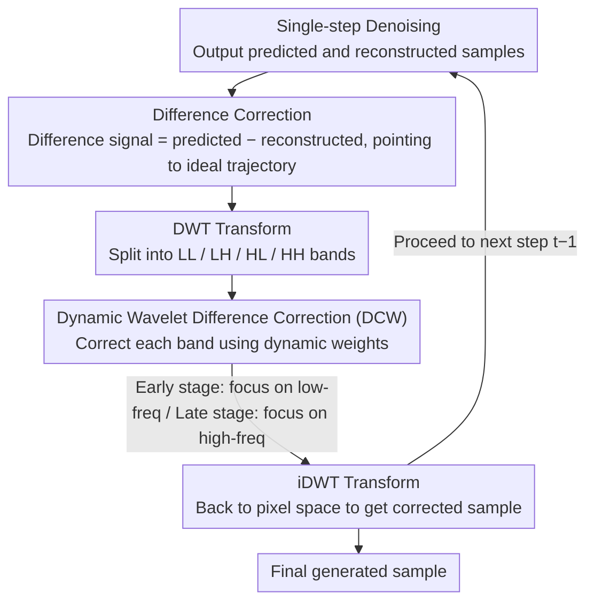

# Elucidating the SNR-t Bias of Diffusion Probabilistic Models

**Conference**: CVPR 2026  
**arXiv**: [2604.16044](https://arxiv.org/abs/2604.16044)  
**Code**: [https://github.com/AMAP-ML/DCW](https://github.com/AMAP-ML/DCW)  
**Area**: Image Generation  
**Keywords**: Diffusion Models, SNR-t Bias, Difference Correction, Wavelet Domain, Training-free

## TL;DR

This paper reveals a widespread SNR-t bias in diffusion models (where the signal-to-noise ratio of samples in the reverse process does not match the timestep) and proposes Dynamic Difference Correction in the Wavelet Domain (DCW). This training-free, plug-and-play method improves the generation quality of various diffusion models.

## Background & Motivation

**Background**: Diffusion Probabilistic Models (DPMs) have achieved significant success in generation tasks such as image, audio, and video. During training, noisy samples are strictly coupled with timesteps: $X_t = \sqrt{\bar{\alpha}_t} X_0 + \sqrt{1-\bar{\alpha}_t} \epsilon_t$, where the signal-to-noise ratio $\text{SNR}(t) = \bar{\alpha}_t / (1-\bar{\alpha}_t)$ is entirely determined by the timestep $t$.

**Limitations of Prior Work**: During inference, due to the accumulation of network prediction errors and discretization errors from numerical solvers, the reverse denoising trajectory inevitably deviates from the ideal path. This results in a mismatch between the actual SNR of the predicted sample $\hat{x}_t$ and the preset SNR corresponding to timestep $t$—defined as the SNR-t bias.

**Key Challenge**: While SNR and timesteps are strictly coupled during training, this correspondence is broken during inference. When the network receives a sample with an mismatched SNR, it produces significant prediction bias: samples with lower SNR lead to over-estimated noise predictions, while higher SNR leads to under-estimation. Experiments confirm that reverse process samples consistently exhibit a lower SNR than forward process samples.

**Goal**: (1) Provide a systematic empirical and theoretical proof of the SNR-t bias; (2) Design a training-free correction method to mitigate this bias.

**Key Insight**: The reconstructed sample $x^0_\theta$ generated at each step of the reverse denoising process, when compared to the predicted sample $\hat{x}_{t-1}$, contains difference signals that provide gradient information to push the deviated sample back toward the ideal trajectory.

**Core Idea**: Introduce difference correction into the wavelet domain to correct different frequency components separately, using dynamic weights designed according to the "low-frequency first, high-frequency later" denoising characteristic of diffusion models.

## Method

### Overall Architecture

DCW is embedded into each denoising step as a plug-and-play inference module. After each denoising step is completed: (1) The reconstructed sample $x^0_\theta$ and the predicted sample $x_{t-1}$ are mapped to the wavelet domain via DWT; (2) Difference signals are calculated for low-frequency (LL) and high-frequency (LH, HL, HH) components, and dynamic weighted correction is applied; (3) The components are mapped back to pixel space via iDWT, and the resulting corrected sample is passed to the next denoising step.

> The theoretical proof of SNR-t bias is a diagnostic contribution (explaining "why reverse SNR is necessarily lower") and is not included in the pipeline diagram. The nodes in the diagram correspond to the two methodological designs: "Difference Correction" and "Dynamic Wavelet Difference Correction (DCW)".

### Key Designs

**1. Theoretical Proof of SNR-t Bias: Establishing "Lower Reverse SNR" as a Mathematical Necessity**

Empirical curves are insufficient; the paper seeks to explain why the SNR of reverse process samples is inherently lower than the forward process. A critical step is providing a more realistic prior for the reconstruction model—assuming its output can be written as $x^0_\theta(\hat{x}_t, t) = \gamma_t x_0 + \phi_t \epsilon_t$, where $0 < \gamma_t \leq 1$ represents the attenuation of the reconstructed signal relative to the ground truth, and $\phi_t \epsilon_t$ is the residual noise. Substituting this into the sampling recursion along the reverse process yields the actual SNR of the predicted sample:

$$\text{SNR}(t) = \frac{\hat{\gamma}_t^2 \, \bar{\alpha}_t}{1-\bar{\alpha}_t + \left(\frac{\sqrt{\bar{\alpha}_t}\,\beta_{t+1}}{1-\bar{\alpha}_{t+1}}\phi_{t+1}\right)^2}.$$

Compared to the forward process $\text{SNR}(t)=\bar{\alpha}_t/(1-\bar{\alpha}_t)$, the numerator is reduced by $\hat{\gamma}_t^2 \leq 1$ and the denominator is increased by a strictly positive term. Both effects lower the ratio, making a lower reverse SNR inevitable. The choice to use $\gamma_t < 1$ rather than the simpler $x^0_\theta = x_0 + \phi_t \epsilon_t$ is because the latter implies $\mathbb{E}[\|x^0_\theta\|^2] > \mathbb{E}[\|x_0\|^2]$, which conflicts with Tweedie's formula and variance identities; the attenuation coefficient $\gamma_t$ resolves this inconsistency.

**2. Pixel-Space Difference Correction: Using Denoising "By-products" to Push Samples Back to the Ideal Trajectory**

Since the bias manifests as a lower SNR, a directional signal is needed to push the sample toward being "closer to noise." The paper finds this signal is readily available—every denoising step produces a reconstructed sample $x^0_\theta(\hat{x}_t, t)$ as a by-product. The difference $\hat{x}_{t-1} - x^0_\theta(\hat{x}_t, t)$ points exactly toward the ideal $x_{t-1}$. Thus, the correction is formulated as:

$$\hat{x}_{t-1} = \hat{x}_{t-1} + \lambda_t\bigl(\hat{x}_{t-1} - x^0_\theta(\hat{x}_t, t)\bigr),$$

where the guidance coefficient $\lambda_t$ controls the correction strength. Intuitively, this difference pulls the predicted sample slightly toward the noise direction, effectively raising the SNR to offset the bias. The elegance lies in using information already calculated in the denoising pipeline, requiring no extra networks or searching. Furthermore, experiments show that correcting the already produced $\hat{x}_{t-1}$ is more efficient and accurate than correcting the previous $\hat{x}_t$.

**3. Dynamic Wavelet Difference Correction (DCW): Frequency-wise Correction with Time-Dependent Weights**

Uniform pixel-space correction treats all frequencies equally, but diffusion models "build the low-frequency skeleton first and fill in high-frequency details later." Different stages require corrections in different frequency bands. DCW uses DWT to decompose the sample into LL, LH, HL, and HH components, applying difference correction to each:

$$\hat{x}^f_{t-1} = \hat{x}^f_{t-1} + \lambda^f_t\bigl(\hat{x}^f_{t-1} - x^{0,f}_\theta\bigr), \quad f \in \{ll, lh, hl, hh\},$$

before reassembling via iDWT. Crucially, the weights $\lambda^f_t$ are not constant; they adjust dynamically: early stages focus on low-frequency components (global structure), while later stages shift focus to high-frequency components (textural details). This ensures the correction strength always targets the most critical frequency band for the current stage, making it more effective than a "one-size-fits-all" pixel-space approach.

### Loss & Training

Completely training-free. DCW is embedded into the inference process as a plug-and-play module without modifying model weights. The computational overhead consists only of DWT/iDWT and difference operations, which is negligible.

## Key Experimental Results

### Main Results

| Base Model | Original FID | + DCW FID | Gain |
|---------|---------|----------|------|
| IDDPM | 8.45 | 6.72 | -1.73 |
| ADM | 4.59 | 3.97 | -0.62 |
| DDIM (50 steps) | 8.72 | 7.31 | -1.41 |
| EDM | 1.97 | 1.79 | -0.18 |
| FLUX | Improved | Improved | Significant |

### Ablation Study

| Configuration | FID Gain |
|------|---------|
| Pixel-space Correction (DC) | Moderate |
| Wavelet-domain Correction (DCW) | Optimal |
| Low-frequency only | Partial |
| High-frequency only | Partial |
| Dynamic vs. Fixed weights | Dynamic is better |

### Key Findings

- DCW is effective across 8 different diffusion models (IDDPM, ADM, DDIM, A-DPM, EA-DPM, EDM, PFGM++, FLUX), proving the universality of SNR-t bias.
- It can be combined with exposure bias correction methods for additional gains, suggesting SNR-t bias is a more foundational issue than exposure bias.
- Consistent effectiveness across datasets of different resolutions (CIFAR-10, ImageNet, etc.).
- Wavelet-domain correction outperforms pixel-space correction, validating the necessity of frequency-separated correction.
- Computational overhead is negligible.

## Highlights & Insights

- **Identification of a fundamental issue**: SNR-t bias is an inherent problem for all DPMs and is more fundamental than exposure bias. The theoretical derivation of $\gamma_t < 1$ elegantly explains the inevitability of this bias.
- **Clever use of difference signals**: The correction direction is naturally contained within the by-products of the denoising process, eliminating the search for extra networks or parameters.
- **Plug-and-play utility**: Zero training cost and nearly zero inference overhead allow it to be applied directly to any DPM, including state-of-the-art models like FLUX.

## Limitations & Future Work

- The selection of $\lambda_t$ currently requires adjustment for different models; automated setting strategies remain to be studied.
- The theoretical analysis is based on Gaussian assumptions; gaps may exist regarding actual data distribution biases.
- Effectiveness in consistency models with very few steps (1-2 steps) remains to be verified.
- Synergistic strategies with other improvement methods could be further explored.

## Related Work & Insights

- **vs. ADM-ES / TS-DPM**: These works study exposure bias (discrepancies between samples). SNR-t bias focuses on the mismatch between samples and timesteps, which is a lower-level issue. DCW can be used in conjunction with these methods.
- **vs. ADM-IP**: ADM-IP mitigates bias by perturbing training data, which requires retraining. DCW is training-free and plug-and-play.
- **vs. FreeU**: FreeU reweights frequency components within the U-Net. DCW dynamically corrects frequency components during the denoising process; the two operate at different levels.

## Rating

- Novelty: ⭐⭐⭐⭐⭐ First to systematically reveal and prove SNR-t bias with deep theoretical analysis.
- Experimental Thoroughness: ⭐⭐⭐⭐⭐ Verified across 8 models, multiple resolutions, and in combination with other methods.
- Writing Quality: ⭐⭐⭐⭐⭐ Complete and elegant logical chain from phenomenon to theory to method.
- Value: ⭐⭐⭐⭐⭐ Broad impact by revealing a fundamental problem and providing a practical solution.

<!-- RELATED:START -->

## Related Papers

- [\[CVPR 2026\] Elucidating the Design Space of Arbitrary-Noise-Based Diffusion Models](eda_arbitrary_noise_diffusion_design_space.md)
- [\[CVPR 2026\] Bias at the End of the Score: Demographic Biases in Reward Models for T2I](bias_reward_models_t2i.md)
- [\[CVPR 2026\] Probabilistic Precipitation Nowcasting with Rectified Flow Transformers](probabilistic_precipitation_nowcasting_with_rectified_flow_transformers.md)
- [\[ICCV 2025\] SMGDiff: Soccer Motion Generation using Diffusion Probabilistic Models](../../ICCV2025/image_generation/smgdiff_soccer_motion_generation_using_diffusion_probabilistic_models.md)
- [\[ICLR 2026\] Conditionally Whitened Generative Models for Probabilistic Time Series Forecasting](../../ICLR2026/image_generation/conditionally_whitened_generative_models_for_probabilistic_time_series_forecasti.md)

<!-- RELATED:END -->
