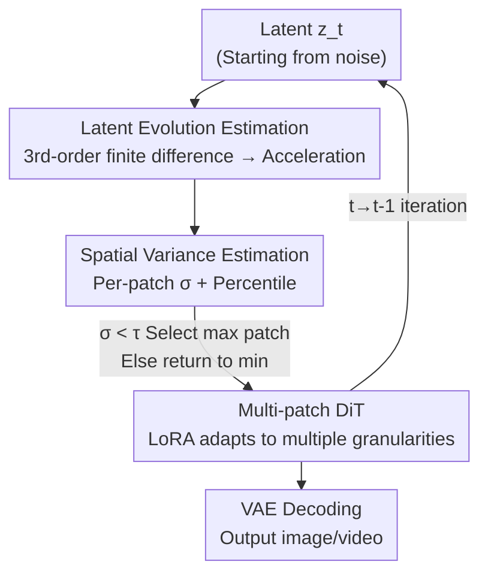

# DDiT: Dynamic Patch Scheduling for Efficient Diffusion Transformers

**Conference**: CVPR 2026  
**Paper**: [CVF Open Access](https://openaccess.thecvf.com/content/CVPR2026/html/Kim_DDiT_Dynamic_Patch_Scheduling_for_Efficient_Diffusion_Transformers_CVPR_2026_paper.html)  
**Code**: Not disclosed  
**Area**: Diffusion Models / Model Compression  
**Keywords**: Diffusion Transformer, dynamic patch, inference acceleration, LoRA, test-time scheduling

## TL;DR
DDiT discovers that Diffusion Transformers require coarse-grained patches during early denoising but fine-grained ones only during late stages. It adds light-weight LoRA branches to a frozen pre-trained DiT to support multiple patch sizes and utilizes a training-free scheduler to automatically select the largest available patch at each step based on the "acceleration of latent evolution." It achieves up to 3.52× acceleration on FLUX-1.Dev with almost no drop in FID.

## Background & Motivation
**Background**: Diffusion Transformers (DiT, e.g., FLUX, Wan) are the current mainstream frameworks for image/video generation. However, iterative denoising combined with global attention makes inference extremely slow—Wan-2.1 takes 30 minutes to generate a 5-second 720p video on an RTX 4090. Consequently, many acceleration schemes like feature caching, pruning, quantization, and distillation have been developed.

**Limitations of Prior Work**: These methods share two common flaws. First, **hard static reduction**—permanently cutting a set of weights, operations, or tokens—may discard computations critical for specific outputs, leading to significant quality degradation. Second, they are **one-size-fits-all and input-agnostic**—applying the same compute regardless of whether the prompt is "a blue sky" or "a scene of zebras crowded together," failing to allocate resources where they are truly needed.

**Key Challenge**: DiT uses **fixed-size patches** for tokenization throughout the process. Since attention complexity is $O(N^2)$ where $N = HW/p^2$, smaller patches result in more tokens and slower speeds. However, different steps in denoising generate different levels of detail: early stages build coarse global structures, while late stages refine local textures. Using the same granularity for all steps is both wasteful and inflexible.

**Key Insight**: The authors observe that latents evolve at different "detail rates" across various time steps. If the latent manifold changes slowly at a specific step, it indicates coarse structure generation; here, using large patches (coarse granularity) saves computation with minimal quality loss. Conversely, rapid changes indicate detail generation, requiring a return to small patches.

**Core Idea**: Replace "discarding computation" with "dynamically allocating computation." For each denoising step and prompt, utilize the acceleration of latent evolution as a proxy signal to automatically select the largest viable patch size, explicitly controlling the compute budget while preserving quality.

## Method

### Overall Architecture
DDiT addresses how to enable a **pre-trained** DiT to switch patch granularities on-demand during inference. It consists of two parts: **Architectural modification** using LoRA and distillation fine-tuning to allow the model to process multiple patch sizes (leaving the backbone mostly untouched), and **Scheduling** using a training-free scoring rule to determine the patch size at each inference step. This is a two-stage approach: first enabling the model's multi-patch capability, and then using a scheduler to decide when to use it.

Input consists of a prompt and latents $z_T$ starting from pure noise. At each denoising step $t$, the scheduler estimates the acceleration of latent evolution from recent steps to pick a patch size $p_t$. The corresponding patch-embedding then partitions $z_t$ into tokens for the LoRA-equipped DiT. After one denoising step and de-embedding back to latent space, the process iterates until $z_0$, which is decoded into an image/video via VAE.

### Key Designs

**1. Multi-granular Patchification: Using LoRA to adapt frozen DiT to different patch sizes**

The limitation is that the pre-trained DiT's patch-embedding layer is designed for a fixed size $p$; changing the size directly breaks the learned latent manifold. DDiT adds dedicated patch-embedding and de-embedding weights $w^{emb}_{p_{new}} \in \mathbb{R}^{p_{new}\times p_{new}\times C\times d}$ for each supported $p_{new}$ (defined as integer multiples of $p$, i.e., $\{p, 2p, 4p, \dots\}$), projecting each large patch into the same $d$-dimensional token space. Since the token count $N_{p_{new}} = HW/p_{new}^2$ is $(p_{new}/p)^2$ times smaller, attention becomes much cheaper—experimentally, $p \to 2p$ yields ~3× compute gains (4096 tokens to 1024).

To minimize training costs, the backbone is frozen. LoRA branches (rank=32) are inserted into feed-forward layers and one residual block as "adaptation paths." A residual connection is added from before patch-embedding to after de-embedding to balance the "original latent manifold" and the "LoRA-learned $p_{new}$ manifold." Position embeddings for new patches are **bilinearly interpolated** from the original $p$, and a learnable patch-size identifier vector is added to all tokens to inform the model of the current granularity. Finally, distillation loss transfers behavior from the frozen base model to the LoRA branches (see Loss & Training section).

**2. Latent Evolution Estimation: Quantifying "detail rate" using 3rd-order finite differences**

The core scheduling problem is determining whether the current step generates coarse structure or detail. DDiT quantifies evolution speed using **increasing orders of finite differences** on latent sequences. First-order difference is the displacement between adjacent steps $\Delta z_t = z_t - z_{t+1}$; second-order describes the rate of change of displacement (local velocity of the denoising trajectory) $\Delta^{(2)} z_{t-1} = \Delta z_{t-1} - \Delta z_t$; third-order captures changes in velocity, interpreted as "acceleration" within a short time window:

$$\Delta^{(3)} z_{t-1} = \Delta^{(2)} z_{t-1} - \Delta^{(2)} z_t = 2\left(\frac{\Delta z_{t-1} + \Delta z_{t+1}}{2} - \Delta z_t\right)$$

The intuition: low acceleration → small latent manifold differences → coarse structure generation, allowing large patches; high acceleration → significant structural differences → detail generation, requiring small patches. Differentiation at the **3rd order** is more effective and stable than 1st or 2nd orders (which capture only short-term changes), a finding consistent with existing work relating noise prediction differences to 3rd-order finite differences.

**3. Spatial Variance Estimation + Threshold Scheduling: Selecting max patch via percentiles**

Acceleration is calculated per-latent-pixel and must be aggregated for a $p_t$ decision across the image. DDiT partitions $z_{t-1}$ based on candidate patch sizes $p_i$ and calculates the standard deviation $\sigma^{p_i}_{t-1}$ of $\Delta^{(3)}z_{t-1}$ within each patch. High variance implies fine textures; low variance implies flatness. Instead of the **mean**, the **$\epsilon$-percentile** $\sigma^{p_i,(\epsilon)}_{t-1}$ is used for aggregation. Images often contain flat backgrounds and highly textured regions simultaneously; using the mean would smooth out high-variance signals, mistakenly selecting large patches and losing texture. The percentile preserves effective signals while ignoring outliers.

The final rule: compare $\sigma^{p_i,(\epsilon)}_{t-1}$ with a threshold $\tau$ and **select the largest patch whose variance is below the threshold**, otherwise return to the minimum patch (i.e., 1):

$$p_t = \begin{cases} \max(p_i), & \text{if } \sigma^{p_i,(\epsilon)}_{t-1} < \tau \\ 1, & \text{otherwise} \end{cases}$$

$\tau$ provides an explicit knob for speed: larger $\tau$ results in faster inference (easier coarse selection), while smaller $\tau$ favors quality. This scheduling is **training-free** and plug-and-play. Defaults are $\tau=0.001, \epsilon=0.4$.

### Loss & Training
Only new components (multi-patch layers, LoRA, identifiers) are fine-tuned while the backbone is frozen. Distillation loss transfers noise prediction from the base model to the LoRA branch—let $\hat{\epsilon}_L, \hat{\epsilon}_T$ represent predictions from the LoRA model and frozen teacher:

$$\mathcal{L} = \lVert \hat{\epsilon}_L(z^{p_{new}}_t, t) - \hat{\epsilon}_T(z^{p}_t, t) \rVert_2^2$$

Patch-embedding weights are initialized using the pseudo-inverse of bilinearly interpolated projections to preserve base model behavior. T2I is tuned on T2I-2M using the Prodigy optimizer; T2V uses AdamW on synthetic videos. Both tasks currently support $p_{new}=2p, 4p$.

## Key Experimental Results

### Main Results
T2I uses FLUX-1.Dev, T2V uses Wan-2.1 1.3B; 1024×1024, 50-step inference. Comparison with caching SOTAs (TeaCache, TaylorSeer) on COCO (lower FID, higher CLIP/ImgR are better):

| Method | Speed (s/img) | COCO FID↓ | CLIP↑ | DrawBench ImgR↑ |
|------|--------------|-----------|-------|------------------|
| FLUX-1.Dev (50 steps, baseline) | 12.0 | 33.07 | 0.314 | 1.0291 |
| TeaCache (ℓ=0.6) | 6.0 | 34.95 | 0.303 | 0.9968 |
| TaylorSeer (N=3,O=2) | 6.0 | 34.74 | 0.303 | 0.9721 |
| **DDiT** | **5.5** | **33.42** | **0.317** | **1.0284** |
| **DDiT + TeaCache (ℓ=0.4)** | **3.4** | 33.60 | 0.315 | 1.0182 |

Ours achieves 2.18× acceleration with an FID only 0.35 higher than baseline, outperforming caching methods at similar speeds. Combining with TeaCache reaches **3.52×** acceleration. On T2V (VBench):

| Model | Speed | VBench↑ |
|------|------|---------|
| Wan-2.1 (Baseline) | 1.0× | 81.24 |
| DDiT (τ=0.004) | 1.6× | 81.17 |
| DDiT (τ=0.001) | 2.1× | 80.97 |
| DDiT + TeaCache | 3.2× | 80.53 |

### Ablation Study

| Configuration | FID↓ | CLIP↑ | ImageReward↑ | Description |
|------|------|-------|--------------|------|
| DDiT (n=1) | 34.71 | 0.2927 | 0.9782 | 1st-order difference |
| DDiT (n=2) | 34.28 | 0.3082 | 1.0128 | 2nd-order difference |
| **DDiT (n=3)** | **33.42** | **0.3136** | **1.0284** | 3rd-order difference |

Threshold $\tau$ trade-off (DrawBench):

| Configuration | Speed | CLIP | ImageReward |
|------|------|------|-------------|
| DDiT (τ=0.004) | 1.88× | 0.3148 | 1.0271 |
| DDiT (τ=0.001) | 2.18× | 0.3136 | 1.0284 |
| DDiT (τ=0.01) | 3.52× | 0.3082 | 1.0124 |

### Key Findings
- **Difference order is critical for quality**: FID/CLIP/ImageReward improve monotonically from 1st to 3rd order; high-order differences capture richer temporal dynamics.
- **$\tau$ is a clean speed knob**: Increasing $\tau$ allows for earlier coarse patch selection; speed doubling (1.88× to 3.52×) only slightly impacts quality.
- **Content-awareness occurs**: High-texture prompts (zebras, snow) are assigned more fine-patch steps, while simple prompts (apple on black background) use more coarse patches.
- **Human preference matches baseline**: User studies show 61% of DDiT generations are comparable to baseline, suggesting large speedups with negligible perceptual loss.

## Highlights & Insights
- **Redefining acceleration as "allocation" rather than "discarding"**: While typical methods prune weights/tokens (subtraction), DDiT reschedules denoising steps across granularities—dynamic allocation preserves quality better.
- **3rd-order finite difference as a signal**: Using the "acceleration" of latent evolution to judge the generation stage provides an actionable proxy for diffusion dynamics, potentially transferable to other tasks like adaptive step sizing.
- **Percentile aggregation trick**: Using the $\epsilon$-percentile instead of the mean for patch variance addresses the issue of "coexisting flat and textured regions," a simple yet effective detail.
- **Plug-and-play**: LoRA + training-free scheduling allows application to any existing pre-trained DiT without heavy re-training.

## Limitations & Future Work
- **Global patch size per step**: Currently uniform across the whole image per step; spatial adaptive patches (coarse for background, fine for subject) are the natural next step.
- **Heuristic threshold selection**: $\tau$ and $\epsilon$ depend on empirical tuning; sensitivity boundaries for different resolutions or tasks are not fully explored.
- **Individual training per patch size**: Requires LoRA fine-tuning for each supported granularity ($2p, 4p$), though it remains lightweight.
- **Inherited base model flaws**: Due to distillation, DDiT inherits any existing defects of the base model.

## Related Work & Insights
- **vs Caching (TeaCache / TaylorSeer)**: These methods save compute by reusing historical intermediate representations. DDiT saves by modifying token granularity. They are **complementary** and can be stacked for superior gains.
- **vs Pruning / Quantization / Distillation**: Most are "hard static reduction" rules that are content-agnostic. DDiT’s dynamic allocation based on content and time steps preserves details more effectively.
- **vs Prior Multi-patch DiTs**: Previous works required training complex architectures or fixed schedules; DDiT is a general, test-time, training-free scheduler compatible with off-the-shelf DiTs.

## Rating
- Novelty: ⭐⭐⭐⭐
- Experimental Thoroughness: ⭐⭐⭐⭐
- Writing Quality: ⭐⭐⭐⭐
- Value: ⭐⭐⭐⭐⭐

<!-- RELATED:START -->

## Related Papers

- [\[CVPR 2026\] Memory-Efficient Fine-Tuning Diffusion Transformers via Dynamic Patch Sampling and Block Skipping](memory-efficient_fine-tuning_diffusion_transformers_via_dynamic_patch_sampling_a.md)
- [\[CVPR 2026\] MPDiT: Multi-Patch Global-to-Local Transformer Architecture for Efficient Flow Matching](mpdit_multi-patch_global-to-local_transformer_architecture_for_efficient_flow_ma.md)
- [\[CVPR 2026\] SpotEdit: Selective Region Editing in Diffusion Transformers](spotedit_selective_region_editing_in_diffusion_transformers.md)
- [\[CVPR 2026\] DPAR: Dynamic Patchification for Efficient Autoregressive Visual Generation](dpar_dynamic_patchification_for_efficient_autoregressive_visual_generation.md)
- [\[CVPR 2026\] NAMI: Efficient Image Generation via Bridged Progressive Rectified Flow Transformers](nami_efficient_image_generation_via_bridged_progressive_rectified_flow_transform.md)

<!-- RELATED:END -->
