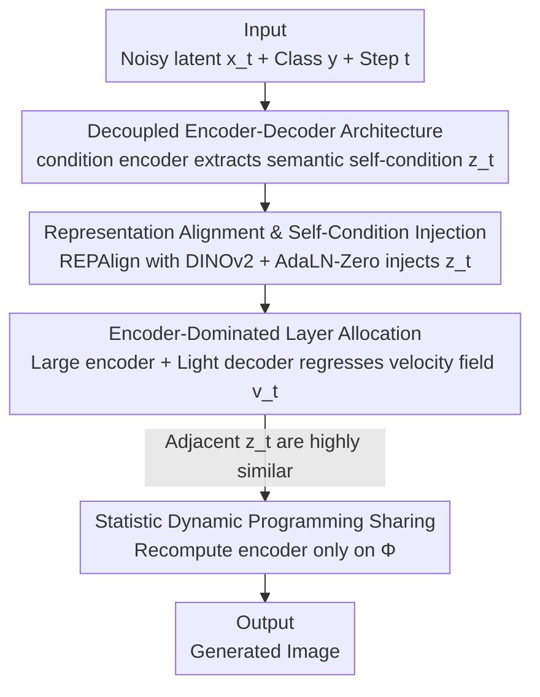

# DDT: Decoupled Diffusion Transformer

**Conference**: CVPR 2026  
**Paper**: [CVF Open Access](https://openaccess.thecvf.com/content/CVPR2026/html/Wang_DDT_Decoupled_Diffusion_Transformer_CVPR_2026_paper.html)  
**Code**: https://github.com/MCG-NJU/DDT  
**Area**: Diffusion Models / Image Generation  
**Keywords**: Diffusion Transformer, Encoder-Decoder Decoupling, Representation Alignment, Self-Conditioning Sharing, Dynamic Programming Acceleration  

## TL;DR
DDT splits the traditional "decoder-only" Diffusion Transformer into a dedicated condition encoder for semantic extraction and a dedicated velocity decoder for velocity field regression. This decouples the optimization conflict between "semantic encoding" and "high-frequency decoding." It achieves a 1.31 FID on ImageNet 256×256 in only 256 epochs (approximately 4× faster than REPA) and further accelerates inference by nearly 3× by leveraging dynamic programming to share highly similar self-conditions across adjacent steps.

## Background & Motivation
**Background**: Diffusion Transformers (DiT, SiT) have introduced Transformer architectures into diffusion models to replace UNet. They consistently outperform convolutional approaches after sufficiently long training and have become the mainstream backbone for text-to-image and text-to-video generation. However, they generally suffer from **slow convergence**, often requiring 800–1400 epochs, making the cost of developing new models extremely high.

**Limitations of Prior Work**: Current Diffusion Transformers are homogeneous stacks of decoder-only blocks: every denoising step uses the **exact same modules** to first encode noisy inputs into low-frequency semantics and then decode high-frequency details. The authors observe through a spectral perspective that reverse SDE generation is an autoregressive refinement process from "low frequency to high frequency" (Fig. 3), with most computation spent on generating high-frequency details from $t=0.4$ to $t=1.0$.

**Key Challenge**: Within the same set of parameters, "encoding low-frequency semantics" and "decoding high-frequency details" are **mutually restrictive**. Encoding semantics inevitably attenuates high-frequency information, leading to a competition for capacity within the same module and creating an optimization dilemma. The authors further performed time-step reallocation experiments with SiT-XL/2 (Fig. 4): allocating more computation to earlier steps with higher noise significantly improves FID, indicating that the **model bottleneck lies in low-frequency semantic encoding capacity** rather than high-frequency decoding.

**Goal**: To accelerate convergence and improve sampling quality without increasing the inference burden, answering whether "decoupled encoder-decoder Transformers can unlock accelerated convergence and quality improvements for diffusion models."

**Key Insight**: Classic vision algorithms (detection, segmentation) commonly use asymmetric designs with a "large encoder for feature extraction + light decoder for output," whereas modern diffusion models have reverted to homogeneous decoder-only structures. The authors argue this direction is severely undervalued.

**Core Idea**: Use a **dedicated condition encoder** to explicitly extract low-frequency semantics as "self-conditions," which are then fed into a **dedicated velocity decoder** to regress the high-frequency velocity field, architecturally separating the two conflicting tasks.

## Method

### Overall Architecture
DDT is trained under the standard linear flow matching framework, splitting a single denoising network into two serial modules. Given a noisy latent $x_t$, time step $t$, and class $y$: the condition encoder first extracts the semantic self-condition $z_t$; the velocity decoder then takes $x_t$, $t$, and $z_t$ to regress the velocity field $v_t$. The encoder side uses REPAlign (aligning with pre-trained vision features from DINOv2) for direct supervision and indirectly receives backpropagation from the decoder's flow matching loss. The decoder side injects $z_t$ via AdaLN-Zero. Since $z_t$ is highly similar across adjacent time steps, the encoder can be recomputed only on a selected set of time steps $\Phi$ during inference, while other steps reuse previous results to further accelerate the process.

### Key Designs

**1. Decoupled Encoder-Decoder Architecture: Separating "Semantic Extraction" and "Detail Generation"**

This is the foundation of DDT. Addressing the conflict where semantic encoding and high-frequency decoding compete within the same parameters, DDT no longer requires every denoising step to handle both tasks using homogeneous modules. Instead, it explicitly splits them. The condition encoder follows the micro-design of DiT/SiT (alternating Attention and FFN blocks, no long residuals) to encode patchified noisy tokens into self-condition features: $z_t = \text{Encoder}(x_t, t, y)$, where $t$ and $y$ are injected per-block via AdaLN-Zero. The velocity decoder has the same structure but **no longer takes the class label** (the authors assume class information is already integrated into $z_t$). it only uses $t$ and $z_t$ as conditions to regress the velocity field: $v_t = \text{Decoder}(x_t, t, z_t)$, trained with the flow matching loss:

$$\mathcal{L}_{dec} = \mathbb{E}\!\left[\int_0^1 \left\| (x_{data} - \epsilon) - v_t \right\|^2 \mathrm{d}t\right]$$

This provides dedicated capacity for semantic encoding without being crowded out by high-frequency decoding. The encoder also receives indirect supervision from the decoder's flow matching loss, significantly accelerating overall convergence.

**2. Representation Alignment + Self-Condition Injection: Maintaining Local Consistency of $z_t$**

Splitting the modules is not enough; the self-condition must be both "semantically rich" and "stable across adjacent steps" (the latter being a prerequisite for sharing-based acceleration). DDT borrows representation alignment from REPA: it takes the intermediate feature $h_i$ from the $i$-th layer of the encoder, projects it via a learnable MLP $h_\phi$, and aligns it with DINOv2 representation $r_*$ using cosine similarity:

$$\mathcal{L}_{enc} = 1 - \cos\!\left(r_*,\, h_\phi(h_i)\right)$$

This regularization injects external vision priors into the encoder to accelerate convergence (consistent with REPA) and forces $z_t$ to be highly correlated between adjacent denoising steps. On the decoder side, $z_t$ is injected into features via AdaLN-Zero, further enhancing this consistency. The authors measured that the cosine similarity of self-conditions between $z_{t=0}$ and $z_{t=1}$ can exceed 0.8 (Fig. 5), which validates Design 4.

**3. Encoder-Dominated Asymmetric Layer Allocation: Larger Returns for Larger Models**

Since the bottleneck is low-frequency semantic encoding, parameters should be shifted toward the encoder. DDT systematically swept encoder/decoder layer ratios from $2{:}1$ to $5{:}1$ under a fixed total layer count, denoted as $m\text{En}n\text{De}$ for $m$ encoder layers and $n$ decoder layers. The conclusion is: as the model size increases, it favors a more "aggressive" encoder-dominated ratio. For the Base model, 8En4De is optimal, while the Large model surprisingly prefers an extreme ratio like 20En4De (Fig. 7, Fig. 8). This "counter-intuitive" finding led the authors to push the XL model to 22En6De to explore the upper bound. It suggests that Diffusion Transformer capacity should be prioritized for semantic encoding rather than high-frequency decoding—the latter does not require as many layers and can achieve similar results even with simple Convolutional blocks (see Ablation Study).

**4. Statistic Dynamic Programming for Self-Condition Sharing: Saving Computation on Adjacent Steps**

Design 2 ensures high redundancy in $z_t$ across adjacent steps, which is utilized here for inference acceleration. Given total steps $N$ and an encoder computation budget $K$, define the set of steps $\Phi$ where the self-condition must be **recomputed** ($|\Phi|=K$, sharing ratio $1-\frac{K}{N}$). If the current step $t \notin \Phi$, the previous $z_{t-\Delta t}$ is reused; otherwise, the encoder is executed. A naive approach would be uniform recomputation every $\frac{N}{K}$ steps (Uniform), similar to DeepCache. However, the authors point out that while UNet lacks representation alignment and has poorer local consistency, DDT's consistent structure allows for better optimization. They formalize "selecting which steps to recompute" as a **minimum sum path problem**: construct a self-condition similarity matrix $S \in \mathbb{R}^{N\times N}$ using cosine distance to minimize the global similarity cost $-\sum_k \sum_{i} S[\Phi_k, i]$. This is solved via dynamic programming with the state transition:

$$\mathbf{C}_i^k = \min_{j=0}^{i}\left\{\mathbf{C}_j^{k-1} - \Sigma_{l=j}^{i}\, \mathbf{S}[j, l]\right\}$$

The optimal $\Phi$ is obtained by backtracking the path $\mathbf{P}$, with a solving overhead of only a few seconds. Compared to uniform sharing, this Statistic Dynamic Programming (StatisticDP) achieves lower FID loss at the same acceleration ratio.

### Loss & Training
The total objective is a combination of the encoder representation alignment loss $\mathcal{L}_{enc}$ and the decoder flow matching loss $\mathcal{L}_{dec}$. Training uses Adam with a constant learning rate of 0.0001 and a batch size of 256, without gradient clipping or warmup. The VAE used is the off-the-shelf SD-VAE-f8d4-ft-EMA (downsampling factor 8). Sampling defaults to an Euler solver with 250 steps. The baseline also incorporates "improved baseline" techniques such as SwiGLU, RoPE, RMSNorm, and lognorm sampling to ensure a fair comparison.

## Key Experimental Results

### Main Results
On ImageNet 256×256 class-conditional generation, DDT-XL/2 sets a new SoTA in just 256 epochs, with training efficiency approximately 4× that of REPA.

| Model | Params | Epochs | FID↓ (w/ CFG) | IS↑ | Notes |
|------|------|--------|---------------|-----|------|
| SiT-XL/2 | 675M | 1400 | 2.06 | 270.3 | decoder-only baseline |
| REPA-XL/2 | 675M | 800 | 1.42 | 305.7 | with rep. alignment |
| **DDT-XL/2** | 675M | 80 | 1.52 | 263.7 | Near SoTA in 80 epochs |
| **DDT-XL/2** | 675M | 256 | **1.31** | 308.1 | New SoTA, ~4× speedup |
| **DDT-XL/2** | 675M | 400 | **1.26** | 310.6 | Approaches VAE limit 1.20 rFID |

At 512×512 (fine-tuned from the 256 model), it achieved 1.28 FID, significantly leading REPA's 2.08 (interim report 1.90, further training to 500K steps reached 1.28).

### Ablation Study
Impact of different encoder/decoder ratios and decoder block types at 400K steps without CFG (DDT-B/2, 8En4De):

| Config | FID↓ | sFID↓ | IS↑ | Notes |
|------|------|-------|-----|------|
| Improved-REPA-B/2 | 19.1 | 6.88 | 76.5 | Strongest same-size decoder-only base |
| DDT-B/2 (8En4De) Attn+MLP | **16.32** | 6.63 | 86.0 | Default config, best |
| DDT-B/2 (8En4De) Conv+MLP | 16.96 | 7.33 | 85.1 | Decoder with simple Conv still close |
| DDT-B/2 (8En4De) MLP+MLP | 24.13 | 7.89 | 65.0 | Pure MLP decoder performs significantly worse |

Self-condition sharing acceleration (DDT-XL/2, w/ CFG, StatisticDP vs Uniform):

| Sharing Ratio | Speedup | Strategy | FID↓ |
|----------|------|------|------|
| 0.00 | 1.0× | — | 1.31 |
| 0.50 | 1.6× | Uniform | 1.31 |
| 0.80 | 2.6× | Uniform / StatisticDP | 1.36 / **1.33** |
| 0.87 | 3.0× | Uniform / StatisticDP | 1.42 / **1.40** |

### Key Findings
- **Encoder dominance increases with scale**: Base prefers 8En4De, Large prefers 20En4De, and XL pushes to 22En6De. Assigning capacity to semantic encoding is more effective than to high-frequency decoding—this is the most counter-intuitive yet significant finding.
- **The decoder is "not picky"**: Thanks to the decoupled design, replacing the decoder with simple Conv blocks (16.96 FID) remains close to the default Attn+MLP (16.32), confirming that high-frequency decoding is not the bottleneck.
- **Sharing acceleration is nearly free**: $z_t$ similarity between adjacent steps is >0.8. When the sharing ratio is ≤0.83 (~2.7× speedup), FID barely drops. StatisticDP consistently outperforms uniform sharing across all speedup levels.
- **Minimal extra overhead**: Compared to the baseline, DDT-XL/2 adds only +1.2G VRAM and +0.01s per training step, with inference being nearly equal.

## Highlights & Insights
- **Diagnosing "slow convergence" as "insufficient semantic encoding capacity" via a spectral lens**: The authors used time-step reallocation experiments (giving more compute to noisy steps improves FID) to identify the bottleneck in low-frequency encoding, providing a logically sound justification for the architectural solution.
- **Double dividends from a single design**: Representation alignment both accelerates convergence and naturally preserves high consistency in self-conditions across adjacent steps, enabling "shared encoder" inference acceleration for free. The architectural decoupling is not an isolated change but connects training and inference acceleration.
- **Upgrading cache reuse from heuristic to optimization**: Unlike DeepCache-style methods that rely on manual uniform caching, DDT models the selection of recomputation steps as a minimum sum path problem solved via DP in seconds, a strategy transferable to any diffusion scenario with redundant adjacent features.
- **The "large encoder, small decoder" asymmetric design insight** can be directly applied to parameter allocation in other generative Transformers.

## Limitations & Future Work
- **Limited task scope**: Experiments were conducted only on ImageNet class-conditional generation (256/512). The effectiveness of the decoupled architecture in more complex conditions like text-to-image or text-to-video has yet to be verified. ⚠️ The authors noted slight degradation in some metrics at 512, attributed to insufficient fine-tuning steps.
- **Ratio determined by sweeping**: The optimal encoder/decoder layer ratio was found through empirical sweeping (and varies significantly with scale), lacking predictive theoretical guidance; it might require re-sweeping for different datasets or model scales.
- **Budget selection for self-condition sharing**: The trade-off between sharing ratio and quality requires manual selection of the budget $K$, even though DP provides the optimal $\Phi$ for a given $K$.
- **Future directions**: Extending the decoupling idea to text-conditioned diffusion or making the encoder/decoder ratio adaptive during training are natural next steps.

## Related Work & Insights
- **vs REPA**: REPA adds representation alignment to a decoder-only structure to enhance low-frequency encoding, but performance saturates as the model scales. DDT completely separates encoding and decoding while reusing REPA’s alignment loss, consistently leading at the XL scale (1.31 vs 1.42 FID) with ~4× faster convergence.
- **vs DiT / SiT**: Both are homogeneous decoder-only Diffusion Transformers. DDT identifies their inherent optimization dilemma between "semantic encoding vs high-frequency decoding" and solves it with an asymmetric encoder-decoder, where the fundamental difference lies in the architecture rather than training tricks.
- **vs DeepCache (UNet Cache Reuse)**: DeepCache uses manual uniform caching for UNet acceleration, but UNet lacks representation alignment and has poor adjacent step consistency. DDT possesses stronger consistency and uses Statistic Dynamic Programming for optimal sharing, resulting in more stable acceleration with less quality loss.
- **vs MAR**: MAR relies on semantic features produced by a masked backbone to overcome the insufficient capacity of a lightweight decoder head. This shares the same motivation as DDT's "isolating semantic encoding," but DDT follows a purely continuous diffusion approach with encoder-decoder decoupling.

## Rating
- Novelty: ⭐⭐⭐⭐⭐ A clear and unique design path from spectral diagnosis to encoder-decoder decoupling and DP sharing.
- Experimental Thoroughness: ⭐⭐⭐⭐⭐ Systematic comparison across sizes + ablation on ratios/block types/sharing strategies + SoTA on both 256/512 resolutions.
- Writing Quality: ⭐⭐⭐⭐ The logic from diagnosis to design to verification is smooth and formulas are clear; certain details (like the DP state transition) might require checking the original text for full context.
- Value: ⭐⭐⭐⭐⭐ 4× training speedup + nearly 3× inference speedup + new SoTA, with "large encoder, small decoder" providing general guidance for future model design.

<!-- RELATED:START -->

## Related Papers

- [\[CVPR 2026\] DeCo: Frequency-Decoupled Pixel Diffusion for End-to-End Image Generation](deco_frequency-decoupled_pixel_diffusion_for_end-to-end_image_generation.md)
- [\[CVPR 2026\] Guiding a Diffusion Transformer with the Internal Dynamics of Itself](guiding_a_diffusion_transformer_with_the_internal_dynamics_of_itself.md)
- [\[CVPR 2026\] DiT-IC: Aligned Diffusion Transformer for Efficient Image Compression](ditic_aligned_diffusion_transformer_for_efficient.md)
- [\[CVPR 2026\] GeoRK2: Geometry-Guided Runge-Kutta Integration for Diffusion Transformer Acceleration](geork2_geometry-guided_runge-kutta_integration_for_diffusion_transformer_acceler.md)
- [\[CVPR 2026\] Decoupled Residual Denoising Diffusion Models for Unified and Data Efficient Image-to-Image Translation](decoupled_residual_denoising_diffusion_models_for_unified_and_data_efficient_ima.md)

<!-- RELATED:END -->
