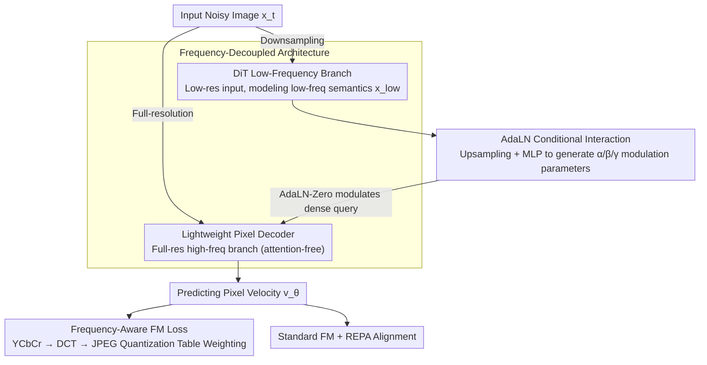

# DeCo: Frequency-Decoupled Pixel Diffusion for End-to-End Image Generation

**Conference**: CVPR 2026  
**arXiv**: [2511.19365](https://arxiv.org/abs/2511.19365)  
**Code**: [https://github.com/Zehong-Ma/DeCo](https://github.com/Zehong-Ma/DeCo)  
**Area**: Image Generation  
**Keywords**: Pixel Diffusion, Frequency Decoupling, End-to-End Generation, Diffusion Transformer, Frequency-Aware Loss

## TL;DR
DeCo proposes a frequency-decoupled pixel diffusion framework that utilizes a lightweight pixel decoder to process high-frequency details, allowing the DiT to focus on low-frequency semantic modeling. Combined with a frequency-aware flow matching loss, it achieves FID scores of 1.62 (256) and 2.22 (512) on ImageNet, narrowing the gap between pixel-space and latent-space diffusion.

## Background & Motivation
1. **Background**: Latent Diffusion Models (LDM) are the dominant paradigm, but they rely on a two-stage pipeline with VAEs, which introduces lossy reconstruction and distribution shifts. Pixel diffusion models perform end-to-end modeling directly in pixel space, avoiding VAE limitations but suffering from low training and inference efficiency.
2. **Limitations of Prior Work**: Existing pixel diffusion models use a single DiT to model both high-frequency signals and low-frequency semantics. High-frequency noise is difficult to learn and interferes with the learning of low-frequency semantics, leading to slow training and suboptimal generation quality.
3. **Key Challenge**: DiT is proficient at capturing low-frequency semantics but struggles with high-frequency signals, whereas pixel space contains both simultaneously.
4. **Goal**: Design a more efficient pixel diffusion paradigm that decouples the modeling tasks for high and low frequencies.
5. **Key Insight**: Inspired by the observation that "high-frequency signals are easier to reconstruct from high-resolution inputs, while low-frequency semantics are easier to model at low resolutions."
6. **Core Idea**: Use a DiT to process downsampled inputs to focus on low-frequency semantics, and a lightweight pixel decoder to generate high-frequency details at full resolution conditioned on the DiT output.

## Method

### Overall Architecture
DeCo aims to relieve pixel diffusion from the burden of "one DiT tackling both high and low frequencies." High-frequency noise is inherently difficult to learn and drags down low-frequency semantic modeling. The approach splits the image into two paths: first, the input is downsampled and passed to the DiT to focus on low-frequency semantics $x_{\text{low}} = \text{DiT}(\bar{x}_t, t, y)$; then, these semantics are used as conditions for a lightweight pixel decoder to recover high-frequency details at full resolution, predicting the pixel velocity $v_\theta(x_t, t, y) = \text{Dec}(x_t, t, x_{\text{low}})$. The entire pipeline is trained end-to-end with a total loss comprising standard FM, frequency-aware FM, and REPA alignment.

### Key Designs

**1. Frequency-Decoupled Architecture: Relieving DiT from High-Frequency Burden**

In pixel space, high and low frequencies are mixed. Since DiT is naturally suited for low-frequency semantics rather than high-frequency signals, forcing it to handle both is the root cause of slow training and poor quality. DeCo splits the task by resolution: DiT only sees downsampled inputs to focus on low frequencies, while high frequencies are handled by an attention-free lightweight pixel decoder. This decoder consists of $N$ linear blocks and a projection layer, operating directly on full-resolution noisy images and receiving DiT outputs as conditions. The key is multi-scale input: the decoder takes high-resolution images, which are naturally suited for high frequencies, while the DiT takes low-resolution images, corresponding to its strength in low-frequency modeling. DCT energy analysis confirms this division of labor: the high-frequency energy of the DiT output in DeCo is significantly lower than the baseline, indicating successful transfer to the pixel decoder.

**2. AdaLN Conditional Interaction: Injecting Low-Frequency Semantics into the Decoder**

The decoder recovers high frequencies but must follow the semantic guidance of the DiT. DeCo upsamples the DiT output to full resolution and passes it through an MLP to generate modulation parameters $\alpha, \beta, \gamma$, which modulate the dense query in the decoder using AdaLN-Zero:

$$h_N = h_{N-1} + \alpha \cdot \text{MLP}((1+\gamma) \cdot h_{N-1} + \beta)$$

Compared to the direct addition used in UNet, AdaLN's multiplicative-additive modulation is more flexible and provides better signal control, as evidenced by its superior performance in ablation studies.

**3. Frequency-Aware FM Loss: Weighting Frequencies by Human Perception**

Standard FM loss treats all frequencies equally, but human sensitivity varies significantly across the frequency spectrum. Allocating training resources to visually insignificant high frequencies is wasteful. DeCo adopts a prior: the JPEG quantization table, which encodes visual importance for different frequencies. Specifically, both predicted and ground-truth velocities are converted to the YCbCr color space and then to the frequency domain via $8\times8$ DCT. The normalized inverse of the JPEG quantization table is used as an adaptive weight—frequencies with smaller quantization intervals are assigned higher weights. The weighted MSE is then calculated in the frequency domain:

$$\mathcal{L}_{\text{FreqFM}} = \mathbb{E}[w\|\mathbb{V}_\theta - \mathbb{V}_t\|^2]$$

This encourages the model to focus on visually salient frequencies rather than imperceptible high-frequency components.

### Loss & Training
The total loss is the sum of three terms: $\mathcal{L} = \mathcal{L}_{\text{FM}} + \mathcal{L}_{\text{FreqFM}} + \mathcal{L}_{\text{REPA}}$, where REPA provides representation alignment. Inference uses 50-step Euler sampling.

## Key Experimental Results

### Main Results

| Method | Type | FID↓ (256) | FID↓ (512) | IS↑ | Notes |
|------|------|-----------|-----------|-----|------|
| DeCo | Pixel Diffusion | 1.62 | 2.22 | 294.6 | Pixel Diffusion SOTA |
| DiT-XL/2 | Latent | 2.27 | - | 278.2 | Requires VAE |
| REPA-XL/2 | Latent | 1.42 | - | 305.5 | Current Best LDM |
| PixelFlow | Pixel Diffusion | 54.33 | - | 24.67 | Multi-scale Method |
| Baseline | Pixel Diffusion | 61.10 | - | 16.81 | Non-decoupled |

### Ablation Study

| Configuration | FID↓ | Description |
|------|-----|------|
| DeCo Full | 31.35 | 200K Iterations |
| w/o FreqFM | 34.12 | Frequency loss is effective |
| w/o REPA | 67.55 | REPA alignment is critical |
| Baseline | 61.10 | No decoupling |

### Key Findings
- DeCo reaches 2.57 FID at 400K iterations, converging 10x faster than the baseline.
- The key to frequency decoupling lies in both the multi-scale input strategy and AdaLN interaction; both are indispensable.
- The pixel decoder is extremely lightweight (attention-free), adding only 3% more parameters while providing significant gains.
- Strong performance in text-to-image generation: GenEval 0.86, DPG-Bench 81.4.

## Highlights & Insights
- The **Frequency Decoupling** approach is simple yet powerful: letting different modules do what they are best at.
- Using the **JPEG Quantization Table as a perceptual prior** is an elegant trick that introduces human perceptual knowledge at zero cost.
- Pixel diffusion is finally competitive with latent diffusion, proving that a VAE is not strictly necessary.

## Limitations & Future Work
- Still slightly trails the strongest LDMs at 512 resolution, though the gap is narrowing.
- The hidden dimension and number of layers in the pixel decoder require hyperparameter tuning.
- Future work could explore stronger frequency decoupling schemes or integration with parallel work like JiT.

## Related Work & Insights
- **vs PixelFlow**: Uses a cascaded approach across different resolution stages, but each stage still handles all frequencies. DeCo decouples frequencies simultaneously within each timestep.
- **vs DDT**: Performs single-scale frequency decoupling in latent space. DeCo is a multi-scale solution in pixel space.

## Rating
- Novelty: ⭐⭐⭐⭐ Clear frequency decoupling, though not revolutionary.
- Experimental Thoroughness: ⭐⭐⭐⭐⭐ Validated across 256/512/T2I with in-depth ablations.
- Writing Quality: ⭐⭐⭐⭐⭐ Thorough analysis and persuasive visualizations.
- Value: ⭐⭐⭐⭐⭐ Makes pixel diffusion a competitive paradigm once again.

<!-- RELATED:START -->

## Related Papers

- [\[CVPR 2026\] PixelDiT: Pixel Diffusion Transformers for Image Generation](pixeldit_pixel_diffusion_transformers_for_image_generation.md)
- [\[CVPR 2026\] SpeeDiff: Scalable Pixel-Anchored End-to-End Latent Diffusion Model](speediff_scalable_pixel-anchored_end-to-end_latent_diffusion_model.md)
- [\[CVPR 2026\] DDT: Decoupled Diffusion Transformer](ddt_decoupled_diffusion_transformer.md)
- [\[ICML 2026\] End-to-End Autoregressive Image Generation with 1D Semantic Tokenizer](../../ICML2026/image_generation/end-to-end_autoregressive_image_generation_with_1d_semantic_tokenizer.md)
- [\[ICCV 2025\] End-to-End Multi-Modal Diffusion Mamba](../../ICCV2025/image_generation/end-to-end_multi-modal_diffusion_mamba.md)

<!-- RELATED:END -->
