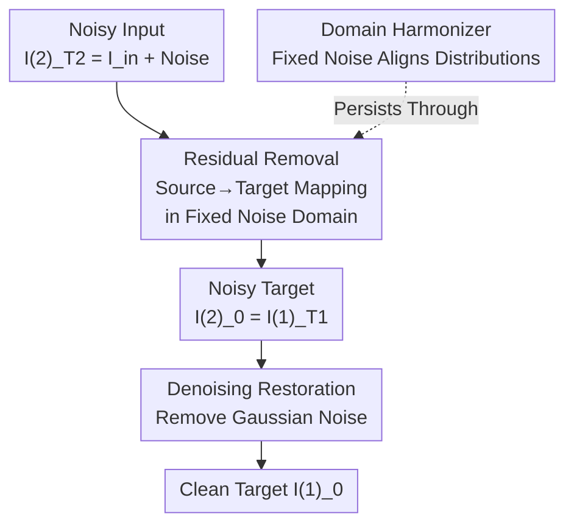

# Decoupled Residual Denoising Diffusion Models for Unified and Data Efficient Image-to-Image Translation

**Conference**: CVPR 2026  
**arXiv**: [2606.01048](https://arxiv.org/abs/2606.01048)  
**Code**: https://github.com/HKU-HealthAI/DRDD (Available)  
**Area**: Diffusion Models / Image Generation / Image Restoration  
**Keywords**: Image-to-Image Translation, Residual Diffusion, Domain Alignment, Decoupled Diffusion, Data Efficient

## TL;DR
DRDD identifies that injecting Gaussian noise, beyond performing "manifold lifting," also implicitly narrows the feature distribution gap between different domains (acting as a "domain harmonizer"). Consequently, it decouples the traditional coupled diffusion into two independent stages: "noise addition for domain harmonization" followed by "deterministic residual mapping." This ensures the core source $\to$ target mapping is completed entirely within a fixed noise domain, achieving robustness and data efficiency in unified restoration tasks and scenarios with limited paired data.

## Background & Motivation
**Background**: Image-to-Image (I2I) translation involves mapping images from a source domain to a target domain, covering tasks like denoising, deraining, dehazing, super-resolution, and style transfer. Early methods relied on GANs, while diffusion models (e.g., SR3, WeatherDiff) have become mainstream due to their quality and diversity. To stably preserve input structures, advanced methods like RDDM, I2SB, and IR-SDE no longer start from pure noise but perform backward sampling starting from a "noisy input image."

**Limitations of Prior Work**: Despite different starting points, these methods share the same underlying paradigm—I2I translation is completed via a **single, coupled backward process**, where each step removes noise and residuals simultaneously (residual = source image - target image). When performing **unified I2I translation** (a single model handling multiple tasks/domains), large domain gaps and the difficulty of collecting large-scale paired data across diverse tasks make this coupled paradigm struggle.

**Key Challenge**: The authors revisit the role of "Gaussian noise injection" in diffusion. They find that besides moving data off low-dimensional manifolds (manifold lifting) and enriching score estimation signals, it possesses an overlooked property—a certain amount of fixed Gaussian noise acts as a "domain harmonizer," implicitly pulling feature distributions of different domains closer (Proposition 3.1: the KL divergence between two distributions strictly decreases after adding the same Gaussian noise). However, coupled diffusion **removes noise and residuals prematurely** during the backward process, eroding this harmonization benefit before the source $\to$ target mapping is complete.

**Goal**: Separate "domain harmonization" and "semantic mapping" in time, maintaining the harmonization effect throughout the core mapping process while improving data efficiency.

**Key Insight**: Since the value of noise lies in "maintaining a harmonized, noisy domain," it should not be removed during the mapping—the core residual mapping should be embedded entirely within a fixed noise domain.

**Core Idea**: The traditional single coupled diffusion is **decoupled** into two serial independent stages: first, stochastic noise diffusion (domain harmonization + manifold lifting), followed by deterministic residual diffusion within a fixed noise domain (learning semantic mapping). Correspondingly, the backward process is symmetrically split into "residual removal" and "denoising."

## Method

### Overall Architecture
DRDD addresses how to maintain the domain harmonization effect of noise throughout the I2I mapping while saving on paired data. It splits the traditional "noise + residual" forward chain into two independent, serial diffusions. The forward process starts from the clean target $I_0^{(1)}$ by injecting Gaussian noise to obtain the noisy target $I_{T_1}^{(1)}$ (noise diffusion stage) and then uses it as a starting point to inject the residual $I_{res}=I_{in}-I_0$ to obtain the noisy input $I_{T_2}^{(2)}$ (residual diffusion stage). The complete forward chain is $I_0^{(1)}\to I_{T_1}^{(1)}=I_0^{(2)}\to I_{T_2}^{(2)}$, where the endpoint is exactly $I_{in}+\bar\beta_{T_1}\varepsilon$ (noisy input). The backward process is symmetrically decoupled: starting from $I_{T_2}^{(2)}$, it **first** performs residual removal within a fixed noise domain to obtain the noisy target $I_0^{(2)}=I_{T_1}^{(1)}$ (the core source $\to$ target mapping, where noise remains untouched), and **then** performs denoising to restore the noisy target to the clean target $I_0^{(1)}$, i.e., $I_{T_2}^{(2)}\to I_0^{(2)}\to I_0^{(1)}$. Each stage is handled by an independent network and trained with different objectives.

### Key Designs

**1. Noise as "Domain Harmonizer": Aligning Distributions with Fixed Noise**

The biggest obstacle in unified I2I is the massive feature gap between different tasks/domains, making it hard for a single model to learn a universal mapping. The authors discovery that noise does more than "manifold lifting": injecting the same Gaussian noise $\mathcal{N}(0,\sigma^2)$ ($\sigma\neq0$) into two different distributions $P$ and $Q$ to get $P_\sigma$ and $Q_\sigma$ results in $D_{\text{KL}}(P_\sigma\|Q_\sigma)<D_{\text{KL}}(P\|Q)$ (Proposition 3.1, proof in Appendix A.1 of the original paper). That is, noise injection **strictly reduces** the distributional distance between domains, as visualized by t-SNE. Crucially, traditional diffusion uses scheduled noise that is gradually removed; DRDD requires a **fixed-level, non-scheduled** noise to maintain a stable "noisy domain," vastly simplifying unified mapping.

**2. Decoupled Forward Process: Splitting Coupled Diffusion into Serial Noise and Residual Stages**

The coupled paradigm mixes "noise addition" and "residual addition" in one chain, which means they must be removed together in reverse, eroding harmonization benefits. DRDD decouples the forward process into two independent stages. The noise diffusion stage gradually injects Gaussian noise: $I_t^{(1)}=I_{t-1}^{(1)}+\beta_t\varepsilon_{t-1}=I_0^{(1)}+\bar\beta_t\varepsilon$, where $\bar\beta_t=\sqrt{\sum_{i=1}^t\beta_i^2}$, performing both domain harmonization and manifold lifting. Its final state becomes the start of residual diffusion ($I_0^{(2)}:=I_{T_1}^{(1)}$), which performs deterministic target $\to$ source injection **within a fixed noise domain**: $I_t^{(2)}=I_{t-1}^{(2)}+\alpha_t I_{res}=I_0^{(2)}+\bar\alpha_t I_{res}$, where $\bar\alpha_t=\sum_{i=1}^t\alpha_i$. When $\bar\alpha_{T_2}=1$, the endpoint $I_{T_2}^{(2)}=I_{in}+\bar\beta_{T_1}\varepsilon$ is reached, representing the "noisy input image." Fixed independence means the noise level is a constant during the residual stage.

**3. Decoupled Backward Process: Residual Removal in Fixed Noise Domain followed by Denoising**

This is the key to maintaining harmonization throughout the mapping. The backward process starts from the noisy input $I_{T_2}^{(2)}$. In **stage one (residual removal)**, a network $I_{res}^\theta(I_t^{(2)},t,I_{in})$ is trained to predict the residual in the noise domain, with the iteration $I_{t-1}^{(2)}=I_t^{(2)}-\alpha_t I_{res}^\theta(I_t^{(2)},I_{in},t)$. Throughout this source $\to$ target mapping, the noise is **not touched**, thus preserving the harmonization and manifold lifting effects. In **stage two (denoising)**, a noise network $\epsilon_\theta$ restores the noisy target to a clean target via $I_{t-1}^{(1)}=I_t^{(1)}-(\bar\beta_t-\sqrt{\bar\beta_{t-1}^2-\sigma_t^2})\epsilon_\theta(I_t^{(1)},t)+\sigma_t\varepsilon_t$, where $\sigma_t^2=\eta\beta_t^2\bar\beta_{t-1}^2/\bar\beta_t^2$ and $\eta$ controls stochasticity ($\eta=1$ for random, $\eta=0$ for deterministic). In contrast to "mapping while denoising," DRDD "maps first, then denoises separately."

**4. Data Efficiency: Denoising Stage Trained with Unpaired Target Images Only**

A major difficulty in unified I2I is the scarcity of paired data. DRDD's decoupling provides a bonus: the denoising network loss $\mathcal{L}_\epsilon(\theta)=\mathbb{E}[\|\epsilon-\epsilon_\theta(I_t^{(1)},t)\|_1]$ **depends only on clean target images and injected noise, requiring no source images**. This allows the denoising stage to be trained on massive unpaired target-domain datasets or initialized with pre-trained weights from large-scale datasets like ImageNet. Only the residual removal network requires paired data, using $\mathcal{L}_{res}(\theta)=\mathbb{E}[\|I_{res}-I_{res}^\theta(I_t^{(2)},t,I_{in})\|_1]$, ensuring paired samples are used where they matter most.

### Example Walkthrough: The Journey of a Noisy Input
Take a low-light input $I_{in}$ in a multi-task restoration setting: ① Sample Gaussian noise $\epsilon$ and construct the noisy input $I_{T_2}^{(2)}=I_{in}+\bar\beta_{T_1}\epsilon$ as the starting point; ② In the residual removal stage, loop $t=T_2\dots1$, at each step calculating $I_{t-1}^{(2)}=I_t^{(2)}-\alpha_t I_{res}^\theta(\cdot)$ to remove the "low-light $\to$ normal-light" residual, resulting in a noisy normal-light target $I_0^{(2)}$—the noise level stays fixed at $\bar\beta_{T_1}$ throughout, so domains remain harmonized; ③ Set $I_{T_1}^{(1)}=I_0^{(2)}$ and enter the denoising stage loop $t=T_1\dots1$, using $\epsilon_\theta$ to remove Gaussian noise; ④ Return the clean normal-light image $I_0^{(1)}$. Both stages use DDIM sampling with a step size of 2 during inference.

### Loss & Training
Two networks are trained separately (see Alg. 1 in the original paper): the residual removal network uses $\mathcal{L}_{res}$ (requires paired data), and the denoising network uses $\mathcal{L}_\epsilon$ (requires only target images). The derivation is based on the DDPM/DDIM framework and is compatible with score-based SDEs. The denoising network uses a U-Net with channel depth $C=64$ and multipliers $(1,2,4,8)$. The optimal noise intensity $\bar\beta$ is derived from the theoretical objective $J(\sigma;\lambda)=\lambda\widetilde A(\sigma)+(1-\lambda)\widetilde B(\sigma)$ (where $A$ is the distance between noisy source/target domains and $B$ is the distance between noisy/original source domains, measured via MMD). For $\lambda=0.5$, the optimal $\bar\beta\approx1.1\text{–}1.2$, with experimental results showing stability in the 0.8–1.3 range and a peak at 1.0.

## Key Experimental Results

### Main Results

All-in-One-5 Five-Task Unified Restoration (SSIM↑ / LPIPS↓ / FID↓, Average column):

| Method | Type | SSIM↑ | LPIPS↓ | FID↓ |
|------|------|-------|--------|------|
| DA-CLIP* | Diffusion | 0.876 | 0.108 | 20.0 |
| DiffuIR* | Diffusion | 0.869 | 0.117 | 33.7 |
| AdAIR | Non-diff | 0.909 | 0.089 | 26.1 |
| VLUNet | Non-diff | 0.904 | 0.096 | 27.9 |
| DFPIR | Non-diff | 0.912 | 0.081 | 24.9 |
| **DRDD (Ours)*** | Diffusion | **0.916** | **0.073** | **18.3** |

DRDD leads across all three average metrics, with perceived quality metrics (LPIPS, FID) showing significant gains (FID 18.3 vs. 20.0 second best).

MNMD Cross-Domain Single-Task Denoising (Self-built benchmark including Natural/Medical/Remote Sensing domains, Average column):

| Method | SSIM↑ | LPIPS↓ |
|------|-------|--------|
| RDDM | 0.8406 | 0.1702 |
| IR-SDE | 0.8215 | 0.0879 |
| VLUNET | 0.9274 | 0.0784 |
| **DRDD (Ours)** | **0.9338** | **0.0553** |

Across highly distinct domains, DRDD achieves the highest SSIM and lowest LPIPS in every domain, validating the effectiveness of "domain harmonization" in cross-domain scenarios.

### Ablation Study

Decoupling mechanism ported to the SDE framework (IR-SDE $\to$ De-IRSDE, single-task I2I):

| Task | Metric | IR-SDE (Coupled) | De-IRSDE (Decoupled) |
|------|------|---------------|-----------------|
| Inpainting | LPIPS↓ / FID↓ | 0.0517 / 15.14 | **0.0490 / 15.10** |
| Deraining | PSNR↑ / SSIM↑ / LPIPS↓ | 27.2 / 0.856 / 0.083 | **28.1 / 0.862 / 0.076** |
| Denoise | SSIM↑ / LPIPS↓ / FID↓ | 0.833 / 0.1014 / 33.29 | 0.827 / 0.1069 / **31.87** |

The decoupled version consistently outperforms the coupled baseline in deraining and inpainting; for denoising, it maintains comparable SSIM/LPIPS with better FID, proving the transferability of the "residual/noise decoupling" idea.

### Key Findings
- **Domain harmonization is the core performance driver**: Executing the residual mapping entirely in a fixed noise domain prevents the alignment effects from being stripped away, significantly simplifying the learning of unified mappings.
- **Superior data efficiency**: When training sets are sub-sampled to 75%/50%/25%, DRDD's performance drop in Low-Light and All-in-One-3 tasks is significantly smaller than baselines, as the denoising network benefits from unpaired data and ImageNet pre-training.
- **Optimal noise intensity ranges**: The theoretical objective $J(\sigma;\lambda)$ suggests an optimal $\bar\beta\approx1.1\text{–}1.2$, matching experimental observations of a stable range between 0.8–1.3 and a peak at 1.0.
- **Robustness in composite degradation**: On CDD-11, DRDD achieves the highest average SSIM, showing clear advantages over PromptIR/WGWSNet/MoCE-IR-S in complex scenarios like L+H+S or L+H+R.

## Highlights & Insights
- **Reinterpretation of Noise**: Formalizing the role of Gaussian noise in reducing domain KL divergence into a proposition and verifying it via t-SNE/MMD adds "domain harmonizer" to the existing "manifold lifting" perspective.
- **Elegant "Map-then-Denoise" Decoupling**: Traditional paradigms erode harmonization by denoising mid-mapping. DRDD's approach of locking the mapping inside a fixed noise domain followed by a final denoising is a clean "separation of concerns" in the time dimension.
- **Data Efficiency as a Free Byproduct**: The fact that the denoising loss does not include source images allows for the use of massive unpaired target data and large pre-trained weights, reserving scarce paired data for the residual network.
- **Framework Agnostic**: The decoupling principle holds across DDPM, DDIM, and SDE, making it an orthogonal design principle for diffusion backbones.

## Limitations & Future Work
- The introduction of two independent networks and a two-stage sampling process increases structural and inference complexity; the inference cost compared to single-stage models deserves more attention.
- Theoretical guarantees for the "domain harmonizer" (Prop 3.1) are based on injecting the **same** noise into two distributions; the optimal noise intensity still relies on the $J(\sigma;\lambda)$ estimate and manual selection of $\lambda$.
- MNMD is a self-built benchmark, and comparisons in cross-domain denoising are somewhat limited; scalability to larger, more diverse unified benchmarks requires further verification.
- The residual removal network still requires paired data; achieving "zero-pairing" in unified I2I remains a future direction.

## Related Work & Insights
- **vs. RDDM**: RDDM distinguishes between residual and noise diffusion but still processes them in a **single, coupled** backward process. DRDD's decoupling in time is the fundamental difference.
- **vs. I2SB / IR-SDE**: These start from noisy inputs to preserve structure but remain coupled. DRDD identifies the erosion of harmonization and fixes it using the "map-then-denoise" sequence.
- **vs. SR3 / WeatherDiff**: Earlier diffusion I2I started from pure noise, leading to weaker structure preservation. DRDD upgrades noise to a persistent "domain harmonizer."
- **Insight**: Splitting diffusion by "semantic mapping vs. noise processing" and tailoring data supply to each sub-task is a paradigm-level design principle transferable to other conditional generation tasks.

## Rating
- Novelty: ⭐⭐⭐⭐⭐ Formalizing noise as a "domain harmonizer" and proposing temporal decoupling is novel and consistent.
- Experimental Thoroughness: ⭐⭐⭐⭐ Extensive verification across multi-task/cross-domain/low-data scenarios, though some costs are relegated to the appendix.
- Writing Quality: ⭐⭐⭐⭐⭐ Clear motivational derivation and well-aligned equations and figures.
- Value: ⭐⭐⭐⭐ Provides a framework-agnostic decoupling approach for unified, data-efficient I2I with high practicality.

<!-- RELATED:START -->

## Related Papers

- [\[CVPR 2026\] MERIT: Multi-domain Efficient RAW Image Translation](merit_multi-domain_efficient_raw_image_translation.md)
- [\[CVPR 2026\] Low-Rank Residual Diffusion Models](low-rank_residual_diffusion_models.md)
- [\[CVPR 2026\] Residual Diffusion Bridge Model for Image Restoration](residual_diffusion_bridge_model_for_image_restoration.md)
- [\[CVPR 2026\] DeCo: Frequency-Decoupled Pixel Diffusion for End-to-End Image Generation](deco_frequency-decoupled_pixel_diffusion_for_end-to-end_image_generation.md)
- [\[CVPR 2026\] Efficient and Training-Free Single-Image Diffusion Models](efficient_and_training-free_single-image_diffusion_models.md)

<!-- RELATED:END -->
