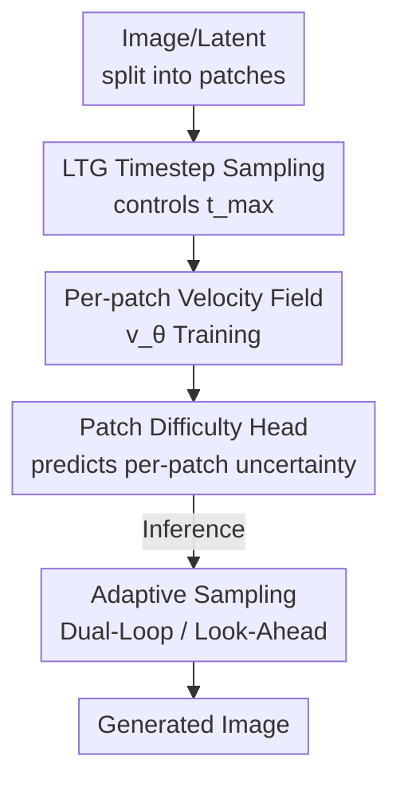

# Denoising, Fast and Slow: Difficulty-Aware Adaptive Sampling for Image Generation

**Conference**: CVPR 2026  
**arXiv**: [2604.19141](https://arxiv.org/abs/2604.19141)  
**Code**: https://github.com/CompVis/patch-forcing (Included)  
**Area**: Diffusion Models / Image Generation  
**Keywords**: Patch-level denoising, Diffusion Forcing, uncertainty prediction, adaptive sampling, Flow Matching

## TL;DR
Diffusion/flow matching models typically use a single timestep for all patches and distribute computation uniformly. This paper proposes **Patch Forcing (PF)**: assign independent noise levels to each patch during training and learn a lightweight "patch difficulty head." This allows confident (easy) regions to denoise first, providing "future" context for uncertain (difficult) regions. Combined with two difficulty-aware samplers, it reduces the FID of SiT on ImageNet 256² from 17.2 to 9.8 (XL/2, fixed computation).

## Background & Motivation
**Background**: Modern diffusion/flow matching image generators (DiT, SiT, etc.) apply a global timestep $t$ and uniform function evaluation counts (NFE) across **all spatial positions** during each denoising step. Computational resources are **uniformly distributed** spatially.

**Limitations of Prior Work**: This uniform distribution implicitly assumes that "every region of an image has the same denoising difficulty." However, natural images are highly heterogeneous—large low-frequency backgrounds and saturated regions are easy, while fine structures, object boundaries, small text, and occlusion edges only disambiguate in later stages of denoising. Treating all regions equally leads to wasted computation in easy areas and insufficient refinement/context in difficult areas.

**Key Challenge**: Difficult regions fundamentally require **more context**. Previously, context was provided via external conditions (depth maps, text, representation alignment REPA) or by **borrowing ground-truth** (like inpainting/editing). However, pure generation scenarios have no ground-truth to borrow during inference.

**Goal**: Enable the denoising process to **self-generate** context—independent of external signals or ground-truth—by internally advancing regions that are already certain and using them to guide more difficult ones.

**Key Insight**: Based on Diffusion Forcing (independent noise for each element) and its image variant SRM (Spatial Reasoning Models), the authors bring this mechanism to the **patch level**. Key observations: ① More context lowers validation loss; ② Model-predicted uncertainty correlates with patch difficulty; ③ Providing more context reduces uncertainty.

**Core Idea**: Use **per-patch timesteps + a learned difficulty head** to let easy patches proceed first, providing self-generated context for difficult ones, thus spending NFEs where they are most needed under a fixed computational budget.

## Method

### Overall Architecture
PF is built on Flow Matching: interpolating $\mathbf{x}_t = t\mathbf{x}_1 + (1-t)\mathbf{x}_0$ where $\mathbf{v}_\theta$ regresses the velocity field. Unlike standard practices, PF gives each patch an **independent timestep** $\mathbf{t}\in\mathbb{R}^{(H/p)\times(W/p)}$ by extending the AdaLN scalar timestep mechanism in DiT to support spatially varying timesteps, requiring minimal architecture changes.

The pipeline consists of training and inference: Training involves sampling these per-patch timesteps (naive uniform sampling exposes "excess info" states not seen in inference) and introduces the **LTG sampler** to control the maximum information per sample. Simultaneously, a **difficulty head** is learned. Inference uses this signal to drive **adaptive samplers** that advance low-uncertainty patches to provide context.

### Key Designs

**1. LTG Timestep Sampler: Controlling "maximum info" instead of "average info"**

Naive sampling $t_i\sim\mathcal{U}(0,1)$ concentrates the mean $\bar t$ around $0.5$, exposing too much clean signal compared to inference. SRM samples the mean but $t_{\max}$ still hits $t=1$ often, leaking context. PF constrains **maximum info per sample**: sample $t_{\max}$, then sample $t_i$ from a **truncated Gaussian centered at $t_{\max}$**, $t_i\sim\text{truncate}(\mathcal{N}(t_{\max},\sigma^2))$, forcing $t_i\in[0,t_{\max}]$. A Logit-Normal layer is added, $t_{\max}\sim\text{LogitNorm}(m,s)$, forming the **Logit-Normal Truncated Gaussian (LTG)** sampler. It covers all $t_i$ while controlling $t_{\max}$, achieving the best FID. Benefit: Highly parallelizable compared to SRM's recursive allocation.

**2. Patch Difficulty Head: Reinterpreting variance as "local difficulty"**

To let easy patches go first, the model must identify them. PF adds a lightweight **uncertainty head** (extra params <0.01%) to model difficulty as standard deviation $\sigma_\theta$, minimizing the negative log-likelihood (NLL) of the ground-truth velocity $\mathbf{v}_{\text{GT}}$:
$$\mathcal{L}_{\text{total}}=\mathbb{E}\big[\|\mathbf{v}_{\text{GT}}-\mathbf{v}_\theta(\mathbf{x}_t,\mathbf{t})\|^2-\lambda\log\mathcal{N}(\mathbf{v}_{\text{GT}}\mid \mathbf{sg}(\mathbf{v}_\theta),\sigma_\theta^2\mathbf{I})\big]$$
where $\mathbf{sg}$ is stop-gradient. The authors reinterpret this as **local patch difficulty** rather than traditional uncertainty: higher values = harder regions requiring more computation/context.

**3. Difficulty-Aware Adaptive Sampler: Advancing confident patches as "future" context**

PF proposes two samplers using an **uncertainty threshold** to select confident regions. **Dual-Loop**: Outer loop updates low-uncertainty patches with large steps; inner loop updates high-uncertainty patches with small steps conditioned on the updated states. **Look-Ahead**: Projects confident patches to a "future" timestep (up to $t=1$), using these resolved representations as context to guide uncertain regions. This context is **self-generated**, consistent with training, and orthogonal to guidance (CFG/SAG).

### Loss & Training
Total loss is $\mathcal{L}_{\text{total}}$: MSE + NLL difficulty term ($\lambda=0.01$). Backbone follows SiT/DiT B/L/XL. AdaLN uses per-token embeddings. ImageNet experiments fix architecture/NFE for fair comparison; T2I experiments use a 1.2B PFT trained on a 120M subset of COYO.

## Key Experimental Results

### Main Results: ImageNet 256² Fixed Architecture & NFE
With the same backbone and NFEs, PFT with Euler sampling outperforms SiT, and adaptive samplers provide further gains (FID-50k):

| Model | Params | Sampler | FID ↓ |
|------|------|------|-------|
| SiT-B/2 | 130M | Euler | 33.0 |
| PFT-B/2 | 130M | Euler | 27.9 |
| PFT-B/2 | 130M | + look-ahead | **24.2** |
| SiT-L/2 | 458M | Euler | 18.8 |
| PFT-L/2 | 458M | Euler | 14.7 |
| PFT-L/2 | 458M | + look-ahead | **13.0** |
| SiT-XL/2 | 675M | Euler | 17.2 |
| PFT-XL/2 | 675M | Euler | 12.9 |
| PFT-XL/2 | 675M | + look-ahead | **9.8** |
| SiT-XL/2 + REPA | 675M | — | 7.9 |
| PFT-XL/2 + look-ahead + REPA | 675M | — | **6.7** |

### SOTA Comparison (ImageNet 256², with CFG)

| Model | Epochs | FID↓ | sFID↓ | IS↑ | Pre.↑ | Rec.↑ |
|------|--------|------|-------|-----|-------|-------|
| DiT-XL/2 | 1400 | 2.27 | 4.60 | 278.2 | 0.83 | 0.57 |
| SiT-XL/2 | 1400 | 2.06 | 4.50 | 270.3 | 0.82 | 0.59 |
| SiT-XL/2 + REPA | 200 | 1.96 | 4.49 | 264.0 | 0.82 | 0.60 |
| PFT-XL/2 + REPA + look-ahead | 200 | 2.00 | 4.32 | **284.1** | 0.81 | 0.61 |

### Ablation Study

| Configuration | Key Findings | Description |
|------|---------|------|
| LTG vs SRM Uniform-$\bar t$ | LTG achieves optimal FID | SRM's $t_{\max}$ still leaks context, leaving a train-test gap |
| Pure Truncated Gaussian | Better than SRM but $t$ distribution collapses | Fixes $t_{\max}$ but lacks diversity; hence Logit-Normal is added |
| PFT-random (Random context) | Worse than PFT-parallel | Proves patch prioritization must be driven by uncertainty |

### Key Findings
- **Look-ahead > Dual-loop > Parallel**: Exposing uncertain patches to low-noise context yields the largest gain (12.9 → 9.8 on XL/2).
- **Hypotheses Verified**: Uncertainty $\approx$ difficulty (correlation $R=0.52$ at $t=0.6$). Context shifts the uncertainty histogram to the left.
- **Zero-Cost Difficulty Head**: Unlocks adaptive sampling with minimal parameters.

## Highlights & Insights
- **Controlling maximum info is the "Aha!" moment**: By controlling $t_{\max}$, PF eliminates the training leakage where some patches are always clean, and it's faster than SRM's recursive allocation.
- **UNC as a Scheduling Signal**: Reinterpreting the variance head as a difficulty priority queue for any spatial/sequential generation task.
- **Orthogonal to Guidance**: Unlike CFG which steers trajectories, PF provides a resolved local representation.
- **Clearer Text Rendering**: T2I results show sharper text, confirming fine structures (difficult patches) receive more focused computation.

## Limitations & Future Work
- **Weak Early Signals**: Uncertainty correlation is low ($R=0.11$) at $t=0.2$, meaning adaptive sampling gains mostly come from middle/late stages.
- **Scheduling Overhead**: Dual-loop and look-ahead introduce implementation complexity and hyperparameters.
- **T2I Scale**: Verified on a 120M subset; scalability to the largest datasets remains to be demonstrated.

## Related Work & Insights
- **vs SRM**: PF is simpler, faster, and better matched to inference by controlling $t_{\max}$.
- **vs Diffusion Forcing**: PF brings cross-element noise levels from the temporal dimension to the spatial patch dimension.
- **vs REPA/External conditions**: External signals vs internal self-generated context.
- **vs RAS (Region-Adaptive Sampling)**: RAS is inference-only caching; PF is a training-time framework that can potentially complement caching.

## Rating
- Novelty: ⭐⭐⭐⭐⭐ Bringing Diffusion Forcing to the patch-level and solving the train-test gap via $t_{\max}$ is elegant.
- Experimental Thoroughness: ⭐⭐⭐⭐ B/L/XL scaling and orthogonality tests are solid; T2I scale is modest.
- Writing Quality: ⭐⭐⭐⭐⭐ Clear "fast and slow" analogy, excellent figures.
- Value: ⭐⭐⭐⭐ A reusable framework for adaptive denoising that works well with existing SOTA methods.

<!-- RELATED:START -->

## Related Papers

- [\[CVPR 2026\] Curriculum Group Policy Optimization: Adaptive Sampling for Unleashing the Potential of Text-to-Image Generation](curriculum_group_policy_optimization_adaptive_sampling_for_unleashing_the_potent.md)
- [\[CVPR 2026\] Region-Adaptive Sampling for Diffusion Transformers](region-adaptive_sampling_for_diffusion_transformers.md)
- [\[CVPR 2026\] Few-Step Diffusion Sampling Through Instance-Aware Discretizations](few-step_diffusion_sampling_through_instance-aware_discretizations.md)
- [\[CVPR 2026\] Precise Object and Effect Removal with Adaptive Target-Aware Attention](precise_object_and_effect_removal_with_adaptive_target-aware_attention.md)
- [\[CVPR 2026\] Adaptive Spectral Feature Forecasting for Diffusion Sampling Acceleration](adaptive_spectral_feature_forecasting_for_diffusion_sampling_acceleration.md)

<!-- RELATED:END -->
