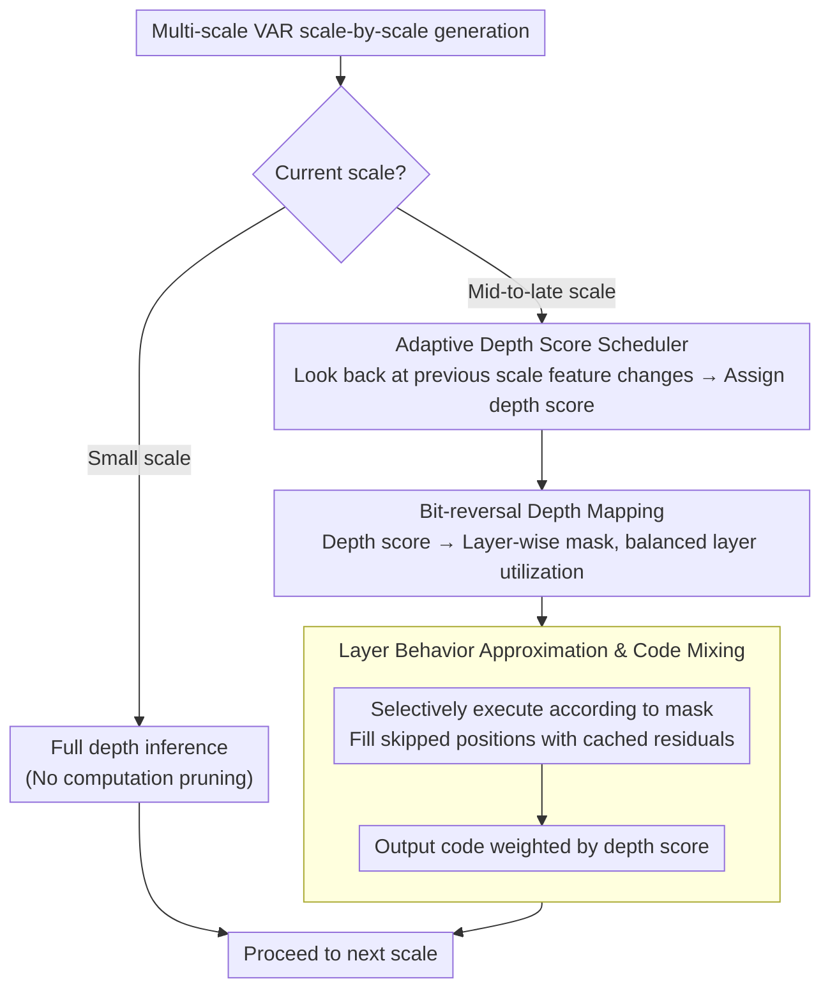

# Depth Adaptive Efficient Visual Autoregressive Modeling

**Conference**: CVPR 2026 Findings  
**arXiv**: [2604.17286](https://arxiv.org/abs/2604.17286)  
**Code**: [https://github.com/STOVAGtz/DepthVAR](https://github.com/STOVAGtz/DepthVAR)  
**Area**: Image Generation  
**Keywords**: Visual Autoregressive, Inference Acceleration, Dynamic Depth, Training-free, Token-level Computation Allocation

## TL;DR

Reveals the fundamental limitations of frequency-driven hard pruning paradigms in VAR models and proposes DepthVAR, a training-free inference acceleration framework. By adaptively allocating the Transformer layer computation depth for each token (rather than binary keep/prune), it achieves 2.3×-3.1× speedup with minimal quality loss.

## Background & Motivation

**Background**: Visual Autoregressive (VAR) models significantly reduce sequence length in text-to-image generation by replacing traditional "next-token" prediction with "next-scale" prediction. However, as resolution increases, the number of tokens per scale grows quadratically, and applying full-layer computation to all tokens uniformly results in severe waste.

**Limitations of Prior Work**: Methods such as FastVAR and SparseVAR utilize frequency features for hard pruning—discarding "unimportant" low-frequency tokens after estimating high-frequency distributions. However, this approach faces fundamental issues: even with a perfect frequency mask (oracle experiments), hard pruning still leads to significant quality degradation; more precise frequency estimation does not guarantee better generation quality (Pearson r = 0.138).

**Key Challenge**: Hard pruning binarizes tokens into "keep/discard," but in reality, low-frequency regions do not require zero computation, but rather *less* computation—the issue lies in the coarse-grained "all-or-nothing" decision-making.

**Goal**: To shift from a hard pruning paradigm to a continuous computational depth allocation, allowing each token to receive a number of Transformer layers that matches its complexity.

**Key Insight**: The authors found that pre-trained VAR models naturally possess depth redundancy due to the use of LayerDrop regularization during training—generation quality reaches a peak before reaching the final layer, and representations of different tokens saturate at different depths.

**Core Idea**: Replace per-token hard pruning with dynamic depth allocation. A non-static depth score is generated via a cyclic rotation scheduler, which is then transformed into layer-wise masks using bit-reversal mapping to achieve balanced layer utilization.

## Method

### Overall Architecture

DepthVAR addresses a specific problem: in the scale-by-scale generation of VAR images, tokens in later scales increase in number, but not every token needs to traverse all $L$ Transformer layers—low-frequency, smooth regions "calculate enough" by the middle layers. Instead of the "keep/prune" binary decision used in existing methods (FastVAR / SparseVAR), this work replaces it with a continuous decision of "how many layers to traverse."

The overall process operates as follows: small scales undergo standard full-depth inference, and a switch to dynamic depth mode occurs starting from a certain intermediate scale. For each subsequent scale $i$, the **Adaptive Depth Score Scheduler** first looks back at the feature changes across layers of the previous scale to assign a depth score $\mathcal{S}_i \in [0,1]^{h_i \times w_i}$ to each current token position (higher scores indicate a need for deeper calculation). This continuous score is transformed into a layer-wise mask $\mathcal{M}_i$ via **Bit-reversal Mapping**, which specifies which positions are calculated or skipped at each layer. During inference, Transformer blocks are executed selectively according to the mask, and skipped positions are filled with cached inter-layer residuals to maintain feature map integrity. Finally, the output codes are mixed using depth score weights, ensuring a token's contribution to the result is proportional to the actual computation it consumed. The entire process requires no modification to model parameters.

### Key Designs

**1. Adaptive Depth Score Scheduler: Allowing "how deep to calculate" to change dynamically with scale**

Commonly, one might use the "importance" of a region in the previous scale to decide the depth of the current scale. However, this would cause regions judged as low-priority to be repeatedly calculated shallowly at every scale. Here, the scores are derived by aggregating absolute feature changes across layers of the previous scale to obtain a "decision ranking map" $\mathcal{B}_i$, which is then normalized into percentiles $\rho_i$. Finally, a scheduling function $\mathcal{G}$ maps the percentile to a depth score. A critical step is the **Cyclic Percentile Rotation** $\mathcal{G}'(\rho)$: each scale shifts the mapping curve slightly so that regions calculated shallowly this time have a chance to be calculated deeply next time, preventing the same group of tokens from being repeatedly updated or skipped. The total computational budget for large scales is constrained by a reference scale $\mathcal{R}$—the smaller $\mathcal{R}$ is, the more aggressively the calculation of deep scales is compressed, leading to higher speedup.

**2. Bit-reversal Depth Mapping: Distributing allocated layers uniformly across the network**

After obtaining the depth scores, one must decide "which specific layers a token traverses." Given a depth map $\mathcal{D}_i = \lfloor \mathcal{S}_i \cdot L \rfloor$, if a token is assigned $d$ layers, simply having it traverse the first $d$ layers $\{0,1,\dots,d-1\}$ results in severe load imbalance: shallow layers process almost all tokens, while deep layers process very few. This work borrows the bit-reversal permutation $\pi_L$ from FFT to spread these $d$ layers: for instance, when $L=32, d=5$, layers $\{0, 16, 8, 24, 4\}$ are selected instead of $\{0,1,2,3,4\}$, ensuring that selected layers span the entire depth interval. The resulting layer-wise mask is:

$$\mathcal{M}_i(\ell, m, n) = \mathbf{1}\{\ell \in \mathcal{L}_i(m,n)\}$$

where $\mathcal{L}_i(m,n)$ is the set of layers selected for position $(m,n)$ via bit-reversal. This ensures the pruning ratio is roughly consistent across each layer.

**3. Layer Behavior Approximation and Code Mixing: Skipped positions leave no holes, and output contribution matches computation ratio**

Per-token layer skipping introduces two risks: skipped positions lack new features, causing subsequent layers to receive "holed" feature maps, and shallowly calculated tokens might degrade quality if they participate equally in the final output. Two solutions are provided. First is cached proxy recovery—Transformer blocks are only run for active positions at each layer $\ell$, while masked positions use the upsampled inter-layer residual from the previous scale:

$$r_i^\ell = \text{Layer}_\ell(r_i^{\ell-1} \odot \mathcal{M}_i(\ell)) + \text{up}(r_{i-1}^\ell - r_{i-1}^{\ell-1}) \odot (1 - \mathcal{M}_i(\ell))$$

This step leverages the local stability of residuals between adjacent scales to provide reasonable proxy features. Second is code mixing—the final codebook lookup uses depth score weighting $z_i = \mathcal{S}_i \cdot \text{lookup}(p_i)$, weakening the contribution of shallowly calculated tokens to prevent them from contaminating the output with "full authority."

### Loss & Training

A completely training-free framework that does not modify model parameters. All mechanisms take effect during inference, with the speedup ratio controlled by adjusting the reference scale $\mathcal{R}$, scheduling function types, and parameters.

## Key Experimental Results

### Main Results

| Method | GenEval↑ | Latency(ms)↓ | HPSv2↑ | Speedup |
|------|---------|----------|-------|-------|
| Infinity Baseline | 0.7237 | 2706 | 30.47 | 1× |
| SparseVAR-0.7 | 0.7208 | 1281 | 29.76 | 2.1× |
| FastVAR | 0.7238 | 1080 | 29.93 | 2.5× |
| **Ours (R=9)** | **0.7318** | 1622 | **30.29** | 1.7× |
| **Ours (R=7)** | 0.7207 | 869 | 29.98 | **3.1×** |

### Ablation Study

| Configuration | GenEval | Note |
|------|---------|------|
| Standard Inference (Full Depth) | 0.7237 | Baseline |
| Hard Pruning + Oracle Frequency | Quality Drop | Proves fundamental limits of hard pruning |
| DepthVAR w/o Cyclic Rotation | Slightly Lower | Fixed ranking leads to long-term under-calculation |
| DepthVAR w/o Code Mixing | Drop | Shallow tokens contribute too much, causing uneven quality |

### Key Findings

- The correlation between frequency estimation accuracy and generation quality is extremely weak (r=0.138); even an oracle mask cannot save the hard pruning paradigm.
- Generation quality in VAR models peaks before the final layer (early exit is feasible), but the saturation depth varies significantly across different tokens.
- Experiments on HART demonstrate that DepthVAR is effective across different VAR architectures, showing good generalizability.

## Highlights & Insights

- The fundamental questioning of the frequency-driven hard pruning paradigm is highly persuasive—the oracle experiments directly prove that the problem lies in the "all-or-nothing" decision paradigm itself, rather than frequency estimation accuracy. This finding provides important guidance for future VAR acceleration research.
- The analogy of bit-reversal layer allocation, derived from FFT, elegantly migrates a classic signal processing technique to the layer selection problem in deep learning.
- The training-free design allows the method to be applied plug-and-play to any pre-trained VAR model, offering high practical value.

## Limitations & Future Work

- While training-free is an advantage, it also means the model has no opportunity to adapt to sparse computation modes, leaving room for further optimization.
- Cached proxy recovery assumes inter-scale feature changes are locally stable, which may introduce errors in rapidly changing regions.
- Experiments were only validated on Infinity and HART models; applicability to newer VAR architectures remains to be verified.
- Future directions: introducing depth-aware regularization during training, or combining adaptive scheduling with intermediate results during the autoregressive process.

## Related Work & Insights

- **vs FastVAR/SparseVAR**: Also VAR acceleration but adopts a hard pruning paradigm; DepthVAR provides better quality at equivalent speedup ratios.
- **vs MoD (Mixture-of-Depths)**: Also a dynamic depth method but requires training a router; DepthVAR is completely training-free.
- **vs Early Exit**: Early exit applies a uniform exit for all tokens, whereas DepthVAR uses per-token dynamic depth.

## Rating

- Novelty: ⭐⭐⭐⭐ Insightful critique of hard pruning; adaptive depth allocation is a meaningful paradigm shift.
- Experimental Thoroughness: ⭐⭐⭐⭐ Oracle experiments and multi-dimensional comparisons are convincing.
- Writing Quality: ⭐⭐⭐⭐ Clear analytical logic; the derivation from observation to method is natural.
- Value: ⭐⭐⭐⭐ Opens a new path for VAR acceleration; training-free characteristics enhance practical value.

<!-- RELATED:START -->

## Related Papers

- [\[CVPR 2026\] FVAR: Next-Focus Prediction for Visual Autoregressive Modeling](fvar_next-focus_prediction_for_visual_autoregressive_modeling.md)
- [\[ICML 2026\] Visual Implicit Autoregressive Modeling](../../ICML2026/image_generation/visual_implicit_autoregressive_modeling.md)
- [\[ICLR 2026\] Visual Autoregressive Modeling for Instruction-Guided Image Editing](../../ICLR2026/image_generation/visual_autoregressive_modeling_for_instruction-guided_image_editing.md)
- [\[CVPR 2026\] DPAR: Dynamic Patchification for Efficient Autoregressive Visual Generation](dpar_dynamic_patchification_for_efficient_autoregressive_visual_generation.md)
- [\[ICLR 2026\] MVAR: Visual Autoregressive Modeling with Scale and Spatial Markovian Conditioning](../../ICLR2026/image_generation/mvar_visual_autoregressive_modeling_with_scale_and_spatial_markovian_conditionin.md)

<!-- RELATED:END -->
