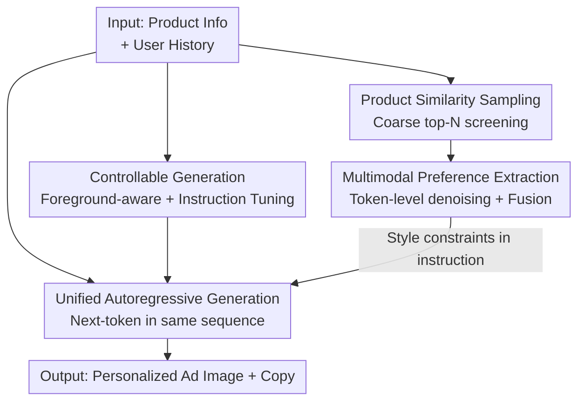

# Design Your Ad: Personalized Advertising Image and Text Generation with Unified Autoregressive Models

**Conference**: CVPR 2026  
**arXiv**: [2605.12138](https://arxiv.org/abs/2605.12138)  
**Code**: https://github.com/JD-GenX/Uni-AdGen (Available)  
**Area**: Image Generation / Multimodal / Autoregressive Generation / E-commerce Advertising  
**Keywords**: Personalized ad generation, unified autoregressive model, joint image-text generation, user preference modeling, coarse-to-fine denoising

## TL;DR
To address the issues in e-commerce advertising where "images and copy use separate models and rely on group CTR to reflect average preferences," this paper proposes Uni-AdGen, a unified autoregressive model. It integrates ad images and copy into a single next-token prediction workflow for joint generation. It further employs a "coarse-to-fine preference understanding module" to extract personalized interests from noisy multimodal historical clicks and introduces PAd1M, the first large-scale personalized ad dataset, along with a background-sensitive evaluation metric (PBS). The results outperform baselines in both general and personalized settings.

## Background & Motivation

**Background**: E-commerce platforms commonly use "ad image + ad copy" combinations to promote products. Due to high manual design costs, the industry has shifted toward AIGC. Current mainstream approaches stack independent models: using a VLM to generate background prompts from transparent product images, a T2I model (e.g., Flux-Fill) for the image, and an LLM for copy based on product descriptions.

**Limitations of Prior Work**: This "multi-model assembly" presents two issues. First, images and text are generated in isolation, leading to system complexity and a lack of cross-modal synergy, which often results in redundant or conflicting information. Second, for "personalization," recent works use Click-Through Rate (CTR) as a reward signal for alignment. However, CTR only reflects **group average preferences** and fails to capture the distinct interests of individual users, leading to sub-optimal results for individuals.

**Key Challenge**: True personalization requires learning directly from individual historical click behavior. However, historical behavior contains two types of entangled noise: **sample-level noise** (irrelevant products in history, such as teapots appearing when the target is lipstick) and **modal-level noise** (users being attracted to different products by different modalities, such as clicking one for its background and another for a specific keyword). Extracting preferences from a single modality is inevitably biased.

**Goal**: (1) Unify image and text ad generation into a single process for natural cross-modal synergy; (2) Extract precise individual preferences from noisy multimodal histories to drive personalized generation.

**Key Insight**: The autoregressive next-token prediction paradigm inherently allows text and image tokens to be generated in the same sequence. This provides a natural architecture for "unified image-text generation." Adding a denoising preference module allows personalization to be integrated into the unified model.

**Core Idea**: Use a unified autoregressive model for joint ad image and text generation (replacing multi-model assembly) and extract individual preferences from noisy history via a "coarse-to-fine" module (coarse filtering by product similarity, fine filtering by token importance).

## Method

### Overall Architecture

Task definition: Given $L$ historical click pairs $\{(I_j, T_j)\}_{j=1}^{L}$ and target product information $P$ (transparent image $I^t$, description $D$, selling points $W$), generate an ad pair $(I^{pred}, T^{pred})$ that closely aligns with the user's real click $(I^{GT}, T^{GT})$.

The framework consists of two layers: **General Ad Generation** is performed by the unified autoregressive model Uni-AdGen (based on Janus-Pro 7B). it encodes structured instructions, product descriptions, and selling points into an input sequence, using special tokens `<text>...</text>` and `<image>...</image>` to define segments. The output is recovered via a text decoder and a VQ-GAN image decoder. The vision side uses a foreground-aware module for structural consistency, while the text side uses instruction tuning for selling point alignment. **Personalization** adds a "coarse-to-fine preference understanding module": first performing coarse sampling of top-$N$ candidates via product similarity (reducing sample-level noise), followed by fine-grained screening of image/text tokens via a relevance extractor (reducing modal-level noise) to drive personalized generation.

### Key Designs

**1. Unified Autoregressive Joint Generation: Concurrent image and text output in one sequence**

Addressing the "isolated multi-model" pain point, Uni-AdGen adopts an autoregressive vision-language architecture. It discretizes multimodal inputs into tokens to produce ad copy and images simultaneously. The model predicts the text sequence $\mathbf{t}$ based on instructions, then generates the image sequence $\mathbf{g}$ conditioned on the text. The joint loss $\mathcal{L}=\lambda_{text}\mathcal{L}_{text}+\lambda_{img}\mathcal{L}_{img}$ is used, where $\mathcal{L}_{img}=\sum_i \log p_\theta(\mathbf{g_i}\mid \mathbf{s}, \mathbf{t}, \mathbf{g_{1:i-1}})$. This explicit conditioning ensures that copy and imagery are coupled in the same context, naturally avoiding redundancy or conflict.

**2. Dual-path Controllable Generation: Foreground-aware for structure, Instruction Tuning for selling points**

To prevent the model from deviating from the product structure or selling points, a **foreground-aware module** is designed for the image side. The transparent product image is patchified and passed through a DINOv2 encoder. The resulting visual embeddings are projected into the autoregressive latent space as control signals $\mathbf{C}$ and injected into the decoder **every 4 layers** via element-wise addition: $[\mathbf{H}_l]_t=[\text{DL}_l(\mathbf{H}_{l-1})]_t+\mathbb{I}_{l\bmod 4=0}\cdot[\mathbf{C}]_t$. On the text side, **instruction tuning** uses diverse templates to ensure the copy strictly uses provided selling points, with an LLM cleaning training data to ensure factual consistency.

**3. Coarse-to-fine Preference Understanding: Screening via product similarity and token importance**

This module addresses historical noise. The **Coarse Stage (PSS)** reduces sample-level noise by performing importance sampling from $M$ history items ($M\gg N$) based on the semantic similarity between historical and target product texts. The sampling weight is $p_i=\frac{\max(s_i+\epsilon,0)}{\sum_{j=1}^{N}\max(s_j+\epsilon,0)}$. The **Fine Stage (Multimodal Preference Extraction)** reduces modal-level noise. Selected historical pairs are encoded into tokens and passed through Transformer relevance extractors. Token importance is measured by attention and cosine similarity, and noise is suppressed via a differentiable Gumbel-Softmax + top-K selection: $\mathbf{e}^i=\text{TK}(\text{G}(\mathbf{e}^i_{in}\cdot\mathbf{e}^i_{out}))\cdot\mathbf{e}^i_{in}$ for $i\in\{v,t\}$. The denoised tokens are fused and inserted into instructions as style constraints like `<text_ph>` and `<image_ph>`.

### Loss & Training

The base model Janus-Pro 7B is fine-tuned using LoRA (rank=12, factor=32), while the foreground-aware and preference extraction modules undergo full parameter fine-tuning. AdamW optimization (lr=5e-5) is used with a batch size of 4 for training on NVIDIA B200 GPUs. $N=10$ historical items are sampled, and the top 40% of tokens are retained during preference extraction. Both text and image weighting in the loss are set to 1.

## Key Experimental Results

### Main Results (General Ad Generation, Table 1)

Baselines include "VLM (GPT-4o or Qwen2.5-VL) + Image Model (ReliableAd / PosterMaker / Flux-Fill)" pipelines and text baselines like Qwen3 and DeepSeek-R1.

| Method | IR ↑ | PS ↑ | Image Manual ↑ | m-BLEU ↑ | m-ROUGE ↑ | Text Manual ↑ |
|------|------|------|-----------|----------|-----------|-----------|
| GPT-4o + Flux-Fill | -1.281 | 20.926 | 88.00 | – | – | – |
| Qwen2.5-VL + ReliableAd | -1.516 | 20.890 | **95.20** | – | – | – |
| Qwen3 (Text) | – | – | – | **0.562** | 0.652 | **99.60** |
| DeepSeek-R1 (Text) | – | – | – | 0.533 | 0.653 | 97.80 |
| **Ours (Joint)** | **-1.244** | 21.002 | 92.60 | 0.551 | 0.654 | 98.20 |

Insights: The joint model achieved the best ImageReward (IR) and ranked second in PS and manual assessment. ReliableAd had high manual scores but lagged in aesthetic metrics. Ours balances visual quality and practical usability.

### Ablation Study (Personalized Generation, Table 2)

Evaluated using PBS for images and BLEU/ROUGE for text against real user clicks.

| Configuration | PBS ↑ | BLEU ↑ | ROUGE ↑ | Notes |
|------|-------|--------|---------|------|
| Pigeon (Image Baseline) | 0.624 | – | – | Unimodal preference |
| Qwen3 (Text Baseline) | – | 0.345 | 0.580 | History in instruction |
| Baseline (No history) | 0.617 | 0.225 | 0.525 | Uni-AdGen alone |
| w/ history (Random) | 0.606 | 0.427 | 0.650 | History added |
| w/ PSS (+Coarse Sampling) | 0.622 | 0.430 | 0.652 | Sample noise reduced |
| **Ours (+Preference Extraction)** | **0.634** | **0.435** | **0.662** | Full model |

### Key Findings
- **History is paramount**: Adding history (w/ history) nearly doubled BLEU and ROUGE, proving that using individual history is more critical than any specific denoising technique.
- **Two-stage denoising is effective**: PSS corrected PBS from 0.606 back to 0.622, and preference extraction further improved it to 0.634. Denoising acts as a consistent refinement.
- **Joint modeling outperforms unimodal**: PBS (0.634) surpassed Pigeon (0.624), and ROUGE (0.662) surpassed DeepSeek-R1 (0.622), demonstrating the value of cross-modal context.
- **PBS Metric Validity**: PBS accurately distinguishes between different backgrounds for the same product, whereas CLIP and DINOv3 showed little sensitivity to such stylistic variations.

## Highlights & Insights
- **From Group CTR to Individual History**: This study shifts the paradigm from using aggregate CTR (average preference) to modeling individual multimodal click histories.
- **Clear Noise Taxonomy**: Categorizing history noise into "sample-level" and "modal-level" allowed for a precise, problem-solution mapping via PSS and Gumbel-Softmax filtering.
- **Importance Sampling over Top-N**: The use of probability sampling rather than a hard cutoff for historical candidates allows the model to retain diverse stylistic references, even from products with lower semantic similarity.
- **Background-Sensitive Metric (PBS)**: Developing a background-sensitive encoder addresses the "evaluation vacuum" where standard metrics only focus on the foreground product.

## Limitations & Future Work
- **Incremental Gains from Denoising**: The absolute gain from the denoising modules over raw history is relatively small, raising questions about the cost-benefit ratio of these components.
- **Dependency on Large Private Data**: PAd1M relies on massive internal JD.com data. Generalization or replication in an academic setting without such scale remains a challenge.
- **Proxy Objectives**: Evaluation relies on similarity to prior clicks (PBS/BLEU) rather than direct metrics like online conversion or CTR lift from A/B testing.
- **Heuristic Hyperparameters**: Parameters like $N=10$ and the 40% retention rate lack a comprehensive sensitivity analysis.

## Related Work & Insights
- **vs. Multi-model Pipelines**: Baselines like ReliableAd are complex and lack synergistic generation. Uni-AdGen's unified sequence simplifies the architecture and prevents redundant cross-modal information.
- **vs. CTR-driven Personalization**: Prior methods assume preference consistency across groups. This work achieves individual-level personalization.
- **vs. Pulse/Pigeon**: These unimodal approaches suffer from modal-level noise, which Uni-AdGen mitigates through joint multimodal denoising.

## Rating
- Novelty: ⭐⭐⭐⭐ First unified autoregressive ad generator + individual history modeling + new metric.
- Experimental Thoroughness: ⭐⭐⭐⭐ Comprehensive baselines and ablations, though lacking online A/B tests.
- Writing Quality: ⭐⭐⭐⭐ Clear taxonomy of noise and well-defined mechanism.
- Value: ⭐⭐⭐⭐ Strong industrial relevance with an extensible personalization paradigm.

<!-- RELATED:START -->

- **Janus-Pro**: Unified Multimodal Understanding and Generation via Autoregressive Modeling
- **ReliableAd**: Autonomous Ad Image Generation with Visual and Semantic Consistency
- **PosterMaker**: A Domain-Specific Architecture for Ad Poster Layout and Content

<!-- RELATED:END -->

## Related Papers

- [\[CVPR 2026\] Premier: Personalized Preference Modulation with Learnable User Embedding in Text-to-Image Generation](premier_personalized_preference_modulation_with_learnable_user_embedding_in_text.md)
- [\[CVPR 2026\] PromptEnhancer: Taming Your Rewriter for Text-to-Image Generation via Fine-Grained Reward](promptenhancer_taming_your_rewriter_for_text-to-image_generation_via_fine-graine.md)
- [\[CVPR 2026\] Rethinking Prompt Design for Inference-time Scaling in Text-to-Visual Generation](rethinking_prompt_design_for_inference-time_scaling_in_text-to-visual_generation.md)
- [\[CVPR 2026\] Proxy-Tuning: Tailoring Multimodal Autoregressive Models for Subject-Driven Image Generation](proxy-tuning_tailoring_multimodal_autoregressive_models_for_subject-driven_image.md)
- [\[CVPR 2026\] Causal Motion Diffusion Models for Autoregressive Motion Generation](causal_motion_diffusion_models_for_autoregressive_motion_generation.md)

<!-- RELATED:END -->
