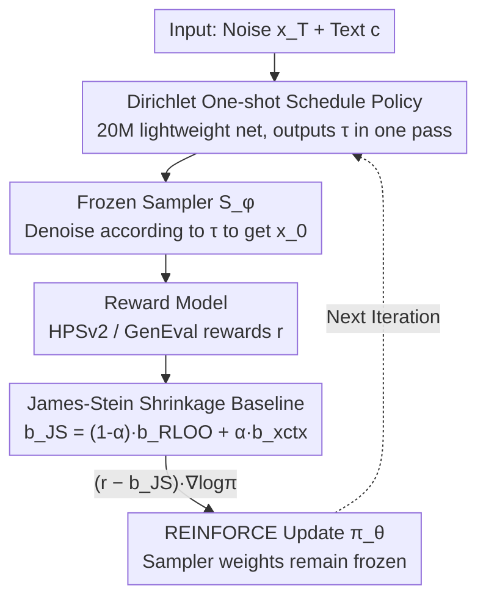

# Designing Instance-Level Sampling Schedules via REINFORCE with James-Stein Shrinkage

**Conference**: CVPR2026  
**arXiv**: [2511.22177](https://arxiv.org/abs/2511.22177)  
**Code**: TBD  
**Area**: Diffusion Models / Image Generation  
**Keywords**: Sampling Schedule, REINFORCE, James-Stein Shrinkage, Dirichlet Policy, T2I Post-training

## TL;DR
The authors propose learning a "per-prompt and per-noise customized sampling schedule" for frozen text-to-image samplers without modifying model weights. By using a one-shot Dirichlet policy to output the entire schedule in a single forward pass and employing James-Stein shrinkage as a REINFORCE reward baseline to reduce gradient variance, the method improves text-image alignment for SD/Flux at the same step counts. Specifically, it enables Flux to approach distilled Flux-Schnell performance in just 5 steps.

## Background & Motivation
**Background**: The inference quality of diffusion and flow-matching text-to-image models depends heavily on the **sampling schedule**—i.e., how a fixed step budget is distributed over the continuous denoising trajectory. However, mainstream production backbones (SD-XL, SD-3.5, Flux) use a **single globally fixed schedule** for all inputs.

**Limitations of Prior Work**: A "universal schedule" cannot be optimal for the diverse prompts encountered at test time, as different prompts require varying spatial/semantic details. Furthermore, different noise seeds introduce different initial conditions (the "golden noise" phenomenon). Mainstream post-training approaches typically **modify weights** by fine-tuning backbones for alignment or distilling them for efficiency, which is costly and alters the original model.

**Key Challenge**: The authors argue that there exists an overlooked, orthogonal "lever": **rearranging the sampling timeline alone** can extract additional generation potential from pre-trained samplers with zero extra inference overhead. The difficulty lies in optimizing instance-specific schedules via RL; schedules are high-dimensional, open-loop, one-shot "forward plans," leading to extremely high gradient variance in REINFORCE.

**Goal**: (1) Design a policy that outputs the entire schedule in a **single forward pass** (avoiding the $O(L)$ inference overhead of autoregressive prediction); (2) Provide a **provably superior** variance-reduction baseline for this high-dimensional one-shot policy gradient.

**Key Insight**: View "per-context RLOO baseline" and "cross-context shared baseline" as two extremes. Use James-Stein shrinkage to perform data-driven interpolation between them—preserving context specificity while leveraging global information to stabilize estimates.

**Core Idea**: Utilize a "frozen sampler + single-pass Dirichlet scheduling policy + REINFORCE with James-Stein shrinkage baseline" to turn sampling scheduling into a **model-agnostic post-training method**.

## Method

### Overall Architecture
The problem of designing a sampling schedule for each (noise $x_T$, prompt $c$) is formalized as **policy optimization**. A lightweight policy network $\pi_\theta$ outputs the entire schedule $\tau$ (a set of normalized timesteps) in a single forward pass. This is executed by the **frozen** pre-trained sampler $S_\phi$ to generate image $x_0$, which is then scored by a reward model (HPSv2 or GenEval rule-based rewards) $r(x_0(\tau); c)$. The objective is to maximize the expected reward:

$$J(\theta) = \mathbb{E}_{\tau \sim \pi_\theta(\cdot \mid x_T, c)}\big[\, r(x_0(\tau); c) \,\big].$$

Since the schedule is a high-dimensional "action" and rewards are only provided at the end, standard REINFORCE suffers from high gradient variance. The core contributions are: (a) a **James-Stein shrinkage baseline** to reduce the variance/MSE of gradient estimation below that of RLOO; (b) a **Dirichlet one-shot scheduler** that represents the action of "partitioning the unit interval into $L+1$ segments" as a continuous distribution on a simplex.

### Key Designs

**1. One-shot Dirichlet Schedule Policy: Scheduling as a Simplex Action**

To avoid the $O(L)$ inference overhead of autoregressive methods, the **entire denoising schedule is sampled as a joint action**. Specifically, let $\tau \sim \text{Dirichlet}(\alpha_\theta(x_T, c))$, where the policy network outputs $L+1$ non-negative parameters $\alpha_\theta \in \mathbb{R}^{L+1}_+$. Each component $\tau_t$ represents a non-negative interval, and the simplex constraint $\sum_{t=1}^{L+1}\tau_t = 1$ ensures these intervals partition the unit interval $[0,1]$. Cumulation $\tilde t_\ell = \sum_{j=1}^{\ell}\tau_j$ and $t_\ell = 1 - \tilde t_\ell$ yields a strictly decreasing sequence $1 = t_0 > t_1 > \cdots > t_L > t_{L+1} = 0$. Segment $\tau_{L+1}$ acts as a **learnable "stopping margin"**, allowing the policy to dynamically adjust the effective sampling horizon.

**2. Variance-Optimal Baseline and Reinterpreting RLOO**

The REINFORCE gradient $\nabla_\theta J = \mathbb{E}[(r(\tau) - b)\nabla_\theta \log \pi_\theta(\tau)]$ is unbiased for any baseline $b$ independent of $\theta$. The **variance-optimal baseline** is:

$$b^{*} = \frac{\mathbb{E}\!\left[r(\tau)\,\|\nabla_\theta \log \pi_\theta(\tau)\|^2\right]}{\mathbb{E}\!\left[\|\nabla_\theta \log \pi_\theta(\tau)\|^2\right]}.$$

When the policy is nearly deterministic within a context, $b^* \approx \mathbb{E}_{\tau}[r(\tau)\mid x_T, c]$. The standard **per-context RLOO** (averaging $K_c$ rollouts per context excluding the current one) is a Monte Carlo approximation of $b^*$. However, RLOO is noisy when $K_c$ is small. Conversely, the **cross-context baseline** $b_{\text{xctx}}$ (averaging across the mini-batch) has lower variance but ignores prompt-specific difficulty.

**3. James-Stein Shrinkage Baseline: Provably Superior Interpolation**

The authors model rewards using **random effects**: $r^{(c,i)} = \mu_c + \varepsilon^{(c,i)}$, with $\varepsilon^{(c,i)}\sim\mathcal{N}(0,\sigma^2)$ and $\mu_c = \mu_0 + \xi^{(c)}$, $\xi^{(c)}\sim\mathcal{N}(0,\delta^2)$. Here $\sigma^2$ is within-context variance and $\delta^2$ represents cross-prompt heterogeneity. The posterior mean of $\mu_c$ **shrinks** the empirical mean $\bar r_c$ towards the global mean $\mu_0$ with strength $\alpha_c^* = \frac{\sigma^2/K_c}{\sigma^2/K_c + \delta^2}$.

The **JS reward baseline** is a convex combination of the two:

$$b_{\text{JS}}^{(c,i)} = (1-\hat\alpha_c)\, b_{\text{RLOO}}^{(c,i)} + \hat\alpha_c\, b_{\text{xctx}}^{(c,i)}, \qquad \hat\alpha_c = \frac{\hat\sigma^2/(K_c-1)}{\hat\sigma^2/(K_c-1) + \hat\delta^2}.$$

Theoretical properties (for $B \geq 3$ contexts): (i) The MSE of the JS baseline relative to $\mu_c$ is **strictly lower** than that of the unbiased RLOO baseline; (ii) $b_{\text{JS}}$ is the empirical Bayes posterior mean, making it the MSE-optimal combination.

### Loss & Training
The policy is trained using REINFORCE with the JS baseline (Algorithm 1). For each iteration: sample $B$ contexts, each with $K_c=2$ rollouts. Calculate rewards $r^{(c,i)}$ and the detached $b_{\text{JS}}^{(c,i)}$, then update the policy using:
$$\frac{1}{BK_c}\sum (r^{(c,i)} - b_{\text{JS}}^{(c,i)})\nabla_\theta\log\pi_\theta(\tau^{(c,i)}\mid c).$$
No KL constraints are used, and the policy is initialized from scratch to evaluate the framework's intrinsic effect.

## Key Experimental Results

### Main Results
Evaluated on HPD v2 with HPSv2 as the reward across four backbones and five step budgets. JS achieves the highest alignment scores across all settings, with the **largest gains at low budgets ($L \leq 20$)**:

| Backbone | Method | L=5 | L=10 | L=20 | L=40 | L=80 |
|----------|------|-----|------|------|------|------|
| SD-XL | Default | 18.25 | 25.47 | 27.69 | 28.52 | 28.55 |
| SD-XL | Ours (JS) | **24.22** | **26.89** | **27.98** | **28.53** | **28.66** |
| SD3.5-L | Default | 24.24 | 28.04 | 29.85 | 30.43 | 30.61 |
| SD3.5-L | Ours (JS) | **26.28** | **28.88** | **29.98** | 30.41 | **30.64** |
| Flux-Dev | Default | 23.73 | 28.06 | 29.88 | 30.84 | 31.04 |
| Flux-Dev | RLOO | 26.48 | 30.41 | 30.77 | 30.92 | 31.10 |
| Flux-Dev | Ours (JS) | **29.21** | **30.86** | **31.12** | **31.23** | **31.36** |

**Approaching distilled models in 5 steps** (Flux-Dev): JS at 5 steps nearly matches the specialized Flux-Schnell distillation, suggesting backbones possess latent few-step potential.

| Method | Default | TPDM PPO | Cr. RLOO | RLOO | Ours (JS) | Flux-Schnell |
|---------|----------|----------|------|-----------|--------------|-----------|
| HPSv2 | 23.73 | 15.73 | 26.92 | 26.48 | **29.21** | 29.42 |

### Ablation Study
Comparing reward baselines while keeping other settings identical:

| Configuration (Flux-Dev, L=5) | HPSv2 | Description |
|------|-------|------|
| Default Schedule | 23.73 | Lower bound |
| TPDM-style PPO (Autoregressive) | 15.73 | Unstable and $O(L)$ overhead |
| Cross-Context RLOO | 26.92 | Low variance, ignores context scale |
| RLOO (Per-context) | 26.48 | Noisy with small rollout counts |
| **Ours (JS) Shrinkage** | **29.21** | Provably lower MSE combination |

### Key Findings
- **JS advantages are most pronounced at low budgets/high heterogeneity**: When steps are few, sampling variance dominates; shrinkage provides the largest gains.
- **RLOO is fragile when $K_c=2$**: This is where JS leverages cross-context information to stabilize learning.
- **Large budget gains in fine-grained tasks**: Even at 40 steps, schedule optimization significantly improves text rendering (OCR-Recall 49.77 $\to$ 58.58) and object counting (GenEval Counting 0.58 $\to$ 0.77).

## Highlights & Insights
- **Scheduling as an independent lever**: Improving alignment by rearranging the timeline without modifying weights or distillation is model-agnostic and inference-efficient.
- **Dirichlet one-shot actions**: Elegant representation of schedule partitioning that amortizes RL overhead to a constant cost.
- **James-Stein shrinkage as a general primitive**: Since it provably outperforms RLOO in MSE, it can be applied to other one-shot policy gradient tasks like RLHF.
- **Few-step potential of pre-trained samplers**: Suggests that few-step capability can be unlocked via better scheduling rather than only via heavy distillation.

## Limitations & Future Work
- The policy architecture is simple, and experiments rely on specific reward models (HPSv2, GenEval).
- The approximation of the variance-optimal baseline assumes policy "near-determinism," which may not hold early in training.
- The random effects model assumes Gaussian rewards and homoscedasticity across contexts, which may be violated by real RM distributions.
- Future work: Adaptive early stopping for dynamic budgets, multi-objective rewards, and extension to video/3D generation.

## Related Work & Insights
- **vs. TPDM (Autoregressive)**: TPDM targets efficiency/early-stopping with $O(L)$ policy overhead; this work targets quality-step Pareto frontiers with $O(1)$ overhead.
- **vs. Distillation (Progressive/Consistency)**: Distillation modifies weights; this work rearranges budgets and is complementary to distillation.
- **vs. REINFORCE Baselines**: JS shrinkage unifies RLOO and global baselines as empirical Bayes posterior means.

## Rating
- Novelty: ⭐⭐⭐⭐⭐ (Scheduling as a post-training lever + JS shrinkage baseline).
- Experimental Thoroughness: ⭐⭐⭐⭐ (Solid backbone coverage; needs more human evaluation).
- Writing Quality: ⭐⭐⭐⭐ (Clear motivation and strong theoretical grounding).
- Value: ⭐⭐⭐⭐⭐ (Model-agnostic, zero extra inference cost, and generalizable baseline).

<!-- RELATED:START -->

## Related Papers

- [\[CVPR 2026\] Few-Step Diffusion Sampling Through Instance-Aware Discretizations](few-step_diffusion_sampling_through_instance-aware_discretizations.md)
- [\[NeurIPS 2025\] Instance-Level Composed Image Retrieval](../../NeurIPS2025/image_generation/instance-level_composed_image_retrieval.md)
- [\[CVPR 2025\] ILIAS: Instance-Level Image Retrieval At Scale](../../CVPR2025/image_generation/ilias_instance-level_image_retrieval_at_scale.md)
- [\[ECCV 2024\] Rejection Sampling IMLE: Designing Priors for Better Few-Shot Image Synthesis](../../ECCV2024/image_generation/rejection_sampling_imle_designing_priors_for_better_few-shot_image_synthesis.md)
- [\[CVPR 2026\] Mixture of States: Routing Token-Level Dynamics for Multimodal Generation](mixture_of_states_routing_token-level_dynamics_for_multimodal_generation.md)

<!-- RELATED:END -->
