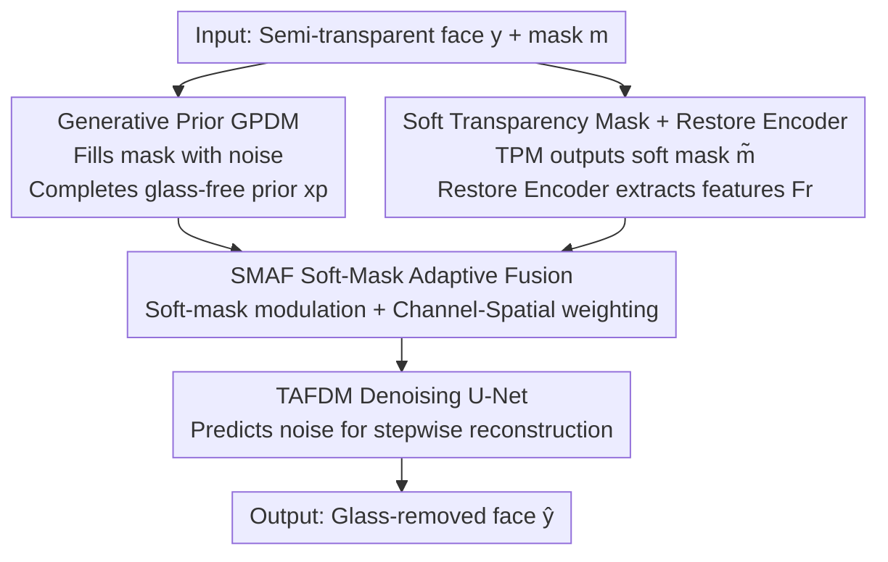

# Diff-SemiER: Transparency-Aware Adaptive Fusion Diffusion Model with Generative Prior for Semi-Transparent Eyeglasses Removal

**Conference**: CVPR 2026  
**Paper**: [CVF Open Access](https://openaccess.thecvf.com/content/CVPR2026/html/Li_Diff-SemiER_Transparency-Aware_Adaptive_Fusion_Diffusion_Model_with_Generative_Prior_for_CVPR_2026_paper.html)  
**Code**: https://github.com/JiahaoLi03/Diff-SemiER  
**Area**: Diffusion Models / Image Generation and Restoration  
**Keywords**: Semi-transparent eyeglasses removal, Diffusion models, Generative prior, Soft-mask adaptive fusion, Face restoration  

## TL;DR
Aiming at the challenge of "semi-transparent sunglasses" where residual information exists under the lens but is partially occluded, Diff-SemiER employs a **Generative Prior Diffusion Branch (GPDM)** to reconstruct a structurally sound glass-free face, followed by a **Transparency-Aware Fusion Diffusion Branch (TAFDM)**. Combined with a soft mask, it adaptively fuses "generated content" and "sub-lens real details" across both channel and spatial dimensions. This approach preserves identity and details under varying occlusion levels, outperforming existing methods on both synthetic and real-world datasets.

## Background & Motivation
**Background**: Eyeglasses removal aims to restore clear eye regions from faces occluded by glasses to enhance downstream tasks such as face recognition, expression analysis, and landmark detection. Existing works are mainly categorized into image-to-image translation (mapping "wearing/not wearing" as two domains) and image inpainting (using masks to locate glasses for occlusion completion).

**Limitations of Prior Work**: Existing methods handle two extremes: **fully transparent glasses** (occlusion only in the frames, eye information is largely intact) and **opaque sunglasses** (lenses completely blocked, requiring pure generation). However, real-world scenarios frequently involve **semi-transparent sunglasses**: the lenses have partial transmittance, where the eyes are obscured but some real textures remain visible. Translation-based methods rely on global distribution alignment and lack fine-grained modeling of point-wise visibility changes within the lens, resulting in blurriness and identity loss. Inpainting-based methods use **binary masks** to treat the entire lens area as "completely missing," thereby discarding valuable sub-lens information and leading to identity drift and detail loss.

**Key Challenge**: The authors emphasize that the true difficulty in semi-transparent scenarios is **not insufficient generative capacity, but the balance between "generative freedom" and "utilization of visible information."** When occlusion is light, sub-lens real details should be prioritized; when occlusion is heavy, generative priors should be relied upon. Binary masks fail to represent this continuously varying transmittance.

**Goal**: To construct a framework that dynamically adjusts according to the degree of occlusion, utilizing sub-lens visible information while maintaining sufficient generative freedom during heavy occlusion, and addressing the lack of paired semi-transparent datasets.

**Core Idea**: The task is decoupled into "structural generation" and "detail restoration." First, a generative prior branch **not conditioned on semi-transparent images** recovers a clean facial structure. Then, an **adaptive fusion branch modulated by a transparency soft mask** fuses generative features and sub-lens real features based on point-wise transmittance. A "soft mask" replaces the "binary mask" to represent continuous transmittance.

## Method

### Overall Architecture
Diff-SemiER is a **dual-diffusion branch** framework. The input consists of a face with semi-transparent sunglasses $y$ and its glasses mask $m$, with the output being the high-fidelity glass-removed face $\hat y$. The inference pipeline is as follows:

1. **Generative Prior Branch (GPDM)**: Fills the glasses mask region in $y$ with standard Gaussian noise to obtain condition $\tilde x$. An independently trained conditional diffusion model completes a structurally sound and semantically coherent glass-free face $x_p$ without "seeing" sub-lens information, serving as the **global generative prior**.
2. **Transparency Prediction Module (TPM)**: Predicts a **transparency soft mask** $\tilde m$ from the input, characterizing point-wise lens transmittance.
3. **Restore Encoder**: Extracts sub-lens real visible features $F_r$ from the original semi-transparent image $y$.
4. **Fusion Diffusion Branch (TAFDM)**: A denoising U-Net that extracts generative features $F_g$ from the noisy input $x_t$ and the prior $x_p$ at each reverse step $t$. The **SMAF (Soft-Mask Adaptive Fusion)** module then fuses $F_g$ and $F_r$ at multiple scales, modulated by $\tilde m$ across channel and spatial dimensions, before feeding them into the decoder to predict noise $e_t$ and reconstruct $\hat y$.

Supported by an **offline data engine**: A transmittance data synthesis method created 25,000 pairs of "clean face ↔ semi-transparent glasses face" for training and evaluation. The following diagram illustrates the inference pipeline:

### Key Designs

**1. Task Decoupling + Generative Prior GPDM: Competing structure without sub-lens noise interference**

The authors found that directly conditioning a diffusion model on semi-transparent images works for high-transparency lenses but fails under heavy occlusion, where minimal sub-lens information "constrains" the model, leading to blurry or distorted results. Thus, the task is decoupled into "structural generation" and "detail restoration." GPDM is **deliberately trained without using semi-transparent images as conditions**; instead, pixel values in the mask area are replaced with standard Gaussian noise to form condition $\tilde x$. This forces the model to maximize generative capacity and learn clean facial structures. It is a conditional diffusion model with a reverse process $p_\theta(x_{0:T}\mid\tilde x)=p(x_T)\prod_{t=1}^{T}p_\theta(x_{t-1}\mid x_t,\tilde x)$, forward noise addition $x_t=\sqrt{\bar\alpha_t}\,x_0+\sqrt{1-\bar\alpha_t}\,\epsilon$, and a denoiser predicting $e_t=\epsilon_\theta(x_t,\tilde x,t)$. The training loss is:

$$L_{GPDM}=\mathbb{E}_{x_0,t,\epsilon}\,\bigl\|\epsilon_\theta(x_t,\tilde x,t)-\epsilon\bigr\|_F^2.$$

The resulting $x_p$ is a "clean guess" providing global semantic reference for heavy occlusion, allowing the subsequent branch to refine real details on top of it.

**2. Soft Transparency Mask + Restore Encoder: Recovering sub-lens information via continuous transmittance**

Binary masks discard real eye textures by treating the lens area as "fully missing," causing identity drift. This paper uses a TPM to predict a continuous **transparency soft mask** $\tilde m$, representing point-wise visibility. Simultaneously, a **Restore Encoder** extracts sub-lens visible features $F_r$ from the original $y$. Together, they provide a point-wise, differentiable basis for deciding when to trust real textures versus generated content—something GPDM cannot do alone as it focuses only on generation. ⚠️ The paper provides limited details on TPM's internal architecture, stating only that it outputs $\tilde m$ to modulate fusion.

**3. SMAF Soft-Mask Adaptive Fusion: Dynamic channel-spatial weighting based on occlusion**

Standard fusion (concatenation or addition) treats transmittance variations uniformly, often causing artifacts. Guided by $\tilde m$, SMAF generates dynamic weights across channels and space. It modulates restoration features as $\tilde F_r=F_r\odot\tilde m$, obtains initial fusion $F=F_g+\tilde F_r$, and calculates spatial and channel attention:

$$W_s=\mathrm{Conv}_{7\times7}\bigl([F^s_{GAP},F^s_{GMP},m]\bigr),\quad W_c=\mathrm{Conv}_{1\times1}\bigl(\max(0,\mathrm{Conv}_{1\times1}(F^c_{GAP}))\bigr),$$

Summing these gives the coarse weight $W_t=W_s+W_c$. For higher adaptability, **channel shuffle + grouped convolution** refine the final dynamic weight map $W=\mathrm{Sigmoid}\bigl(\mathrm{GConv}_{7\times7}(\mathrm{CS}[F,W_t])\bigr)$ (groups equal to channels $C$). Fusion is only applied in the mask area to ensure background consistency:

$$\hat F=\mathrm{Conv}_{1\times1}\Bigl(\tilde F_r\odot W+F_g\odot(1-W)\Bigr)\odot M_g+F_g\odot(1-M_g).$$

This mechanism ensures the fusion is **content-adaptive**: $W$ favors $\tilde F_r$ for detail preservation in low-occlusion areas and $F_g$ for structural integrity in high-occlusion areas.

**4. Transmittance Data Synthesis: Creating realistic paired data with "Radial Gradient Alpha"**

Existing datasets (CelebA, MeGlass) lack paired semi-transparent ground truths. The authors label lens/frame regions, train a segmentation network, and synthesize data in two steps: first, pixel-level fusion creates an **opaque glasses image** $I_{syn}^s=I_{g\text{-}free}\odot(1-M_g)+I_s\odot M_g$. Then, a **Radial Gradient Alpha module** generates a dynamic alpha channel $\alpha$—a radial gradient matrix based on "distance from center" and "preset strategies." The final semi-transparent image is:

$$I_{syn}^{semi}=I_{g\text{-}free}\odot M_l\odot\alpha+I_{syn}^s\odot(1-M_l)+I_{syn}^s\odot M_l\odot(1-\alpha),$$

where $\alpha\in[0,1]$ controls lens transparency. This $\alpha$ serves as the supervision for the transparency soft mask during training.

## Key Experimental Results

### Main Results
On the synthetic FFHQ-Test (1,000 pairs), Diff-SemiER achieved the best results across all 5 metrics, particularly in identity preservation (IDD: ArcFace character angle distance):

| Method | FID↓ | PSNR↑ | SSIM↑ | LPIPS↓ | IDD↓ |
|------|------|-------|-------|--------|------|
| Pix2Pix (GAN) | 67.55 | 30.57 | 0.9253 | 0.0589 | 0.752 |
| ERGAN (GAN) | 56.83 | 28.18 | 0.9093 | 0.0441 | 0.831 |
| MAT (Transformer) | 49.91 | 31.95 | 0.9576 | 0.0176 | 0.734 |
| Palette (Diffusion) | 47.63 | 33.99 | 0.9726 | 0.0125 | 0.651 |
| RDDM (Diffusion) | 47.65 | 35.33 | 0.9764 | 0.0115 | 0.576 |
| Resfusion (Diffusion) | 47.57 | 35.30 | 0.9774 | 0.0110 | 0.582 |
| **Ours** | **47.45** | **36.16** | **0.9802** | **0.0094** | **0.534** |
| GT | 46.44 | ∞ | 1 | 0 | 0 |

On three **real-world** datasets (no paired ground truth, FID only):

| Method | FFHQ | CelebA-HQ | CelebA |
|------|------|-----------|--------|
| RDDM | 66.21 | **99.53** | 61.82 |
| Resfusion | 67.40 | 100.45 | 62.92 |
| **Ours** | **66.13** | 99.80 | **61.60** |

### Ablation Study
Four variants on FFHQ-Test:

| Configuration | PSNR↑ | SSIM↑ | LPIPS↓ | IDD↓ | Description |
|------|-------|-------|--------|------|------|
| only GPDM | 33.66 | 0.9714 | 0.0137 | 0.682 | Prior only; sound structure but lost texture/identity |
| w/o Generative Prior | 35.79 | 0.9794 | 0.0101 | 0.581 | Over-reliance on residual features causes artifacts |
| only Soft Mask | 35.64 | 0.9790 | 0.0110 | 0.563 | Performance overly dependent on mask accuracy |
| w/o Soft Mask | 36.10 | 0.9797 | 0.0096 | 0.543 | SMAF without modulation reduces detail stability |
| **Diff-SemiER (full)** | **36.16** | **0.9802** | **0.0094** | **0.534** | Best across all metrics |

### Key Findings
- **Generative prior contributes most to "Identity"**: Using only GPDM resulted in the worst IDD, indicating structural correctness without identity preservation. Conversely, removing the prior led to blurriness under heavy occlusion. Both are essential.
- **Soft mask modulation enhances robustness**: SMAF absorbs errors from the predicted soft mask using dual-dimensional re-weighting, making it more robust than using a soft mask alone.
- **Failure Cases**: Quality decreases under extreme head poses where the lens region is severely distorted (Fig. 9).

## Highlights & Insights
- **Problem Redefinition**: The authors correctly identify the core challenge as a balance between "generative freedom" and "utilization of visible information" rather than mere generative power.
- **Portability of Soft Masks**: Replacing binary masks with continuous transmittance is a transferable concept for any partial occlusion task (e.g., watermark/reflection/shadow removal).
- **Dual-Branch Decoupling**: Separating "global structure guess" and "local detail restoration" prevents weak information from hindering the generation process.

## Limitations & Future Work
- **Extreme Poses**: Models struggle with severe distortion at high head angles.
- **Quantitative Real-World Evaluation**: Due to lack of paired data, real-world evaluation relies on FID and user studies, lacking direct pixel-level metrics.
- **Inference Cost**: Multi-branch diffusion processes incur high computational overhead and latency, which were not reported.

## Related Work & Insights
- **vs. Translation-based (Pix2Pix, ERGAN)**: These suffer from blurriness and identity drift due to global mapping; current work explicitly utilizes sub-lens information, reducing IDD from 0.75-0.83 to 0.534.
- **vs. Binary Mask Inpainting (MAT, Palette)**: These discard residual sub-lens information; this paper uses a **soft mask** to represent partial visibility.
- **vs. Residual Prior Diffusion (RDDM, Resfusion)**: These fail under heavy occlusion; this work introduces an independent GPDM for global structure, ensuring stability across varying occlusion levels.

## Rating
- Novelty: ⭐⭐⭐⭐ Redefines semi-transparent removal as a balance problem; clear technical path despite using existing attention components.
- Experimental Thoroughness: ⭐⭐⭐⭐ Comprehensive metrics on synthetic sets and user studies, but limited analysis on the TPM module and inference cost.
- Writing Quality: ⭐⭐⭐⭐ Clear motivation and formulation.
- Value: ⭐⭐⭐⭐ Addresses a niche but realistic gap in eyeglasses removal; the "soft mask" idea is valuable for related occlusion tasks.

<!-- RELATED:START -->

## Related Papers

- [\[CVPR 2026\] Precise Object and Effect Removal with Adaptive Target-Aware Attention](precise_object_and_effect_removal_with_adaptive_target-aware_attention.md)
- [\[CVPR 2026\] EMR-Diff: Edge-aware Multimodal Residual Diffusion Model for Hyperspectral Image Super-resolution](emr-diff_edge-aware_multimodal_residual_diffusion_model_for_hyperspectral_image_.md)
- [\[CVPR 2026\] CaReFlow: Cyclic Adaptive Rectified Flow for Multimodal Fusion](careflow_cyclic_adaptive_rectified_flow_for_multimodal_fusion.md)
- [\[CVPR 2026\] Streaming Diffusion Model for Fast Infrared and Visible Video Fusion](streaming_diffusion_model_for_fast_infrared_and_visible_video_fusion.md)
- [\[NeurIPS 2025\] Diff-ICMH: Harmonizing Machine and Human Vision in Image Compression with Generative Prior](../../NeurIPS2025/image_generation/diff-icmh_harmonizing_machine_and_human_vision_in_image_compression_with_generat.md)

<!-- RELATED:END -->
