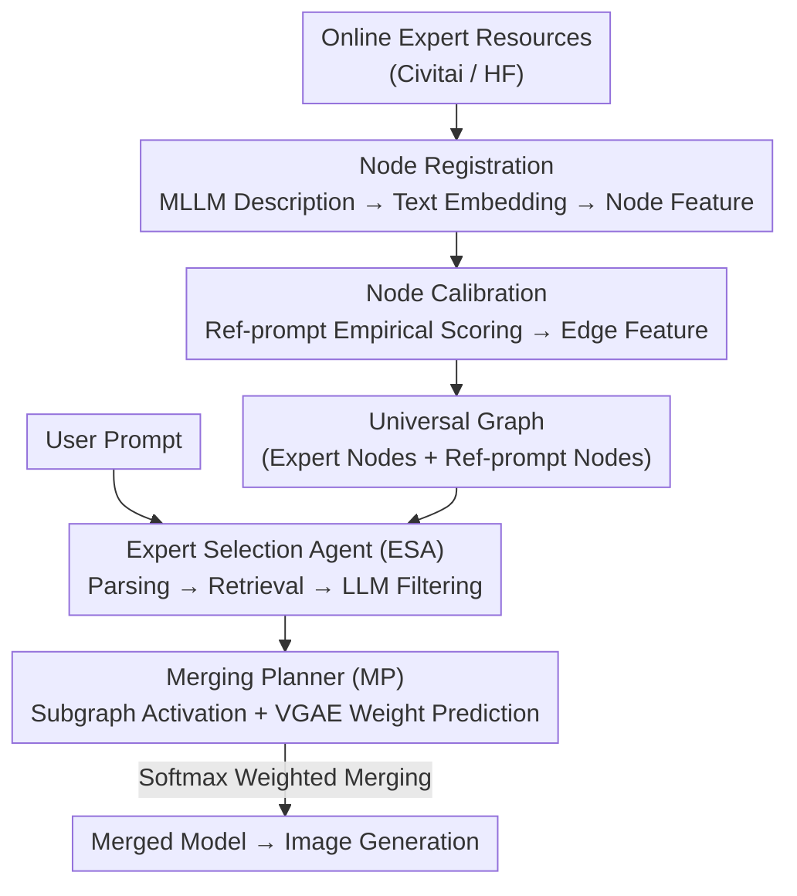

# DiffGraph: An Automated Agent-driven Model Merging Framework for In-the-Wild Text-to-Image Generation

**Conference**: CVPR 2026  
**Paper**: [CVF Open Access](https://openaccess.thecvf.com/content/CVPR2026/html/Li_DiffGraph_An_Automated_Agent-driven_Model_Merging_Framework_for_In-the-Wild_Text-to-Image_CVPR_2026_paper.html)  
**Code**: [Project Page](https://zhuoling.site/DiffGraph)  
**Area**: Text-to-Image Generation / Model Merging / Agent  
**Keywords**: Model Merging, Diffusion Experts, LLM Agent, Variational Graph Autoencoder (VGAE), in-the-wild T2I  

## TL;DR
DiffGraph organizes vast amounts of online diffusion expert models (checkpoints / LoRAs) into a "universal graph." It employs two LLM agents to parse user prompts and dynamically activate subgraphs, utilizing a Variational Graph Autoencoder (VGAE) to predict merging coefficients for each expert. This allows for training-free and test-time-optimization-free on-demand merging of arbitrary experts, leading in human preference metrics on DABench and DiffusionDB.

## Background & Motivation
**Background**: Following large-scale pre-training of diffusion models, developers have fine-tuned numerous "expert models" (checkpoints or LoRAs) using specialized data and shared them on platforms like Civitai and Hugging Face, creating an expanding online expert ecosystem. Merging multiple experts (model merging) allows for the combination of skills, such as a "specific character + specific artistic style."

**Limitations of Prior Work**: Existing merging methods are largely restricted to **pre-defined, fixed sets of experts**. Changing the set or the number of experts requires retraining or test-time optimization. More recent flexible methods (K-LoRA, AutoLoRA, LoRA.rar), while allowing training-free combinations, **treat expert model parameter matrices directly as input features** to predict merging coefficients.

**Key Challenge**: Online experts, even those based on the same base model, are trained with diverse and evolving fine-tuning strategies, datasets, and configurations. This results in massive corporate heterogeneity at the parameter level (including architectural differences, such as checkpoint vs. LoRA). **Methods using parameters as input features naturally fail to generalize to these heterogeneous, massive, and time-evolving real-world online resources**, and most are still limited to fixed counts or require manual specification of the number of experts to merge.

**Goal**: To achieve (1) automated collection, management, and utilization of large-scale online experts; (2) on-demand merging of **different experts and varying numbers of experts** for different user prompts without retraining or test-time optimization after deployment; and (3) seamless scalability to newly emerging experts.

**Key Insight**: The authors observe that **graphs naturally encode heterogeneous entities and their relationships**. Instead of treating experts as parameter matrices, each expert is treated as a node in a graph. Their capabilities are characterized by "textual description encoding" and "empirical quality scores on reference prompts," mapping capability representations into an interpretable shared space aligned with the goal of "image quality."

**Core Idea**: By using an "expert capability graph" + two LLM agents + one VGAE, the problem of "whom to merge and with what weight" is transformed into "selecting a subgraph + predicting edge weights" on the graph.

## Method

### Overall Architecture
DiffGraph consists of three collaborative components: two LLM-driven agents—the **Graph Construction Agent (GCA)** and the **Expert Selection Agent (ESA)**—plus a **VGAE Merging Planner (MP)**. The pipeline consists of two main stages:

1. **Universal Graph Construction (Offline, one-time)**: GCA automatically crawls online experts and registers each as an **expert node**. It enriches node/edge features through two complementary mechanisms: "Node Registration" (textual descriptions → node features) and "Node Calibration" (empirical scoring on reference prompts → edge features), forming a universal graph that can be stored lightly on local storage.
2. **Dynamic Subgraph Activation (Online, per prompt)**: ESA parses the user prompt, retrieves, and filters the necessary CKPT/PEFT experts. MP activates a subgraph centered on the selected expert nodes, temporarily inserts the user prompt as a node, and uses a trained VGAE to encode the subgraph context to predict edge weights between the "user prompt node ↔ each expert node" as merging coefficients. Finally, expert parameters are weighted and merged to generate the final image.

The universal graph only needs to be constructed once (2319 experts in the paper, 29 hours on 4×A100). Adding a new expert takes only 1.2 minutes without retraining. During inference, subgraphs are activated on demand, avoiding the quality degradation caused by including irrelevant experts.

### Key Designs

**1. Node Registration and Calibration: Replacing raw parameters with "textual capability descriptions + empirical quality scores"**

This bypasses the core obstacle of "parameter heterogeneity." **Node Registration** addresses the pain point where "parameter matrices as features do not generalize." For each collected expert, it is registered as an isolated node. An MLLM (e.g., GPT-4o) reads usage instructions and example prompts from its homepage to generate a concise skill description, which is encoded into **node features** using a text embedding model (all-MiniLM-L6-v2). These textual features allow for efficient "embedding similarity pre-filtering" based on user needs.

However, pure text descriptions are qualitative and might be inaccurate, failing to reflect actual generation capability. **Node Calibration** adds a quantitative perspective: a set of representative **reference prompts** $\{r_j\}_{j=1}^{N_r}$ is constructed as another type of node (reference prompt nodes). Each expert generates images for all reference prompts, and scores are calculated using multiple metrics (CLIP Score, ImageReward, Aesthetic Score, PickScore, HPSv2). these scores are concatenated into **edge features** connecting "expert nodes ↔ reference prompt nodes." GCA periodically monitors platforms to add/remove nodes without retraining, keeping the graph synchronized with the ecosystem.

**2. Expert Selection Agent (ESA): Letting LLMs "assign roles" to select a few experts from thousands**

The challenge is that thousands of online experts cannot be entirely included in the merging process (compute constraint and noise) nor can all descriptions be fed to an LLM (token limit). ESA uses a three-step "Retrieval + Filtering + Role-assignment" process. It parses the user prompt $p$ into a concise summary $s$ (capturing subject and style), calculates similarity between $s$ and expert node features, and retrieves the top-$K_1$ **CKPT expert** candidates. Simultaneously, it uses chain-of-thought to decompose $p$ into semantic components and infers required visual attributes $\{a_m\}_{m=1}^{N_a}$, retrieving the top-$K_2$ **PEFT expert** candidates for each attribute.

To avoid irrelevant or redundant experts, ESA applies **LLM filtering**: the LLM reviews candidate descriptions to assess alignment with generation requirements, finalizing the merging set $M_{exp}=\{M_{ckpt}, M_{peft}\}$. The number of experts $N_{ckpt}$ and $N_{peft}$ is **automatically determined by the LLM**, enabling dynamic expert counts per prompt.

**3. VGAE Merging Planner (MP): Predicting merging coefficients via VGAE on activated subgraphs**

Once experts are selected, MP determines weights. It activates a subgraph $G=(V,E,X,\mathcal{E})$ centered on selected experts and their one-hop neighbors (reference prompt nodes). The node set $V=\{v_p, V_{ref}, V_{exp}\}$ includes the temporary user prompt node $v_p$. A VGAE encodes this context to predict edge weights $w\in\mathbb{R}^{|V_{exp}|}$ as merging coefficients:

$$w = f(G;\theta) = \mathrm{Dec}(w\mid H)\,\mathrm{Enc}(H\mid G)$$

The encoder maps the subgraph to latent variables $H=[h_p^\top; H_{exp}]$, where each vector follows a Gaussian $\mathrm{Enc}(h_i\mid G)=\mathcal{N}(h_i\mid \mu_i, \mathrm{diag}(\sigma_i^2))$ implemented with two-layer GCNs. To facilitate reinforcement learning training, $w_i$ is modeled as a **Beta distribution** $w_i\sim\mathrm{Beta}(\alpha_i,\beta_i)$ over $(0,1)$. To ensure unimodal sampling, the model forces $\alpha_i,\beta_i>1$ via $\alpha_i=1+e^{a_i}$ and $\beta_i=1+e^{b_i}$ from FFN outputs. During testing, the expectation $w_i=\frac{\alpha_i}{\alpha_i+\beta_i}$ is used as the deterministic coefficient.

The final parameters are merged via type-specific softmax weighting: $W=\sum_{i=1}^{N_{ckpt}}\mathrm{softmax}(w_{ckpt})_i\cdot W_i$ for CKPTs and $\Delta W=\sum_{j=1}^{N_{peft}}\mathrm{softmax}(w_{peft})_j\cdot \Delta W_j$ for PEFTs, resulting in $\overline{W}=W+\Delta W$.

### Loss & Training
The **only learnable component** is the lightweight VGAE $f(\cdot;\theta)$. During training, prompts are sampled from a training set (non-overlapping with reference prompts), and the objective is to maximize image quality: $\arg\max_\theta \mathbb{E}_{\theta\sim\Omega}[u(I,p)]$, where $u$ is a quality metric and $I$ is the image generated by the merged model. Due to the non-differentiable nature of the full denoising process, **policy gradient** is used for optimization:

$$\nabla_\theta\mathbb{E}_{\theta\sim\Omega}[u(I,p)] \approx \frac{1}{B}\sum_{b=1}^{B} u(I_b,p_b)\,\nabla_\theta P(w_b)$$

where $B$ is the batch size and $P(w_b)$ is the probability of sampling $w_b$. Optimized via AdamW ($lr=1e-2$).

## Key Experimental Results

### Main Results
Evaluated on SD15 and FLUX.1 Dev using DABench and DiffusionDB. Metrics include ImageReward (IR), HPSv2.1 (HPS), Aesthetic (AS), PickScore (PS), and CLIP Score (CS). Results for SD15:

| Method | DABench IR ↑ | DABench HPS ↑ | DiffusionDB IR ↑ | DiffusionDB HPS ↑ |
|------|------|------|------|------|
| Direct (SD15) | -18.27 | 23.88 | 14.83 | 23.74 |
| Diffusion Soup | -3.81 | 25.55 | 33.79 | 25.64 |
| Model Swarms | 17.74 | 25.90 | 50.62 | 26.63 |
| AutoLoRA | 26.51 | 27.41 | 35.62 | 25.56 |
| DiffAgent (Single) | 29.94 | 27.83 | 52.65 | 27.52 |
| **Ours fixed** (w/o ESA, fixed 13 experts) | 23.14 | 28.37 | 54.83 | 27.67 |
| **Ours (Full)** | **73.11** | **30.06** | **85.40** | **29.48** |

The full version leads significantly in IR (73.11 vs. 29.94 for the runner-up DiffAgent). Even the "fixed" variant without ESA outperforms baseline merging methods, suggesting the inherent advantage of the "graph perspective." Parameter-dependent methods (K-LoRA/AutoLoRA) show limited improvement under large-scale online settings.

### Ablation Study
Four groups of ablations (SD15 / DABench, IR metric):

| Module | Configuration | IR ↑ | Description |
|------|------|------|------|
| Graph Construction | w/o registration | 31.04 | Node features set to zero |
| Graph Construction | w/o calibration | 11.92 | All edge features removed (most significant drop) |
| Graph Construction | Learnable calibration | 19.63 | Edges as learnable embeddings |
| ESA | w/o ESA (Top-10 retrieval) | 16.12 | No agent for expert selection |
| ESA | Random activation | 15.36 | Randomly selected experts |
| MP | w/o MP (Uniform merging) | 13.29 | No weight prediction |
| MP | Parameter-based merging | 26.62 | Node features replaced by model parameters |
| MP | **Ours (Full)** | **73.11** | Final model |

### Key Findings
- **Node Calibration (Edge Features) contributes most**: Removing it crashes IR from 73.11 to 11.92, indicating that "quantitative empirical capability" is more critical than "qualitative textual descriptions."
- **Parameter-based nodes perform poorly (26.62)** compared to textual/score features (73.11), validating that raw parameters are not ideal representations for expert capability.
- **ESA is indispensable**: Removing it drops IR to 16.12, showing that selecting the *right* experts is as important as calculating weights.
- **Extensibility**: A variant trained on pre-2023 data and tested on 2023–2025 experts (IR=69.64) nearly matches the fully retrained version (73.11), proving seamless scalability.

## Highlights & Insights
- **"Feature Swap" over "Network Swap"**: The core breakthrough is replacing "parameter matrices" with "textual descriptions + quality scores" as inputs. While parameter heterogeneity is a bottleneck, capability-based representations reside in a shared space aligned with quality, requiring only a simple mapping for the VGAE.
- **Unified Graph Perspective**: Expert selection is subgraph activation; merging coefficients are edge weights. This integrates two previously separate problems and supports dynamic expert counts.
- **Beta Distribution for Weights**: Modeling $w_i$ with a unimodal Beta distribution for policy gradient training is a robust trick for continuous weight optimization under RL.
- **CKPT/PEFT Role Separation**: Splitting experts into "base quality" and "detail control" roles for LLM selection is a simple but effective architectural choice.

## Limitations & Future Work
- **Heavily dependent on closed-source LLMs**: GCA and ESA rely on GPT-4o; errors in description or filtering propagate directly.
- **RL Reward vs. Human Preference**: Using quality scores (IR/HPS) as rewards carries the risk of overfitting automated metrics at the expense of actual human preference.
- **Reference Prompt Bottleneck**: The capability space is defined by the set of reference prompts; if these prompts lack coverage, new expert characterization may be inaccurate.
- **Future Directions**: Exploring open-source MLLMs, incorporating human feedback fine-grained rewards, or adaptive reference prompt sets.

## Related Work & Insights
- **Comparison with Diffusion Soup / Model Swarms**: These methods find a universal merge for **fixed small sets**; DiffGraph provides per-prompt dynamic selection and merging for massive resources.
- **Comparison with Parameter-based methods**: K-LoRA and others fail to generalize to heterogeneous experts; DiffGraph's transition to a textual/score-based graph representation enables training-free extension.
- **Comparison with DiffAgent**: DiffAgent routes a **single** expert; DiffGraph merges a dynamic **set** of experts, achieving significantly higher IR.
- **Insight**: When raw representations are too heterogeneous to use, projecting entities into a shared, interpretable space aligned with the final objective is more effective than using more powerful models.

## Rating
- Novelty: ⭐⭐⭐⭐⭐ First framework to use an agent-driven graph perspective to manage and merge massive online experts.
- Experimental Thoroughness: ⭐⭐⭐⭐ Extensive benchmarks and ablations; however, RL rewards rely heavily on automated metrics.
- Writing Quality: ⭐⭐⭐⭐ Clear logic across motivation, method, and ablation sections.
- Value: ⭐⭐⭐⭐⭐ Directly addresses in-the-wild expert ecosystem challenges with strong practical potential.

<!-- RELATED:START -->

## Related Papers

- [\[ICLR 2026\] EdiVal-Agent: An Object-Centric Framework for Automated, Fine-Grained Evaluation of Multi-Turn Editing](../../ICLR2026/image_generation/edival-agent_an_object-centric_framework_for_automated_fine-grained_evaluation_o.md)
- [\[CVPR 2026\] Disentangling to Re-couple: Resolving the Similarity-Controllability Paradox in Subject-Driven Text-to-Image Generation](disentangling_to_re-couple_resolving_the_similarity-controllability_paradox_in_s.md)
- [\[ICLR 2026\] W-Edit: A Wavelet-based Frequency-aware Framework for Text-driven Image Editing](../../ICLR2026/image_generation/w-edit_a_wavelet-based_frequency-aware_framework_for_text-driven_image_editing.md)
- [\[CVPR 2025\] coDrawAgents: A Multi-Agent Dialogue Framework for Compositional Image Generation](../../CVPR2025/image_generation/codrawagents_a_multi-agent_dialogue_framework_for_compositional_image_generation.md)
- [\[CVPR 2026\] ParaUni: Enhance Generation in Unified Multimodal Model with Reinforcement-driven Hierarchical Parallel Information Interaction](parauni_enhance_generation_in_unified_multimodal_model_with_reinforcement-driven.md)

<!-- RELATED:END -->
