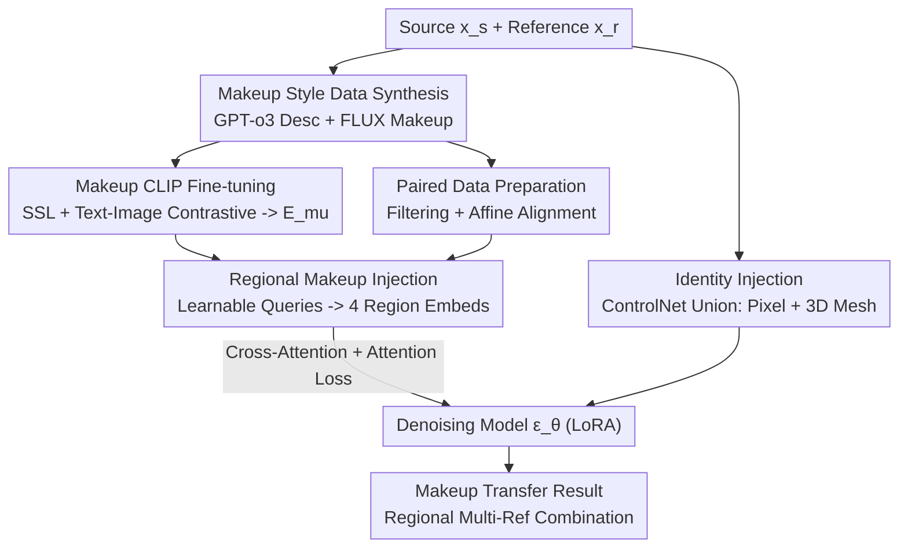

# Diffusion-Based Makeup Transfer with Facial Region-Aware Makeup Features

**Conference**: CVPR 2026  
**Paper**: [CVF Open Access](https://openaccess.thecvf.com/content/CVPR2026/html/Gao_Diffusion-Based_Makeup_Transfer_with_Facial_Region-Aware_Makeup_Features_CVPR_2026_paper.html)  
**Code**: Not released  
**Area**: Diffusion Models / Image Editing  
**Keywords**: Makeup Transfer, Diffusion Models, Region Controllability, CLIP Fine-tuning, ControlNet  

## TL;DR
Addressing the pain points where off-the-shelf CLIP fails to capture fine-grained makeup and holistic injection loses regional controllability, FRAM fine-tunes a specialized "Makeup CLIP Encoder" using synthetic data. It then extracts region-separated makeup features using learnable facial region queries coupled with attention loss. This allows diffusion-based methods to combine makeup from different reference images (e.g., skin/eyes/lips) for the first time, while achieving a superior balance between identity preservation and makeup consistency.

## Background & Motivation
**Background**: Makeup transfer aims to apply the makeup from a reference image to a source face while preserving the source identity. With the maturity of large-scale text-to-image diffusion models, current mainstream approaches inject both the source (identity condition) and reference (makeup condition) into a denoising model. They typically use off-the-shelf foundation models (like CLIP) to encode reference makeup features into the denoising network (e.g., Stable-Makeup).

**Limitations of Prior Work**: The authors identify two specific issues. First, foundation models like CLIP are pre-trained on natural images for general tasks and are not adept at capturing fine-grained facial attributes like "makeup style"—they focus more on content and semantics, often ignoring subtle makeup differences. Second, existing methods inject makeup features **as a whole**, performing "global makeup transfer" without considering that makeup consists of distinct regions (eyeshadow, lipstick, blush). This prevents "region-specific transfer"—such as taking eye makeup from image A and lip makeup from image B.

**Key Challenge**: Makeup is essentially "region-specific, content-independent" style information, whereas general encoders provide "holistic, content-coupled" features. Using a single global vector fails to represent regional structures and introduces facial content interference, causing a trade-off between identity preservation and makeup consistency (e.g., Stable-Makeup has good makeup but poor identity; MAD/Gorgeous have good identity but poor makeup).

**Goal**: To decompose the task into: (1) building an encoder that truly understands makeup; (2) enabling makeup features to be separated by facial regions and injected independently.

**Key Insight**: Since existing data lacks annotations and CLIP lacks makeup knowledge, **synthesize annotated makeup data** to fine-tune a specialized "Makeup CLIP." Since makeup is naturally regional, use **learnable queries** to probe features (inspired by face representation learning), where each query is responsible for a facial region, decomposing holistic features into "regional makeup embeddings."

**Core Idea**: Fine-tune a specialized makeup encoder with synthetic data + decompose makeup features into facial regions via learnable queries (aligned by attention loss with facial parsing masks). This transforms "globally uncontrollable makeup transfer" into "region-controllable makeup transfer."

## Method

### Overall Architecture
FRAM is a two-stage diffusion-based makeup transfer framework. It takes a reference makeup image $x_r$ and a source identity image $x_s$ to output a face with the reference makeup and source identity. The denoising model $\epsilon_\theta$ operates in the VAE latent space. During training, Gaussian noise is added to $x_r$ to get $x_t$, and $\epsilon_\theta$ predicts the noise for reconstruction while being conditioned on $x_s$'s identity and $x_r$'s makeup.

The process has two stages. **Stage 1 (Makeup CLIP Fine-tuning)**: Uses GPT-o3 to generate 50 makeup descriptions, which a SOTA text-driven editing model (FLUX.1-Kontext-dev) uses to apply makeup to FFHQ faces. This creates "annotated makeup style data" used to fine-tune a CLIP visual encoder into a specialized makeup encoder $E_{mu}$ via self-supervised and vision-language contrastive learning. **Stage 2 (Identity + Regional Makeup Injection)**: Pairs the edited images into "before/after" sets and learns to inject identity and makeup. On the makeup side, learnable region queries probe $E_{mu}$ for 4 regional embeddings, injected via cross-attention and aligned with masks using attention loss. On the identity side, a ControlNet Union encodes source pixels and 3D mesh structures simultaneously.

### Key Designs

**1. Makeup CLIP Fine-tuning: Building a specialized encoder with synthetic data**

To solve the issue of CLIP failing to capture makeup. Since existing datasets lack labels, the authors synthesize data: GPT-o3 generates 50 descriptions ranging from "Dewy minimalist" to "Smoky seductress." FLUX.1-Kontext-dev applies these to FFHQ faces, keeping features/expressions unchanged. Two objectives fine-tune the encoder $E_{mu}$. Self-supervised (SSL) part: Apply TPS, random crops, and flips to the same image to create two views with "different content but same makeup," using InfoNCE to pull them together while pushing others apart:

$$\mathcal{L}_{ssl} = -\log \frac{\exp(f_s(z_{i,1}, z_{i,2})/\tau)}{\sum_{a \in I(i,1)} \exp(f_s(z_{i,1}, z_a)/\tau)}$$

Where $f_s$ is cosine similarity and $\tau$ is temperature. Text-image contrastive (Text) part: Use CLIP text encoder for makeup descriptions and align image embeddings with **same-makeup** text embeddings:

$$\mathcal{L}_{text} = -\frac{1}{|P|} \sum_{p \in P} \log \frac{\exp(f_s(z_{i,1}, z^{text}_p)/\tau)}{\sum_{a \in I} \exp(f_s(z_{i,1}, z^{text}_a)/\tau)}$$

Total objective $\mathcal{L}_{clip} = \mathcal{L}_{ssl} + \mathcal{L}_{text}$. Unlike CSD which relies only on image contrast, this introduces text supervision for "content-independent makeup features." KNN classification accuracy improved from 61.7% to 88.2%.

**2. Learnable Facial Region Queries + Attention Loss: Decomposing makeup into regional embeddings**

To enable regional control. $N$ learnable tokens $\{q_n\}_{n=1}^N$ act as queries. Using $E_{mu}(\hat{x}_r)$ features as key/values through a CLIP projector, $N$ "regional makeup embeddings" $\{f_n\}_{n=1}^N$ are predicted ($N{=}4$: skin, eyes, nose, lips). These are injected via cross-attention. To ensure $f_n$ only affects its region, the average cross-attention map $\bar{A}_n$ is aligned with the regional binary mask $M_n$ from FaRL:

$$\mathcal{L}_{attn} = \frac{1}{NUV} \sum_{n=1}^N \sum_{u,v} \big[ \mathrm{FL}(\bar{A}_n[u,v], M_n[u,v]) + \mathrm{DICE}(\bar{A}_n[u,v], M_n[u,v]) \big]$$

Using Focal and Dice loss forces the attention to stay within the mask. During inference, this allows **mask-free** regional control—users can take skin from one reference and eyes from another.

**3. ControlNet Union for Identity Injection: Pixel appearance + 3D mesh structure**

To maintain source identity. Unlike Stable-Makeup using two ControlNets, FRAM uses a single ControlNet Union as identity encoder $E_{id}$ to simultaneously encode pixel-level appearance from $x_s$ and structural guidance from a 3D mesh $x_m$ reconstructed via 3DDFA-V3. Ablations show that pixels preserve look while 3D mesh locks the face shape; removing either causes an ID score drop.

### Loss & Training
The total objective is $\mathcal{L} = \mathcal{L}_{diff} + \mathcal{L}_{attn}$, where $\mathcal{L}_{diff} = \mathbb{E}_{x_0,t,\epsilon}\|\epsilon - \epsilon_\theta(x_t, t, C)\|_2^2$. $C$ includes the prompt, identity, and makeup features. LoRA fine-tuning is applied only to the cross-attention layers of $\epsilon_\theta$. LoRA, CLIP projector, and $E_{id}$ are trained jointly. In Stage 2, paired data is refined using GPT-5 for filtering and JMLR landmarks for **affine transformation** to align the edited makeup face to the source before replacement (better than simple blending).

## Key Experimental Results

### Main Results
Evaluated on MT, Wild-MT, and CPM-real using: CSD (Makeup Similarity), ID (Identity via BlendFace), SSIM (Structure), L2-M (Non-edit area diff), and Aes (Aesthetic). Results on MT:

| Method | Type | CSD ↑ | ID ↑ | SSIM ↑ | L2-M ↓ | Aes ↑ |
|------|------|-------|------|--------|--------|-------|
| CSD-MT | GAN | 0.434 | 0.585 | 0.424 | 0.146 | 4.50 |
| MAD | Diff(Free) | 0.328 | 0.535 | 0.805 | 0.003 | 4.26 |
| Gorgeous | Diff | 0.417 | 0.652 | 0.896 | 0.003 | 4.70 |
| SHMT | Diff | 0.498 | 0.372 | 0.811 | 0.012 | 4.86 |
| Stable-Makeup | Diff | 0.527 | 0.413 | 0.864 | 0.006 | 5.10 |
| **FRAM (Ours)** | Diff | **0.536** | 0.587 | 0.880 | **0.002** | **5.25** |

Observation: MAD/Gorgeous have strong ID but weak makeup; Stable-Makeup has strong makeup but poor ID. FRAM achieves the best balance without sacrificing quality. In user studies, FRAM was preferred by 58.5%.

### Ablation Study
CLIP fine-tuning ablation (CPM-real, Acc: Makeup KNN accuracy):

| SSL | Text | Acc ↑ | CSD ↑ | ID ↑ | Aes ↑ | Note |
|-----|------|-------|-------|------|-------|------|
| ✕ | ✕ | 61.7 | 0.461 | 0.459 | 4.88 | Off-the-shelf CLIP |
| ✓ | ✕ | 80.3 | 0.506 | 0.425 | 4.86 | SSL only |
| ✕ | ✓ | 86.9 | 0.508 | 0.406 | 4.79 | Text only |
| ✓ | ✓ | **88.2** | **0.528** | 0.429 | **4.95** | Full |

### Key Findings
- **Makeup CLIP is the core gain**: Off-the-shelf CLIP achieves only 61.7% accuracy; fine-tuning boosts it to 88.2%, directly improving makeup consistency.
- **Pixels are vital for ID**: Removing pixel input while keeping 3D mesh causes ID to drop from 0.429 to 0.048 (shape is correct, but the person is unrecognizable).
- **Attention loss enables functionality**: While it provides small numeric gains to CSD/ID, its primary value is enabling region-controllable transfer, a qualitative shift.

## Highlights & Insights
- **Synthetic Data for Domain-Specific Encoders**: Using LLMs + editing models to create training data effectively fills the gap when foundation models lack specific knowledge (e.g., makeup styles).
- **Mask-Free Regional Control via Attention Alignment**: By supervising attention maps during training, regional knowledge is distilled into queries, allowing mask-free control during inference.
- **First Diffusion Method for Multi-Reference Combination**: Allows taking eye makeup from Ref A and lip makeup from Ref B—a capability previously seen in GANs but missing in diffusion approaches.
- **Affine Alignment for High-Quality Paired Data**: Aligning synthetic makeup faces to source faces via affine transforms is superior to simple blending or discarding misaligned samples.

## Limitations & Future Work
- **Dependency on Large Models**: The pipeline relies heavily on GPT-o3, FLUX, GPT-5, 3DDFA, and FaRL. This impacts reproducibility and portability.
- **Fixed Regions**: Restricted to 4 regions (skin, eyes, nose, lips). Finer elements like eyeliner or highlighter layering are not yet explored.
- **Identity Balance**: While leading in diffusion methods, ID score (0.587) is lower than identity-focused models like Gorgeous (0.652).
- **Dataset Diversity**: Performance on extreme poses, occlusions, or cross-domain (artistic) faces lacks systematic quantitative evaluation.

## Related Work & Insights
- **vs Stable-Makeup**: Both use ControlNet + CLIP. FRAM differs by using a fine-tuned makeup CLIP, regional queries, and its ControlNet Union integrates 3D mesh, achieving better identity and regional control.
- **vs Gorgeous**: Gorgeous uses textual inversion per makeup style; FRAM uses a direct encoder, avoiding the need to learn new tokens for every new makeup.
- **vs SHMT**: SHMT uses self-supervised learning on real datasets; FRAM uses supervised learning on high-diversity synthetic pairs.

## Rating
- **Novelty**: ⭐⭐⭐⭐⭐ (First regional control in diffusion makeup transfer; clear original query-based design).
- **Experimental Thoroughness**: ⭐⭐⭐⭐ (Comprehensive metrics and user study, though cross-domain/pose quantitative data is thinner).
- **Writing Quality**: ⭐⭐⭐⭐⭐ (Excellent logic, clear motivation, and strong ablation analysis).
- **Value**: ⭐⭐⭐⭐ (High application value; the synthesis-alignment paradigm is transferable to other face editing tasks).

<!-- RELATED:START -->

## Related Papers

- [\[ECCV 2024\] Toward Tiny and High-quality Facial Makeup with Data Amplify Learning](../../ECCV2024/image_generation/toward_tiny_and_high-quality_facial_makeup_with_data_amplify_learning.md)
- [\[CVPR 2026\] RegionRoute: Regional Style Transfer with Diffusion Model](regionroute_regional_style_transfer_with_diffusion_model.md)
- [\[CVPR 2026\] High-Fidelity Diffusion Face Swapping with ID-Constrained Facial Conditioning](high-fidelity_diffusion_face_swapping_with_id-constrained_facial_conditioning.md)
- [\[CVPR 2026\] HierEdit: Region-Aware Hierarchical Diffusion for Efficient High-Resolution Editing](hieredit_region-aware_hierarchical_diffusion_for_efficient_high-resolution_editi.md)
- [\[CVPR 2026\] Compositional Text-to-Image Generation Via Region-aware Bimodal Direct Preference Optimization](compositional_text-to-image_generation_via_region-aware_bimodal_direct_preferenc.md)

<!-- RELATED:END -->
