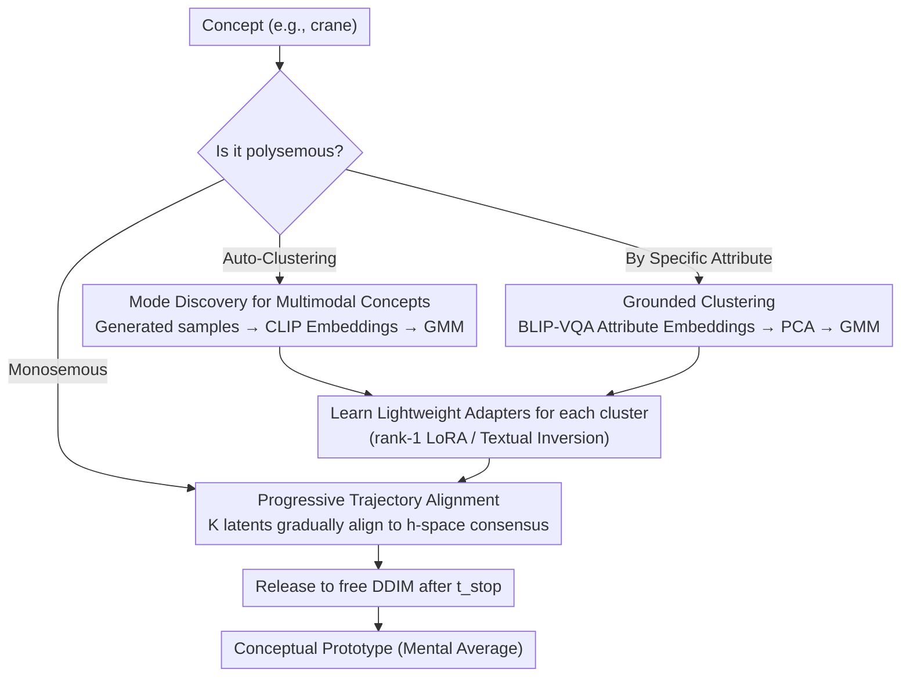

# Diffusion Mental Averages

**Conference**: CVPR 2026  
**arXiv**: [2603.29239](https://arxiv.org/abs/2603.29239)  
**Code**: [Project Page](https://diffusion-mental-averages.github.io)  
**Area**: Image Generation / Diffusion Models  
**Keywords**: Diffusion Models, Conceptual Prototypes, Trajectory Alignment, Semantic Averaging, Model Bias Analysis

## TL;DR

Proposes Diffusion Mental Averages (DMA), which extracts "mental average" prototype images of concepts from pre-trained diffusion models by aligning multiple denoising trajectories in the semantic space—achieving consistent and realistic visualization of conceptual averages for the first time.

## Background & Motivation

When humans imagine a "bird," a typical small bird (like a sparrow) comes to mind rather than an ostrich or a rare species. This "mental prototype" reflects experiential preferences. Similarly, diffusion models should implicitly encode a "typical representation" for each concept after training—but how can it be visualized?

Limitations of current methods:

**Pixel-space averaging**: Requires spatial alignment; even after alignment, details are averaged out, resulting in blurry and unrealistic results. Abstract concepts (e.g., "freedom") cannot be spatially aligned at all.

**Semantic-space averaging**: While AE/VAE/GANs allow encode → average → decode, diffusion models **lack an explicit semantic bottleneck layer**. Semantic information is scattered across different timesteps, and there is no direct decoder.

**Dataset distillation methods** (D4M, MGD3): Optimized for downstream tasks, these produce prototypes that are often unnatural or inconsistent.

**Selective methods**: Selecting representative samples from a set is limited by the total number of samples and cannot transcend existing generations.

**Key Challenge**: Semantic information in diffusion models is **distributed across the entire denoising trajectory**—from coarse-grained layouts in early steps to fine-grained details in late steps—making simple averaging at a single level impossible.

## Method

### Overall Architecture

Diffusion models spread conceptual semantic information across the entire denoising trajectory—early steps determine global layout, while late steps define details—thus preventing a simple "encode → average → decode" at a specific layer as seen in VAEs. DMA addresses this by redefining "averaging" as "aligning a group of trajectories": running K latent noise variables simultaneously and forcing them to converge toward a semantic consensus at each denoising step. Once all trajectories converge, any one of them can be decoded as the "mental average" prototype of the concept. The "metric" for alignment is the U-Net bottleneck layer (h-space), as prior work proved this layer's semantics are approximately linearly additive, making averaging meaningful.

### Key Designs

**1. Progressive Trajectory Alignment: Forcing semantic consensus at every denoising step rather than post-hoc averaging.**

Pixel averaging is blurry because of its absolute application on final images. DMA instead unifies semantics incrementally along the "coarse-to-fine" rhythm of diffusion. Specifically, $K=1000$ noise latents $\{\mathbf{z}_k^{(0)}\}_{k=1}^K$ are initialized. At each timestep $t$, their mean h-space activation is calculated as the current consensus target:

$$\bar{A}^{(t)} = \frac{1}{K}\sum_{k} H(\mathbf{z}_k^{(t)})$$

Each latent is then pulled toward this consensus by performing 300 Adam iterations with the objective $\min_{\mathbf{z}_i^{(t)}} \|H(\mathbf{z}_i^{(t)}) - \bar{A}^{(t)}\|_2^2$. After optimization, the latents proceed to the next step via DDIM sampling. Since early steps dominate global structure and late steps dominate texture, this process naturally aligns composition first, then details. Alignment continues until a cutoff $t_{stop}=10$, after which standard DDIM takes over for the final steps. This locks the conceptual skeleton while preserving the stochastic details necessary for realistic images, avoiding over-alignment that results in blurs.

**2. Mode Discovery for Multimodal Concepts: Clustering before averaging when a word has multiple typical forms.**

The concept "dog" includes both Golden Retrievers and Chihuahuas; "crane" refers to both a bird and construction machinery. Averaging them directly yields inconsistent hybrids. DMA produces a batch of samples, extracts their CLIP embeddings for GMM clustering, and splits the concept into several semantic sub-regions. Trajectory alignment is then performed within each cluster. To bridge the gap between the CLIP-space clustering and the h-space alignment, a lightweight adapter (Textual Inversion or rank-1 LoRA) is learned for each cluster to guide the diffusion model's conditioning.

**3. Grounded Clustering: Allowing users to specify the axis of division.**

Automatic clustering might not align with user-relevant dimensions. Grounded clustering allows explicit specification of attributes (e.g., "doctor" by skin tone, "dog" by breed). This is achieved by using BLIP-VQA to query the attribute, obtaining attribute-focused embeddings, and performing GMM clustering after PCA dimensionality reduction. This transforms mode discovery from "model-perceived similarity" to "user-defined semantic axes," also serving as a controllable entry point for probing model bias.

### An Example: Mental Average for "crane"

Direct averaging of "crane" results in a bird-machine hybrid. Using the DMA pipeline: A batch of crane samples is generated, and CLIP embeddings are clustered via GMM, naturally identifying "bird" and "construction crane" clusters. A LoRA is learned for each to lock the condition to the corresponding semantics. Within each cluster, 1000 latents undergo progressive trajectory alignment—aligning toward the h-space consensus at each of the first 990 steps before completing via DDIM at $t_{stop}=10$. The resulting "bird" prototype is a typical crane, and the "crane machine" is a typical tower crane, each being highly consistent internally.

### Loss & Training

- The core optimization objective is simple: $\mathcal{L} = \|H(\mathbf{z}_k^{(t)}) - \bar{A}_t\|_2^2$
- Adam optimizer, learning rate $2 \times 10^{-2}$, 300 iterations per latent per timestep.
- CFG scale = 7.0, 20-step DDIM sampling.
- LoRA: rank-1 LoRA, 2000 steps, learning rate $10^{-4}$, CFG reduced to 3.0.
- Textual Inversion: 3000 steps, learning rate $10^{-2}$.
- Full optimization takes approximately 10 hours (RTX 4080).

## Key Experimental Results

### Main Results

Evaluated across 12 concepts (animals, people, objects, abstracts), 1000 samples per group, 10 repetitions:

| Method | Consistency (CLIP) ↓ | Consistency (DreamSim) ↓ | Representativeness (CLIP) ↓ | ImageReward ↑ |
|------|---------------------|-------------------------|---------------------------|--------------|
| GANgealing | 0 | 0 | 0.386 | -0.684 |
| Avg VAE | 0 | 0 | 0.473 | -2.262 |
| D4M | 0.168 | 0.274 | 0.197 | 0.823 |
| MGD3 | 0.180 | 0.319 | 0.195 | 0.755 |
| **DMA (Ours)** | **0.031** | **0.032** | **0.179** | **1.002** |

- GANgealing and Avg VAE have 0 consistency (by design) but produce blurry results.
- DMA is superior across consistency, representativeness, and image quality.

### Ablation Study

| Configuration | Description |
|------|------|
| Different cutoff $t_{stop}$ | Higher values improve alignment but increase cost; 10 steps are sufficient. |
| LoRA vs Textual Inversion | LoRA preserves color and shape better; TI has limited capacity. |
| Different SD Variants | Different variants produce prototypes with varying styles/biases, verifying generality. |
| DiT Architecture | Using the final transformer block instead of h-space is equally effective. |

### Key Findings

- **Extreme Consistency**: DMA converges to nearly identical prototypes from different random seeds, with 5-10x better consistency than D4M/MGD3.
- **Revealing Model Bias**: "Soldier" is consistently male in SD1.5/Realistic Vision, more neutral in PixelArt, and female in Animerge.
- **Abstract Concepts**: Consistently generates the Statue of Liberty for "freedom" and Venice canals for "Italy," which baselines cannot handle.
- **Effective Mode Discovery**: Successfully separates "bird" and "construction crane" modes for the word "crane."

## Highlights & Insights

1. **New Research Problem**: First to propose extracting "mental averages" from diffusion models—finding the "most typical" representation rather than diverse samples.
2. **Elegant Concept**: Transforms "averaging" into "trajectory alignment," aligning with the coarse-to-fine generation paradigm of diffusion models.
3. **Model Probing Tool**: DMA serves as an analysis tool for conceptual representations and biases within diffusion models.
4. **Generalization**: Works across SD1.5 and DiT architectures, suggesting the semantic hierarchy is a common property of diffusion models rather than a specific architecture.
5. **Mode Discovery + Adapter**: A robust solution for handling polysemous concepts.

## Limitations & Future Work

1. **High Computational Cost**: 1000 latents × 20 steps × 300 iterations ≈ 10 hours (RTX 4080), limiting practical application.
2. **Dependence on h-space**: Requires manual identification of semantic layers for non-U-Net architectures like DiT.
3. **CFG and Sample Count**: High-variance concepts require more samples; high CFG improves consistency but reduces diversity.
4. **Encoder Bias**: Clustering inherits biases from CLIP/BLIP.
5. **Subjective Evaluation**: Representativeness metrics depend on the choice of embedding space.

## Related Work & Insights

- **Kwon et al.**: Discovered the linear semantic properties of the U-Net bottleneck (h-space), which is the foundation of this work.
- **GANgealing**: Uses spatial alignment for pixel averaging in GANs but is limited to pre-trained GANs and cannot handle abstract concepts.
- **D4M / MGD3**: Recent works using diffusion for dataset distillation, though focused on classification tasks rather than conceptual summarization.
- **Textual Inversion / LoRA**: Utilized innovatively here for cross-space semantic alignment.
- **Insight**: The temporal dimension of diffusion models contains a hierarchy from abstract to concrete semantics that can be exploited for various tasks.

## Rating

- Novelty: ⭐⭐⭐⭐⭐ — Entirely new problem definition; the "mental average" concept is highly inspiring.
- Experimental Thoroughness: ⭐⭐⭐⭐ — Comprehensive across concepts and architectures, though computational cost analysis is limited.
- Writing Quality: ⭐⭐⭐⭐⭐ — Fluent narrative, logical flow from cognitive analogies, and rich visualization.
- Value: ⭐⭐⭐⭐ — Significant as an analysis tool and visualization method, though practical use cases are specialized.

<!-- RELATED:START -->

## Related Papers

- [\[NeurIPS 2025\] GenIR: Generative Visual Feedback for Mental Image Retrieval](../../NeurIPS2025/image_generation/genir_generative_visual_feedback_for_mental_image_retrieval.md)
- [\[CVPR 2026\] Reviving ConvNeXt for Efficient Convolutional Diffusion Models](reviving_convnext_for_efficient_convolutional_diffusion_models.md)
- [\[CVPR 2026\] Visual Diffusion Models are Geometric Solvers](visual_diffusion_models_are_geometric_solvers.md)
- [\[CVPR 2026\] Learnability-Guided Diffusion for Dataset Distillation](learnability-guided_diffusion_for_dataset_distillation.md)
- [\[CVPR 2026\] Elucidating the SNR-t Bias of Diffusion Probabilistic Models](dcw_snr_t_bias_diffusion.md)

<!-- RELATED:END -->
