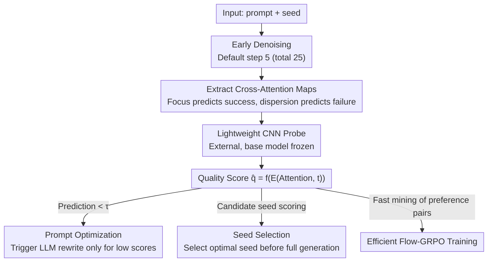

# Diffusion Probe: Generated Image Result Prediction Using CNN Probes

**Conference**: CVPR 2026  
**arXiv**: [2602.23783](https://arxiv.org/abs/2602.23783)  
**Code**: None  
**Area**: Diffusion Models / Image Quality Prediction  
**Keywords**: Diffusion models, Probes, Cross-attention, Early quality prediction, Generation acceleration

## TL;DR

It was discovered that the cross-attention distribution in the early denoising steps of diffusion models is highly correlated with the final image quality. This paper proposes Diffusion Probe—a lightweight CNN that predicts generation quality from early attention maps. By pre-filtering low-quality generation paths at only 10% of the denoising process, it accelerates prompt optimization, seed selection, and GRPO training.

## Background & Motivation

**Background**: T2I diffusion models face a core efficiency bottleneck: unpredictable quality.

**Limitations of Prior Work**: Users often require multiple attempts (changing prompts/seeds) to obtain satisfactory results, where each attempt necessitates running the complete sequence of denoising steps.

**Key Challenge**: Academic methods such as IC-Edit (repeated generation) and Flow-GRPO (sorting multiple candidates) similarly rely on full generation, with costs scaling linearly with the number of samples.

**Key Insight**: A core discovery of this paper is that early cross-attention maps in diffusion models implicitly contain signals for predicting final image quality: objects corresponding to dispersed or fragmented attention tokens are often missing or distorted in the final image.

## Method

### Overall Architecture

The primary efficiency pain point for T2I diffusion models is that "quality is only known after completing the denoising chain"—changing prompts or seeds requires waiting for all 25 steps to judge the outcome. This paper finds the answer is already written in the early cross-attention maps. At a default step 5 (out of 25), the cross-attention map $\mathcal{A}$ from intermediate layers is extracted and fed into a lightweight CNN probe $E_\theta$, alongside timestep embeddings, to directly regress a scalar quality score $\hat{q} = f_\theta(E_\theta(\mathcal{A}, t))$. Once the probe is trained offline, this early score can be used to truncate doomed generation paths in prompt optimization, seed selection, and GRPO training.

### Key Designs

**1. Predicting success from early attention: Focus vs. Dispersion**

This is the foundational premise: if early attention were unrelated to final quality, the probe would be useless. The authors conducted a systematic audit of FLUX and observed two complementary phenomena: (a) even in high-noise stages, semantically significant tokens induce sharp, localized high-attention regions, indicating that object localization is formed very early; (b) if the final image has issues (missing/distorted objects or semantic misalignment), the corresponding early attention maps are noticeably dispersed and fragmented. Thus, "attention focus → correct rendering, attention dispersion → probable failure" becomes a signal directly readable by a CNN.

**2. Plug-and-play lightweight CNN probe: Zero modification to base parameters**

To interpret this signal cheaply, the probe is constructed from several DownBlocks (with residual layers) and an OutputLayer (normalization + pooling + convolution). It extracts attention from the last 10 encoder blocks for UNets (e.g., SDXL) or 10 consecutive middle blocks for DiTs (e.g., FLUX). The architecture is extremely lightweight and entirely external—base model weights remain frozen. The training objective is to align the probe output with the scores of a pretrained reward model (e.g., ImageReward) on the full image:

$$\mathcal{L} = \|\hat{q} - q\|_2^2$$

where $q$ is the quality score from the reward model for the fully generated image. The probe learns to approximate final rewards using early attention, offering a non-intrusive solution for any T2I model with attention mechanisms.

**3. Applying "early prediction" to three downstream tasks**

The value of the probe lies in replacing expensive full generation evaluations with cheap early predictions across three scenarios: (a) **Prompt Optimization**: LLM prompt rewriting is only triggered if the predicted score is below a threshold $\tau$, eliminating unnecessary LLM calls; (b) **Seed Selection**: Candidate seeds are run for only $T_0 \ll T$ steps, and the probe selects the best seed for full generation; (c) **Efficient Flow-GRPO Training**: The probe rapidly mines preference pairs $(x^+, x^-)$, accelerating policy convergence by avoiding full generation.

### Loss & Training

- MSE regression loss, with labels from a pretrained ImageReward model.
- Training data consists of 15K prompts (MS-COCO), evaluated on 5K disjoint prompts.
- Oversampling is applied to low-score samples to address data imbalance.
- The default extraction step is $t=5$ (out of 25): prediction accuracy gains are highest between $t=1$ and $t=5$, following which returns diminish.

## Key Experimental Results

### Main Results (Prediction accuracy at 1024×1024 resolution)

| Base Model | Steps | SRCC↑ | AUC-ROC↑ | KTC↑ | PCC↑ |
|----------|------|-------|----------|------|------|
| SDXL | 5 | 0.73 | 0.86 | 0.57 | 0.72 |
| SDXL | 10 | 0.76 | 0.89 | 0.61 | 0.75 |
| FLUX | 5 | 0.76 | 0.88 | 0.60 | 0.75 |
| FLUX | 10 | **0.79** | **0.91** | **0.64** | **0.78** |
| Qwen-Image | 10 | 0.72 | 0.87 | 0.56 | 0.71 |

The performance is consistent across architectures (UNet/DiT), and an AUC > 0.9 indicates excellent classification/discrimination.

### Ablation Study (Downstream task performance)

| Model | Task | Method | CLIP Score↑ | ImageReward↑ | Aesthetic↑ |
|------|------|------|-------------|-------------|------------|
| SDXL | Prompt Optimization | Baseline | 28.31 | 0.71 | 5.13 |
| SDXL | Prompt Optimization | **Ours (+Probe)** | 30.24 | 0.72 | 5.29 |
| SDXL | Prompt Optimization | +LLM | 30.80 | 0.73 | 5.34 |
| FLUX | Seed Selection | Random | 31.37 | 1.02 | 5.67 |
| FLUX | Seed Selection | **Ours (+Probe)** | 31.41 | 1.06 | **5.79** |

The Probe approaches LLM performance in prompt optimization with significantly lower overhead and markedly improves aesthetic scores in seed selection.

### Key Findings

- Probe prediction accuracy nears peak levels at step 5 (PCC 0.75 vs. peak 0.78), utilizing only 20% of total steps.
- Consistency across three different architectures (UNet/DiT) validates the model-agnostic nature of the approach.
- In Flow-GRPO training, the probe increases the proportion of high-quality samples by 2.5×, leading to smoother convergence.
- The degree of attention map dispersion directly corresponds to failure modes (missing, distorted, or mismatched attributes).

## Highlights & Insights

- Introduces the LLM probing paradigm to diffusion models for the first time—diagnosing generation trajectories via probes is a novel perspective.
- The core insight is elegant: focused early attention implies correct rendering, while dispersed attention implies failure.
- The probe is fully decoupled from the base model, non-intrusive, and applicable to any T2I model with attention layers.
- Practical application scenarios are diverse (prompt iteration, seed filtering, RL acceleration).

## Limitations & Future Work

- Currently only validated on the ImageReward metric; predictive power for other dimensions (e.g., text rendering, spatial relations) remains to be verified.
- Probes must be trained separately for each base model; generalizing to new models requires re-collecting data.
- Extraction steps $t$ and block layers are manually selected and may not be optimal for all models.
- MSE loss is insensitive to ranking; future work could explore ranking losses or contrastive learning.
- For extremely simple or complex prompts, attention patterns may not yield the same predictive power.

## Related Work & Insights

- Difference from DAAM (Attention Attribution): DAAM performs post-hoc analysis, while Probe performs prediction.
- Complementary to attention manipulation methods like Attend-and-Excite—the latter improves attention, while the former predicts its effect.
- Comparison with ICEdit: ICEdit requires decoding and a VLM (72B), whereas Probe requires only a lightweight CNN.
- The probing paradigm is mature in NLP (predicting linguistic properties); its extension to visual generation is a natural evolution.
- Can be combined with acceleration methods like DPCache—pre-filtering followed by accelerated generation.

## Rating

- Novelty: ⭐⭐⭐⭐ First to introduce probing to diffusion; attention-quality correlation is a valuable discovery.
- Experimental Thoroughness: ⭐⭐⭐⭐ Validated across three models, multiple steps, and three downstream tasks.
- Writing Quality: ⭐⭐⭐⭐ Clear motivation, intuitive visualization, and well-organized experiments.
- Value: ⭐⭐⭐⭐ High practical value, especially for scenarios requiring massive sampling (RL training, agents).
- Value: TBD

<!-- RELATED:START -->

## Related Papers

- [\[CVPR 2026\] Diversity over Uniformity: Rethinking Representation in Generated Image Detection](diversity_over_uniformity_rethinking_representation_in_generated_image_detection.md)
- [\[CVPR 2026\] Illustrator's Depth: Monocular Layer Index Prediction for Image Decomposition](illustrators_depth_monocular_layer_index_prediction_for_image_decomposition.md)
- [\[CVPR 2026\] Attribution as Retrieval: Model-Agnostic AI-Generated Image Attribution](attribution_as_retrieval_modelagnostic_aigenerated.md)
- [\[CVPR 2026\] FVAR: Next-Focus Prediction for Visual Autoregressive Modeling](fvar_next-focus_prediction_for_visual_autoregressive_modeling.md)
- [\[CVPR 2026\] Markovian Scale Prediction: A New Era of Visual Autoregressive Generation](markovian_scale_prediction_a_new_era_of_visual_autoregressive_generation.md)

<!-- RELATED:END -->
