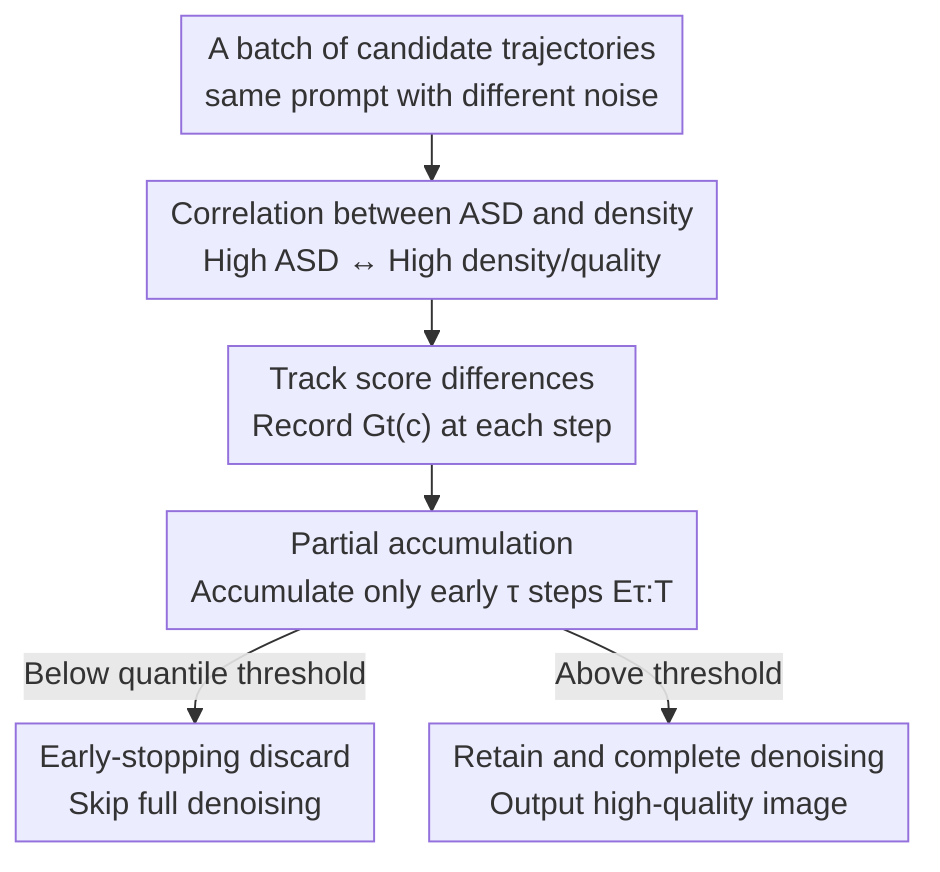

# Diffusion Sampling Path Tells More: An Efficient Plug-and-Play Strategy for Sample Filtering

**Conference**: CVPR 2026  
**Paper**: [CVF Open Access](https://openaccess.thecvf.com/content/CVPR2026/html/Wang_Diffusion_Sampling_Path_Tells_More_An_Efficient_Plug-and-Play_Strategy_for_CVPR_2026_paper.html)  
**Code**: None  
**Area**: Image Generation / Diffusion Models / Inference-time Alignment  
**Keywords**: Diffusion Sampling, Sample Filtering, Classifier-Free Guidance, Inference-time Alignment, Reward-free Evaluation

## TL;DR
This paper discovers that the "Accumulated Score Difference (ASD)" between conditional and unconditional scores along the diffusion denoising trajectory is strongly correlated with sample quality. Based on this, the authors propose CFG-Rejection—a plug-and-play filtering strategy that requires no external reward models, preserves the model architecture, and prunes low-quality trajectories early in the denoising process, consistently improving generation quality across HPSv2, PickScore, GenEval, and DPG-Bench.

## Background & Motivation
**Background**: Sampling in diffusion models is stochastic; a change in the random seed for the same prompt can yield drastically different results. In practice, users often rely on "trial and error"—repeatedly regenerating images until satisfied, which is both time-consuming and computationally expensive. To mitigate this quality fluctuation, there are two primary paradigms: training-side fine-tuning (using RL or implicit rewards to fine-tune the model) and inference-time alignment (manipulating noise vectors during sampling or selecting superior samples, such as Best-of-N or DNO).

**Limitations of Prior Work**: Both paradigms are highly expensive. Training-side methods require constructing reward models, re-labeling data, and performing large-scale fine-tuning. Inference-time alignment generally relies on **external reward models** (such as PickScore). These reward models suffer from two major flaws: (1) they are trained on limited datasets and older architectures (such as SD1.5/SDXL), leading to poor generalization on new models or fine-grained tasks like text rendering; (2) they operate **post-hoc in the pixel space**, meaning quality signals can only be obtained after the image is fully denoised and generated. Consequently, Best-of-N must run the complete denoising process for all candidates before comparison, incurring massive computational waste.

**Key Challenge**: Quality signals arrive too late (requiring full denoising), and the signals are external (requiring reward model training and facing domain mismatch issues). Is it possible to detect whether a trajectory is promising early on, during the **ongoing** sampling process, using signals **intrinsic** to the model itself?

**Key Insight**: The authors start with a geometric interpretation of classifier-free guidance (CFG), which pushes samples toward high-density, semantically coherent regions of the data manifold. If so, "how much the conditional guidance affects the trajectory" inherently carries information about "whether this trajectory is converging toward a high-quality region." This impact is readily accessible in the CFG formula (the difference between the conditional and unconditional scores).

**Core Idea**: Use the **Accumulated Score Difference (ASD)** between conditional and unconditional scores along the denoising trajectory as a zero-cost intrinsic quality proxy. By filtering out low-ASD trajectories early in the denoising process, this approach avoids both external reward models and full denoising.

## Method

### Overall Architecture
The method consists of two stages: first, controlled experiments are used to **reveal** the strong correlation between ASD and sample density (which represents quality); then, an early-stopping filter named CFG-Rejection is **designed** based on this finding. The core metric is the divergence between the conditional and unconditional scores at each denoising step, defined as $G_t(c)=\|S_\theta(x_t;\sigma_t,c)-S_\theta(x_t;\sigma_t,\emptyset)\|_2$, which measures "how much the conditional signal alters the denoising prediction." Accumulating this metric along the trajectory yields the ASD. A key observation is that $G_t(c)$ is most discriminative in the **early denoising stages**. Consequently, quality can be predicted using only the partial accumulation of early steps without waiting for the complete trajectory, which is the direct source of computational savings. The entire pipeline: Track step-wise score differences $\rightarrow$ Accumulate early partial steps $\rightarrow$ Discard low-potential trajectories based on a quantile threshold.

### Key Designs

**1. ASD: Treating "Accumulated Conditional Influence" as an Intrinsic Quality Signal**

The pain point is that quality evaluation has consistently relied on external reward models and full generation. The authors' breakthrough lies in the CFG scoring formula $S_w(x;\sigma,c)=wS_\theta(x;\sigma,c)+(1-w)S_\theta(x;\sigma,\emptyset)$, where the difference between the conditional and unconditional scores inherently reflects "where and how strongly the condition pushes the trajectory." Consequently, they define the single-step score difference as $G_t(c)=\|S_\theta(x_t;\sigma_t,c)-S_\theta(x_t;\sigma_t,\emptyset)\|_2$. Summing the squares of these differences along all denoising steps yields the Accumulated Score Difference (ASD):

$$E_T(c)=\sum_{t=1}^{T} G_t(c)^2.$$

The squared $\ell_2$ norm is chosen intentionally: it produces an **energy-like** metric that amplifies large conditional deviations, which are highly concentrated in the early denoising stage where information density is highest. The authors validate this on a 2D fractal toy distribution with a high-density central backbone and sparse peripheral branches: high-ASD samples cluster in the dense center with strong category consistency; low-ASD samples fall into the sparse periphery with weak semantic alignment; and samples with near-zero ASD correspond to degraded, corrupted images in real text-to-image generation. Furthermore, local sample density and ASD exhibit a **log-linear positive correlation** (Fig. 3). This trend is successfully replicated on ImageNet using two manifold density indicators, Avg-kNN and LOF—larger ASD values indicate samples falling within higher-likelihood regions, yielding better generation-condition alignment. This effectively translates "quality" into a readily readable scalar within the sampling process without requiring any external models.

**2. CFG-Rejection: Early-Stopping Pruning via Early Partial Accumulation**

Directly using $E_T(c)$ is insufficient because calculating the full ASD post-hoc to select the top-k candidates requires running the complete denoising process for every candidate, failing to save computation. Noting that $G_t(c)$ is most discriminative in the early steps, the authors employ **partial accumulation**: given a truncation step $\tau\in[1,T]$, they only accumulate the $\tau$ steps during the early phases of denoising (summing from $T-\tau$ to $T$ as in the formula):

$$E_{\tau:T}(c)=\sum_{t=T-\tau}^{T} G_t(c)^2,$$

When $E_{\tau:T}(c)<\gamma$, the trajectory is discarded immediately, bypassing the remaining denoising steps. This transforms the wasteful "run-all-then-select" pipeline of Best-of-N into an efficient setup where bad candidates are pruned after just a few steps. Experiments demonstrate that $\tau=10$ already captures most of the quality gains, and performance saturates past $\tau=20$, indicating that early score differences provide an exceptionally strong filtering signal. This is the root cause of the method's efficiency. Fig. 4 illustrates this comparison clearly: Best-of-N executes the entire denoising trajectory and relies on an external reward model to filter images, whereas CFG-Rejection leverages intrinsic sampling path information to terminate low-quality generation prematurely.

**3. Step-wise Normalization + Quantile Thresholding: Robust and Prompt-Agnostic Filtering**

Directly accumulating step-wise score differences introduces two engineering issues. First, the noise scale varies dramatically across different denoising steps; if left unaddressed, steps with higher noise levels would dominate the accumulation, leading to timestep imbalance. The authors normalize the scores by the noise level at each step to eliminate this imbalance, ensuring that the contribution of each step is treated fairly. Second, the absolute magnitude of ASD fluctuates significantly across different prompts (rendering complex prompts incomparable to simple ones). Consequently, instead of using a **fixed threshold $\gamma$**, the method employs **quantile-based filtering** (e.g., retaining the top-ranked percentile of ASD samples for each prompt). These two designs enable CFG-Rejection to be plugged into existing generation pipelines without prompt-specific tuning, all while preserving the model architecture and sampling schedule unchanged.

## Key Experimental Results

### Main Results
On ImageNet (EDM2-S, Heun sampler with 32 steps), selecting the top 10% of samples based on ASD consistently improves human preference scores; at different values of $\tau$, $\tau=10$ already approaches the performance ceiling:

| Dataset / Metric | Full set | Top 10% (τ=10) | τ=15 | τ=20 |
|------|------|------|------|------|
| ImageNet PickScore↑ | 20.38 | 20.52 | 20.60 | 20.61 |
| ImageNet HPSv2↑ | 26.13 | 26.31 | 26.48 | 26.55 |

On GenEval (SDv1.5, guidance=9), ASD filtering outperforms random selection on most compositional categories, elevating the overall score from 0.4322 (random) to 0.4785 ($\tau=20$). The improvement in the two-object relation category is particularly notable (reported as a +46% level improvement in the paper):

| Method ($\omega=9$) | Two Obj. | Counting | Color Attri. | Overall↑ |
|------|------|------|------|------|
| random | 0.3725 | 0.3578 | 0.0688 | 0.4322 |
| 4 from 50 | 0.5455 | 0.3375 | 0.11 | 0.4728 |
| τ=20 | 0.50 | 0.4094 | 0.1175 | **0.4785** |

Equal compute/time budget comparison (ImageNet, PickScore): Under a tight 5s budget, CFG-Rejection (21.04) outperforms Best-of-N (20.92). DNO is unusable at low budgets as it requires about 15s of optimization per step. When the budget is relaxed to 10–15s, Best-of-N slightly overtakes CFG-Rejection with a minimal gap:

| Time Budget (s) | CFG-Rejection | Best-of-N | DNO |
|------|------|------|------|
| 5 | **21.04** | 20.92 | – |
| 10 | 21.09 | 21.15 | – |
| 15 | 21.12 | 21.23 | 20.79 |

### Ablation Study

| Configuration | Key Metrics | Description |
|------|---------|------|
| τ=10 | HPSv2 26.31 / GenEval close to upper bound | Early 10-step signals are sufficient; saves compute |
| τ=20 | HPSv2 26.55 / DPG performance saturated | Marginal returns of subsequent steps diminish |
| 4-from-20 vs 4-from-50 | DPG overall 64.48 vs 65.15 | Larger candidate pool yields slight improvement, but the gap is small |
| Memorization check (vs random) | Similarity 0.3805 → 0.3912 | Similarity only increases slightly; no evidence of memorization |

### Key Findings
- **Early signals are the most valuable**: $\tau=10$ achieves the vast majority of gains, and performance saturates at $\tau \ge 20$. This indicates that pruning can be performed in the early stages of denoising, which is the core of its efficiency advantage.
- **Not relying on memorized training samples**: On SDv2.1 (using a 10k LAION subset with memorization mitigation), the SSCD similarity of CFG-Rejection compared to random selection only slightly increases from 0.3805 to 0.3912 (which is within a reasonable range). Meanwhile, CLIP Score (0.2581 → 0.2615) and HPSv2 (22.84 → 22.98) consistently improve, proving that the gains stem from quality filtering rather than biasing toward memorized high-frequency samples.
- **Larger gains on complex prompts**: The improvement in compositional reasoning (such as two-object relationship) is the most pronounced, indicating that high-density trajectory filtering is more effective in hard scenarios. In contrast, since SDXL's default alignment is already strong and its sample distribution is tighter, the headroom for improvement is smaller, resulting in more moderate gains.

## Highlights & Insights
- **Turning CFG's "by-product" into a free quality probe**: The difference in conditional scores is an inherently available quantity in CFG computation. This work is the first to reveal and quantify its log-linear correlation with sample density/quality, effectively discovering a zero-cost intrinsic verifier that requires no reward model training.
- **"Early stopping" rather than "post-hoc selection"**: Traditional Best-of-N must process the entire denoising sequence before selection, wasting computation entirely on rejected samples. CFG-Rejection shifts the decision point to the early phase of denoising to save this computational overhead. The core concept is transferable to any generative modality using CFG (e.g., video or 3D).
- **Engineering details dictate plug-and-play capability**: Step-wise noise normalization resolves timestep imbalance, and quantile thresholding resolves scale discrepancies across prompts. These seemingly subtle treatments are key to ensuring that the method is readily usable without manual hyperparameter tuning.

## Limitations & Future Work
- **Intrinsic signal is a coarse proxy**: The authors concede that the characterization of quality by ASD is coarser than human-preference-based rewards (such as PickScore). Consequently, when computation is abundant and time budgets are relaxed, it can be slightly outperformed by Best-of-N. Its positioning is a robust, lightweight default alternative when reward models are unavailable or expensive to deploy.
- **Empirical theoretical explanation**: The correlation between ASD and density is primarily supported by toy distribution geometry and ImageNet density metrics. Formal discussions are relegated to the appendix, leaving room for a more rigorous characterization of the correlation mechanism (⚠️ the specific definitions of Equations 5–7 are subject to the original paper's appendix).
- **Validated only on images**: Although the paper claims potential generalization to modalities such as video and 3D, the experiments only cover image generation. Cross-modality effectiveness remains to be verified.
- **Dependency on CFG**: The method is inherently built upon classifier-free guidance, making it not directly applicable to sampling pipelines that do not use CFG or employ very weak guidance.

## Related Work & Insights
- **vs Best-of-N**: Both perform sample filtering, but Best-of-N relies on an external reward model and evaluates candidates only after complete denoising. This work utilizes the intrinsic ASD signal from CFG to filter early in the denoising process, eliminating the need for reward models or complete runs to save compute, though with a coarser quality proxy.
- **vs DNO / RENO (Direct Noise Optimization)**: They perform gradient optimization in the latent space through repeated forward-and-backward sampling, which is extremely expensive (~15s per step). This work performs no optimization but only forward filtering, vastly outperforming them in usability under tight computational budgets.
- **vs LGD (Reward-Guided Generation)**: LGD injects reward gradients into the denoising process to achieve online guidance, which introduces instability and still relies on external supervision. This work is entirely reward-free and requires no extra supervision.

## Rating
- Novelty: ⭐⭐⭐⭐⭐ First to reveal and utilize CFG's intrinsic ASD signal for reward-free early-stopping filtering, offering a highly novel perspective.
- Experimental Thoroughness: ⭐⭐⭐⭐ Covers multiple benchmarks and models (ImageNet/GenEval/DPG) alongside a dedicated memorization check, though cross-modality verification is absent.
- Writing Quality: ⭐⭐⭐⭐ Clear narrative flow from phenomenon discovery to mechanism to method, with well-explained equations and intuitive logic.
- Value: ⭐⭐⭐⭐ Plug-and-play with zero overhead, making it highly suitable as a default filter in reward-free scenarios.

<!-- RELATED:START -->

## Related Papers

- [\[CVPR 2026\] PromptLoop: Plug-and-Play Prompt Refinement via Latent Feedback for Diffusion Model Alignment](promptloop_plug-and-play_prompt_refinement_via_latent_feedback_for_diffusion_mod.md)
- [\[ICLR 2026\] HiGS: History-Guided Sampling for Plug-and-Play Enhancement of Diffusion Models](../../ICLR2026/image_generation/higs_history-guided_sampling_for_plug-and-play_enhancement_of_diffusion_models.md)
- [\[CVPR 2026\] Efficient Weighted Sampling via Score-based Generative Models](efficient_weighted_sampling_via_score-based_generative_models.md)
- [\[ICLR 2026\] RNE: plug-and-play diffusion inference-time control and energy-based training](../../ICLR2026/image_generation/rne_plug-and-play_diffusion_inference-time_control_and_energy-based_training.md)
- [\[CVPR 2026\] Coupled Diffusion Sampling for Training-Free Multi-View Image Editing](coupled_diffusion_sampling_for_training-free_multi-view_image_editing.md)

<!-- RELATED:END -->
