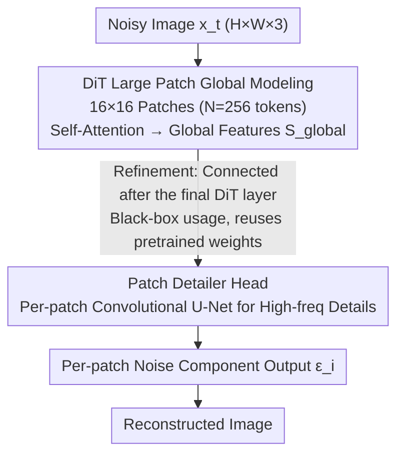

# DiP: Taming Diffusion Models in Pixel Space

**Conference**: CVPR 2026  
**arXiv**: [2511.18822](https://arxiv.org/abs/2511.18822)  
**Code**: [GitHub](https://github.com/NJU-PCALab/DiP)  
**Area**: Image Generation / Pixel-space Diffusion  
**Keywords**: Pixel-space Diffusion, Patch Detailer Head, Global-Local Decoupling, End-to-End Generation, Efficient Inference

## TL;DR
Ours proposes DiP, an efficient pixel-space diffusion framework. By utilizing a DiT backbone to model global structures with large patches and a lightweight Patch Detailer Head to recover local details, it achieves computational efficiency comparable to LDMs without requiring a VAE, reaching a 1.79 FID on ImageNet 256×256.

## Background & Motivation

**Background**: Latent Diffusion Models (LDMs) have become the de facto standard by compressing images into latent space via VAEs. However, VAEs introduce information loss and are not trained end-to-end. Pixel-space diffusion models preserve full signals but suffer from high computational costs.

**Limitations of Prior Work**: (a) The VAE in LDMs acts as an information bottleneck, introducing reconstruction artifacts and limiting the upper bound of image fidelity; (b) Existing pixel-space models (e.g., PixelFlow, SiD) use small patches ($2 \times 2$ or $4 \times 4$), causing sequence lengths to grow quadratically with resolution, making training and inference computationally expensive.

**Key Challenge**: Pixel-space models face a quality-efficiency dilemma: small patches preserve details but lead to excessive sequence lengths; large patches are efficient but lose high-frequency information as the self-attention mechanism in DiT compresses rich intra-patch spatial information into a single token.

**Goal**: To achieve efficiency comparable to LDMs in pixel space while avoiding VAE information loss and retaining the advantages of end-to-end training.

**Key Insight**: Decoupling global structure modeling from local detail recovery—DiT uses large patches ($16 \times 16$) for efficient global modeling, while a lightweight CNN head recovers local details.

**Core Idea**: A DiT backbone operates on large patches to maintain efficiency, combined with a co-trained convolutional U-Net Patch Detailer Head that injects local inductive biases, adding only 0.3% more parameters.

## Method

### Overall Architecture

DiP aims to achieve LDM-level speed in pixel space without relying on VAEs by separating the modeling of "global structure" and "local details." Given a noisy image $x_t \in \mathbb{R}^{H \times W \times 3}$, it is first divided into $N = (H \times W)/P^2$ large patches ($P=16$). The DiT backbone models global features $S_{\text{global}} \in \mathbb{R}^{N \times D}$ on this short sequence via self-attention. A lightweight Patch Detailer Head then processes each patch in parallel—taking the corresponding global feature $s_i$ and the original noisy pixel patch $p_i$ to reconstruct the noise component $\epsilon_i$ for that patch.

### Key Designs

**1. DiT Global Modeling with Large Patches: Matching Sequence Lengths with LDMs**

The primary bottleneck for pixel-space methods is sequence length: small patches ($2 \times 2$ or $4 \times 4$) preserve details but the token count explodes with resolution. DiP directly uses $P=16$ patches, cutting a $256 \times 256$ image into 256 tokens—aligning the sequence length and computational complexity with LDMs in latent space. The trade-off is that DiT alone cannot render fine textures: single-image overfitting experiments (Fig. 3) show that DiT-only captures global layout and tone but fails to render sharp edges and high-frequency textures, highlighting an inherent weakness in local inductive bias.

**2. Patch Detailer Head for High-frequency Recovery: Reclaiming Details with 0.3% Parameters**

To compensate for high frequencies lost by DiT, each large patch passes through a shallow convolutional U-Net (4 downsamplings + 4 upsamplings, each block comprising Conv+SiLU+Pooling). The global feature $s_i \in \mathbb{R}^{D \times 1 \times 1}$ is concatenated channel-wise at the bottleneck with the downsampled output to guide local refinement. Convolution is chosen for its native locality and translation equivariance, which are ideal for texture and edge denoising. The authors compared standard MLP, coordinate-based MLP, intra-patch attention, and convolutional U-Net; the U-Net performed best with the fewest parameters, increasing total parameters by only 0.3%.

**3. Posterior Refinement: Treating DiT as a Black-box Backbone**

Ablations were conducted on the head insertion point—posterior, intermediate injection, and hybrid. Placing the head after the final DiT layer proved optimal. This allows DiT to be treated as a complete black-box backbone, maximizing simplicity and allowing the direct reuse of pretrained DiT weights.

### Loss & Training
- Supports DDPM noise prediction and Flow Matching frameworks.
- Uses DDT (DiT variant) as the backbone with the AdamW optimizer.
- EMA decay of 0.9999, batch size 256.
- Patch Detailer Head: intermediate layers kernel=3, padding=1; final layer kernel=1.
- Uses Euler-100 sampler.

## Key Experimental Results

### Main Results

| Method | Type | FID↓ | sFID↓ | IS↑ | Prec.↑ | Rec.↑ | Latency | Params |
|------|------|------|-------|------|--------|-------|----------|--------|
| DiT-XL (LDM) | Latent | 2.27 | 4.60 | 278.2 | 0.83 | 0.57 | 2.09s | 675M+86M |
| SiT-XL (LDM) | Latent | 2.06 | 4.50 | 270.3 | 0.82 | 0.59 | 2.09s | 675M+86M |
| PixelFlow-XL/4 | Pixel | 1.98 | 5.83 | 282.1 | 0.81 | 0.60 | 7.50s | 677M |
| VDM++ | Pixel | 2.12 | - | 278.1 | - | - | - | 2.46B |
| **DiP-XL/16 (600ep)** | **Pixel** | **1.79** | 4.59 | 281.9 | 0.80 | **0.63** | **0.92s** | **631M** |

### Ablation Study (Patch Detailer Head Architecture)

| Architecture | FID↓ | sFID↓ | IS↑ | Training Cost | Latency |
|------|------|-------|------|----------|----------|
| DiT-only (629M) | 5.28 | 6.56 | 243.8 | 84×8 GPU h | 0.88s |
| + Standard MLP | 6.92 | 7.27 | 210.9 | 93×8 GPU h | 0.91s |
| + Coord-based MLP | 2.20 | 4.49 | 284.6 | 123×8 GPU h | 0.95s |
| + Intra-Patch Attn | 2.98 | 5.16 | 275.0 | 96×8 GPU h | 0.94s |
| **+ Conv U-Net (Ours)** | **2.16** | **4.79** | 276.8 | 87×8 GPU h | **0.92s** |

| Scaled DiT-only vs. Plus Head | FID↓ | Params | Training Cost | Latency |
|--------------------------|------|--------|----------|------|
| DiT-only 1536 hidden dim | 2.83 | 1.1B | 149×8 h | 1.49s |
| **DiT-XL + Conv U-Net** | **2.16** | **631M** | **87×8 h** | **0.92s** |

### Key Findings
- **More Efficient than Scaling**: Adding a 0.3% parameter Head is more effective than scaling DiT to 1.1B (2.16 vs 2.83 FID) and is 38% faster.
- **Comparison with PixelFlow**: Among pixel-space methods, DiP's latency is 0.92s vs 7.50s (8× faster) with superior FID.
- **Value of Local Inductive Bias**: Standard MLP was ineffective (FID worsened), indicating that simple intra-patch transformations are insufficient and convolutional spatial priors are necessary.
- **t-SNE Verification**: Adding the Head leads to tighter intra-class clustering and clearer inter-class separation in the feature space.

## Highlights & Insights
- **Exquisite Design Philosophy**: The Global-Local Decoupling principle is simple yet effective, solving the core bottleneck of pixel-space diffusion models with only a 0.3% parameter increase.
- **Efficiency-Quality Pareto Optimality**: Reaches a new Pareto frontier in the FID-Latency space (Fig. 2).
- **End-to-End Advantage**: No VAE pretraining required, avoiding information bottlenecks and the flaws of non-end-to-end training.

## Limitations & Future Work
- Currently only validated on ImageNet 256×256; higher resolutions (512+) and text-guided generation remain to be explored.
- The Patch Detailer Head processes each patch independently, which might pose risks for cross-patch boundary consistency.
- Comparison with recent LDM methods (e.g., FLUX) on text-to-image tasks is not yet comprehensive.

## Related Work & Insights
- Difference from PixelNerd: PixelNerd is tightly coupled with NeRF rendering mechanisms, limiting architectural exploration; DiP proposes more general design principles.
- Difference from JiT: JiT models high-dimensional pixel data by predicting clean images; DiP maintains efficiency through global-local decoupling.
- Insight: The large patch + local refinement approach may be applicable to other tasks requiring efficient processing of high-resolution inputs.

## Rating
- Novelty: ⭐⭐⭐⭐ Global-local decoupling is simple and effective, though the concept is not highly complex.
- Experimental Thoroughness: ⭐⭐⭐⭐⭐ Extremely systematic with architectural comparisons (4 types of heads), placement strategies (3 types), scale-up comparisons, and multiple training budgets.
- Writing Quality: ⭐⭐⭐⭐ Strong motivation verification (single-image overfitting experiment is convincing), clear charts.
- Value: ⭐⭐⭐⭐⭐ Provides a practical, high-efficiency solution for pixel-space diffusion, potentially driving the development of VAE-free generation.

<!-- RELATED:START -->

## Related Papers

- [\[CVPR 2026\] PixelDiT: Pixel Diffusion Transformers for Image Generation](pixeldit_pixel_diffusion_transformers_for_image_generation.md)
- [\[CVPR 2026\] Taming Sampling Perturbations with Variance Expansion Loss for Latent Diffusion Models](taming_sampling_perturbations_with_variance_expansion_loss_for_latent_diffusion_.md)
- [\[CVPR 2026\] Scale Space Diffusion：把尺度空间塞进扩散过程](scale_space_diffusion.md)
- [\[CVPR 2026\] Elucidating the Design Space of Arbitrary-Noise-Based Diffusion Models](eda_arbitrary_noise_diffusion_design_space.md)
- [\[CVPR 2026\] DeCo: Frequency-Decoupled Pixel Diffusion for End-to-End Image Generation](deco_frequency-decoupled_pixel_diffusion_for_end-to-end_image_generation.md)

<!-- RELATED:END -->
