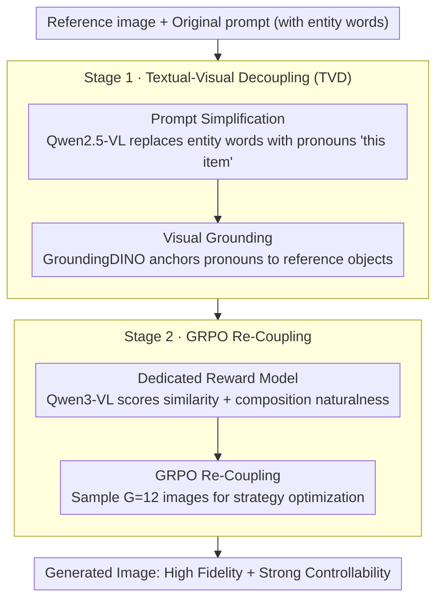

# Disentangling to Re-couple: Resolving the Similarity-Controllability Paradox in Subject-Driven Text-to-Image Generation

**Conference**: CVPR 2026  
**arXiv**: [2604.00849](https://arxiv.org/abs/2604.00849)  
**Code**: None (planned open source)  
**Area**: Image Generation  
**Keywords**: Subject-Driven T2I, Diffusion Transformer, GRPO, reward model, Textual-Visual Decoupling

## TL;DR

The DisCo framework is proposed to resolve the "similarity-controllability" paradox in subject-driven image generation. It first decouples text and visual information by replacing entity words with pronouns to eliminate textual interference on the subject, and then re-couples them using GRPO with a dedicated reward model.

## Background & Motivation

The **Key Challenge** in subject-driven T2I generation lies in the "dual-optimal paradox" between maintaining high subject fidelity and accurately executing text editing instructions. Existing methods (e.g., IP-Adapter, OminiControl, DreamO) employ techniques like encoder injection or unified sequences but fail to fundamentally resolve this conflict.

The **Key Insight** of this paper is that the root of the contradiction lies in the "role overload" of the text prompt. Traditional prompts simultaneously describe the subject and the editing instructions (e.g., "a duck toy in the jungle"), where "duck toy" activates the model's prior knowledge, conflicting with the actual details of the reference image. Experiments (Fig.1) demonstrate that when "a duck toy" is replaced with "this item," the subject fidelity of the generated image significantly improves—the issue is not a lack of model capability, but rather the contradictory signals introduced by entity description words in the prompt.

## Method

### Overall Architecture

The **Mechanism** of DisCo is "Disentangle then Re-couple," constructed in two stages based on the FLUX DiT. The first stage is Textual-Visual Decoupling (TVD), which thoroughly separates subject identity information from text control instructions to cut off the interference of text priors. The second stage is GRPO Re-Coupling, which uses reinforcement learning to naturally re-integrate the decoupled visual subject and text context, achieving both high fidelity and strong controllability.

### Key Designs

**1. Prompt Simplification: Replacing entity words with pronouns to cut off text priors**

The root of the conflict is that entity words in the prompt (e.g., "a duck toy") activate model priors that fight with the reference image details. DisCo uses Qwen2.5-VL 72B to analyze prompts, identify entity words corresponding to the subject, and replace them with generic pronouns ("this item" / "it"). This forces the model to retrieve subject identity only from the visual modality, directly removing interference from text priors.

**2. Visual Grounding: Re-anchoring pronouns to reference image objects**

Pronoun replacement introduces a new problem—the model does not know which object "this item" refers to in the reference image. DisCo uses GroundingDINO with the original entity words to precisely locate the subject in the reference image, bridging generic pronouns with specific visual features. Attention map visualizations (Fig.2) confirm that after decoupling, attention on entity words is suppressed, while the subject attention from the reference image accurately falls on the corresponding region of the generated image.

**3. Dedicated Reward Model: Simultaneously scoring subject similarity and composition naturalness**

Off-the-shelf rewards (ImageReward, CLIP-T, HPS) focus on overall quality or text alignment but fail to capture subject fidelity and compositional harmony. The authors use a VLM to automatically generate editing instructions and synthesize negative samples (altering subject ID features or subject-context interactions) to construct preference pairs. This is used to train a dedicated reward model based on Qwen3-VL-30B that evaluates both "resemblance" and "coordination."

**4. GRPO Re-Coupling: Re-fusing decoupled vision and text via preferences**

Pure decoupling can lead to unnatural compositions (e.g., a candle floating in a city background), requiring RL to restore interactions. For each prompt-image pair, $G=12$ images are sampled. The reward model makes preference choices for each pair, aggregating log-probability as the reward. After group-level normalization to calculate the advantage $\hat{A}_t^i$, the policy model is optimized using a clipped objective + KL regularization to re-couple the visual subject and text background into a cohesive whole.

### Loss & Training

- Base Model: FLUX, Dataset: Subjects200K
- Optimizer: AdamW, learning rate 1e-5, 8×H20 GPUs
- GRPO Settings: sampling timestep=16, 12 images per prompt, noise level ε=0.3
- Reward Model: Qwen3-VL-30B, trained on 25k preference pairs

## Key Experimental Results

### Main Results

Evaluated on DreamBench (30 subjects × 25 prompts = 750 cases):

| Metric | DisCo | FLUX Kontext | DreamO | UNO | Gain |
|------|-------|-------------|--------|-----|------|
| CLIP-B-I↑ | **0.928** | 0.910 | 0.899 | 0.899 | +1.8% |
| CLIP-L-I↑ | **0.937** | 0.911 | 0.901 | 0.907 | +2.6% |
| DINO-I↑ | **0.903** | 0.839 | 0.813 | 0.827 | +7.6% |
| CLIP-B-T↑ | **0.329** | 0.321 | 0.322 | 0.311 | +2.5% |
| CLIP-L-T↑ | **0.273** | 0.268 | 0.267 | 0.255 | +1.9% |
| ImageReward↑ | **1.339** | 1.276 | 1.186 | 0.854 | +4.9% |

DisCo reaches SOTA in **both** subject similarity and text controllability, breaking the trade-off dilemma seen in previous methods.

### Ablation Study

| Configuration | CLIP-I↑ | CLIP-T↑ | IR↑ | Note |
|------|---------|---------|-----|------|
| w/o TVD | 0.915 | 0.319 | 1.237 | No decoupling, subject fidelity drops |
| w/o GRPO | 0.922 | 0.319 | 1.189 | No RL, composition quality drops significantly |
| use CLIP (r) | 0.898 | 0.319 | 1.163 | CLIP cannot evaluate fine-grained quality |
| use IR (r) | 0.914 | 0.326 | 1.404 | IR improves quality but harms subject similarity |
| use pretrained (r) | 0.918 | 0.321 | 1.189 | General VLM struggles to calibrate complex preferences |
| **DisCo (Ours)** | **0.928** | **0.329** | **1.339** | Best synergy of all components |

### Key Findings

- The TVD module solves subject fidelity issues, but strict decoupling leads to unnatural compositions (e.g., a candle suspended in the air over a city background).
- GRPO is the key to bridging the composition gap, with IR increasing from 1.189 to 1.339.
- The dedicated reward model is far superior to CLIP/ImageReward/General VLMs as a reward source.
- User study (100 cases): DisCo win rates are 80% against UNO, 82% against DreamO, and 51% against FLUX Kontext.

## Highlights & Insights

1. **Precise Problem Identification**: The conflict between text priors and visual references is intuitively revealed through the experiment in Fig.1; this insight is simple yet profound.
2. **Decouple → Re-couple Philosophy**: Eliminating conflicts via information isolation and then restoring interaction via RL is more effective than direct optimization in entangled spaces.
3. **Reward Model Training via Synthetic Negatives**: Using VLMs to automatically generate editing instructions for preference pair construction avoids manual labeling and targets specific failure modes of subject-driven tasks.
4. **Attention Map Visualization** provides direct evidence of the effectiveness of decoupling.

## Limitations & Future Work

- Reliance on Qwen2.5-VL 72B for prompt analysis and GroundingDINO for localization introduces additional complexity during inference.
- The reward model is trained on 25k preference pairs, a relatively limited scale that may not generalize well to edge cases.
- Evaluation is limited to DreamBench, lacking more diverse benchmarks.
- Handling of multi-subject scenarios is not discussed.

## Related Work & Insights

- The migration trend of GRPO from LLMs (DeepSeek-R1) to diffusion models (Flow-GRPO, DanceGRPO) is noteworthy.
- The pipeline of "Synthetic Negatives → Reward Model Training → RL" is transferable to other generation tasks requiring multi-dimensional evaluation.
- The "information source decoupling" concept holds universal value for multi-condition generation tasks.

## Rating

- Novelty: ⭐⭐⭐⭐ — Precise core insight (prompt role overload), well-designed decouple+couple framework.
- Experimental Thoroughness: ⭐⭐⭐⭐ — Complete quantitative + qualitative + user study + ablation.
- Writing Quality: ⭐⭐⭐⭐⭐ — The motivating example in Fig.1 is highly persuasive, with clear exposition.
- Value: ⭐⭐⭐⭐ — Provides a systematic solution for subject-driven T2I.

<!-- RELATED:START -->

## Related Papers

- [\[CVPR 2026\] Resolving the Identity Crisis in Text-to-Image Generation](resolving_the_identity_crisis_in_text-to-image_generation.md)
- [\[CVPR 2026\] FlowFixer: Towards Detail-Preserving Subject-Driven Generation](flowfixer_towards_detail-preserving_subject-driven_generation.md)
- [\[CVPR 2026\] Proxy-Tuning: Tailoring Multimodal Autoregressive Models for Subject-Driven Image Generation](proxy-tuning_tailoring_multimodal_autoregressive_models_for_subject-driven_image.md)
- [\[CVPR 2026\] Scone: Bridging Composition and Distinction in Subject-Driven Image Generation via Unified Understanding-Generation Modeling](scone_bridging_composition_and_distinction_in_subject-driven_image_generation_vi.md)
- [\[CVPR 2026\] Re-Align: Structured Reasoning-guided Alignment for In-Context Image Generation and Editing](re-align_structured_reasoning-guided_alignment_for_in-context_image_generation_a.md)

<!-- RELATED:END -->
