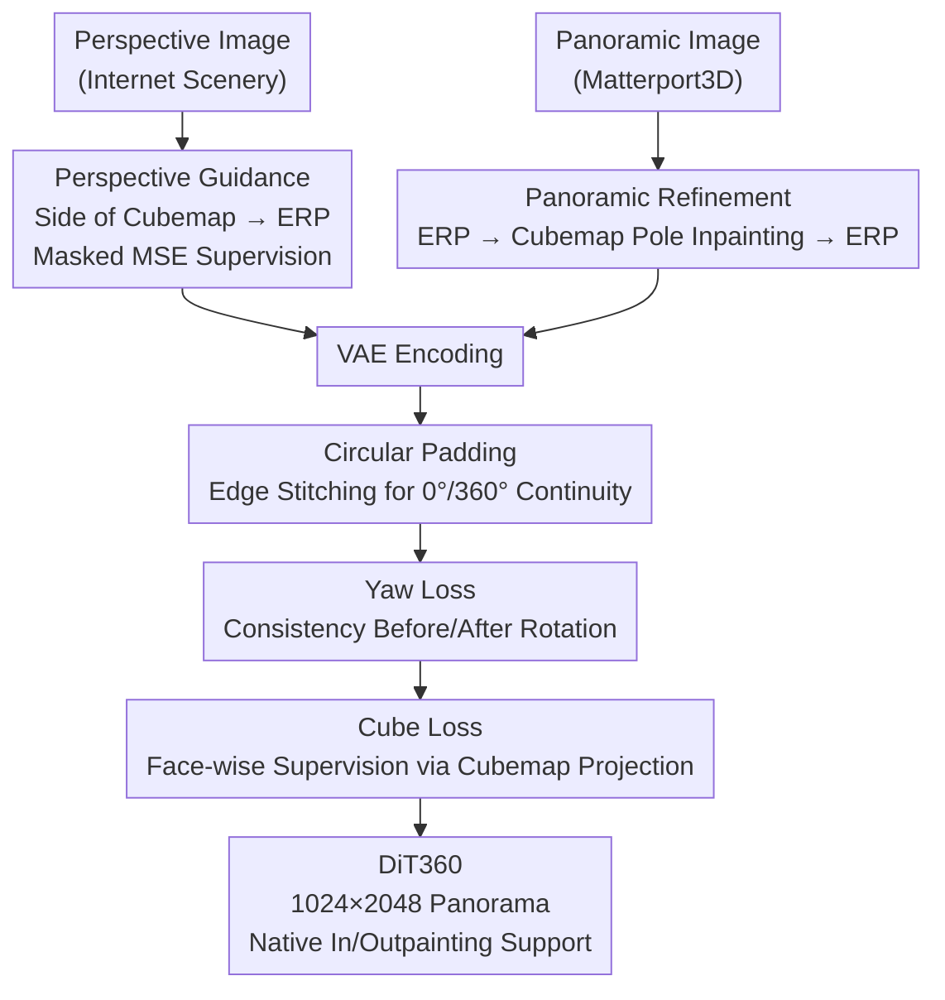

# DiT360: High-Fidelity Panoramic Image Generation via Hybrid Training

**Conference**: CVPR 2026  
**Paper**: [CVF Open Access](https://openaccess.thecvf.com/content/CVPR2026/html/Feng_DiT360_High-Fidelity_Panoramic_Image_Generation_via_Hybrid_Training_CVPR_2026_paper.html)  
**Code**: https://github.com/Insta360-Research-Team/DiT360  
**Area**: Diffusion Models / Panoramic Image Generation  
**Keywords**: Panorama Generation, DiT/Flux, Hybrid Training, Equirectangular Projection (ERP), Cubemap Supervision

## TL;DR
DiT360 does not focus on model architecture but instead uses "perspective + panoramic hybrid training" to address the scarcity of high-quality real-world panoramic data. It injects cross-domain knowledge via perspective guidance and panoramic refinement at the image level (pre-VAE) and enforces geometric consistency via circular padding, yaw loss, and cube loss at the token level (post-VAE). It achieves state-of-the-art performance on Matterport3D across 11 metrics (notably FID 42.88).

## Background & Motivation

**Background**: Panoramic image generation (360° field of view) is a critical capability for spatial intelligence, AR/VR, and autonomous driving. Mainstream approaches revolve around specialized panoramic representations—either training diffusion models directly on Equirectangular Projections (ERP) to ensure global continuity, utilizing cubemaps (CP) to align spherical geometry via perspective priors, or stitching multiple perspective views.

**Limitations of Prior Work**: These methods suffer from two persistent issues: (1) **Geometric Fidelity**—ERP exhibits severe distortion at the poles (ceiling/floor) which models fail to learn accurately, while stitching methods produce discontinuities at seams; (2) **Perceptual Realism**—high-quality real-world panoramic data is extremely scarce, forcing models to over-rely on synthetic or rendered data, resulting in a "rendered" look lacking photo-realism. Even with 360° assets from platforms like YouTube, direct training is impractical due to the lack of domain-specific cleaning (horizon correction, aesthetic filtering).

**Key Challenge**: The root cause is the **data**, not the model strength. Real panoramic data is rare and "dirty" (blurred poles), while the most realistic perspective data (massive internet scenery photos) is not in the panoramic domain. The two cannot be used together directly because perspective images lack spherical geometry and distortion structures.

**Goal**: To simultaneously inject the "photo-realism of the perspective domain" and the "geometric structure of the panoramic domain" into a single model under limited panoramic data. This is split into two sub-problems: ① How to clean and utilize scarce, noisy panoramic data; ② How to transfer photo-realistic knowledge from vast perspective images to the panoramic domain without breaking geometry.

**Key Insight**: The focus is shifted from "designing better panoramic operators" to "designing a better hybrid training paradigm." Since any single data source is flawed, the advantages of both domains are fused at **different representation levels** (image level/token level).

**Core Idea**: "Cross-domain hybrid training" replaces "specialized model design." Using a standard DiT (Flux), the model absorbs knowledge from both domains across multiple levels: image-level domain translation and regularization (Perspective Guidance + Panoramic Refinement) and token-level geometric supervision (Circular Padding + Yaw Loss + Cube Loss).

## Method

### Overall Architecture

DiT360 is built upon Flux (an open-source DiT variant with RoPE and a flow-based scheduler), tuning only the LoRA modules injected into the attention layers. The framework is a **dual-branch hybrid training pipeline**: the perspective branch injects photo-realism, and the panoramic branch ensures geometric consistency. Core interventions occur at the **image level** (pre-VAE) and the **token level** (post-VAE).

The perspective branch takes high-quality internet landscape photos, treats them as a side of a cubemap, projects them back to ERP with a mask, and applies MSE supervision only on the masked region (Image Level: Perspective Guidance). The panoramic branch takes Matterport3D, converts ERP to cubemap, performs inpainting on the centers of the top/bottom faces to refine blurred poles, and projects back to ERP (Image Level: Panoramic Refinement). At the token level, three geometric supervisions are applied to the noisy tokens: Circular Padding for $0^\circ/360^\circ$ continuity, Yaw Loss for rotational consistency, and Cube Loss for accurate distortion structure. The final loss is a weighted sum of the original Flux MSE, cube loss, and yaw loss.

> Note: The two image-level modules (Perspective Guidance, Panoramic Refinement) act before the VAE; the three token-level modules (Circular Padding, Yaw Loss, Cube Loss) act on the latent space noise.

### Key Designs

**1. Panoramic Refinement: Cleaning Dirty Real-World Data**

Matterport3D is one of the few large-scale real-world panoramic datasets, but it contains significant blurring at the poles. Training directly on this transfers degradation to the generated results. The authors use mature perspective inpainting to solve this: ERP is converted to a cubemap, a binary mask is applied to the centers of the top and bottom faces ($M(u,v)=0$ if $256 \le u,v < 768$ for $1024 \times 1024$ faces), the centers are replaced with white, reconstructed via a pre-trained inpainting model $\hat I$, and projected back to ERP.

This serves as **image quality regularization**, removing polar artifacts while preserving panoramic distortion structures. Ablation results show this is critical: training on refined data yields BRISQUE 10.25 / IS 1.60, while unrefined data degrades to BRISQUE 24.91 / IS 1.41.

**2. Perspective Guidance: Injecting Photo-Realism from Massive Data**

To overcome the realism ceiling of limited panoramic data, internet perspective photos are treated as a **side face** of a cubemap and projected to ERP with a mask. Supervision is applied only within the mask:

$$L_{\text{perspective}} = L_{\text{MSE}}(\epsilon \odot M,\ \hat\epsilon_\theta \odot M)$$

Only side faces are used as top/bottom faces represent rare viewpoints poorly covered in datasets. Due to Flux's explicit positional encoding (RoPE), each token focuses on a local neighborhood, ensuring **gradients do not leak from the perspective region to unrelated panoramic regions**, maintaining robust training.

**3. Position-aware Circular Padding: Enforcing $0^\circ/360^\circ$ Boundary Continuity**

The left and right edges of an ERP correspond to the physically connected $0^\circ/360^\circ$ longitude. DiT360 applies explicit constraints at the token level. After VAE compression and noise injection, the latent tokens $X_t \in \mathbb{R}^{H \times W \times d}$ are padded along the width dimension by stitching the first column $X_0$ and the last column $X_{-1}$ to the opposite ends:

$$\tilde X_t = [X_{-1},\ X_t,\ X_0] \in \mathbb{R}^{H \times (W+2) \times d}$$

This padding is also applied to positional encodings. This explicitly guides the model to learn **continuity between adjacent columns across the boundary**, leveraging the alignment between Flux's positional encoding and image content.

**4. Yaw Loss + Cube Loss: Rotation Invariance and Distortion Structure**

These represent additional geometric supervisions in the latent noise space:

$$L_{\text{pano}} = L_{\text{MSE}} + \lambda_1 L_{\text{cube}} + \lambda_2 L_{\text{yaw}}$$

**Yaw loss** addresses rotation invariance: a panorama rotated by any angle $a$ along the vertical axis remains a valid panorama. Given a random rotation $a$, consistency is enforced: $\epsilon_{\text{yaw}} = \text{Rotate}(X_t - \epsilon, a)$, $\epsilon_{\theta,\text{yaw}} = \text{Rotate}(\epsilon_\theta, a)$, $L_{\text{yaw}} = \mathbb{E}[\|\epsilon_{\theta,\text{yaw}} - \epsilon_{\text{yaw}}\|_2^2]$. This improves global structural coherence (optimal FAED in ablation).

**Cube loss** targets polar distortion. Directly supervising ERP causes the model to mimic local distortion appearances rather than learning the exact geometry. Both sampled and predicted noise are projected into six cubemap faces for face-wise supervision: $L_{\text{cube}} = \mathbb{E}[\|\epsilon_{\theta,\text{cube}} - \epsilon_{\text{cube}}\|_2^2]$. This transfers perspective priors to the panoramic domain (significantly lowering FID$_{\text{pole}}$ and FID$_{\text{equ}}$).

### Loss & Training

Training only updates the LoRA modules in the Flux.1-dev attention layers. The perspective branch uses $L_{\text{perspective}}$, and the panoramic branch uses $L_{\text{pano}}$. Default weights are $\lambda_1 = \lambda_2 = 0.5$. Training resolution is 1024×2048. Due to DiT's scalability and the mask-based design, DiT360 supports inpainting and outpainting **without additional fine-tuning** via inversion-based feature replacement.

## Key Experimental Results

### Main Results

Comparison on the Matterport3D validation set against 8 baselines:

| Metric | DiT360 | Second Best | Note |
|------|--------|----------|------|
| FID↓ | **42.88** | SMGD 46.72 | Best overall fidelity |
| FID$_{\text{clip}}$↓ | **41.60** | SMGD 45.04 | First |
| FID$_{\text{equ}}$↓ | **24.77** | PAR 27.39 | First |
| BRISQUE↓ | **10.25** | Matrix-3D 16.37 | Significant lead in quality |
| NIQE↓ | **3.72** | LayerPano3D 3.79 | First |
| IS↑ | **1.60** | MVDiffusion 1.58 | First |
| QA$_{\text{aesthetic}}$↑ | **4.19** | LayerPano3D 3.93 | Best aesthetics |
| FAED↓ | **2.91** | HunyuanWorld 2.91 | Tied for first |
| CS↑ (CLIP Score) | 34.68 | HunyuanWorld 34.73 | Slightly lower |
| QA$_{\text{quality}}$↑ | 4.69 | LayerPano3D 4.73 | Slightly lower |

### Ablation Study

Impact of modules added to the Flux+LoRA baseline:

| Configuration | FAED↓ | IS↑ | BRISQUE↓ | FID↓ | Note |
|------|-------|-----|----------|------|------|
| Flux + LoRA | 3.23 | 1.51 | 17.02 | 46.69 | baseline |
| w/ Circular Padding | 3.04 | 1.54 | 13.61 | 43.71 | Major FID/BRISQUE gain |
| w/ Cube Loss | 3.01 | 1.57 | 15.68 | 44.40 | Lower polar distortion |
| w/ Yaw Loss | 2.98 | 1.56 | 15.96 | 44.63 | Best rotational consistency |
| w/ Perspective Guidance | 2.95 | 1.48 | 16.94 | 46.03 | Boosts QA scores |
| **Ours (Full)** | **2.91** | **1.60** | **10.25** | **42.88** | Best combination |

### Key Findings
- **Data > Model**: Unrefined data causes BRISQUE to jump from 10.25 to 24.91, proving that noisy data is the bottleneck.
- **Metric Limitations**: CLIP and Q-Align scores are slightly lower as they are designed for perspective images and may not accurately reflect panoramic quality.

## Highlights & Insights
- **Paradigm Shift**: Redefining the problem as a "hybrid training paradigm" instead of "specialized architecture" allows a standard DiT to excel by absorbing cross-domain knowledge.
- **Perspective as Cubemap Side**: A simple geometric transform allows any internet photo to become a panoramic training sample, effectively augmenting the dataset.
- **Supervision in Noise Space**: Constraining yaw/cube consistency in the latent noise space aligns with the flow-based scheduler and ensures stable training.

## Limitations & Future Work
- **Mask Dependency**: In/outpainting is mask-conditioned, requiring camera pose information.
- **Evaluation Standards**: The field lacks universally accepted panoramic metrics; perspective metrics like CLIP Score are suboptimal.
- **Polar Reconstruction**: Polar refinement relies on inpainting "hallucinations," which may lack precision for high-accuracy geometric tasks.

## Related Work & Insights
- **vs. Direct ERP Training (PanFusion / SMGD)**: DiT360 improves upon these by explicitly addressing polar distortion and boundary continuity, reducing FID from 46.72 to 42.88.
- **vs. Cubemap/Stitching (MVDiffusion)**: Avoids seam issues and high computational costs by using cubemaps only for supervision/cleaning, not for inference assembly.
- **vs. Synthetic Data (LayerPano3D)**: Maintains much higher photo-realism (Aesthetic 4.19 vs 3.93) by leveraging real perspective images.

## Rating
- Novelty: ⭐⭐⭐⭐ Reframing the bottleneck as hybrid training is insightful.
- Experimental Thoroughness: ⭐⭐⭐⭐ Extensive benchmarks and clear ablations.
- Writing Quality: ⭐⭐⭐⭐ Well-organized dual-level structure.
- Value: ⭐⭐⭐⭐ Strong baseline for 3D scene generation with practical in/outpainting support.

<!-- RELATED:START -->

## Related Papers

- [\[CVPR 2026\] MMFace-DiT: A Dual-Stream Diffusion Transformer for High-Fidelity Multimodal Face Generation](mmface-dit_a_dual-stream_diffusion_transformer_for_high-fidelity_multimodal_face.md)
- [\[CVPR 2026\] FontCrafter: High-Fidelity Element-Driven Artistic Font Creation with Visual In-Context Generation](fontcrafter_high-fidelity_element-driven_artistic_font_creation_with_visual_in-c.md)
- [\[CVPR 2026\] FastHybrid: Accelerating Hybrid Autoregressive Image Generation with Lookahead and Guided Decoding](fasthybrid_accelerating_hybrid_autoregressive_image_generation_with_lookahead_an.md)
- [\[CVPR 2026\] PROMO: Promptable Outfitting for Efficient High-Fidelity Virtual Try-On](promo_promptable_virtual_tryon_efficient.md)
- [\[CVPR 2026\] MatPedia: A Universal Generative Foundation for High-Fidelity Material Synthesis](matpedia_a_universal_generative_foundation_for_high-fidelity_material_synthesis.md)

<!-- RELATED:END -->
